## Content
* R
* RStudio
* tidyverse


## What you need to do these tutorials...
* [R](https://cloud.r-project.org/): These materials have been tested using R version 4.0.4 (2021-02-15)
* [RStudio](https://www.rstudio.com/products/rstudio/download/#download): These materials have been tested using RStudio version 1.3.1093
* [Raw data files](https://github.com/riffomonas/raw_data/archive/refs/tags/0.3.zip). This will download a directory called `raw_data-X.X` where the "X.X" is the version number. Make sure the directory is uncompressed and remove the `-X.X` so that you now have a directory called `raw_data`. ***This is super important!***

You can follow along with a video that I made for installing these tools on windows and Mac OS X. The only difference is that in the video I put `raw_data` into `code_club` and you should put it into `minimalR`. Ideally that directory will live on the desktop while you are going through the exercises.

<iframe style="margin: 0 auto;display:block;" width="560" height="315" src="https://www.youtube.com/embed/D6CunpqF04E" frameborder="0" allow="accelerometer; autoplay; clipboard-write; encrypted-media; gyroscope; picture-in-picture" allowfullscreen></iframe>

### Customizing RStudio
There are many ways to customize RStudio. You can find the options by going to the Preferences window. If you are using windows you can get to the Preferences window by going Tools->Global Options. Here is a screenshot of how to do it for Mac OS X. The method should be pretty similar for people working on a Windows computer.

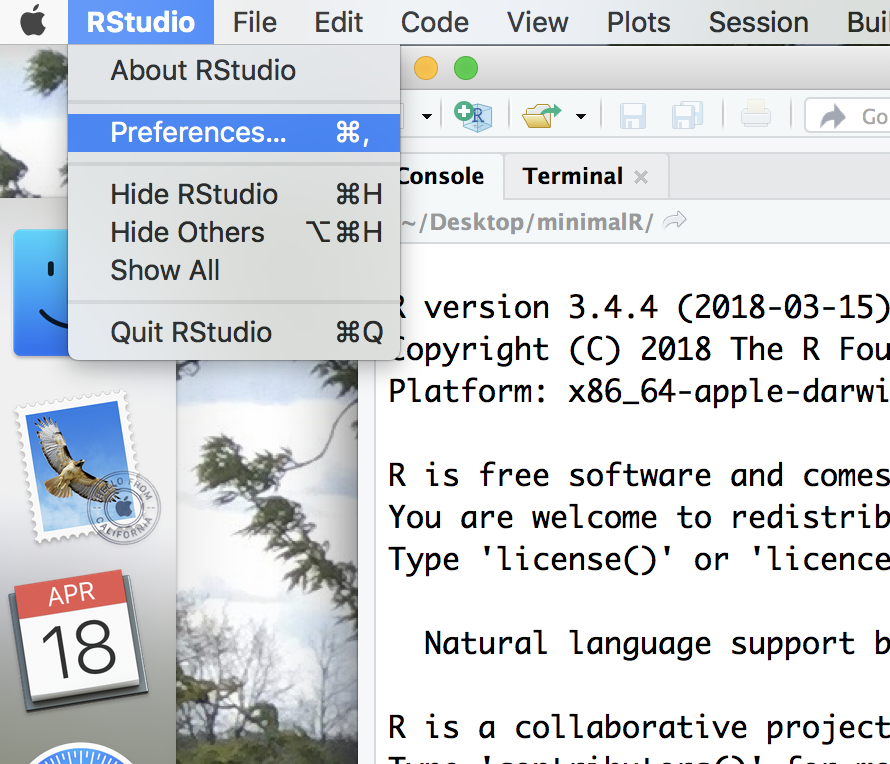

In the first tab, "General", you should have something like this.

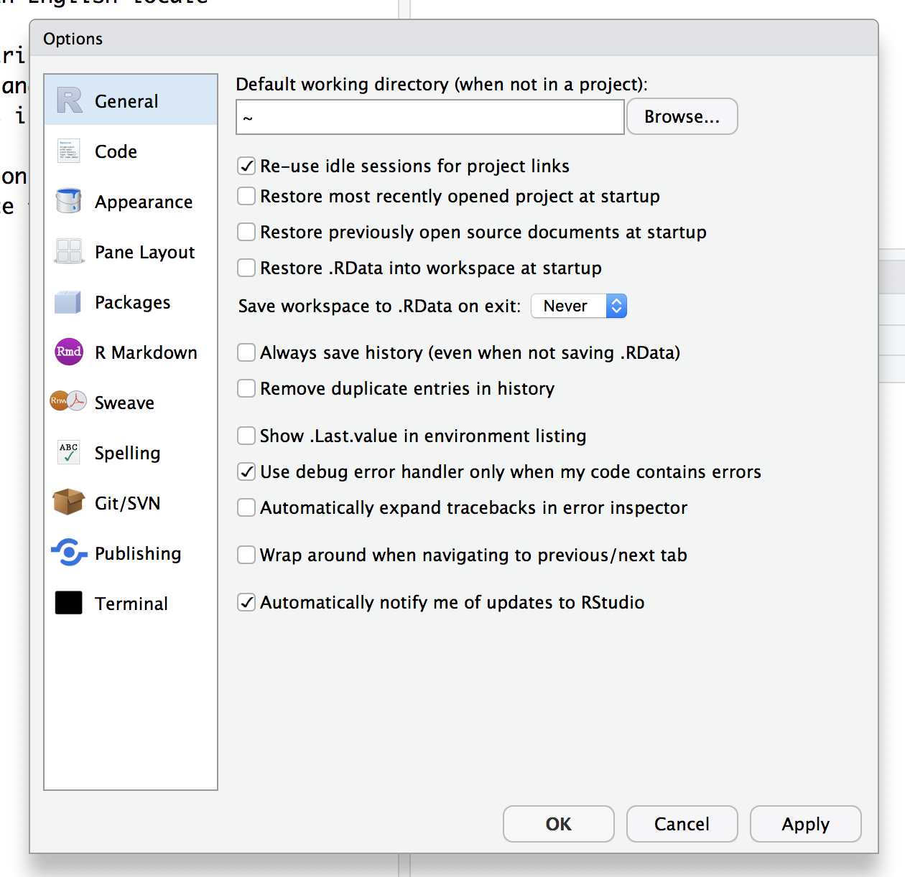

You don't want any of the boxes to be checked except to be notified of RStudio updates, these are especially problematic:
* Restore .RData into workspace at startup
* Save workspace to .RData on exit (toggle should say "Never")
* Always save history

Once you've got everything checked/unchecked the way you want it, go ahead and click "Apply" and then "OK"


### Installing packages

There's a lot of functionality built into R. The beauty of it being an open source resource is that anyone can add to it to expand it's functionality or to improve how you work with the existing functionality. This is done through packages. Some day, you might make your own package! We will use several R packages throughout our Code Clubs. The one we'll use the most is called `tidyverse`. We'll be talking a lot about this package as we go along. But for now, we need to install this package. In the lower right panel of RStudio, select the "Package" tab. You'll get something that looks like this:

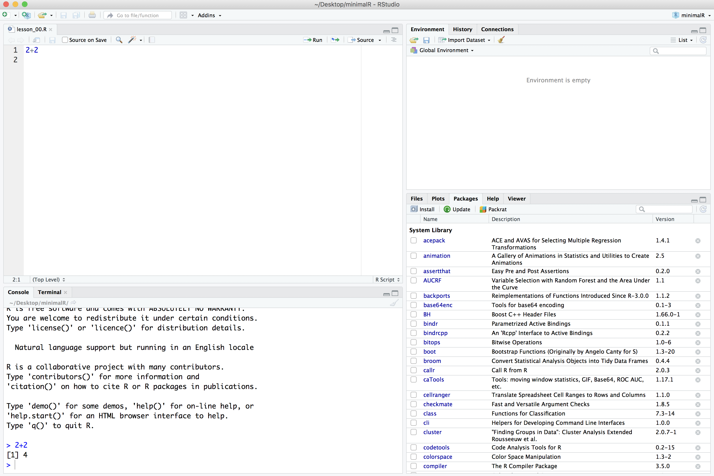

In the search window, type in "tidyverse" (without the quotes). If it isn't already installed, you won't see it. If it is installed, it will be listed. The package isn't installed on my computer.

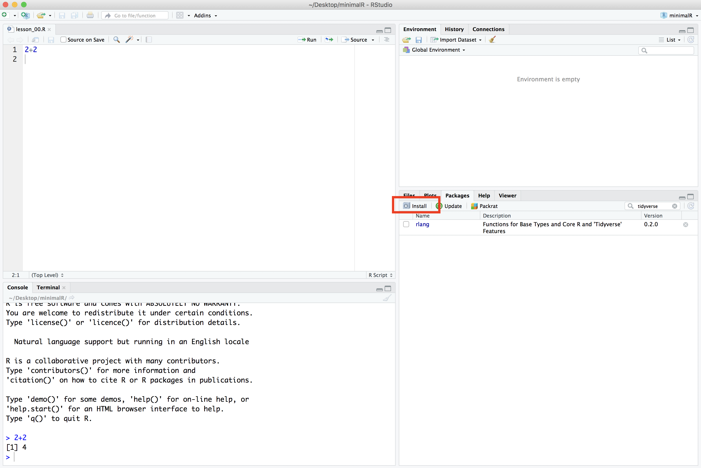

If it isn't installed on your computer either, go ahead and click the Install button and type "tidyverse" into the "Packages" window:

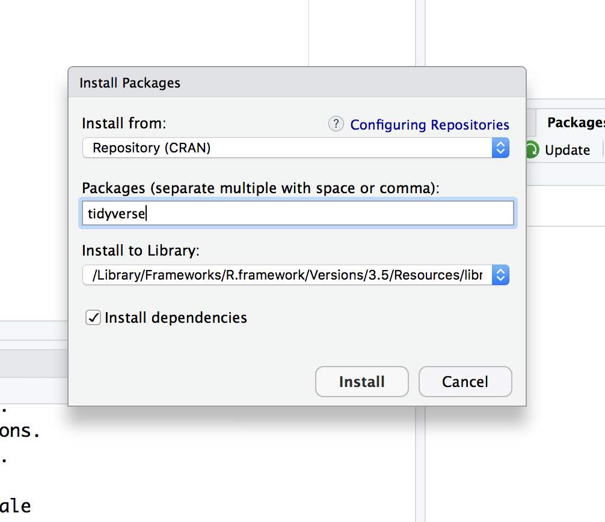

Once you press the "Install" button, the dialog will close and RStudio will install the package. You'll notice a couple things have happened. In the Packages tab in the lower right panel, you now see the "tidyverse" package is there. You'll also notice that in the lower left corner that R ran the command `install.packages("tidyverse")`.

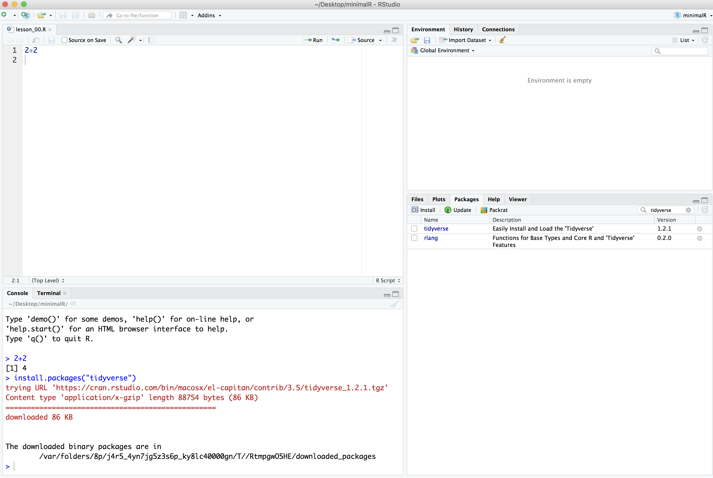

Finally, to make all of the tidyverse goodness available as we go through the tutorials, you can either click the small square next to "tidyverse" in the "Packages" tab or you can run `library(tidyverse)` in the console tab in the lower left panel of RStudio.

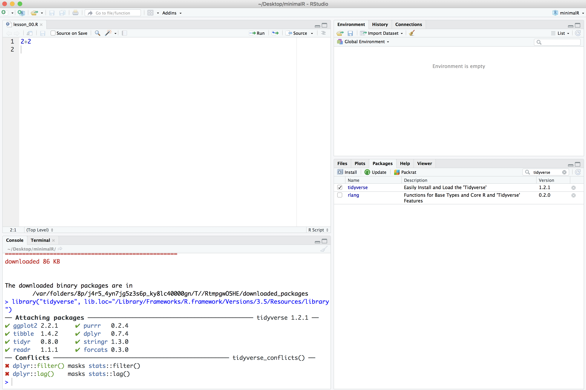

Some things may happen...
* While loading the tidyverse library or during installation, it may ask if you want to install from source, go ahead and type "Yes" at the prompts.
* You might run into an error message that says, "there is no package called ‘Rcpp’". It might be Rcpp and/or another package that it complains about. Try to replicate the steps for installing the tidyverse package, but with Rcpp and any other packages it complains about.
* If you are on a Mac, to install these tools, you will need to click on the "Terminal" tab an enter `xcode-select --install
`. Once that is done, go back to the "Console" tab. Then try to install the packages it is complaining about.
* If you've run into problems and and reinstalled the dependencies, re-run `install.packages(tidyverse)` and repeat the `library(tidyverse)` command. You may need to restart RStudio. You should get something that looks like

```R
> library(tidyverse)
── Attaching packages ─────────────────────────────────────── tidyverse 1.3.0 ──
✔ ggplot2 3.2.1     ✔ purrr   0.3.3
✔ tibble  2.1.3     ✔ dplyr   0.8.4
✔ tidyr   1.0.2     ✔ stringr 1.4.0
✔ readr   1.3.1     ✔ forcats 0.5.0
── Conflicts ────────────────────────────────────────── tidyverse_conflicts() ──
✖ dplyr::filter() masks stats::filter()
✖ dplyr::lag()    masks stats::lag()
```


### R Scripts

We'll quickly get to a point where we don't want to retype multiple lines of code over and over. We can create R scripts that hold lines of code that R Studio will run for us. We can open a new R script by choosing the File menu, then the New File menu, and finally the R Script option. Alternatively, you could click on the icon that contains a white page with a green plus sign on it. I've put a red circle around it in the screen shot below

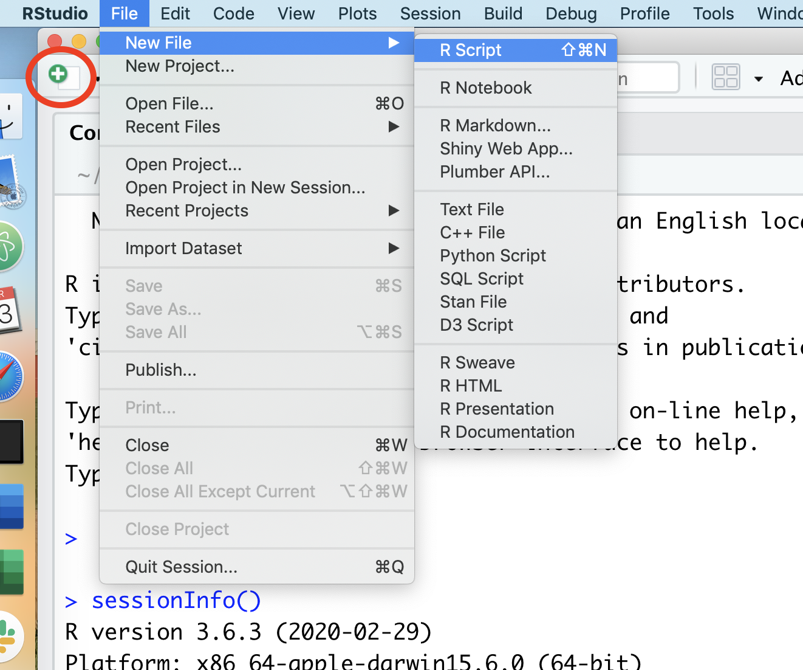

Once you select "R script", a new panel will open in RStudio.

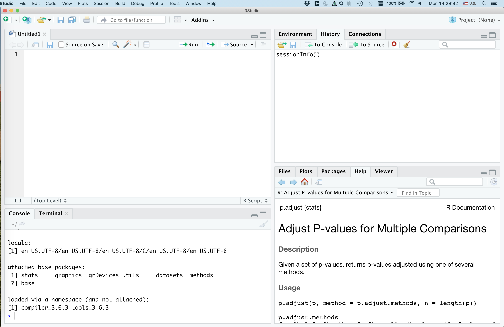

That upper right panel is where you can type in code. Go ahead and copy and paste the following code into your new R script

```R
library(tidyverse)

r_version <- R.version$version.string

read_csv("https://raw.githubusercontent.com/riffomonas/data/master/comma-survey/comma-survey.csv") %>%
	rename(data=`How would you write the following sentence?`) %>%
	mutate(data=recode(data,
		`Some experts say it's important to drink milk, but the data are inconclusive.` = "Plural",
		`Some experts say it's important to drink milk, but the data is inconclusive.` = "Singular")
	) %>%
	count(data) %>%
	drop_na() %>%
	mutate(percentage = 100 * n/sum(n)) %>%
	ggplot(aes(x=data, y=percentage, fill=data)) +
		geom_col(show.legend=FALSE) +
		labs(x=NULL,
			y="Percentage of respondents",
			title="Is the word 'data' plural or singular?",
			subtitle=r_version) +
		theme_classic()


```

Go ahead and save this as `test_script.R`. You should have something like this

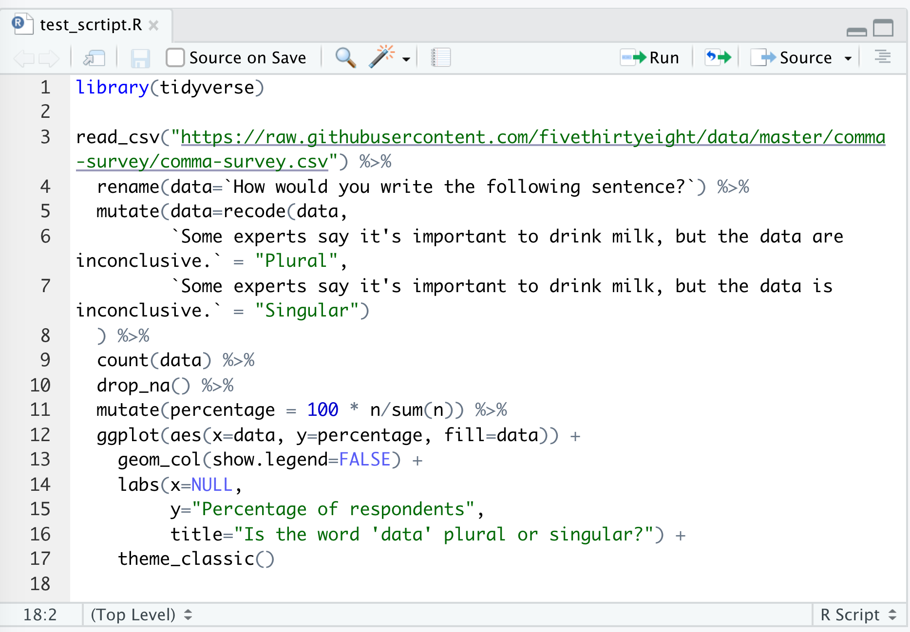


There are several ways to run this script. You could copy and paste all the code to the console window below. An easier way would be to click "Source", and "Source with Echo". There are a few other ways to run the code in the script in your console, but this will serve us well for now...

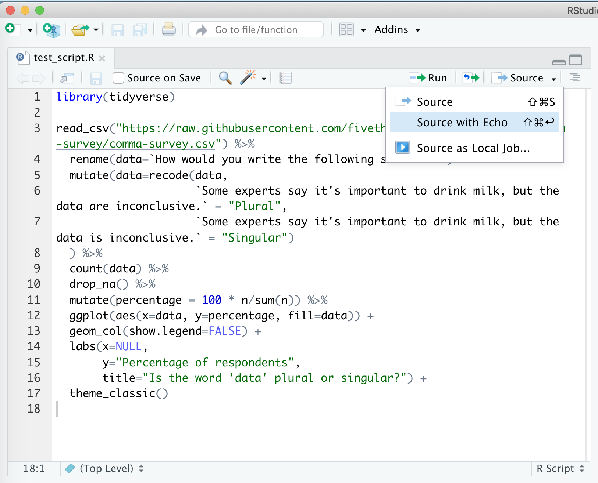

This will run your code in the console window below and will pop out your plot in the lower right corner. Viola! If everything is set up correctly, you should have a plot that looks like mine.


If you don't get this, make sure you installed the `tidyverse` package as described above and then make sure you copy and pasted everything from the code block above into a clean R script file.


## My setup
If you run `sessionInfo` at the console, you will see the version of R and the packages you have installed and attached (more about what this all means later). Here's what mine looks like.


```r
sessionInfo()
```

```
## R version 4.0.4 (2021-02-15)
## Platform: x86_64-apple-darwin17.0 (64-bit)
## Running under: macOS Big Sur 10.16
## 
## Matrix products: default
## BLAS:   /Library/Frameworks/R.framework/Versions/4.0/Resources/lib/libRblas.dylib
## LAPACK: /Library/Frameworks/R.framework/Versions/4.0/Resources/lib/libRlapack.dylib
## 
## locale:
## [1] en_US.UTF-8/en_US.UTF-8/en_US.UTF-8/C/en_US.UTF-8/en_US.UTF-8
## 
## attached base packages:
## [1] stats     graphics  grDevices utils     datasets  methods   base     
## 
## other attached packages:
##  [1] forcats_0.5.0   stringr_1.4.0   dplyr_1.0.2     purrr_0.3.4    
##  [5] readr_1.4.0     tidyr_1.1.2     tibble_3.0.4    ggplot2_3.3.2  
##  [9] tidyverse_1.3.0 knitr_1.30      ezknitr_0.6    
## 
## loaded via a namespace (and not attached):
##  [1] Rcpp_1.0.5        cellranger_1.1.0  pillar_1.4.6      compiler_4.0.4   
##  [5] dbplyr_2.0.0      R.methodsS3_1.8.1 R.utils_2.10.1    tools_4.0.4      
##  [9] lubridate_1.7.9.2 jsonlite_1.7.1    evaluate_0.14     lifecycle_0.2.0  
## [13] gtable_0.3.0      pkgconfig_2.0.3   rlang_0.4.9       reprex_0.3.0     
## [17] cli_2.1.0         rstudioapi_0.13   DBI_1.1.0         haven_2.3.1      
## [21] xfun_0.19         withr_2.3.0       xml2_1.3.2        httr_1.4.2       
## [25] fs_1.5.0          generics_0.1.0    vctrs_0.3.5       hms_0.5.3        
## [29] grid_4.0.4        tidyselect_1.1.0  glue_1.4.2        R6_2.5.0         
## [33] fansi_0.4.1       readxl_1.3.1      modelr_0.1.8      magrittr_2.0.1   
## [37] ps_1.4.0          backports_1.2.0   scales_1.1.1      ellipsis_0.3.1   
## [41] rvest_0.3.6       assertthat_0.2.1  colorspace_2.0-0  stringi_1.5.3    
## [45] munsell_0.5.0     broom_0.7.2       crayon_1.3.4      R.oo_1.24.0
```
