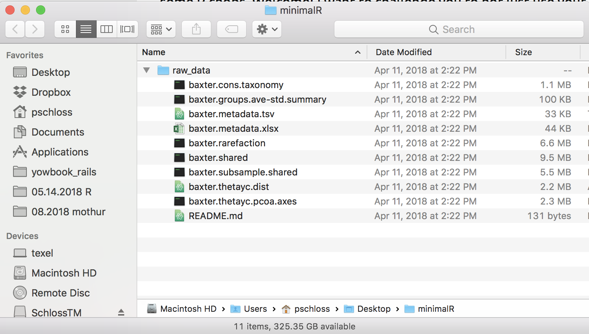
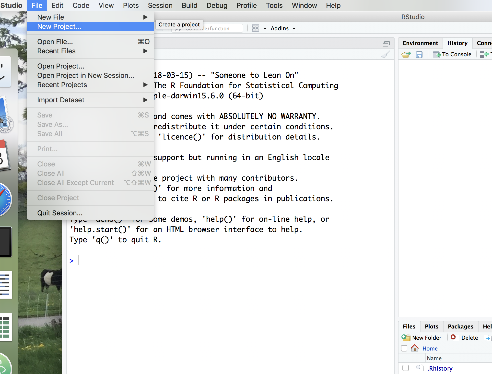
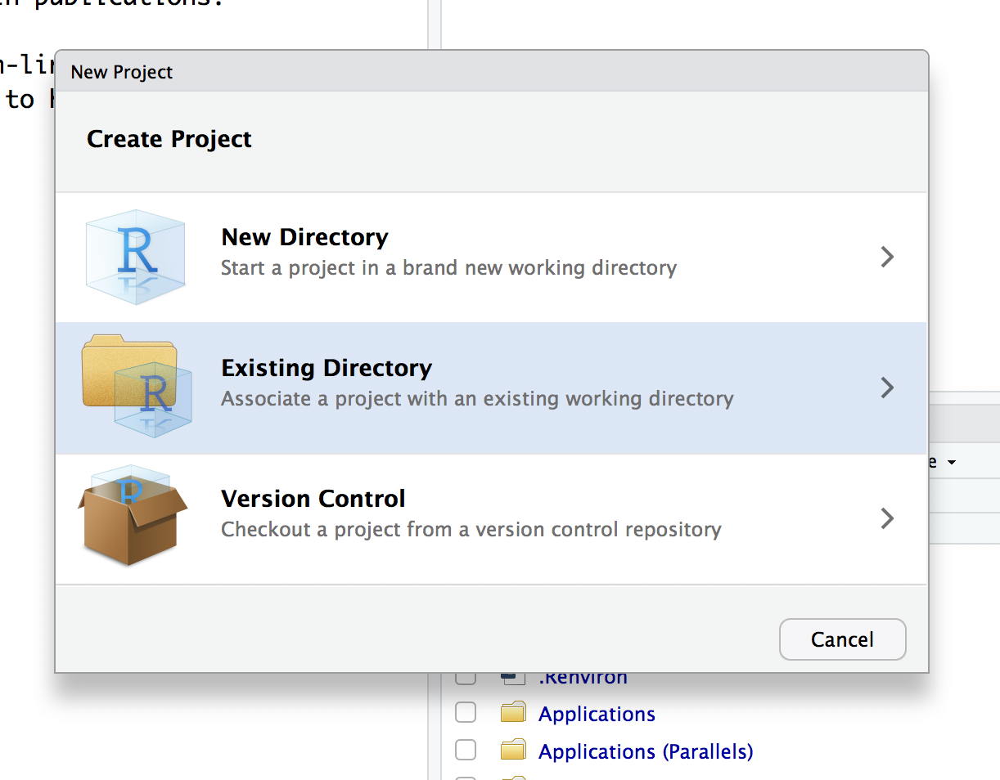
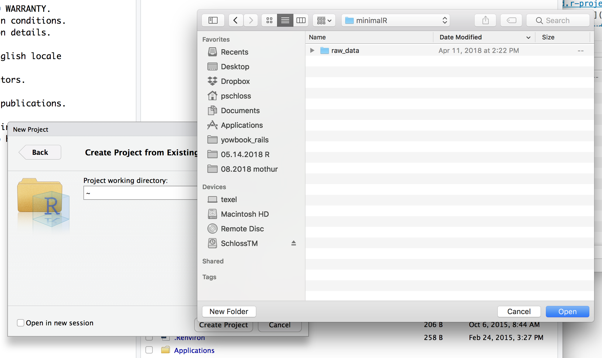
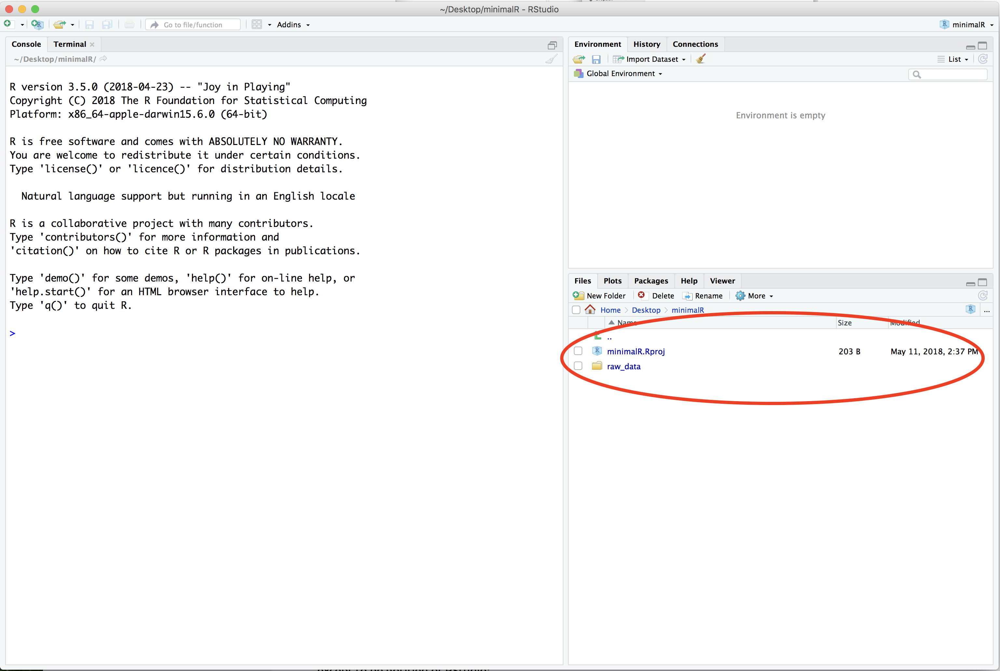
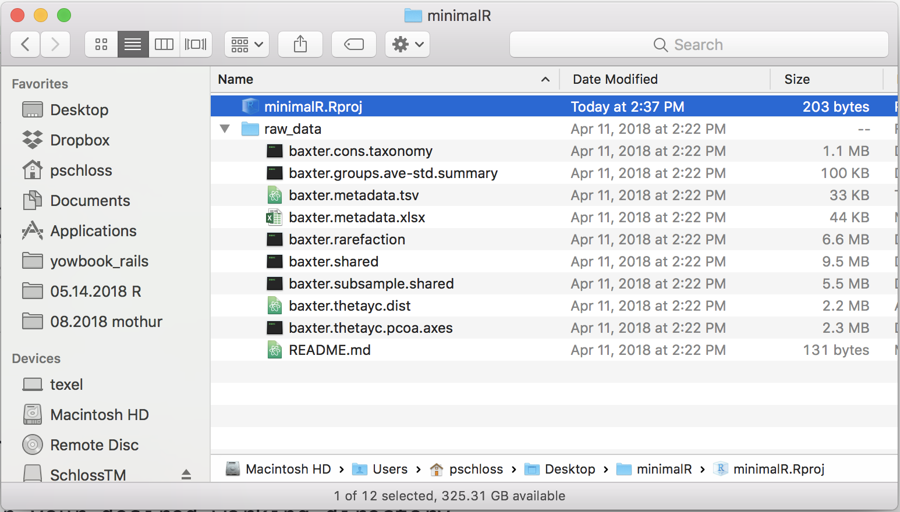

## Content
* Philosophy behind these instructional materials
* Why R?
* Introduction to our dataset
* Setting up a project

## Philosophy
I have never taken a course or workshop in using R. I've read a lot of books on how to program with R. To be honest, I'm not sure how much they helped. I learned R by taking a single script that I wrote to create a scatter plot and modifying it or "hacking it" to get it to do what I wanted. If I ran into a problem, I would either google the error message or the question I was trying to answer. As I asked around, I learned that most people learned R by hacking their way to success along with a lot of practice. That is the underlying philosophy of this series of lessons. Most programming books slowly build to something useful with silly examples along the way. The first code you will write in Lesson 1 will be the basis of every other piece of code we write in these tutorials. We will start with working code for a plot that could be published and hack it until we have a plot showing which taxa are associated with health or disease.

I suspect that you will understand the first chunk of code we write. We will strive for readable code that is easy to understand. That being said, just because you suspect that the `geom_point` function will add points to a plot, doesn't mean that you know how to use `geom_point` or that you would know how to make a bar chart. Calmly accept your ignorance and know that all will be explained eventually. Learning experts have found that we do not learn best by taking on a topic and beating it to death until we've mastered it. Rather, we learn best when we learn something partially, move on to something else that we also learn partially, but can fold in the previous knowledge to help us improve our partial knowledge of the earlier topic. It's kind of like taking steps forward in a dark room only to get to the end and see that you knew the path all the way along. This is the approach that we will be taking with these lessons. My goal is not to provide a reference on R or to necessarily document every nook and cranny of the language and its myriad packages. I will empower you to do that.

The final philosophical point I will make is that I believe it is important to eat your own dog food as an educator. Everything I teach, is how I want to code and how I want those that work for me to code. There is definitely always room for improvement, but be confident that I'm not trying to sell you on something that I do not use myself. That being said, although I don't claim that the plots we'll make are works of aRt, I do think that they're pretty close to being publication quality. Why make a crappy plot, when you could make a good one that puts your work in the best possible light?

If you notice a bug, something that is unclear, have an idea for a better approach, or want to see something added, please file an issue or, even better, a pull request at the project's [GitHub repository](https://github.com/riffomonas/minimalR).

## Why R
If you're looking for some big "pound your chest" explanation for why you should learn R, then you're looking in the wrong place. I know R. That's why I teach R. Why did I learn R? There were people around me that new R and I knew I could depend on them to help me learn R if I ran into any problems. Less important than which language you should learn is that you learn *A* language. Any language, really.

The way I see it there are several credible languages if you are a scientist: R, Python, C/C++, Java. R and Python are "high level" languages that have a lot of built in goodies to make your life easy. As you'll see, it's pretty easy to build a graph or to calculate a mean in R (and python). These languages are engineered to make it easier on the programmer than the person running the code. In contrast, C/C++ and Java are not as easy to program, but are far more efficient and run blazing fast. You'll hear about others like Julia, Ruby, or Perl. These aren't quite mainstream for biologists or aren't fully developed yet or are past their sell by date. Unless you have needs for high performance, I'd probably stay away from C/C++ and Java isn't really all that high performance. If you need the speed of C++ you can write C++ in R.

This leaves you to chose between R and Python. You can google "Should I learn R or Python" and you'll get screed after screed telling you why one language is the best. Do not read these. They're next to worthless and smack of all sorts of machismo. I block accounts on Twitter that go off on R vs. Python screeds. I know R's warts and I know that Python could possibly cure these warts. But I also know that Python has its own warts. Rather than carry the cognitive baggage of learning both, I do what I need in R. At least a few times a year I tell myself I should learn Python to know it, but when it comes to doing it, I'm just not sold. To be honest, to really appreciate the differences between the languages you probably need a fair bit more experience than someone that is reading this. Note that someone else could/should easily rewrite this paragraph switching R and Python.

But really! What should you learn? Depends. What does your research group use? What do your collaborators use? What do the people around you use? If you have a problem, who are you going to get help from? For me, the answers to these questions were generally: R. Again, it's more important that you learn your first language than which language you learn. Master your first language and then start noodling with others. I always cringe when I see someone encouraging a novice to learn other languages. It can only sow confusion and frustration. Since you're here, I suspect someone has encouraged you to learn R or that your local community has some R chops. Welcome! I want to challenge you to not just use your community to help you, but to also nourish your community to help it grow.

## Introduction to Baxter dataset
The `raw_data` data directory that you downloaded is based on data analyzed by former Schloss Lab member, [Niel Baxter](http://www.schlosslab.org/labbies/baxter.html). Niel's dissertation work followed up on work from another former lab member, [Joe Zackular](https://www.zackularlab.org). ***We were interested in determining whether knowing the structure of the gut microbiota could help physicians detect colonic lesions better than traditional non-invasive diagnostics.*** Current non-invasive tests, FOBT and FIT, measure the amount of blood in a fecal sample. Blood in feces is bad. FOBT and FIT are good at detecting more advanced stages of carcinoma development, but have limited sensitivity for detecting adenomas. Early detection is key because adenomas can be removed leading to a better prognosis for the patient. Ideally, people would get a colonoscopy because the physician can remove any questionable growth. Because the procedure is unpleasant, expensive, and intimidating, only about 30% of people follow screening guidelines. Developing a robust non-invasive diagnostic is important.

Working with our colleagues at the University of Michigan Rogel Cancer Center, Niel generated 16S rRNA gene sequence data from 490 individuals that were classified as having normal colons or colons with adenomas and carcinomas. The diagnoses were determined by colonoscopy. Along with the sequence data, we had access to some clinical data about the individuals. Niel processed the sequences using [mothur](https://www.mothur.org) and assigned them to operational taxonomic units (OTUs) resulting in a shared file, which contains the number of times each OTU appeared in each sample. This shared file, information about the taxonomy of each OTU, and files with summary statistics describing the diversity of the communities are included in the `raw_data` directory you downloaded. This data set has been the basis for a number of papers from my research group. Although the effect sizes are not gigantic, we do see a benefit to knowing the structure of a patient's microbiome for improving early detection. For the purposes of this set of tutorials, the dataset also provides a good launching point to perform manipulations, analyses, and visualizations that are commonly used by people studying microbial communities - human or otherwise.

## Set up our minimalR project...
* In your home directory or desktop create a directory called `minimalR`
* Move your decompressed `raw_data` directory into `minimalR`. There should only be one thing in `minimalR`, which is the `raw_data` directory. If you look at your Finder window or Window Explorer window, you should have something that looks like this when `raw_data` is expanded

* To make life easier, you should start with RStudio. Open `RStudio` and do "File->New Project->Existing Directory".

* Once you're in the "Create Project" dialog click on the "Existing Directory" link.

* Use the "Browse" button to find `minimalR`. Once you're there (you should only see `raw_data` in the directory), select open.

* My copy of `minimalR` is on the desktop and it lists my "Project working directory" as `~/Desktop/minimalR`. Click "Create Project"

* In the lower right corner of the RStudio program window you will see that the "Files" tab is selected. In the panel it will have a file called `minimalR.Rproj` and a directory called `raw_data`.

* Quit RStudio
* Use your finder to navigate to your `minimalR` directory
* Double click on `minimalR.Rproj`. This is probably the quickest way to have RStudio open up in your desired working directory.

