## Learning goals
* Determine when a scatter plot is an appropriate data visualization tool
* Manipulate plotting symbols and colors to plot metadata
* Adapt existing code to achieve a goal
* Install R packages and libraries


## Scatter plots
[Scatter plots](https://en.wikipedia.org/wiki/Scatter_plot) are commonly used to plot two continuous variables against each other. Usually the x-axis contains the independent variable and the y-axis contains the dependent variable. For example, one could plot calories consumed on the x-axis and the individual's weight on the y-axis. Other times, it is used to visualize a correlation. For example, one might plot individuals' weights against their heights to see whether there is a linear relationship. In microbial ecology, a common approach is to use ordination to visualize the similarity between samples. In the case of Principle Coordinates Analysis (PCoA), the first axis explains the most variation in the data, the second axis explains the second most variation, and so forth. In the game of microbial ecology bingo, these ordinations represent the center square. Let's see how to make one in R.


```r
library(tidyverse)
library(readxl)

pcoa <- read_tsv(file="raw_data/baxter.thetayc.pcoa.axes")
metadata <- read_excel(path="raw_data/baxter.metadata.xlsx")
metadata_pcoa <- inner_join(metadata, pcoa, by=c('sample'='group'))

ggplot(metadata_pcoa, aes(x=axis1, y=axis2, color=dx)) +
	geom_point(shape=19, size=2) +
	scale_color_manual(name=NULL,
		values=c("blue", "red", "black"),
		breaks=c("normal", "adenoma", "cancer"),
		labels=c("Normal", "Adenoma", "Cancer")) +
	coord_fixed() +
	labs(title="PCoA of ThetaYC Distances Between Stool Samples",
		x="PCo Axis 1",
		y="PCo Axis 2") +
	theme_classic()

ggsave("ordination.pdf")
```


What's going on in this chunk of code? One of the nice things about working in R is that the code can be quite readable so that a novice can figure out what is going on. This chunk of code has four sections. First, we are asking R to load two libraries called `tidyverse` and `readxl`. Second, we are reading in two files and joining them together. Finally, we are plotting some of the data from the joined data and saving it as a PDF. There are a couple of details that are helpful to notice here:
* R is a very expansive language that many people from diverse backgrounds and interests are helping to develop. This has resulted in numerous packages to make life easier. The `tidyverse` is a set of packages that has been a game changer for R.
* A function (e.g. `read_tsv`) takes arguments. These arguments are contained within round parentheses (i.e. `(`) and if there are multiple arguments, they are separated by a comma
* Parameters for the arguments that are textual are wrapped in quote marks (i.e. `"` or `'`). It doesn't matter whether you use single (i.e. `'`) or double (i.e. `"`) quotes, but be consistent and you have to match a single quote with a single quote and a double with a double.
* Sometimes functions can be used as arguments in other functions (e.g. `element_blank`)
* Addition (i.e. `+`) isn't always for adding numbers!


---

### Activity 1

* Put a `#` at the start of the lines with `geom_point` and `coord_fixed`. What do these lines do?
* Take the line of code that starts `geom_point` and move it to after the `coord_fixed` line. Does the plot change?

<input type="button" class="hideshow">
<div markdown="1" style="display:none;">
* The `#` allows you to turn text or code into a comment. Comments are not executed. Comments are useful for providing documentation to yourself and others and they are useful for helping to debug code
* As we'll see later, the `+` when used with the `ggplot` function allows you to add things to a plot. Just like numerical addition, the order of the values does not matter
</div>

---

### Activity 2

The `library(tidyverse)` code loaded the `tidyverse` package, which is a bundle of other packages. You can see which packages are loaded by by running `tidyverse_packages()`. Pick three of packages it loaded and find a description of each.

<input type="button" class="hideshow">
<div markdown="1" style="display:none;">
The library command loads the following packages and versions from the `tidyverse` package (as of version 1.2.1)
```
✔ ggplot2 2.2.1.9000     ✔ purrr   0.2.4     
✔ tibble  1.4.2          ✔ dplyr   0.7.4     
✔ tidyr   0.8.0          ✔ stringr 1.2.0     
✔ readr   1.1.1          ✔ forcats 0.2.0
```

You can learn about these and the other package that are loaded as part of the tidyverse at the [project's homepage](https://www.tidyverse.org).
</div>

---

### Activity 3
* Change the plotting symbol from a circle to a diamond
* Make the plotting symbols a smidge larger
* Output a `png` formatted version of the image

<input type="button" class="hideshow">
<div markdown="1" style="display:none;">


```r
ggplot(metadata_pcoa, aes(x=axis1, y=axis2, color=dx)) +
	geom_point(shape=18, size=3) +
	scale_color_manual(name=NULL,
		values=c("blue", "red", "black"),
		breaks=c("normal", "adenoma", "cancer"),
		labels=c("Normal", "Adenoma", "Cancer")) +
	coord_fixed() +
	labs(title="PCoA of ThetaYC Distances Between Stool Samples",
		x="PCo Axis 1",
		y="PCo Axis 2") +
	theme_classic()

ggsave("ordination.png")
```


</div>

---

### Activity 4
* Write code for a new plot, and adapt the code to make the color represent the "Gender" variable

<input type="button" class="hideshow">
<div markdown="1" style="display:none;">


```r
ggplot(data=metadata_pcoa, mapping=aes(x=axis1, y=axis2, color=Gender)) +
	geom_point(shape=19, size=3) +
	scale_color_manual(name=NULL,
		values=c("darkgreen", "orange"),
		breaks=c("f", "m"),
		labels=c("Female", "Male")) +
	coord_fixed() +
	labs(title="PCoA of ThetaYC Distances Between Stool Samples",
		x="PCo Axis 1",
		y="PCo Axis 2") +
	theme_classic()
```

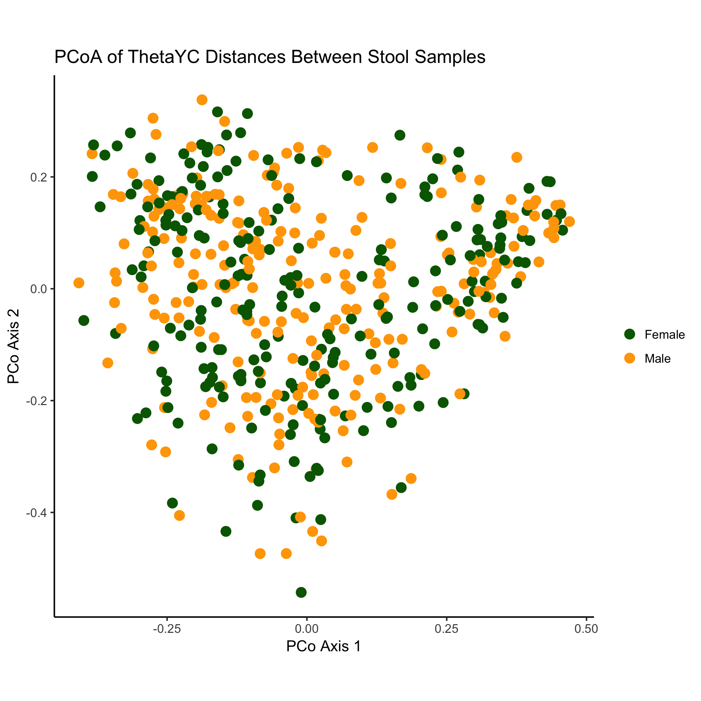
</div>

---

## ggplot2

The `ggplot2` package or just "ggplot" as it is commonly known, is a powerful tool for generating figures. The *gg* in the name refers to the "Grammar of Graphics", which is a way of thinking of figures as being a series of layers consisting. Originally described by [Leland Wilkinson](https://www.amazon.com/Grammar-Graphics-Statistics-Computing/dp/0387245448), the grammar has been updated and applied to [R by Hadley Wickham](http://vita.had.co.nz/papers/layered-grammar.html), the package's creator. According to the grammar, a figure consists of the underlying **data**, **aes**thetic mappings, **geom**etric objects, **scales**, a **coord**inate system, statistical transformations, and facet specifications. As we have seen already, each of these elements can be manipulated in ggplot2. As we proceed through the tutorials we will gain a greater appreciation for the variety of ways we can manipulate these elements within ggplot2 to make attractive images. ****

As an introduction to ggplot, let's break down the plotting section of the code chunk we've been working with.


```r
ggplot(data=metadata_pcoa, mapping=aes(x=axis1, y=axis2, color=dx))
```

Here we can see that the data to be plotted comes from a *variable* named `metadata_pcoa`, which is a *data frame* that contains the data we want to plot. The mapping we are applying to the data consists of assigning various columns from the data frame to aesthetics that we want to plot. Specifically, we will put the data in the `axis1` column to the x-axis, the data in the `axis2` column to the y-axis, and the data in the `dx` column (i.e. the diagnosis) to the color that will be plotted at the x and y coordinates. If we run this line in R, we will get a plotting window that doesn't have any data in it.


```r
ggplot(data=metadata_pcoa, mapping=aes(x=axis1, y=axis2, color=dx))
```

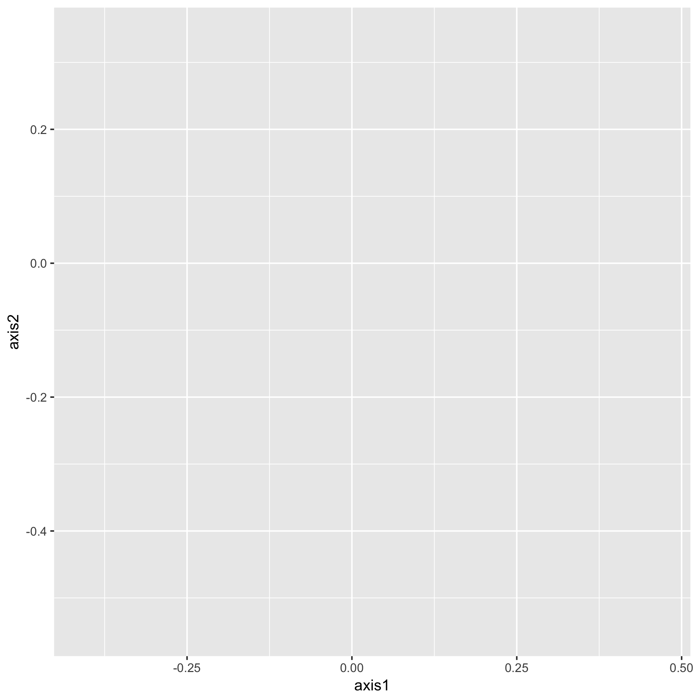

The data are there, we just can't see them - we need to tell ggplot the geometry that we want to apply to the data. This is contained within the next line, which is "added" to the original plotting window


```r
ggplot(data=metadata_pcoa, mapping=aes(x=axis1, y=axis2, color=dx)) +
	geom_point(shape=19, size=2)
```

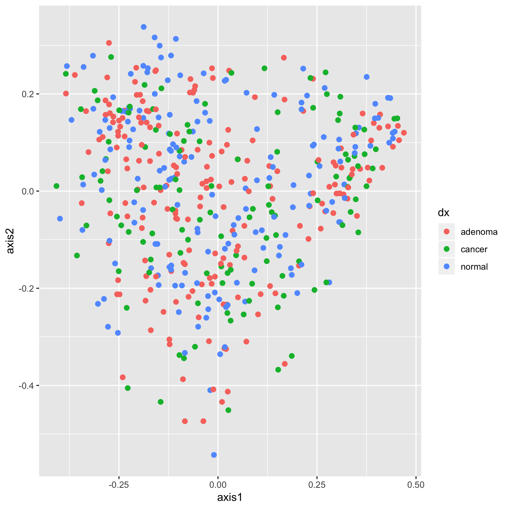

Now it's starting to look like a figure. There is a subtle point to notice in our `geom_point` function call. You'll notice that we are assigning aesthetics to our points without using the `aes` function in the `geom_point`. By default, the mapping values in the `ggplot` function call are applied to subsequent layers of the figure. That means that the points we plot will be colored according to the `dx` value. We could have done this instead


```r
ggplot(data=metadata_pcoa, mapping=aes(x=axis1, y=axis2)) +
 	geom_point(shape=19, size=2, mapping=aes(color=dx))
```

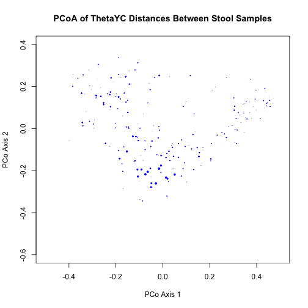

Again, we get the same plot. Stylistically, it's generally best to put your aesthetics mappings as close to the `ggplot` function call as possible. So, we'll put it back where we had it. Also, notice that we have two things that we might think of aesthetics outside of the mapping - the shape and size of the points to be plotted. When we set attributes for a plotting aesthetic outside of the mapping, that value gets applied to all of the points in that layer. Notice what happens Here


```r
ggplot(data=metadata_pcoa, mapping=aes(x=axis1, y=axis2, color=dx)) +
	geom_point(shape=19, size=2, color="black")
```

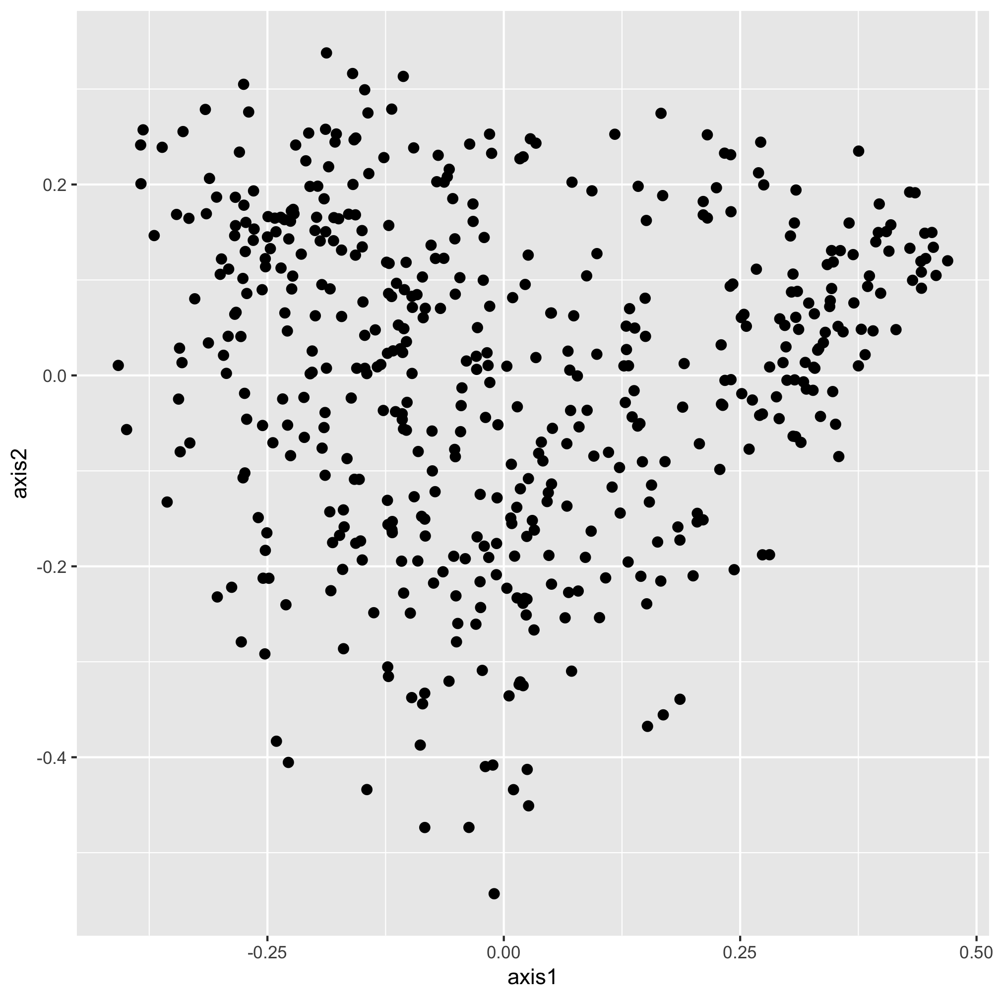

Our new color aesthetic, black, is overwriting the colors for the three diagnosis groups. There are numerous aesthetic values that we can apply to all of the points or that we can map to a specific variable. For example, in addition to color, we could also map the shape of the plotting symbol to the `dx` column.


```r
ggplot(data=metadata_pcoa, mapping=aes(x=axis1, y=axis2, color=dx, shape=dx)) +
 geom_point(size=2)
```

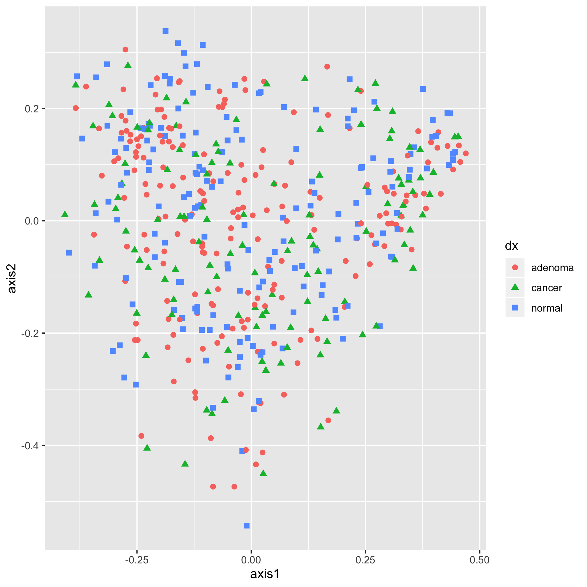

Each geometry (e.g. `geom_point`) has a set of aesthetics that it will map onto variables. `geom_point` will use mappings for x, y, size, shape, alpha (i.e. the opacity of the point), and fill and stroke (i.e. the color to use when using plotting symbols 21 through 25). We'll talk about color and shapes later. For now, let's go back to the diamond shape, which we had before.


```r
ggplot(data=metadata_pcoa, mapping=aes(x=axis1, y=axis2, color=dx)) +
	geom_point(shape=19, size=2)
```

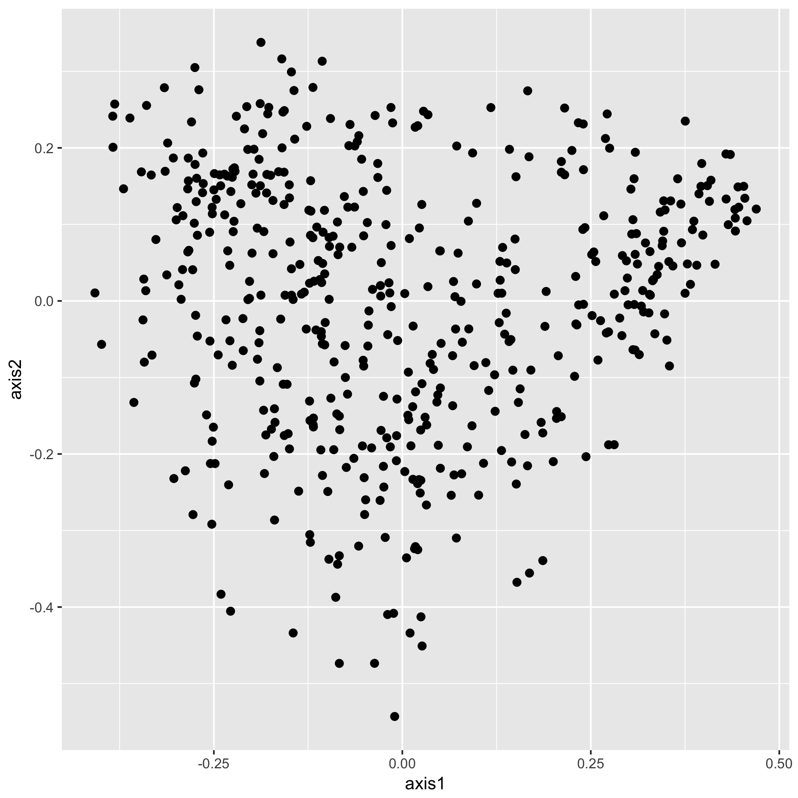

Notice that we needed to add the `geom_point` function call to `p` to update the value of `p`. This way, when we add the next component to the plot, we have the `geom_point` layer already included in the figure. You might notice that the values of `a` and `b` are still `2` and `3`, respectively, since we didn't update their values when we multiplied them. One quirky thing you've no doubt noticed is that to assign values in R people typically use the `<-` operator. You can also use `=`, but the equals sign is generally saved for assigning values to arguments in a function call (e.g. `color=dx`). You cannot use the `<-` operator for arguments. When you use the `<-` or `=` operator you don't get any output, the assignment is silent. If you want the value of the new variable, you need to write it out. This is what we did by putting `p` on its own line.

Moving along, we would now like specify the color of our plotting symbols to something other than the default values. This is done using one of ggplot's `scale` functions. Here we'll use `scale_color_manual`. This function allows us to manually set the colors to the values of `dx` that we want. It's been using "adenoma", "cancer", and "normal". Not only are these lower case rather than title case, they are also in an order that reflects the disease progression. We'd like them to go "Noraml", "Adenoma", and "Cancer". I'm also not a fan of having a title on the legend, so we'll set the name of the scale to `NULL` rather than `dx`


```r
ggplot(data=metadata_pcoa, mapping=aes(x=axis1, y=axis2, color=dx)) +
	geom_point(shape=19, size=2) +
	scale_color_manual(name=NULL,
		values=c("blue", "red", "black"),
		breaks=c("normal", "adenoma", "cancer"),
		labels=c("Normal", "Adenoma", "Cancer"))
```

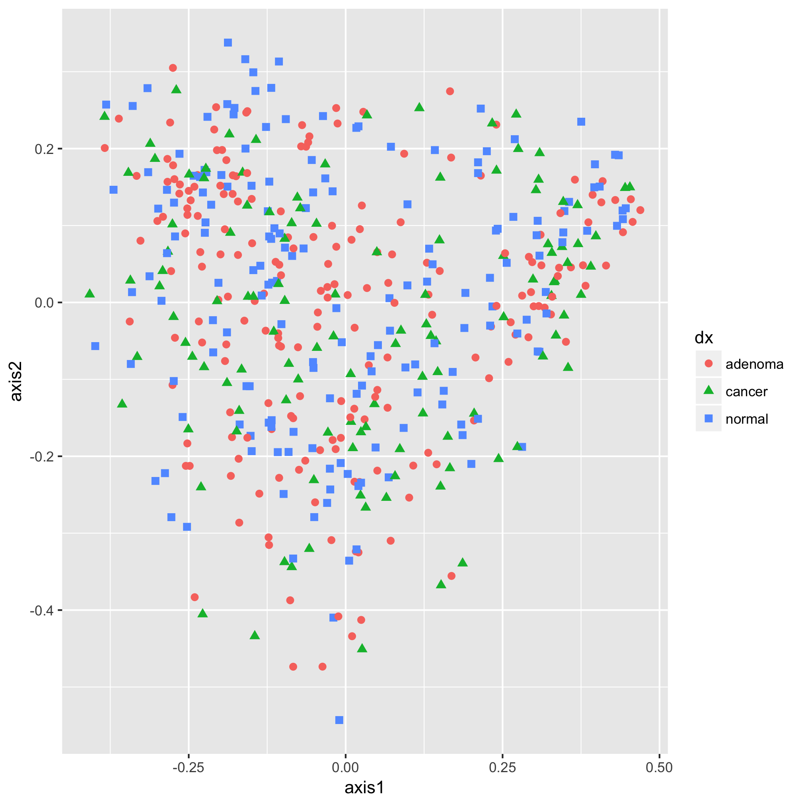

Next, I'd like to set the scale of the axes. We do this with one of the `coord` functions. By default, the coordinate system is `coord_cartesian`. For this ordination diagram I would like the shape of the plot to be square, rather than rectangular. We can achieve this with the `coord_fixed` function


```r
ggplot(data=metadata_pcoa, mapping=aes(x=axis1, y=axis2, color=dx)) +
	geom_point(shape=19, size=2) +
	scale_color_manual(name=NULL,
		values=c("blue", "red", "black"),
		breaks=c("normal", "adenoma", "cancer"),
		labels=c("Normal", "Adenoma", "Cancer")) +
	coord_fixed()
```

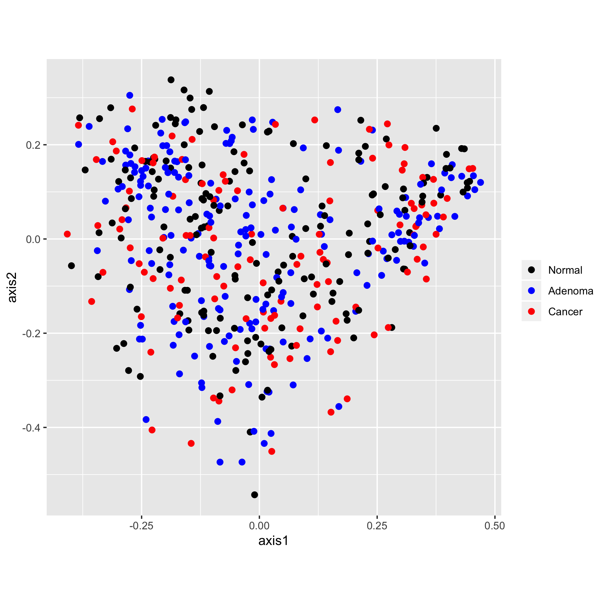

The scatter plot has "axis1" and "axis2" as the x and y-axis labels and lacks an overall title. Let's give them something a bit more descriptive and professionally formatted. We can do this with the `labs` function:


```r
ggplot(data=metadata_pcoa, mapping=aes(x=axis1, y=axis2, color=dx)) +
	geom_point(shape=19, size=2) +
	scale_color_manual(name=NULL,
		values=c("blue", "red", "black"),
		breaks=c("normal", "adenoma", "cancer"),
		labels=c("Normal", "Adenoma", "Cancer")) +
	coord_fixed() +
	labs(title="PCoA of ThetaYC Distances Between Stool Samples",
		x="PCo Axis 1",
		y="PCo Axis 2")
```

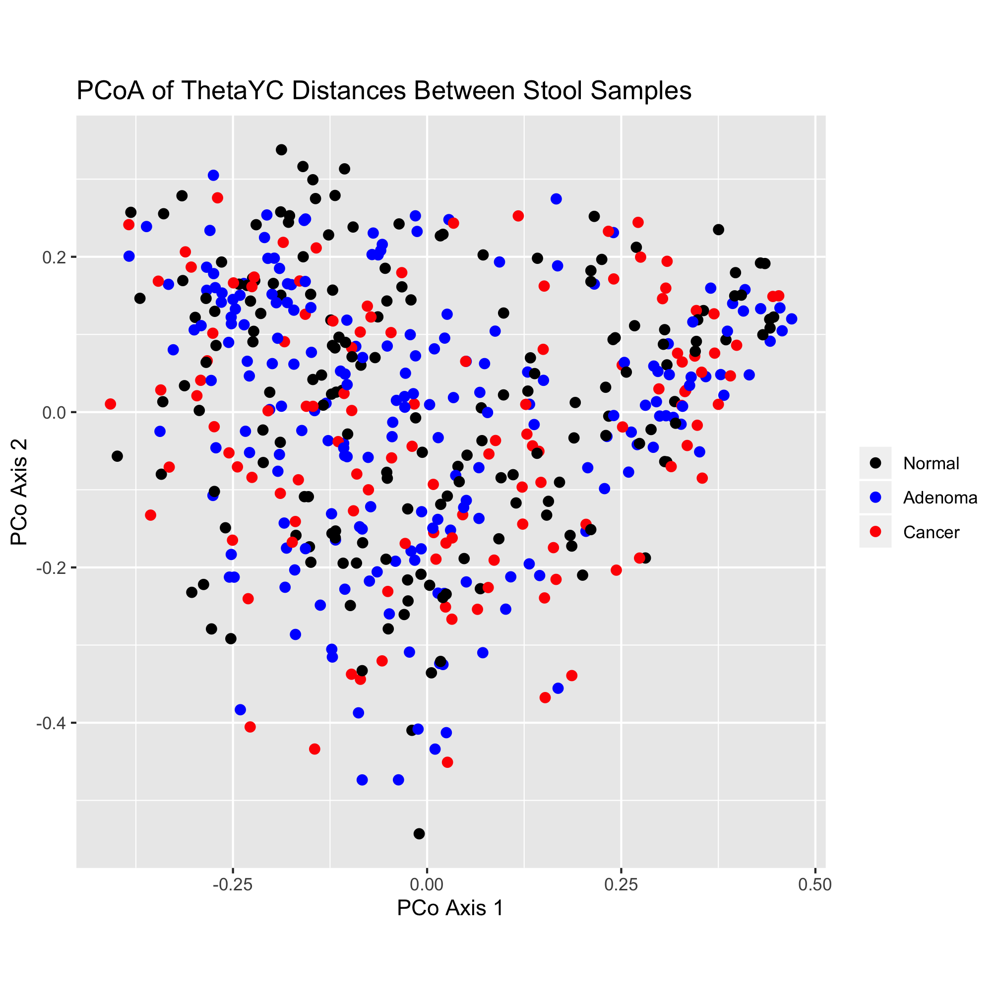

That looks pretty good! One thing that I'm not a fan of is the gray background color or the gridlines. There are many, many options for establishing the theme of the figure. We'll explore these themes later, but be comforted (or scared) by the fact that you can change virtually everything about the theming of your plots


```r
ggplot(data=metadata_pcoa, mapping=aes(x=axis1, y=axis2, color=dx)) +
	geom_point(shape=19, size=2) +
	scale_color_manual(name=NULL,
		values=c("blue", "red", "black"),
		breaks=c("normal", "adenoma", "cancer"),
		labels=c("Normal", "Adenoma", "Cancer")) +
	coord_fixed() +
	labs(title="PCoA of ThetaYC Distances Between Stool Samples",
		x="PCo Axis 1",
		y="PCo Axis 2") +
	theme_classic()
```


Finally, we'd like to save our figure with the `ggsave` function. This function is smart enough to know to format the figure as a PDF since the "pdf" extension is in the name. You could also generate a PNG, TIFF, or JPG-formatted imaage.


```r
ggsave("ordination.pdf")
```

This has been a quick run through the various ggplot-related functions that we can use to build our plot. We'll spend more time talking about colors and shapes in a moment. In later chapters we'll also discuss the various geometries, coordinates, and theming elements that we might use to represent our data.

---

### Activity 5
Altering the size of the plotting symbol is commonly called a ["bubble chart"](https://en.wikipedia.org/wiki/Bubble_chart). Create a plot where the value of `axis3` (the z-axis) is mapped on to the size of the plotting symbol. Don't worry about manipulating the legend.

<input type="button" class="hideshow">
<div markdown="1" style="display:none;">


```r
ggplot(metadata_pcoa, aes(x=axis1, y=axis2, size=axis3, color=dx)) +
	geom_point(shape=19) +
	scale_color_manual(name=NULL,
		values=c("blue", "red", "black"),
		breaks=c("normal", "adenoma", "cancer"),
		labels=c("Normal", "Adenoma", "Cancer")) +
	coord_fixed() +
	labs(title="PCoA of ThetaYC Distances Between Stool Samples",
		x="PCo Axis 1",
		y="PCo Axis 2") +
	theme_classic()
```


</div>

---

### Activity 6
One problem with the original ordination is that there is a tendency for the points to fall on top of each other making for a big mass of point. One of the aesthetic properties of `geom_point` is `alpha`, which allows you to set the transparency of each point. Alter the original ggplot code we used to change the alpha of our points to get a better sense of how many points overlap at the same location.

<input type="button" class="hideshow">
<div markdown="1" style="display:none;">


```r
ggplot(metadata_pcoa, aes(x=axis1, y=axis2, color=dx)) +
	geom_point(shape=19, size=2, alpha=0.5) +
	scale_color_manual(name=NULL,
		values=c("blue", "red", "black"),
		breaks=c("normal", "adenoma", "cancer"),
		labels=c("Normal", "Adenoma", "Cancer")) +
	coord_fixed() +
	labs(title="PCoA of ThetaYC Distances Between Stool Samples",
		x="PCo Axis 1",
		y="PCo Axis 2") +
	theme_classic()
```


</div>

---

### Activity 7
* Think about the data in your research. What variables would you depict by changing the plotting symbol? The symbol color? The symbol's size?
* What is an appropriate number of colors or plotting symbols to use? Are there colors to stay away from?
* Freehand draw a scatter chart plot of your data. What question are you trying to answer with your plot? What variable goes on the x-axis? y-axis? How do you use color? symbols? size?
* What more do you need to learn to make the plot for your own data?

---

### Activity 8
* What do you think of our original ordination? What works? What doesn't?
* What question(s) is it seeking to answer?

---


## Plotting symbols

There are 25 different plotting symbols in R that can be set by giving the `shape` argument a value from 1 to 25. I tend to limit myself to a handful of these: open and closed squares, circles, or triangles. To keep myself from hunting for the right shape value, I made a cheat sheet:

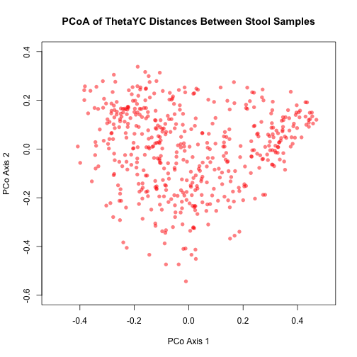

Among these 25 symbols, symbols 21 to 25 are unique. The color of these symbol is taken from the value of `fill` and the color of the border comes from the value of `color`. The width of the border can be set with the `stroke` aesthetic. Let's give this a shot with our ordination.


```r
ggplot(metadata_pcoa, aes(x=axis1, y=axis2, fill=dx)) +
	geom_point(shape=21, size=2, stroke=0.5) +
	scale_color_manual(name=NULL,
		values=c("blue", "red", "black"),
		breaks=c("normal", "adenoma", "cancer"),
		labels=c("Normal", "Adenoma", "Cancer")) +
	coord_fixed() +
	labs(title="PCoA of ThetaYC Distances Between Stool Samples",
		x="PCo Axis 1",
		y="PCo Axis 2") +
	theme_classic()
```

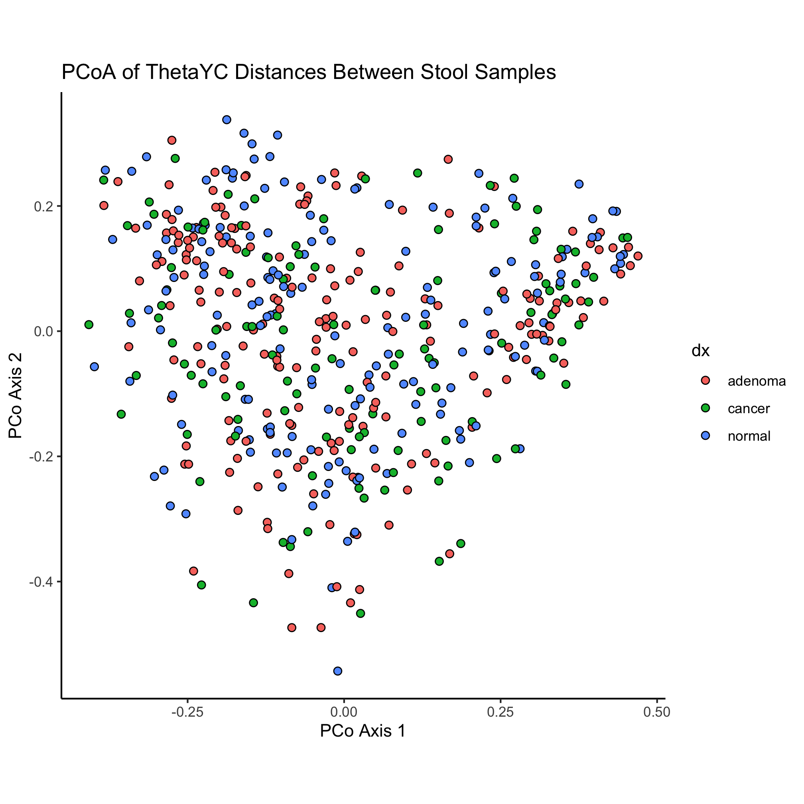

We have a small bug in our code now - our colors don't seem to be taking. What do you think we need to change to fix the problem?


```r
ggplot(metadata_pcoa, aes(x=axis1, y=axis2, fill=dx)) +
	geom_point(shape=21, size=2, stroke=0.5) +
	scale_fill_manual(name=NULL,
		values=c("blue", "red", "black"),
		breaks=c("normal", "adenoma", "cancer"),
		labels=c("Normal", "Adenoma", "Cancer")) +
	coord_fixed() +
	labs(title="PCoA of ThetaYC Distances Between Stool Samples",
		x="PCo Axis 1",
		y="PCo Axis 2") +
	theme_classic()
```

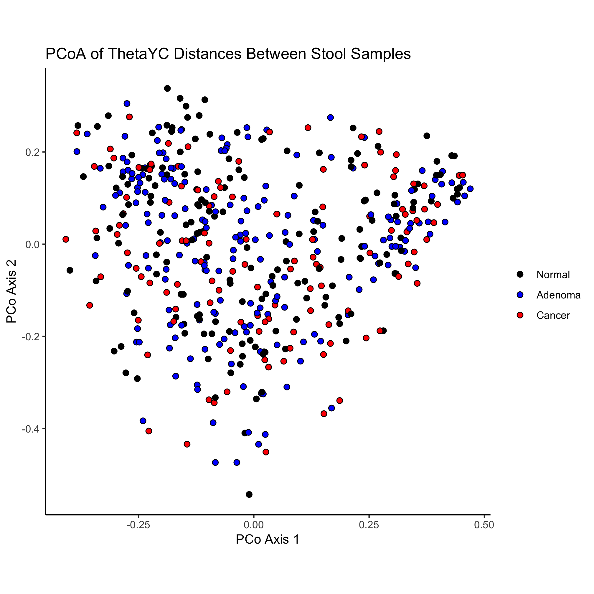

Let's change our ordination a bit to color our point by the `dx` column of our data frame and change the shape of the point based on the `Gender` column. Can you do this without looking ahead?


```r
ggplot(metadata_pcoa, aes(x=axis1, y=axis2, color=dx, shape=Gender)) +
	geom_point(size=2) +
	scale_color_manual(name=NULL,
		values=c("blue", "red", "black"),
		breaks=c("normal", "adenoma", "cancer"),
		labels=c("Normal", "Adenoma", "Cancer")) +
	coord_fixed() +
	labs(title="PCoA of ThetaYC Distances Between Stool Samples",
		x="PCo Axis 1",
		y="PCo Axis 2") +
	theme_classic()
```

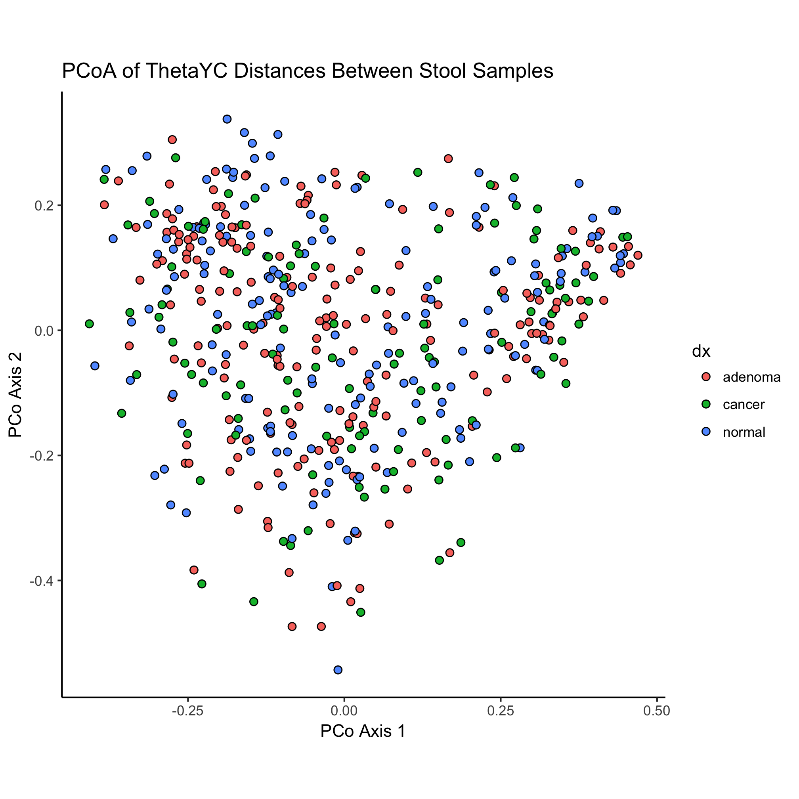

Here again, we have the poorly formatted legend for the shape. Similar to our use of `scale_color_manual` we can solve the formatting problem using `scale_shape_manual`


```r
ggplot(metadata_pcoa, aes(x=axis1, y=axis2, color=dx, shape=Gender)) +
	geom_point(size=2) +
	scale_color_manual(name=NULL,
		values=c("blue", "red", "black"),
		breaks=c("normal", "adenoma", "cancer"),
		labels=c("Normal", "Adenoma", "Cancer")) +
	scale_shape_manual(name=NULL,
		values=c(19, 17),
		breaks=c("f", "m"),
		labels=c("Female", "Male")) +
	coord_fixed() +
	labs(title="PCoA of ThetaYC Distances Between Stool Samples",
		x="PCo Axis 1",
		y="PCo Axis 2") +
	theme_classic()
```


Nothing really pops out in the ordination to suggest that there's a difference between diagnosis group or sex. Instead of mapping the subject's sex onto the shape, let's map the diagnosis onto the shape and color.


```r
ggplot(metadata_pcoa, aes(x=axis1, y=axis2, color=dx, shape=dx)) +
	geom_point(size=2) +
	scale_color_manual(name=NULL,
		values=c("blue", "red", "black"),
		breaks=c("normal", "adenoma", "cancer"),
		labels=c("Normal", "Adenoma", "Cancer")) +
	scale_shape_manual(name=NULL,
		values=c(15, 16, 17),
		breaks=c("normal", "adenoma", "cancer"),
		labels=c("Normal", "Adenoma", "Cancer")) +
	coord_fixed() +
	labs(title="PCoA of ThetaYC Distances Between Stool Samples",
		x="PCo Axis 1",
		y="PCo Axis 2") +
	theme_classic()
```


## Color

So far we've used some basic colors to color our points. For the primary colors, these names work pretty well. You can get a listing of the various named colors in R with the `colors()` function


```r
colors()
```

Revisiting our original ordination we might try to soften the saturation of the colors a bit


```r
ggplot(metadata_pcoa, aes(x=axis1, y=axis2, color=dx)) +
	geom_point(shape=19, size=2) +
	scale_color_manual(name=NULL,
		values=c("dodgerblue", "sienna", "gray"),
		breaks=c("normal", "adenoma", "cancer"),
		labels=c("Normal", "Adenoma", "Cancer")) +
	coord_fixed() +
	labs(title="PCoA of ThetaYC Distances Between Stool Samples",
		x="PCo Axis 1",
		y="PCo Axis 2") +
	theme_classic()
```

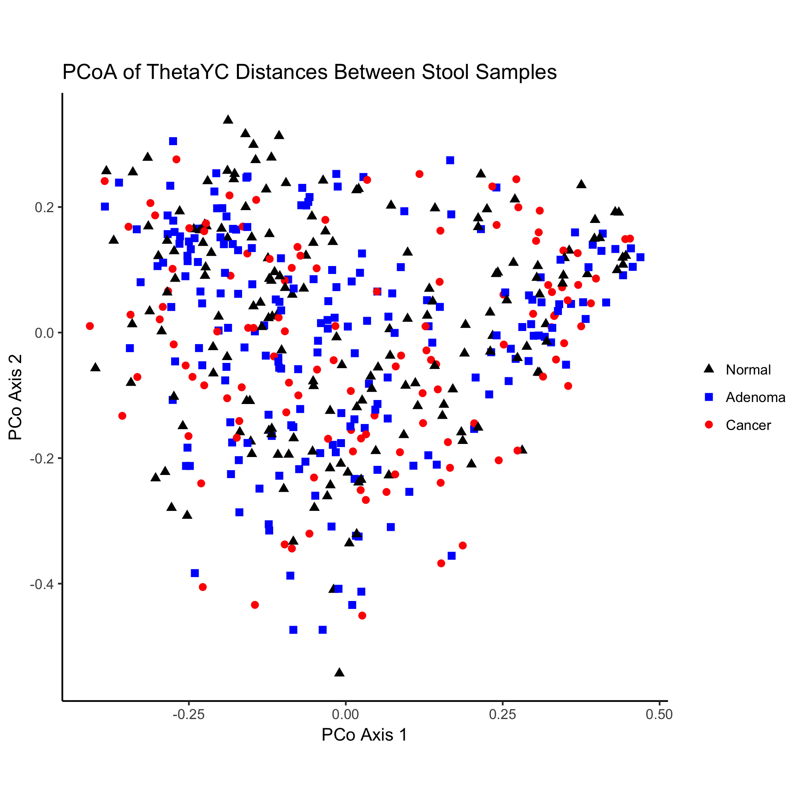

There are numerous color palette options available. Unfortunately, the palettes that are built into R leave a bit to be desired. Several R packages are available for picking colors that work well together. One popular website for identifying good palettes is [ColorBrewer](http://colorbrewer2.org/#type=sequential&scheme=BuGn&n=3) and these palettes are available as the `RColorBrewer` package. You can install a packages with the `install.packages` function


```r
install.packages("RColorBrewer")
```

When you run this command, R will likely ask you where you want to download the package from. It probably doesn't really matter, although I typically pick the one closest to me: `58`. As we saw with the `tidyverse` package, we need to load it with the `library` function.


```r
library(RColorBrewer)
```

We can get a sense of the package by running the following


```r
?RColorBrewer
```

```
RColorBrewer           package:RColorBrewer            R Documentation

ColorBrewer palettes

Description:

     Creates nice looking color palettes especially for thematic maps

Usage:

     brewer.pal(n, name)
     display.brewer.pal(n, name)
     display.brewer.all(n=NULL, type="all", select=NULL, exact.n=TRUE,
     colorblindFriendly=FALSE)
     brewer.pal.info

Arguments:

       n: Number of different colors in the palette, minimum 3, maximum
          depending on palette

    name: A palette name from the lists below

    type: One of the string "div", "qual", "seq", or "all"

  select: A list of names of existing palettes

 exact.n: If TRUE, only display palettes with a color number given by n

colorblindFriendly: if TRUE, display only colorblind friendly palettes

Details:

     ‘brewer.pal’ makes the color palettes from ColorBrewer available
     as R palettes.

     ‘display.brewer.pal()’ displays the selected palette in a graphics
     window.

     ‘display.brewer.all()’ displays the a few palettes simultanueously
     in a graphics window.

     ‘brewer.pal.info’ returns information about the available palettes
     as a dataframe. ‘brewer.pal.info’ is not a function, it is a
     variable. This might change in the future.

     For details and an interactive palette selection tools see
     http://colorbrewer.org. It is free to use, although ColorBrewer's
     designers would appreciate it if you could cite the ColorBrewer
     project if you decide to use one of our color schemes.

     There are 3 types of palettes, sequential, diverging, and
     qualitative.
     1. Sequential palettes are suited to ordered data that progress
     from low to high.  Lightness steps dominate the look of these
     schemes, with light colors for low data values to dark colors for
     high data values.
     2. Diverging palettes put equal emphasis on mid-range critical
     values and extremes at both ends of the data range. The critical
     class or break in the middle of the legend is emphasized with
     light colors and low and high extremes are emphasized with dark
     colors that have contrasting hues.
     3. Qualitative palettes do not imply magnitude differences between
     legend classes, and hues are used to create the primary visual
     differences between classes.  Qualitative schemes are best suited
     to representing nominal or categorical data.

     The sequential palettes names are
     Blues BuGn BuPu GnBu Greens Greys Oranges OrRd PuBu PuBuGn PuRd
     Purples RdPu Reds YlGn YlGnBu YlOrBr YlOrRd

     All the sequential palettes are available in variations from 3
     different values up to 9 different values.

     The diverging palettes are
     BrBG PiYG PRGn PuOr RdBu RdGy RdYlBu RdYlGn Spectral

     All the diverging palettes are available in variations from 3
     different values up to 11 different values.

     For qualitative palettes, the lowest number of distinct values
     available always is 3, but the largest number is different for
     different palettes. It is given together with the palette names in
     the following table.

       Accent    8
       Dark2     8
       Paired   12
       Pastel1   9
       Pastel2   8
       Set1      9
       Set2      8
       Set3     12

     ColorBrewer is Copyright (c) 2002 Cynthia Brewer, Mark Harrower,
     and The Pennsylvania State University.  All rights reserved.
     The ColorBrewer palettes have been included in this R package with
     permission of the copyright holder.
     For license details see the file ‘COPYING’ included in this
     package.

Value:

     A palette
     You will get an error when you ask for a nonexisting palette, and
     you will get a warning if a palette you asked for exists but not
     with as many different leves as you asked for.

Note:

     More information on ColorBrewer is available at its Website, <URL:
     http://www.colorbrewer.org>.

Author(s):

     Erich Neuwirth, University of Vienna, <email:
     erich.neuwirth@univie.ac.at>, with contributions by John
     Maindonald, Australian National University, <email:
     john.maindonald@anu.edu.au>

Examples:

     ## create a sequential palette for usage and show colors
     mypalette<-brewer.pal(7,"Greens")
     image(1:7,1,as.matrix(1:7),col=mypalette,xlab="Greens (sequential)",
            ylab="",xaxt="n",yaxt="n",bty="n")
     ## display a divergent palette
     display.brewer.pal(7,"BrBG")
     devAskNewPage(ask=TRUE)
     ## display a qualitative palette
     display.brewer.pal(7,"Accent")
     devAskNewPage(ask=TRUE)
     ## display a palettes simultanoeusly
     display.brewer.all(n=10, exact.n=FALSE)
     devAskNewPage(ask=TRUE)
     display.brewer.all(n=10)
     devAskNewPage(ask=TRUE)
     display.brewer.all()
     devAskNewPage(ask=TRUE)
     display.brewer.all(type="div")
     devAskNewPage(ask=TRUE)
     display.brewer.all(type="seq")
     devAskNewPage(ask=TRUE)
     display.brewer.all(type="qual")
     devAskNewPage(ask=TRUE)
     display.brewer.all(n=5,type="div",exact.n=TRUE)
     devAskNewPage(ask=TRUE)
     display.brewer.all(colorblindFriendly=TRUE)
     devAskNewPage(ask=TRUE)
     brewer.pal.info
     brewer.pal.info["Blues",]
     brewer.pal.info["Blues",]$maxcolors
```

The `?` function is useful for getting help pages on our favorite functions. Used like we did here, it pulls up a help page for the package. We see that there are a number of nicely named functions that tell us what they do. For our ordination we would like 3 colors for use with qualitative data that are friendly to our color blind friends. Reading through the documentation and the Examples section at the end, let's run this command.


```r
display.brewer.all(n=3, type="qual", colorblindFriendly=TRUE)
```

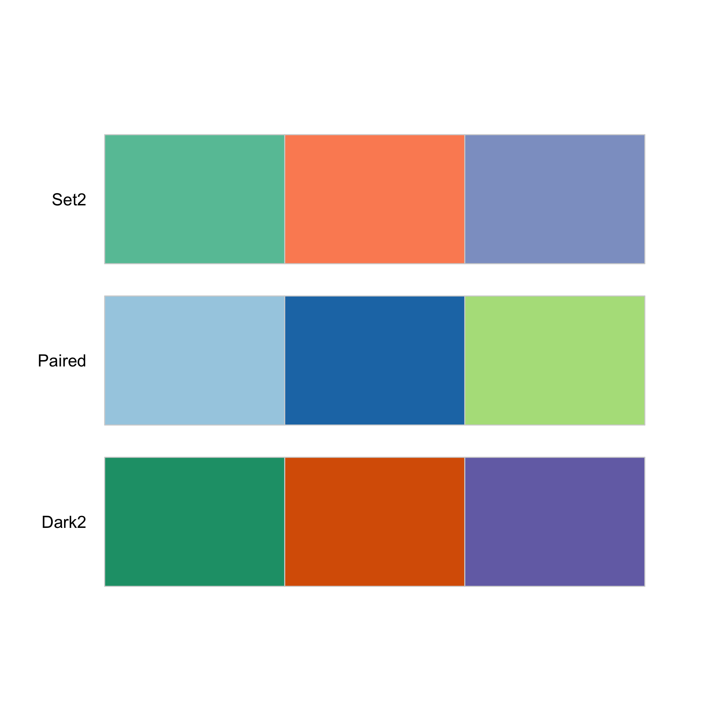

This pops up a set of three options that we can now use for our ordination with the `brewer.pal` function. The "Set2" palette are the default ggplot colors. Instead, let's use the `Dark2` palette.


```r
ggplot(metadata_pcoa, aes(x=axis1, y=axis2, color=dx)) +
	geom_point(shape=19, size=2) +
	scale_color_manual(name=NULL,
		values=brewer.pal(n=3, name="Dark2"),
		breaks=c("normal", "adenoma", "cancer"),
		labels=c("Normal", "Adenoma", "Cancer")) +
	coord_fixed() +
	labs(title="PCoA of ThetaYC Distances Between Stool Samples",
		x="PCo Axis 1",
		y="PCo Axis 2") +
	theme_classic()
```

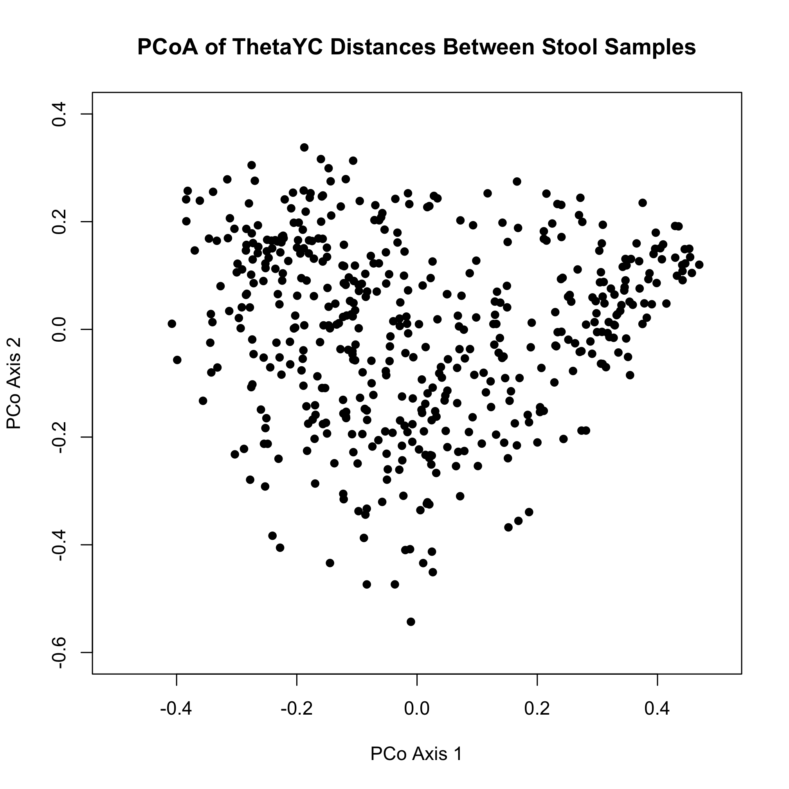

Some more whimsical options include the [`beyonce`](https://github.com/dill/beyonce) and [`wesanderson`](https://github.com/karthik/wesanderson) color palettes. Another option is to find a website who's color scheme you really like and use a color picker browser extension or `Adobe Photoshop` to get the HTML code for colors you like. For example, the two dominant colors on this site are `#FFAC63` and `#2857D6`. These HTML color codes are hexidecimal numbers and can be used like you would a named color. Instead of using named colors, we could use these two colors along with `black` to color our ordination


```r
ggplot(metadata_pcoa, aes(x=axis1, y=axis2, color=dx)) +
	geom_point(shape=19, size=2) +
	scale_color_manual(name=NULL,
		values=c('#FFAC63', '#2857D6', 'black'),
		breaks=c("normal", "adenoma", "cancer"),
		labels=c("Normal", "Adenoma", "Cancer")) +
	coord_fixed() +
	labs(title="PCoA of ThetaYC Distances Between Stool Samples",
		x="PCo Axis 1",
		y="PCo Axis 2") +
	theme_classic()
```

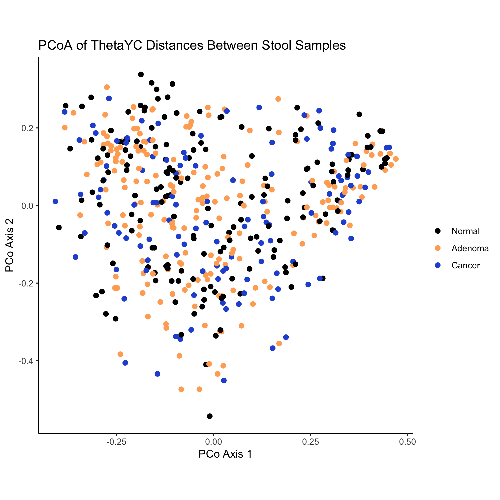

---

### Activity 9
What if you run `brewer.pal(n=3, name="Dark2")` at the prompt in R?

<input type="button" class="hideshow">
<div markdown="1" style="display:none;">

```r
brewer.pal(n=3, name="Dark2")
```

```
## [1] "#1B9E77" "#D95F02" "#7570B3"
```
</div>


---

### Activity 10
Install the `wesanderson` R package and pick a theme to color the ordination

<input type="button" class="hideshow">
<div markdown="1" style="display:none;">


```r
install.packages("wesanderson")
library("wesanderson")
names(wes_palettes)

ggplot(metadata_pcoa, aes(x=axis1, y=axis2, color=dx)) +
	geom_point(shape=19, size=2) +
	scale_color_manual(name=NULL,
		values=wes_palette(name="Darjeeling", n=3),
		breaks=c("normal", "adenoma", "cancer"),
		labels=c("Normal", "Adenoma", "Cancer")) +
	coord_fixed() +
	labs(title="PCoA of ThetaYC Distances Between Stool Samples",
		x="PCo Axis 1",
		y="PCo Axis 2") +
	theme_classic()
```


```
##  [1] "BottleRocket1"  "BottleRocket2"  "Rushmore1"      "Rushmore"      
##  [5] "Royal1"         "Royal2"         "Zissou1"        "Darjeeling1"   
##  [9] "Darjeeling2"    "Chevalier1"     "FantasticFox1"  "Moonrise1"     
## [13] "Moonrise2"      "Moonrise3"      "Cavalcanti1"    "GrandBudapest1"
## [17] "GrandBudapest2" "IsleofDogs1"    "IsleofDogs2"
```

```
## Error in wes_palette(name = "Darjeeling", n = 3): Palette not found.
```


</div>
