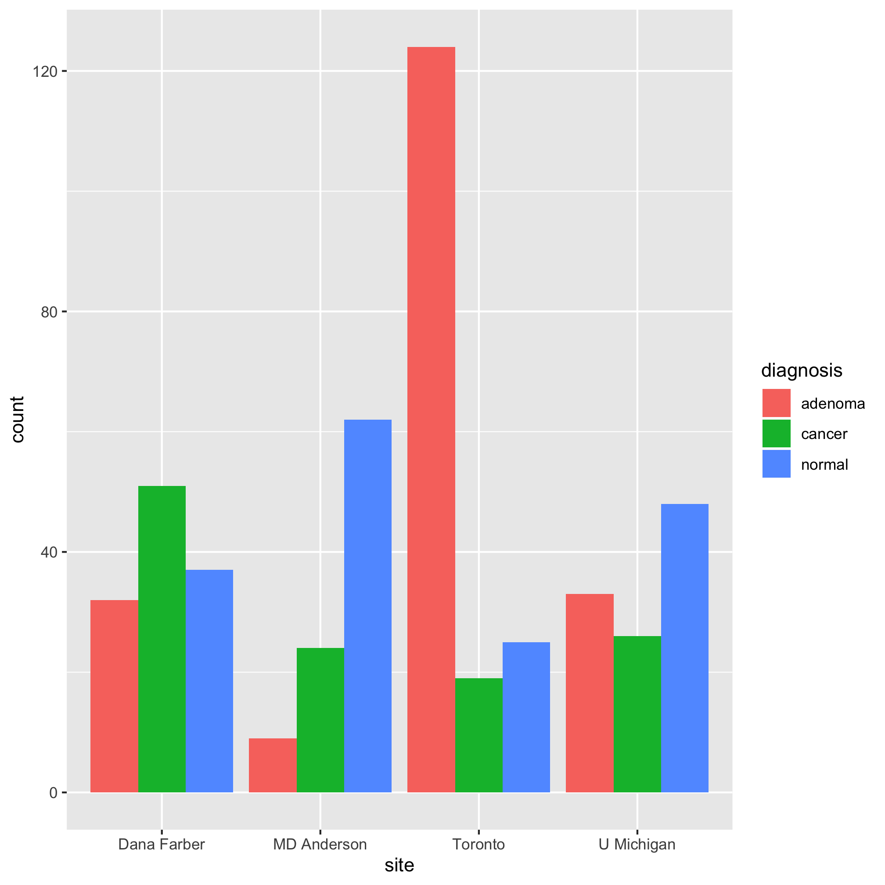
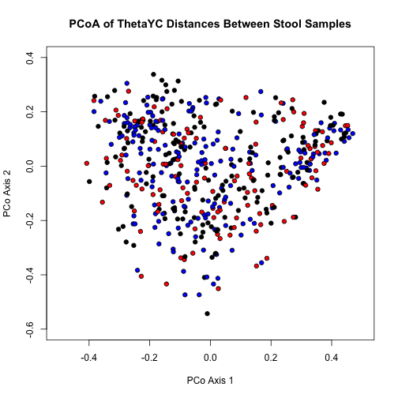
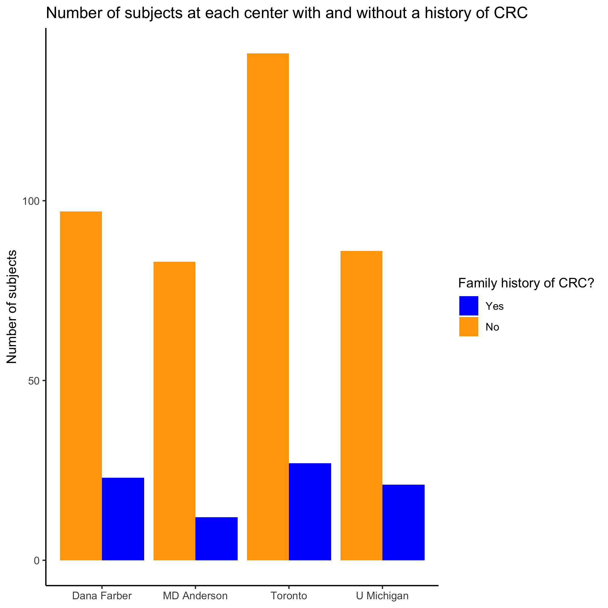
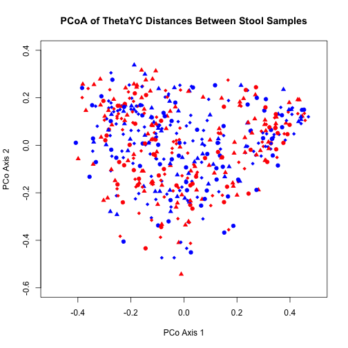

## Learning goals

* Manipulate data frames
* Creating functions
* Incorporate metadata into scatter plots
* Read in data from various file formats


## Getting metadata into R
Metadata are the data about the data. For the dataset we worked with in the last section we might think about the people's diagnosis, BMI, race, smoking status, and so forth. This information is critical to understanding the structure in our data. I intimated this earlier, but we could imagine picking plotting symbols based on diagnosis or coloring our points based on the patient's sampling center or their BMI. Before we can do all these cool things, we need to learn how to work with our metadata.

For the data we used in the previous session, the researchers provided the metadata as a text file. In the world of R and programming, in general, text files are your friend. Files generated by Microsoft Excel or Word are not text files, but are rather a binary file format. For now, trust me that text is best. The `baxter.metadata.tsv` file is a tab-delineated file. This means that the columns are separated by tabs. Another common format is for columns to be comma-delineated. These are often called `tsv` and `csv` files, respectively. In the previous session you saw how we could read in the ordination data using the `read.table` command. There are many commands for reading in data from a file, but this one works pretty well for most purposes.


```r
metadata <- read.table(file="data/baxter.metadata.tsv", header=T, sep='\t', stringsAsFactors=FALSE)
```

Take a look at this command, what do you think is happening here? How do you think it would change if you had a `csv` instead? Our new `metadata` variable holds a `data.frame`. Previously we saw variables that were a `vector`. You can think of a `data.frame` as a collection of vectors that are all the same length but can each differ in the type of data they contain whether it is numerical, text, logical, or categorical data. A data.frame is very much like a spreadsheet - it is a table where the rows represent an entity and the columns represent its characteristics.

For you, this might beg the question, I have my metadata stored in a Microsoft Excel spreadsheet, how should I convert that to a text file? Previously we learned about DRY, another practice we want to develop is to leave raw data raw. All sorts of very bad things can happen when we start mucking with our raw data files. Once we've modified the metadata that our collaborators sent us we can't revert it to the original state very easily. So we can export a tsv or csv file from Excel or we can ask R to work directly with the Excel formatted file (`xlsx`). Here we'll introduce another great package - `openxlsx`


```
## Installing package into '/Users/pschloss/Library/R/3.4/library'
## (as 'lib' is unspecified)
```


```r
install.packages("openxlsx", repos="https://cloud.r-project.org/")
library("openxlsx")

metadata <- read.xlsx(file="data/baxter.metadata.xlsx")
```

Nuts. That didn't work. Hmmm. Let's get some help. If there's a function you want to use but don't know or can't remember it's arguments, you can type `?read.xlsx`. The `?` tells R you want help. In this case we get a screen that looks like so...

````
read.xlsx               package:openxlsx               R Documentation

Read data from a worksheet or Workbook object into a data.frame

Description:

     Read data from a worksheet or Workbook object into a data.frame

Usage:

     read.xlsx(xlsxFile, sheet = 1, startRow = 1, colNames = TRUE,
       skipEmptyRows = TRUE, rowNames = FALSE, detectDates = FALSE,
       rows = NULL, cols = NULL)

Arguments:

xlsxFile: An xlsx file or Workbook object

   sheet: The name or index of the sheet to read data from.

startRow: first row to begin looking for data.  Empty rows at the top
          of a file are always skipped, regardless of the value of
          startRow.

colNames: If ‘TRUE’, the first row of data will be used as column
          names.

skipEmptyRows: If ‘TRUE’, empty rows are skipped else empty rows after
          the first row containing data will return a row of NAs.

rowNames: If ‘TRUE’, first column of data will be used as row names.

detectDates: If ‘TRUE’, attempt to recognise dates and perform
          conversion.

    rows: A numeric vector specifying which rows in the Excel file to
          read. If NULL, all rows are read.

    cols: A numeric vector specifying which columns in the Excel file
          to read. If NULL, all columns are read.
````

Now we see the various arguments that `open.xlsx` will take. Instead of using the `file` argument, it wants us to use the `xlsxFile` argument. You can scroll down through the help page to get all sorts of useful information about the package including examples of how to use it. If you're running R from the command line, go ahead and hit `q` to return to the R prompt.


```r
metadata <- read.xlsx(xlsxFile="data/baxter.metadata.xlsx")
```

There you go, we now have our metadata in R. Let's see what we can do with it now.

### Activity 1
Open one of the spreadsheets where you keep the metadata for your project

* What do you see in your spreadsheet that might cause problems?
* How would you want to organize your metadata to make it easier to use with R?
* Look at the formatting of your data. Are all of the dates consistently formatted? Do you use a consistent capitalization style? Do you use non-text information (e.g. color) to represent values?


## Exploring our metadata
Let's dig into the Baxter data to think about how we'd like to use the metadata to improve our scatter plot. Whenever we read in a data frame there are a few things to do get a handle on your data. First, let's see how much data we have


```r
nrow(metadata)
```

```
## [1] 490
```

```r
ncol(metadata)
```

```
## [1] 17
```

```r
dim(metadata)
```

```
## [1] 490  17
```

These three commands tell us the number of rows (`nrow`), columns (`ncol`), and both together (`dim`) in our metadata data frame. Let's find out the names of our columns


```r
colnames(metadata)
```

```
##  [1] "sample"       "fit_result"   "Site"         "Dx_Bin"      
##  [5] "dx"           "Hx_Prev"      "Hx_of_Polyps" "Age"         
##  [9] "Gender"       "Smoke"        "Diabetic"     "Hx_Fam_CRC"  
## [13] "Height"       "Weight"       "NSAID"        "Diabetes_Med"
## [17] "stage"
```

Are these column names informative? What type of information do you think each column might contain? If our data frame had names on the rows, we could get their value using the `rownames` command in a similar way. We can get a sense of the data frame using the `head` command, which returns the first 6 values of a variable or `tail`, which returns the last 6 values.


```r
head(metadata)
```

```
##    sample fit_result        Site           Dx_Bin      dx Hx_Prev
## 1 2003650          0  U Michigan High Risk Normal  normal       0
## 2 2005650          0  U Michigan High Risk Normal  normal       0
## 3 2007660         26  U Michigan High Risk Normal  normal       0
## 4 2009650         10     Toronto          Adenoma adenoma       0
## 5 2013660          0  U Michigan           Normal  normal       0
## 6 2015650          0 Dana Farber High Risk Normal  normal       0
##   Hx_of_Polyps Age Gender Smoke Diabetic Hx_Fam_CRC Height Weight NSAID
## 1            1  64      m    NA        0          1    182    120     0
## 2            1  61      m     0        0          0    167     78     0
## 3            1  47      f     0        0          1    170     63     0
## 4            1  81      f     1        0          0    168     65     1
## 5            0  44      f     0        0          0    170     72     1
## 6            1  51      f     1        0          0    160     67     0
##   Diabetes_Med stage
## 1            0     0
## 2            0     0
## 3            0     0
## 4            0     0
## 5            0     0
## 6            0     0
```

```r
tail(metadata)
```

```
##      sample fit_result        Site      Dx_Bin      dx Hx_Prev
## 485 3529653          0 Dana Farber      Normal  normal       0
## 486 3531650          0 Dana Farber      Normal  normal       1
## 487 3535650          0  U Michigan Adv Adenoma adenoma       0
## 488 3537650          0  U Michigan      Normal  normal       0
## 489 3551650          0 Dana Farber     Adenoma adenoma       1
## 490 3561650          0  U Michigan      Normal  normal       0
##     Hx_of_Polyps Age Gender Smoke Diabetic Hx_Fam_CRC Height Weight NSAID
## 485            0  51      f     0        0          0    162     72     0
## 486            0  53      f     0        0          0    160     86     0
## 487            1  75      m     1        0          0    185     93     1
## 488            0  56      f     0        0          0    160     69     0
## 489            1  77      m     1        0          0    187     83     1
## 490            0  51      f     0        0          0    167     71     0
##     Diabetes_Med stage
## 485            0     0
## 486            0     0
## 487            0     0
## 488            0     0
## 489            0     0
## 490            0     0
```

We can also use the `str` command to get an idea about the structure of a variable.


```r
str(metadata)
```

```
## 'data.frame':	490 obs. of  17 variables:
##  $ sample      : num  2003650 2005650 2007660 2009650 2013660 ...
##  $ fit_result  : num  0 0 26 10 0 ...
##  $ Site        : chr  "U Michigan" "U Michigan" "U Michigan" "Toronto" ...
##  $ Dx_Bin      : chr  "High Risk Normal" "High Risk Normal" "High Risk Normal" "Adenoma" ...
##  $ dx          : chr  "normal" "normal" "normal" "adenoma" ...
##  $ Hx_Prev     : num  0 0 0 0 0 0 1 0 1 1 ...
##  $ Hx_of_Polyps: num  1 1 1 1 0 1 1 0 1 1 ...
##  $ Age         : num  64 61 47 81 44 51 78 59 63 67 ...
##  $ Gender      : chr  "m" "m" "f" "f" ...
##  $ Smoke       : num  NA 0 0 1 0 1 1 0 1 1 ...
##  $ Diabetic    : num  0 0 0 0 0 0 1 0 0 0 ...
##  $ Hx_Fam_CRC  : num  1 0 1 0 0 0 0 0 0 0 ...
##  $ Height      : num  182 167 170 168 170 160 172 177 154 167 ...
##  $ Weight      : num  120 78 63 65 72 67 78 65 54 58 ...
##  $ NSAID       : num  0 0 0 1 1 0 0 0 0 0 ...
##  $ Diabetes_Med: num  0 0 0 0 0 0 1 0 0 0 ...
##  $ stage       : num  0 0 0 0 0 0 3 0 0 4 ...
```

You'll commonly encounter numerical (`int` or `num`), categorical (`Factor`), boolean (`logical`), and text (`chr`) data. The `str` command will tell you the type of data you have in your variable.

Another function that is great for characterizing a data frame (or any type of variable) is `summary`. We used this previously on a vector, but when we use it on a data frame we get the summary output for each column.


```r
summary(metadata)
```

```
##      sample          fit_result         Site              Dx_Bin         
##  Min.   :2003650   Min.   :   0.0   Length:490         Length:490        
##  1st Qu.:2326158   1st Qu.:   0.0   Class :character   Class :character  
##  Median :2776662   Median :   0.0   Mode  :character   Mode  :character  
##  Mean   :2757494   Mean   : 236.3                                        
##  3rd Qu.:3155185   3rd Qu.: 102.5                                        
##  Max.   :3561650   Max.   :2964.0                                        
##                                                                          
##       dx               Hx_Prev        Hx_of_Polyps         Age       
##  Length:490         Min.   :0.0000   Min.   :0.0000   Min.   :29.00  
##  Class :character   1st Qu.:0.0000   1st Qu.:0.0000   1st Qu.:52.00  
##  Mode  :character   Median :0.0000   Median :1.0000   Median :60.00  
##                     Mean   :0.2834   Mean   :0.6687   Mean   :60.28  
##                     3rd Qu.:1.0000   3rd Qu.:1.0000   3rd Qu.:69.00  
##                     Max.   :1.0000   Max.   :1.0000   Max.   :89.00  
##                     NA's   :3        NA's   :1                       
##     Gender              Smoke           Diabetic        Hx_Fam_CRC    
##  Length:490         Min.   :0.0000   Min.   :0.0000   Min.   :0.0000  
##  Class :character   1st Qu.:0.0000   1st Qu.:0.0000   1st Qu.:0.0000  
##  Mode  :character   Median :0.0000   Median :0.0000   Median :0.0000  
##                     Mean   :0.4587   Mean   :0.1166   Mean   :0.1694  
##                     3rd Qu.:1.0000   3rd Qu.:0.0000   3rd Qu.:0.0000  
##                     Max.   :1.0000   Max.   :1.0000   Max.   :1.0000  
##                     NA's   :6        NA's   :1                        
##      Height          Weight           NSAID         Diabetes_Med    
##  Min.   :  0.0   Min.   :  0.00   Min.   :0.0000   Min.   :0.00000  
##  1st Qu.:162.0   1st Qu.: 67.00   1st Qu.:0.0000   1st Qu.:0.00000  
##  Median :170.0   Median : 78.00   Median :0.0000   Median :0.00000  
##  Mean   :169.8   Mean   : 79.08   Mean   :0.2459   Mean   :0.08163  
##  3rd Qu.:177.0   3rd Qu.: 90.00   3rd Qu.:0.0000   3rd Qu.:0.00000  
##  Max.   :203.0   Max.   :193.00   Max.   :1.0000   Max.   :1.00000  
##  NA's   :1       NA's   :1        NA's   :2                         
##      stage       
##  Min.   :0.0000  
##  1st Qu.:0.0000  
##  Median :0.0000  
##  Mean   :0.5245  
##  3rd Qu.:0.0000  
##  Max.   :4.0000  
## 
```

### Activity 2
What do you notice about the output of running `str(metadata)`? What types of data are there? Thinking about the list of data types outlined above, are there columns that are improperly formatted? Do the column names match the type of data in the column? Looking at the output of `summary(metadata)`, what do you notice about how the different data types were summarized?


## Working with metadata
After a quick look at the metadata we can see that there are a few things that aren't quite right that need to be fixed before we can use the metadata in our scatter plot: some of the columns are the wrong type and some of the values in the data frame don't make sense. Let's start by fixing the column types. To do this we'll have to figure out how to work with a single column in the data frame. We can pull out values of a data frame by several methods. The first we'll talk about is to retrieve columns using a `$`.


```r
metadata$sample
```

```
##   [1] 2003650 2005650 2007660 2009650 2013660 2015650 2017660 2019651
##   [9] 2023680 2025653 2027653 2029650 2031650 2033650 2035650 2037653
##  [17] 2039650 2041650 2043650 2045653 2049653 2051660 2055690 2057650
##  [25] 2059653 2061650 2063650 2065651 2067650 2071650 2073650 2075650
##  [33] 2077653 2081660 2083650 2085653 2087650 2093650 2097653 2103650
##  [41] 2105652 2107650 2109653 2113670 2115650 2117651 2119650 2123652
##  [49] 2125650 2127650 2129660 2131650 2133650 2137650 2139650 2143653
##  [57] 2145660 2147680 2149650 2151650 2153660 2155650 2157660 2159650
##  [65] 2161653 2163653 2165652 2167670 2169653 2171690 2173650 2177653
##  [73] 2179650 2181650 2183650 2185670 2187680 2189650 2193650 2195651
##  [81] 2197670 2199650 2201650 2203653 2205670 2207653 2215650 2219650
##  [89] 2221650 2223650 2225650 2227660 2229653 2231653 2239650 2241650
##  [97] 2243651 2253660 2255653 2257660 2261650 2265651 2267653 2271650
## [105] 2277650 2279650 2281651 2283670 2285653 2287660 2289650 2291653
## [113] 2293650 2295650 2297650 2301650 2305651 2307650 2309650 2313680
## [121] 2315650 2321650 2325660 2327650 2329650 2335650 2337650 2339651
## [129] 2341650 2343650 2349653 2353670 2355653 2359650 2365651 2367650
## [137] 2373690 2375650 2379653 2389650 2393650 2395670 2399670 2405680
## [145] 2409670 2411660 2413660 2419660 2421651 2427660 2431660 2433650
## [153] 2435680 2437680 2447651 2449650 2453653 2455650 2457670 2461651
## [161] 2463651 2465680 2471651 2473660 2475653 2487651 2491670 2493651
## [169] 2495653 2499660 2503650 2505651 2507651 2511650 2513680 2517650
## [177] 2519650 2523653 2525651 2527670 2529680 2531651 2535652 2537670
## [185] 2539660 2541670 2543653 2545651 2547670 2551650 2555653 2559650
## [193] 2565650 2567653 2571650 2575653 2579680 2581651 2583650 2587650
## [201] 2589650 2597670 2599650 2603650 2611670 2613650 2617653 2619653
## [209] 2625653 2629651 2633670 2637651 2639690 2641650 2643651 2647650
## [217] 2657651 2665650 2667653 2669660 2671660 2675680 2677650 2679660
## [225] 2681650 2695652 2703653 2705653 2709650 2713651 2717652 2719650
## [233] 2725650 2727653 2731670 2733650 2739651 2743650 2751650 2757652
## [241] 2767650 2769660 2771670 2773651 2775653 2777670 2779670 2785650
## [249] 2787660 2795690 2799653 2801653 2803670 2805660 2807650 2811650
## [257] 2815650 2817670 2823650 2827650 2829660 2831680 2835650 2837680
## [265] 2841680 2843670 2849650 2853660 2855690 2857650 2859650 2861650
## [273] 2863680 2871650 2873653 2879660 2883650 2887670 2889660 2893660
## [281] 2895650 2901651 2903653 2905650 2907653 2909653 2911680 2913650
## [289] 2915650 2917650 2921652 2923650 2929650 2931650 2933652 2935650
## [297] 2937653 2939650 2943650 2945660 2955670 2957680 2959660 2961650
## [305] 2963670 2965650 2967680 2969650 2971660 2981651 2987670 2991650
## [313] 2993690 2995660 2997651 2999650 3001670 3005653 3009670 3011651
## [321] 3013653 3015650 3021690 3023652 3025650 3031650 3033660 3043652
## [329] 3047652 3049660 3051650 3053650 3061660 3063660 3065652 3069660
## [337] 3073680 3075653 3081660 3085650 3087661 3089650 3091650 3095670
## [345] 3099680 3101650 3103670 3105660 3109650 3111650 3113650 3117652
## [353] 3119660 3123653 3125660 3127690 3129670 3131650 3133652 3135660
## [361] 3137650 3139650 3141652 3143650 3145650 3149653 3153670 3155690
## [369] 3159650 3161650 3163690 3169650 3173650 3181650 3185650 3187680
## [377] 3189650 3191650 3197670 3203680 3209651 3211670 3215650 3217660
## [385] 3219650 3221650 3223650 3225690 3229650 3231650 3239650 3241660
## [393] 3243680 3245680 3247652 3249650 3251653 3257660 3263650 3267660
## [401] 3271650 3273652 3277650 3279650 3281670 3283690 3289650 3291670
## [409] 3293653 3297650 3301660 3311680 3313650 3315650 3317650 3319650
## [417] 3321660 3323670 3327650 3335650 3337650 3339680 3341680 3343650
## [425] 3345650 3347653 3357650 3361650 3363660 3365650 3367653 3371650
## [433] 3373660 3375670 3377650 3381650 3385670 3387660 3389690 3391652
## [441] 3399653 3401650 3403653 3405653 3407653 3409650 3411650 3415660
## [449] 3417653 3419660 3421653 3427670 3429653 3431650 3433650 3435690
## [457] 3437650 3439680 3441650 3443650 3445670 3447650 3453650 3455650
## [465] 3477660 3481660 3483651 3485680 3487650 3489670 3491650 3495650
## [473] 3497650 3499660 3501650 3503650 3509661 3511650 3515660 3517653
## [481] 3519670 3523650 3525650 3527670 3529653 3531650 3535650 3537650
## [489] 3551650 3561650
```

This is a `vector` of the subject sample ids. When we used the `str` function, what type of variable was this? Let's make it a `character` vector:


```r
metadata$sample <- as.character(metadata$sample)
summary(metadata)
```

```
##     sample            fit_result         Site              Dx_Bin         
##  Length:490         Min.   :   0.0   Length:490         Length:490        
##  Class :character   1st Qu.:   0.0   Class :character   Class :character  
##  Mode  :character   Median :   0.0   Mode  :character   Mode  :character  
##                     Mean   : 236.3                                        
##                     3rd Qu.: 102.5                                        
##                     Max.   :2964.0                                        
##                                                                           
##       dx               Hx_Prev        Hx_of_Polyps         Age       
##  Length:490         Min.   :0.0000   Min.   :0.0000   Min.   :29.00  
##  Class :character   1st Qu.:0.0000   1st Qu.:0.0000   1st Qu.:52.00  
##  Mode  :character   Median :0.0000   Median :1.0000   Median :60.00  
##                     Mean   :0.2834   Mean   :0.6687   Mean   :60.28  
##                     3rd Qu.:1.0000   3rd Qu.:1.0000   3rd Qu.:69.00  
##                     Max.   :1.0000   Max.   :1.0000   Max.   :89.00  
##                     NA's   :3        NA's   :1                       
##     Gender              Smoke           Diabetic        Hx_Fam_CRC    
##  Length:490         Min.   :0.0000   Min.   :0.0000   Min.   :0.0000  
##  Class :character   1st Qu.:0.0000   1st Qu.:0.0000   1st Qu.:0.0000  
##  Mode  :character   Median :0.0000   Median :0.0000   Median :0.0000  
##                     Mean   :0.4587   Mean   :0.1166   Mean   :0.1694  
##                     3rd Qu.:1.0000   3rd Qu.:0.0000   3rd Qu.:0.0000  
##                     Max.   :1.0000   Max.   :1.0000   Max.   :1.0000  
##                     NA's   :6        NA's   :1                        
##      Height          Weight           NSAID         Diabetes_Med    
##  Min.   :  0.0   Min.   :  0.00   Min.   :0.0000   Min.   :0.00000  
##  1st Qu.:162.0   1st Qu.: 67.00   1st Qu.:0.0000   1st Qu.:0.00000  
##  Median :170.0   Median : 78.00   Median :0.0000   Median :0.00000  
##  Mean   :169.8   Mean   : 79.08   Mean   :0.2459   Mean   :0.08163  
##  3rd Qu.:177.0   3rd Qu.: 90.00   3rd Qu.:0.0000   3rd Qu.:0.00000  
##  Max.   :203.0   Max.   :193.00   Max.   :1.0000   Max.   :1.00000  
##  NA's   :1       NA's   :1        NA's   :2                         
##      stage       
##  Min.   :0.0000  
##  1st Qu.:0.0000  
##  Median :0.0000  
##  Mean   :0.5245  
##  3rd Qu.:0.0000  
##  Max.   :4.0000  
## 
```

```r
str(metadata)
```

```
## 'data.frame':	490 obs. of  17 variables:
##  $ sample      : chr  "2003650" "2005650" "2007660" "2009650" ...
##  $ fit_result  : num  0 0 26 10 0 ...
##  $ Site        : chr  "U Michigan" "U Michigan" "U Michigan" "Toronto" ...
##  $ Dx_Bin      : chr  "High Risk Normal" "High Risk Normal" "High Risk Normal" "Adenoma" ...
##  $ dx          : chr  "normal" "normal" "normal" "adenoma" ...
##  $ Hx_Prev     : num  0 0 0 0 0 0 1 0 1 1 ...
##  $ Hx_of_Polyps: num  1 1 1 1 0 1 1 0 1 1 ...
##  $ Age         : num  64 61 47 81 44 51 78 59 63 67 ...
##  $ Gender      : chr  "m" "m" "f" "f" ...
##  $ Smoke       : num  NA 0 0 1 0 1 1 0 1 1 ...
##  $ Diabetic    : num  0 0 0 0 0 0 1 0 0 0 ...
##  $ Hx_Fam_CRC  : num  1 0 1 0 0 0 0 0 0 0 ...
##  $ Height      : num  182 167 170 168 170 160 172 177 154 167 ...
##  $ Weight      : num  120 78 63 65 72 67 78 65 54 58 ...
##  $ NSAID       : num  0 0 0 1 1 0 0 0 0 0 ...
##  $ Diabetes_Med: num  0 0 0 0 0 0 1 0 0 0 ...
##  $ stage       : num  0 0 0 0 0 0 3 0 0 4 ...
```

How has it changed? Let's use the `as.logical` function to change the `Hx_Prev` column:


```r
metadata$Hx_Prev <- as.logical(metadata$Hx_Prev)
summary(metadata)
```

```
##     sample            fit_result         Site              Dx_Bin         
##  Length:490         Min.   :   0.0   Length:490         Length:490        
##  Class :character   1st Qu.:   0.0   Class :character   Class :character  
##  Mode  :character   Median :   0.0   Mode  :character   Mode  :character  
##                     Mean   : 236.3                                        
##                     3rd Qu.: 102.5                                        
##                     Max.   :2964.0                                        
##                                                                           
##       dx             Hx_Prev         Hx_of_Polyps         Age       
##  Length:490         Mode :logical   Min.   :0.0000   Min.   :29.00  
##  Class :character   FALSE:349       1st Qu.:0.0000   1st Qu.:52.00  
##  Mode  :character   TRUE :138       Median :1.0000   Median :60.00  
##                     NA's :3         Mean   :0.6687   Mean   :60.28  
##                                     3rd Qu.:1.0000   3rd Qu.:69.00  
##                                     Max.   :1.0000   Max.   :89.00  
##                                     NA's   :1                       
##     Gender              Smoke           Diabetic        Hx_Fam_CRC    
##  Length:490         Min.   :0.0000   Min.   :0.0000   Min.   :0.0000  
##  Class :character   1st Qu.:0.0000   1st Qu.:0.0000   1st Qu.:0.0000  
##  Mode  :character   Median :0.0000   Median :0.0000   Median :0.0000  
##                     Mean   :0.4587   Mean   :0.1166   Mean   :0.1694  
##                     3rd Qu.:1.0000   3rd Qu.:0.0000   3rd Qu.:0.0000  
##                     Max.   :1.0000   Max.   :1.0000   Max.   :1.0000  
##                     NA's   :6        NA's   :1                        
##      Height          Weight           NSAID         Diabetes_Med    
##  Min.   :  0.0   Min.   :  0.00   Min.   :0.0000   Min.   :0.00000  
##  1st Qu.:162.0   1st Qu.: 67.00   1st Qu.:0.0000   1st Qu.:0.00000  
##  Median :170.0   Median : 78.00   Median :0.0000   Median :0.00000  
##  Mean   :169.8   Mean   : 79.08   Mean   :0.2459   Mean   :0.08163  
##  3rd Qu.:177.0   3rd Qu.: 90.00   3rd Qu.:0.0000   3rd Qu.:0.00000  
##  Max.   :203.0   Max.   :193.00   Max.   :1.0000   Max.   :1.00000  
##  NA's   :1       NA's   :1        NA's   :2                         
##      stage       
##  Min.   :0.0000  
##  1st Qu.:0.0000  
##  Median :0.0000  
##  Mean   :0.5245  
##  3rd Qu.:0.0000  
##  Max.   :4.0000  
## 
```

```r
str(metadata)
```

```
## 'data.frame':	490 obs. of  17 variables:
##  $ sample      : chr  "2003650" "2005650" "2007660" "2009650" ...
##  $ fit_result  : num  0 0 26 10 0 ...
##  $ Site        : chr  "U Michigan" "U Michigan" "U Michigan" "Toronto" ...
##  $ Dx_Bin      : chr  "High Risk Normal" "High Risk Normal" "High Risk Normal" "Adenoma" ...
##  $ dx          : chr  "normal" "normal" "normal" "adenoma" ...
##  $ Hx_Prev     : logi  FALSE FALSE FALSE FALSE FALSE FALSE ...
##  $ Hx_of_Polyps: num  1 1 1 1 0 1 1 0 1 1 ...
##  $ Age         : num  64 61 47 81 44 51 78 59 63 67 ...
##  $ Gender      : chr  "m" "m" "f" "f" ...
##  $ Smoke       : num  NA 0 0 1 0 1 1 0 1 1 ...
##  $ Diabetic    : num  0 0 0 0 0 0 1 0 0 0 ...
##  $ Hx_Fam_CRC  : num  1 0 1 0 0 0 0 0 0 0 ...
##  $ Height      : num  182 167 170 168 170 160 172 177 154 167 ...
##  $ Weight      : num  120 78 63 65 72 67 78 65 54 58 ...
##  $ NSAID       : num  0 0 0 1 1 0 0 0 0 0 ...
##  $ Diabetes_Med: num  0 0 0 0 0 0 1 0 0 0 ...
##  $ stage       : num  0 0 0 0 0 0 3 0 0 4 ...
```

Another method of retrieving a column is to use square bracket notation


```r
metadata[, "Smoke"] <- as.logical(metadata[,"Smoke"])
summary(metadata)
```

```
##     sample            fit_result         Site              Dx_Bin         
##  Length:490         Min.   :   0.0   Length:490         Length:490        
##  Class :character   1st Qu.:   0.0   Class :character   Class :character  
##  Mode  :character   Median :   0.0   Mode  :character   Mode  :character  
##                     Mean   : 236.3                                        
##                     3rd Qu.: 102.5                                        
##                     Max.   :2964.0                                        
##                                                                           
##       dx             Hx_Prev         Hx_of_Polyps         Age       
##  Length:490         Mode :logical   Min.   :0.0000   Min.   :29.00  
##  Class :character   FALSE:349       1st Qu.:0.0000   1st Qu.:52.00  
##  Mode  :character   TRUE :138       Median :1.0000   Median :60.00  
##                     NA's :3         Mean   :0.6687   Mean   :60.28  
##                                     3rd Qu.:1.0000   3rd Qu.:69.00  
##                                     Max.   :1.0000   Max.   :89.00  
##                                     NA's   :1                       
##     Gender            Smoke            Diabetic        Hx_Fam_CRC    
##  Length:490         Mode :logical   Min.   :0.0000   Min.   :0.0000  
##  Class :character   FALSE:262       1st Qu.:0.0000   1st Qu.:0.0000  
##  Mode  :character   TRUE :222       Median :0.0000   Median :0.0000  
##                     NA's :6         Mean   :0.1166   Mean   :0.1694  
##                                     3rd Qu.:0.0000   3rd Qu.:0.0000  
##                                     Max.   :1.0000   Max.   :1.0000  
##                                     NA's   :1                        
##      Height          Weight           NSAID         Diabetes_Med    
##  Min.   :  0.0   Min.   :  0.00   Min.   :0.0000   Min.   :0.00000  
##  1st Qu.:162.0   1st Qu.: 67.00   1st Qu.:0.0000   1st Qu.:0.00000  
##  Median :170.0   Median : 78.00   Median :0.0000   Median :0.00000  
##  Mean   :169.8   Mean   : 79.08   Mean   :0.2459   Mean   :0.08163  
##  3rd Qu.:177.0   3rd Qu.: 90.00   3rd Qu.:0.0000   3rd Qu.:0.00000  
##  Max.   :203.0   Max.   :193.00   Max.   :1.0000   Max.   :1.00000  
##  NA's   :1       NA's   :1        NA's   :2                         
##      stage       
##  Min.   :0.0000  
##  1st Qu.:0.0000  
##  Median :0.0000  
##  Mean   :0.5245  
##  3rd Qu.:0.0000  
##  Max.   :4.0000  
## 
```

```r
str(metadata)
```

```
## 'data.frame':	490 obs. of  17 variables:
##  $ sample      : chr  "2003650" "2005650" "2007660" "2009650" ...
##  $ fit_result  : num  0 0 26 10 0 ...
##  $ Site        : chr  "U Michigan" "U Michigan" "U Michigan" "Toronto" ...
##  $ Dx_Bin      : chr  "High Risk Normal" "High Risk Normal" "High Risk Normal" "Adenoma" ...
##  $ dx          : chr  "normal" "normal" "normal" "adenoma" ...
##  $ Hx_Prev     : logi  FALSE FALSE FALSE FALSE FALSE FALSE ...
##  $ Hx_of_Polyps: num  1 1 1 1 0 1 1 0 1 1 ...
##  $ Age         : num  64 61 47 81 44 51 78 59 63 67 ...
##  $ Gender      : chr  "m" "m" "f" "f" ...
##  $ Smoke       : logi  NA FALSE FALSE TRUE FALSE TRUE ...
##  $ Diabetic    : num  0 0 0 0 0 0 1 0 0 0 ...
##  $ Hx_Fam_CRC  : num  1 0 1 0 0 0 0 0 0 0 ...
##  $ Height      : num  182 167 170 168 170 160 172 177 154 167 ...
##  $ Weight      : num  120 78 63 65 72 67 78 65 54 58 ...
##  $ NSAID       : num  0 0 0 1 1 0 0 0 0 0 ...
##  $ Diabetes_Med: num  0 0 0 0 0 0 1 0 0 0 ...
##  $ stage       : num  0 0 0 0 0 0 3 0 0 4 ...
```

We can even mix and match them...


```r
metadata$Diabetic <- as.logical(metadata[,"Diabetic"])
summary(metadata)
```

```
##     sample            fit_result         Site              Dx_Bin         
##  Length:490         Min.   :   0.0   Length:490         Length:490        
##  Class :character   1st Qu.:   0.0   Class :character   Class :character  
##  Mode  :character   Median :   0.0   Mode  :character   Mode  :character  
##                     Mean   : 236.3                                        
##                     3rd Qu.: 102.5                                        
##                     Max.   :2964.0                                        
##                                                                           
##       dx             Hx_Prev         Hx_of_Polyps         Age       
##  Length:490         Mode :logical   Min.   :0.0000   Min.   :29.00  
##  Class :character   FALSE:349       1st Qu.:0.0000   1st Qu.:52.00  
##  Mode  :character   TRUE :138       Median :1.0000   Median :60.00  
##                     NA's :3         Mean   :0.6687   Mean   :60.28  
##                                     3rd Qu.:1.0000   3rd Qu.:69.00  
##                                     Max.   :1.0000   Max.   :89.00  
##                                     NA's   :1                       
##     Gender            Smoke          Diabetic         Hx_Fam_CRC    
##  Length:490         Mode :logical   Mode :logical   Min.   :0.0000  
##  Class :character   FALSE:262       FALSE:432       1st Qu.:0.0000  
##  Mode  :character   TRUE :222       TRUE :57        Median :0.0000  
##                     NA's :6         NA's :1         Mean   :0.1694  
##                                                     3rd Qu.:0.0000  
##                                                     Max.   :1.0000  
##                                                                     
##      Height          Weight           NSAID         Diabetes_Med    
##  Min.   :  0.0   Min.   :  0.00   Min.   :0.0000   Min.   :0.00000  
##  1st Qu.:162.0   1st Qu.: 67.00   1st Qu.:0.0000   1st Qu.:0.00000  
##  Median :170.0   Median : 78.00   Median :0.0000   Median :0.00000  
##  Mean   :169.8   Mean   : 79.08   Mean   :0.2459   Mean   :0.08163  
##  3rd Qu.:177.0   3rd Qu.: 90.00   3rd Qu.:0.0000   3rd Qu.:0.00000  
##  Max.   :203.0   Max.   :193.00   Max.   :1.0000   Max.   :1.00000  
##  NA's   :1       NA's   :1        NA's   :2                         
##      stage       
##  Min.   :0.0000  
##  1st Qu.:0.0000  
##  Median :0.0000  
##  Mean   :0.5245  
##  3rd Qu.:0.0000  
##  Max.   :4.0000  
## 
```

```r
str(metadata)
```

```
## 'data.frame':	490 obs. of  17 variables:
##  $ sample      : chr  "2003650" "2005650" "2007660" "2009650" ...
##  $ fit_result  : num  0 0 26 10 0 ...
##  $ Site        : chr  "U Michigan" "U Michigan" "U Michigan" "Toronto" ...
##  $ Dx_Bin      : chr  "High Risk Normal" "High Risk Normal" "High Risk Normal" "Adenoma" ...
##  $ dx          : chr  "normal" "normal" "normal" "adenoma" ...
##  $ Hx_Prev     : logi  FALSE FALSE FALSE FALSE FALSE FALSE ...
##  $ Hx_of_Polyps: num  1 1 1 1 0 1 1 0 1 1 ...
##  $ Age         : num  64 61 47 81 44 51 78 59 63 67 ...
##  $ Gender      : chr  "m" "m" "f" "f" ...
##  $ Smoke       : logi  NA FALSE FALSE TRUE FALSE TRUE ...
##  $ Diabetic    : logi  FALSE FALSE FALSE FALSE FALSE FALSE ...
##  $ Hx_Fam_CRC  : num  1 0 1 0 0 0 0 0 0 0 ...
##  $ Height      : num  182 167 170 168 170 160 172 177 154 167 ...
##  $ Weight      : num  120 78 63 65 72 67 78 65 54 58 ...
##  $ NSAID       : num  0 0 0 1 1 0 0 0 0 0 ...
##  $ Diabetes_Med: num  0 0 0 0 0 0 1 0 0 0 ...
##  $ stage       : num  0 0 0 0 0 0 3 0 0 4 ...
```

But that's probably an awful idea that we don't want to do too much because it will make our code hard to read.

### Activity 3
Go ahead and use the following lines of code to get you started in correcting the `Hx_Fam_CRC`, `NSAID`, `Diabetes_Med`, and `Hx_of_Polyps` columns.

```
metadata[, "Hx_Fam_CRC"] <- as.logical(metadata[,""])
metadata$ <- as.logical(metadata$NSAID)
metadata <- metadata
metadata <- metadata
```

<input type="button" class="hideshow">
<div markdown="1" style="display:none;">


```r
metadata[, "Hx_Fam_CRC"] <- as.logical(metadata[,"Hx_Fam_CRC"])
metadata$NSAID <- as.logical(metadata$NSAID)
metadata$Diabetes_Med <- as.logical(metadata$Diabetes_Med)
metadata$Hx_of_Polyps <- as.logical(metadata$Hx_of_Polyps)
```

</div>


The final column of the data.frame, `stage` indicates the subject's cancer stage from 0 to 4. What type of variable does it currently use? What do you think it should be? Write the command below to make this happen.

<input type="button" class="hideshow">
<div markdown="1" style="display:none;">


```r
metadata$stage <- as.factor(metadata$stage)
```

</div>

At this point, `str` and `summary` output should look like this:


```r
summary(metadata)
```

```
##     sample            fit_result         Site              Dx_Bin         
##  Length:490         Min.   :   0.0   Length:490         Length:490        
##  Class :character   1st Qu.:   0.0   Class :character   Class :character  
##  Mode  :character   Median :   0.0   Mode  :character   Mode  :character  
##                     Mean   : 236.3                                        
##                     3rd Qu.: 102.5                                        
##                     Max.   :2964.0                                        
##                                                                           
##       dx             Hx_Prev        Hx_of_Polyps         Age       
##  Length:490         Mode :logical   Mode :logical   Min.   :29.00  
##  Class :character   FALSE:349       FALSE:162       1st Qu.:52.00  
##  Mode  :character   TRUE :138       TRUE :327       Median :60.00  
##                     NA's :3         NA's :1         Mean   :60.28  
##                                                     3rd Qu.:69.00  
##                                                     Max.   :89.00  
##                                                                    
##     Gender            Smoke          Diabetic       Hx_Fam_CRC     
##  Length:490         Mode :logical   Mode :logical   Mode :logical  
##  Class :character   FALSE:262       FALSE:432       FALSE:407      
##  Mode  :character   TRUE :222       TRUE :57        TRUE :83       
##                     NA's :6         NA's :1                        
##                                                                    
##                                                                    
##                                                                    
##      Height          Weight         NSAID         Diabetes_Med    stage  
##  Min.   :  0.0   Min.   :  0.00   Mode :logical   Mode :logical   0:370  
##  1st Qu.:162.0   1st Qu.: 67.00   FALSE:368       FALSE:450       1: 39  
##  Median :170.0   Median : 78.00   TRUE :120       TRUE :40        2: 35  
##  Mean   :169.8   Mean   : 79.08   NA's :2                         3: 36  
##  3rd Qu.:177.0   3rd Qu.: 90.00                                   4: 10  
##  Max.   :203.0   Max.   :193.00                                          
##  NA's   :1       NA's   :1
```

```r
str(metadata)
```

```
## 'data.frame':	490 obs. of  17 variables:
##  $ sample      : chr  "2003650" "2005650" "2007660" "2009650" ...
##  $ fit_result  : num  0 0 26 10 0 ...
##  $ Site        : chr  "U Michigan" "U Michigan" "U Michigan" "Toronto" ...
##  $ Dx_Bin      : chr  "High Risk Normal" "High Risk Normal" "High Risk Normal" "Adenoma" ...
##  $ dx          : chr  "normal" "normal" "normal" "adenoma" ...
##  $ Hx_Prev     : logi  FALSE FALSE FALSE FALSE FALSE FALSE ...
##  $ Hx_of_Polyps: logi  TRUE TRUE TRUE TRUE FALSE TRUE ...
##  $ Age         : num  64 61 47 81 44 51 78 59 63 67 ...
##  $ Gender      : chr  "m" "m" "f" "f" ...
##  $ Smoke       : logi  NA FALSE FALSE TRUE FALSE TRUE ...
##  $ Diabetic    : logi  FALSE FALSE FALSE FALSE FALSE FALSE ...
##  $ Hx_Fam_CRC  : logi  TRUE FALSE TRUE FALSE FALSE FALSE ...
##  $ Height      : num  182 167 170 168 170 160 172 177 154 167 ...
##  $ Weight      : num  120 78 63 65 72 67 78 65 54 58 ...
##  $ NSAID       : logi  FALSE FALSE FALSE TRUE TRUE FALSE ...
##  $ Diabetes_Med: logi  FALSE FALSE FALSE FALSE FALSE FALSE ...
##  $ stage       : Factor w/ 5 levels "0","1","2","3",..: 1 1 1 1 1 1 4 1 1 5 ...
```

So that's a good introduction on how to work with columns in a data frame. What about rows? Remember we can get someone's height by doing `metadata[, "Height"]`. Well we can also do this:


```r
metadata[,13]
```

```
##   [1] 182 167 170 168 170 160 172 177 154 167 167 185 160 177 180 166 158
##  [18] 177 173 167 167 162 160 177 182 160 160 177 165 172 152 187 162 175
##  [35] 162 170 162 167 177 152 172 165 172 175 162 182 160 177 182 180 182
##  [52] 165 187 170 160 180 182 152 167 170 203 182 170 160 167 165 167 182
##  [69] 177 172 177 162 185 193 173 185 154 175 177 180 165 160 170 185 185
##  [86] 165 172 165 187 177 166 177 161 167 163 180 173 195 167 182 177 172
## [103] 182 182 152 182 182 155 157 180 160 162 162 180 177 185 175 185 165
## [120] 185 162 167 165 185 162 162 165 167 167 167 180 187 167 167 154 180
## [137] 162 160 165 185 172 180 177 157 195 172 157 170 160 170 167 175 185
## [154] 180 177 175 180 175 162 175 185 182 167 160 170 162 150 152   0 175
## [171] 190 172 185 167 185 177 170 177 162 180 160 160 180 157 167 165 175
## [188] 180 167 177 152 185 168 170 157 167 172 170 154 172 177 162 165 162
## [205]  NA 193 177 167 170 180 165 176 182 162 152 162 182 190 177 165 182
## [222] 177 154 177 162 172 175 167 152 167 170 149 167 182 162 185 170 162
## [239] 175 180 185 180 165 195 164 149 157 180 175 180 155 185 176 160 165
## [256] 172 177 167 162 162 162 154 175 182 170 185 154 157 177 175 180 177
## [273] 185 172 178 170 165 185 182 193 170 157 172 175 156 172 157 152 154
## [290] 163 182 162 179 172 162 175 173 180 167 153 177 182 170 187 182 175
## [307] 171 154 162 160 157 157 172 170 177 175 182 172 177 152 172 165 177
## [324] 152 166 167 156 165 162 177 168 170 170 162 167 165 177 167 190 182
## [341] 167 154 170 160 167 165 162 152 167 157 180 167 182 139 157 167 160
## [358] 175 165 157 175 157 182 174 152 180 170 177 170 165 144 182 167 180
## [375] 167 171 152 175 161 180 160 172 172 157 170 158 160 162 180 177 185
## [392] 162 162 167 162 172 152 165 182 167 180 170 167 187 154 154 157 160
## [409] 162 160 167 175 149 154 167 175 160 182 165 167 180 170 170 162 170
## [426] 175 177 165 177 185 167 157 170 162 170 172 170 180 167 175 162 162
## [443] 170 172 190 177 165 157 167 177 162 187 180 177 162 162 172 165 167
## [460] 162 175 172 167 172 177 165 168 165 187 175 172 162 167 162 162 180
## [477] 180 157 182 182 167 185 180 180 162 160 185 160 187 167
```

Of course, it's a pain to keep track of the column number of variables we want to use and it's far easier to use the columns name. Well, we can use a number to retrieve a row...


```r
metadata[5,]
```

```
##    sample fit_result       Site Dx_Bin     dx Hx_Prev Hx_of_Polyps Age
## 5 2013660          0 U Michigan Normal normal   FALSE        FALSE  44
##   Gender Smoke Diabetic Hx_Fam_CRC Height Weight NSAID Diabetes_Med stage
## 5      f FALSE    FALSE      FALSE    170     72  TRUE        FALSE     0
```

You can also name your rows and retrieve a row the same way that we did for the columns, but that can cause more problems than it solves, so we'll skip that for now.

We can also get a specific value from our data frame


```r
metadata[5, 'dx']
```

```
## [1] "normal"
```

Rarely do we have needs that are so specific. We often want to manipulate values based on different criteria. We can use logical operations to get subsets of the data. Let's get all of the rows that are from women


```r
metadata[metadata$Gender == 'f',]
```

```
##      sample fit_result        Site           Dx_Bin      dx Hx_Prev
## 3   2007660         26  U Michigan High Risk Normal  normal   FALSE
## 4   2009650         10     Toronto          Adenoma adenoma   FALSE
## 5   2013660          0  U Michigan           Normal  normal   FALSE
## 6   2015650          0 Dana Farber High Risk Normal  normal   FALSE
## 9   2023680          0 Dana Farber High Risk Normal  normal    TRUE
## 11  2027653          0     Toronto           Normal  normal   FALSE
## 13  2031650          0     Toronto          Adenoma adenoma   FALSE
## 16  2037653         72     Toronto           Cancer  cancer   FALSE
## 17  2039650          0     Toronto           Normal  normal   FALSE
## 20  2045653          0  U Michigan           Normal  normal   FALSE
## 21  2049653          0 Dana Farber          Adenoma adenoma   FALSE
## 22  2051660          0 Dana Farber          Adenoma adenoma    TRUE
## 23  2055690          0 Dana Farber      Adv Adenoma adenoma    TRUE
## 26  2061650          0 Dana Farber High Risk Normal  normal   FALSE
## 27  2063650          0 Dana Farber High Risk Normal  normal    TRUE
## 29  2067650         21     Toronto          Adenoma adenoma   FALSE
## 30  2071650          0  U Michigan High Risk Normal  normal   FALSE
## 31  2073650          0  U Michigan High Risk Normal  normal   FALSE
## 33  2077653          0  U Michigan           Normal  normal   FALSE
## 34  2081660          0  U Michigan High Risk Normal  normal   FALSE
## 35  2083650          0 Dana Farber High Risk Normal  normal   FALSE
## 36  2085653          7 Dana Farber           Normal  normal   FALSE
## 37  2087650          5 Dana Farber High Risk Normal  normal    TRUE
## 40  2103650          0  U Michigan           Normal  normal   FALSE
## 42  2107650          0  U Michigan High Risk Normal  normal   FALSE
## 43  2109653          0 Dana Farber           Normal  normal    TRUE
## 44  2113670         10  U Michigan          Adenoma adenoma   FALSE
## 45  2115650          0 Dana Farber High Risk Normal  normal   FALSE
## 47  2119650          0  U Michigan High Risk Normal  normal   FALSE
## 49  2125650          0  U Michigan          Adenoma adenoma   FALSE
## 52  2131650          0  U Michigan          Adenoma adenoma   FALSE
## 54  2137650          0  U Michigan High Risk Normal  normal   FALSE
## 55  2139650          0 Dana Farber      Adv Adenoma adenoma   FALSE
## 58  2147680          0  U Michigan           Normal  normal   FALSE
## 59  2149650          0  U Michigan           Normal  normal   FALSE
## 64  2159650          1  U Michigan          Adenoma adenoma   FALSE
## 65  2161653          0  U Michigan           Normal  normal   FALSE
## 66  2163653          0  U Michigan           Normal  normal   FALSE
## 67  2165652          0     Toronto           Normal  normal   FALSE
## 70  2171690          0     Toronto           Normal  normal   FALSE
## 72  2177653          0     Toronto           Normal  normal   FALSE
## 77  2187680       1200     Toronto           Cancer  cancer   FALSE
## 78  2189650          0  U Michigan High Risk Normal  normal    TRUE
## 83  2201650          0  U Michigan High Risk Normal  normal   FALSE
## 86  2207653          0  U Michigan      Adv Adenoma adenoma   FALSE
## 88  2219650          0     Toronto          Adenoma adenoma   FALSE
## 91  2225650          0     Toronto           Normal  normal   FALSE
## 93  2229653          0     Toronto      Adv Adenoma adenoma    TRUE
## 95  2239650         14     Toronto          Adenoma adenoma   FALSE
## 105 2277650          0     Toronto High Risk Normal  normal   FALSE
## 108 2283670       1346     Toronto           Cancer  cancer   FALSE
## 109 2285653          0  U Michigan           Cancer  cancer   FALSE
## 111 2289650          0 Dana Farber High Risk Normal  normal   FALSE
## 112 2291653       1379  U Michigan           Cancer  cancer   FALSE
## 113 2293650          0 Dana Farber           Normal  normal    TRUE
## 119 2309650          1 Dana Farber High Risk Normal  normal   FALSE
## 121 2315650          0  U Michigan           Normal  normal   FALSE
## 123 2325660        211  U Michigan           Cancer  cancer    TRUE
## 125 2329650          0  U Michigan           Normal  normal    TRUE
## 126 2335650         79 Dana Farber      Adv Adenoma adenoma   FALSE
## 127 2337650          0  U Michigan High Risk Normal  normal   FALSE
## 129 2341650          0 Dana Farber High Risk Normal  normal    TRUE
## 131 2349653        668  U Michigan           Cancer  cancer   FALSE
## 135 2365651          1 MD Anderson           Cancer  cancer    TRUE
## 137 2373690         70     Toronto           Cancer  cancer   FALSE
## 138 2375650          0     Toronto          Adenoma adenoma   FALSE
## 139 2379653          0     Toronto      Adv Adenoma adenoma   FALSE
## 144 2405680        420 Dana Farber           Cancer  cancer    TRUE
## 147 2413660          0 Dana Farber      Adv Adenoma adenoma    TRUE
## 149 2421651        133 MD Anderson           Cancer  cancer    TRUE
## 150 2427660          0 MD Anderson           Normal  normal   FALSE
## 163 2471651          3     Toronto           Cancer  cancer   FALSE
## 164 2473660          0     Toronto           Normal  normal   FALSE
## 166 2487651          0     Toronto      Adv Adenoma adenoma   FALSE
## 167 2491670        166     Toronto      Adv Adenoma adenoma   FALSE
## 168 2493651          3     Toronto      Adv Adenoma adenoma   FALSE
## 179 2525651        118 Dana Farber           Cancer  cancer    TRUE
## 181 2529680         18 Dana Farber           Cancer  cancer    TRUE
## 182 2531651          0     Toronto      Adv Adenoma adenoma   FALSE
## 184 2537670          0 Dana Farber           Cancer  cancer    TRUE
## 186 2541670        371 MD Anderson           Cancer  cancer    TRUE
## 189 2547670         15 MD Anderson           Cancer  cancer    TRUE
## 191 2555653          0     Toronto      Adv Adenoma adenoma   FALSE
## 193 2565650          5     Toronto          Adenoma adenoma   FALSE
## 194 2567653          0 Dana Farber           Cancer  cancer    TRUE
## 195 2571650        135 Dana Farber           Cancer  cancer    TRUE
## 196 2575653        492 Dana Farber           Cancer  cancer    TRUE
## 198 2581651         11     Toronto          Adenoma adenoma   FALSE
## 199 2583650        145     Toronto      Adv Adenoma adenoma   FALSE
## 202 2597670          0     Toronto      Adv Adenoma adenoma   FALSE
## 203 2599650          0     Toronto          Adenoma adenoma   FALSE
## 204 2603650          0 MD Anderson           Normal  normal   FALSE
## 214 2641650          0     Toronto          Adenoma adenoma   FALSE
## 215 2643651        101     Toronto      Adv Adenoma adenoma   FALSE
## 220 2669660          0 MD Anderson           Normal  normal   FALSE
## 223 2677650          0 MD Anderson           Normal  normal   FALSE
## 225 2681650          0 MD Anderson           Normal  normal   FALSE
## 226 2695652          0 MD Anderson           Normal  normal   FALSE
## 227 2703653        460 Dana Farber           Cancer  cancer    TRUE
## 228 2705653        265 MD Anderson           Cancer  cancer    TRUE
## 229 2709650       1206     Toronto           Cancer  cancer   FALSE
## 232 2719650        110     Toronto          Adenoma adenoma   FALSE
## 233 2725650          0 Dana Farber      Adv Adenoma adenoma    TRUE
## 235 2731670          0 MD Anderson           Normal  normal   FALSE
## 238 2743650          0 MD Anderson           Normal  normal   FALSE
## 243 2771670        723 Dana Farber           Cancer  cancer    TRUE
## 245 2775653        263     Toronto      Adv Adenoma adenoma   FALSE
## 246 2777670         83     Toronto           Cancer  cancer   FALSE
## 247 2779670          0     Toronto           Normal  normal   FALSE
## 249 2787660       1640 Dana Farber           Cancer  cancer    TRUE
## 254 2805660        957     Toronto           Cancer  cancer   FALSE
## 258 2817670         87     Toronto      Adv Adenoma adenoma   FALSE
## 259 2823650          0 Dana Farber      Adv Adenoma adenoma   FALSE
## 260 2827650       1135 Dana Farber           Cancer  cancer    TRUE
## 261 2829660          0 Dana Farber           Cancer  cancer    TRUE
## 262 2831680          0 Dana Farber      Adv Adenoma adenoma   FALSE
## 265 2841680          0  U Michigan           Cancer  cancer   FALSE
## 267 2849650          0  U Michigan          Adenoma adenoma   FALSE
## 268 2853660          1  U Michigan High Risk Normal  normal   FALSE
## 276 2879660        101 Dana Farber           Cancer  cancer    TRUE
## 277 2883650          0 Dana Farber          Adenoma adenoma    TRUE
## 281 2895650        783     Toronto          Adenoma adenoma   FALSE
## 282 2901651          0     Toronto           Normal  normal   FALSE
## 284 2905650          0 MD Anderson           Normal  normal   FALSE
## 285 2907653          0 MD Anderson           Normal  normal   FALSE
## 287 2911680          0  U Michigan           Cancer  cancer   FALSE
## 288 2913650          0 MD Anderson           Normal  normal   FALSE
## 289 2915650        206     Toronto      Adv Adenoma adenoma    TRUE
## 290 2917650          3 MD Anderson           Normal  normal    TRUE
## 292 2923650          5 Dana Farber      Adv Adenoma adenoma   FALSE
## 295 2933652          0  U Michigan      Adv Adenoma adenoma   FALSE
## 296 2935650          0     Toronto          Adenoma adenoma   FALSE
## 300 2945660          3     Toronto      Adv Adenoma adenoma   FALSE
## 303 2959660          0 Dana Farber           Cancer  cancer   FALSE
## 308 2969650        626     Toronto          Adenoma adenoma   FALSE
## 309 2971660        177     Toronto      Adv Adenoma adenoma   FALSE
## 310 2981651          0 MD Anderson           Normal  normal   FALSE
## 311 2987670          0     Toronto           Normal  normal   FALSE
## 312 2991650          0     Toronto          Adenoma adenoma   FALSE
## 313 2993690          1  U Michigan          Adenoma adenoma    TRUE
## 314 2995660         10  U Michigan      Adv Adenoma adenoma    TRUE
## 320 3011651        422 MD Anderson           Cancer  cancer    TRUE
## 321 3013653          0 MD Anderson           Normal  normal   FALSE
## 322 3015650          0 MD Anderson      Adv Adenoma adenoma   FALSE
## 324 3023652          0 MD Anderson           Normal  normal   FALSE
## 326 3031650        251     Toronto      Adv Adenoma adenoma    TRUE
## 327 3033660          0     Toronto           Cancer  cancer    TRUE
## 328 3043652          0 MD Anderson           Normal  normal   FALSE
## 329 3047652          0 MD Anderson           Normal  normal   FALSE
## 330 3049660          0 MD Anderson           Normal  normal   FALSE
## 331 3051650          0 MD Anderson           Normal  normal   FALSE
## 332 3053650          0 MD Anderson           Normal  normal   FALSE
## 336 3069660         30 MD Anderson           Normal  normal   FALSE
## 337 3073680          5 Dana Farber           Normal  normal   FALSE
## 338 3075653          0 MD Anderson           Normal  normal   FALSE
## 340 3085650          0 Dana Farber High Risk Normal  normal    TRUE
## 342 3089650         10 MD Anderson           Normal  normal    TRUE
## 344 3095670       1596 Dana Farber           Cancer  cancer    TRUE
## 345 3099680        356 Dana Farber High Risk Normal  normal    TRUE
## 346 3101650          0 MD Anderson           Normal  normal    TRUE
## 347 3103670         10 MD Anderson      Adv Adenoma adenoma   FALSE
## 348 3105660         74 Dana Farber          Adenoma adenoma    TRUE
## 349 3109650          1 Dana Farber           Normal  normal    TRUE
## 350 3111650          0 Dana Farber High Risk Normal  normal   FALSE
## 352 3117652        658 Dana Farber           Cancer  cancer    TRUE
## 354 3123653          0 MD Anderson           Normal  normal   FALSE
## 356 3127690          0 MD Anderson          Adenoma adenoma   FALSE
## 357 3129670         10     Toronto      Adv Adenoma adenoma   FALSE
## 358 3131650          0     Toronto          Adenoma adenoma   FALSE
## 359 3133652          0     Toronto      Adv Adenoma adenoma   FALSE
## 360 3135660       1072     Toronto           Cancer  cancer   FALSE
## 362 3139650       1477     Toronto          Adenoma adenoma   FALSE
## 365 3145650         13     Toronto          Adenoma adenoma   FALSE
## 369 3159650          0 Dana Farber           Normal  normal    TRUE
## 370 3161650         20     Toronto      Adv Adenoma adenoma   FALSE
## 371 3163690        264  U Michigan          Adenoma adenoma    TRUE
## 373 3173650          5     Toronto      Adv Adenoma adenoma   FALSE
## 375 3185650          0 MD Anderson           Normal  normal    TRUE
## 376 3187680          0 Dana Farber      Adv Adenoma adenoma    TRUE
## 377 3189650          0 Dana Farber      Adv Adenoma adenoma   FALSE
## 378 3191650          0 Dana Farber           Normal  normal    TRUE
## 379 3197670        682     Toronto           Cancer  cancer   FALSE
## 381 3209651          0 MD Anderson           Normal  normal   FALSE
## 382 3211670          0  U Michigan           Normal  normal   FALSE
## 384 3217660          0     Toronto      Adv Adenoma adenoma   FALSE
## 385 3219650          1 Dana Farber High Risk Normal  normal    TRUE
## 386 3221650         29 Dana Farber High Risk Normal  normal   FALSE
## 387 3223650          0     Toronto      Adv Adenoma adenoma   FALSE
## 388 3225690         88     Toronto      Adv Adenoma adenoma   FALSE
## 392 3241660          0  U Michigan           Normal  normal   FALSE
## 393 3243680          0 Dana Farber          Adenoma adenoma   FALSE
## 394 3245680          0 MD Anderson           Normal  normal   FALSE
## 395 3247652          0  U Michigan           Normal  normal   FALSE
## 397 3251653          0 MD Anderson           Normal  normal   FALSE
## 402 3273652          0     Toronto      Adv Adenoma adenoma   FALSE
## 403 3277650         78     Toronto          Adenoma adenoma   FALSE
## 405 3281670       2784  U Michigan           Cancer  cancer    TRUE
## 406 3283690          0     Toronto          Adenoma adenoma   FALSE
## 407 3289650       1885  U Michigan           Cancer  cancer   FALSE
## 408 3291670          0 Dana Farber           Normal  normal   FALSE
## 409 3293653          0 MD Anderson           Normal  normal   FALSE
## 410 3297650       2403 Dana Farber           Cancer  cancer    TRUE
## 411 3301660        660 Dana Farber           Cancer  cancer    TRUE
## 413 3313650          0  U Michigan           Cancer  cancer   FALSE
## 414 3315650        497 Dana Farber           Cancer  cancer    TRUE
## 415 3317650       2611 Dana Farber           Cancer  cancer    TRUE
## 416 3319650        130  U Michigan          Adenoma adenoma   FALSE
## 417 3321660       1211  U Michigan           Cancer  cancer   FALSE
## 418 3323670          3  U Michigan           Normal  normal   FALSE
## 419 3327650          0  U Michigan High Risk Normal  normal   FALSE
## 420 3335650          0 Dana Farber High Risk Normal  normal   FALSE
## 422 3339680          0  U Michigan           Normal  normal   FALSE
## 423 3341680          0  U Michigan           Normal  normal   FALSE
## 424 3343650          0     Toronto          Adenoma adenoma   FALSE
## 425 3345650          0 MD Anderson           Normal  normal    TRUE
## 427 3357650          0 Dana Farber High Risk Normal  normal   FALSE
## 431 3367653          0 MD Anderson           Normal  normal   FALSE
## 432 3371650         16  U Michigan          Adenoma adenoma   FALSE
## 433 3373660          7     Toronto           Cancer  cancer   FALSE
## 434 3375670          0     Toronto          Adenoma adenoma   FALSE
## 437 3385670       2667 Dana Farber           Cancer  cancer    TRUE
## 441 3399653         62     Toronto      Adv Adenoma adenoma   FALSE
## 442 3401650        813 Dana Farber      Adv Adenoma adenoma   FALSE
## 448 3415660          0 MD Anderson           Normal  normal   FALSE
## 451 3421653          0 MD Anderson           Normal  normal   FALSE
## 456 3435690        810 Dana Farber           Cancer  cancer    TRUE
## 458 3439680          5 Dana Farber           Normal  normal   FALSE
## 459 3441650          0 Dana Farber          Adenoma adenoma    TRUE
## 460 3443650          5 Dana Farber          Adenoma adenoma   FALSE
## 463 3453650        752  U Michigan           Cancer  cancer   FALSE
## 465 3477660         20 MD Anderson           Normal  normal   FALSE
## 467 3483651          0     Toronto           Normal  normal   FALSE
## 470 3489670       2867 Dana Farber           Cancer  cancer    TRUE
## 471 3491650          0     Toronto           Normal  normal   FALSE
## 472 3495650          0     Toronto High Risk Normal  normal   FALSE
## 474 3499660          0 Dana Farber           Normal  normal   FALSE
## 475 3501650          0 Dana Farber High Risk Normal  normal    TRUE
## 478 3511650          0     Toronto           Normal  normal   FALSE
## 481 3519670          0  U Michigan High Risk Normal  normal   FALSE
## 485 3529653          0 Dana Farber           Normal  normal   FALSE
## 486 3531650          0 Dana Farber           Normal  normal    TRUE
## 488 3537650          0  U Michigan           Normal  normal   FALSE
## 490 3561650          0  U Michigan           Normal  normal   FALSE
##     Hx_of_Polyps Age Gender Smoke Diabetic Hx_Fam_CRC Height Weight NSAID
## 3           TRUE  47      f FALSE    FALSE       TRUE    170     63 FALSE
## 4           TRUE  81      f  TRUE    FALSE      FALSE    168     65  TRUE
## 5          FALSE  44      f FALSE    FALSE      FALSE    170     72  TRUE
## 6           TRUE  51      f  TRUE    FALSE      FALSE    160     67 FALSE
## 9           TRUE  63      f  TRUE    FALSE      FALSE    154     54 FALSE
## 11         FALSE  65      f FALSE    FALSE      FALSE    167     60 FALSE
## 13          TRUE  72      f  TRUE    FALSE      FALSE    160     57 FALSE
## 16         FALSE  88      f FALSE    FALSE      FALSE    166     63 FALSE
## 17          TRUE  56      f  TRUE    FALSE      FALSE    158     80 FALSE
## 20          TRUE  59      f FALSE    FALSE       TRUE    167     72 FALSE
## 21          TRUE  65      f  TRUE    FALSE      FALSE    167     63 FALSE
## 22         FALSE  64      f  TRUE     TRUE      FALSE    162    108  TRUE
## 23          TRUE  74      f FALSE    FALSE      FALSE    160     72 FALSE
## 26          TRUE  40      f  TRUE    FALSE      FALSE    160    120 FALSE
## 27          TRUE  67      f  TRUE    FALSE      FALSE    160     81 FALSE
## 29          TRUE  69      f FALSE    FALSE      FALSE    165     81 FALSE
## 30          TRUE  52      f  TRUE    FALSE       TRUE    172     54 FALSE
## 31          TRUE  49      f FALSE    FALSE      FALSE    152     61 FALSE
## 33         FALSE  39      f FALSE    FALSE      FALSE    162     61 FALSE
## 34          TRUE  43      f  TRUE    FALSE       TRUE    175     74 FALSE
## 35         FALSE  29      f FALSE    FALSE       TRUE    162     47 FALSE
## 36         FALSE  32      f FALSE    FALSE      FALSE    170    102  TRUE
## 37          TRUE  35      f FALSE    FALSE      FALSE    162     86 FALSE
## 40          TRUE  59      f  TRUE    FALSE      FALSE    152     63 FALSE
## 42          TRUE  77      f FALSE     TRUE      FALSE    165     86 FALSE
## 43         FALSE  48      f  TRUE    FALSE      FALSE    172    121 FALSE
## 44          TRUE  61      f  TRUE    FALSE      FALSE    175     80 FALSE
## 45          TRUE  37      f FALSE    FALSE      FALSE    162     88 FALSE
## 47          TRUE  62      f  TRUE    FALSE      FALSE    160     81 FALSE
## 49          TRUE  68      f  TRUE    FALSE      FALSE    182     77 FALSE
## 52          TRUE  60      f FALSE    FALSE      FALSE    165     84 FALSE
## 54         FALSE  52      f FALSE    FALSE       TRUE    170     96 FALSE
## 55          TRUE  65      f  TRUE    FALSE      FALSE    160     57 FALSE
## 58          TRUE  55      f  TRUE     TRUE      FALSE    152     83 FALSE
## 59          TRUE  44      f FALSE    FALSE      FALSE    167     61 FALSE
## 64          TRUE  58      f    NA    FALSE       TRUE    160     58 FALSE
## 65         FALSE  55      f FALSE    FALSE      FALSE    167     50 FALSE
## 66         FALSE  51      f FALSE    FALSE      FALSE    165     58 FALSE
## 67         FALSE  55      f FALSE    FALSE      FALSE    167     56  TRUE
## 70         FALSE  36      f  TRUE    FALSE      FALSE    172    100 FALSE
## 72         FALSE  56      f FALSE    FALSE      FALSE    162     68  TRUE
## 77         FALSE  78      f FALSE    FALSE      FALSE    154     60 FALSE
## 78          TRUE  76      f FALSE     TRUE      FALSE    175    113  TRUE
## 83         FALSE  49      f FALSE    FALSE       TRUE    170     71 FALSE
## 86          TRUE  57      f  TRUE    FALSE       TRUE    165     69 FALSE
## 88          TRUE  65      f  TRUE    FALSE      FALSE    165     72  TRUE
## 91         FALSE  63      f FALSE    FALSE      FALSE    166     49 FALSE
## 93          TRUE  67      f FALSE    FALSE      FALSE    161     62 FALSE
## 95          TRUE  61      f FALSE    FALSE       TRUE    163     61 FALSE
## 105        FALSE  47      f FALSE    FALSE       TRUE    152     61 FALSE
## 108        FALSE  60      f  TRUE    FALSE      FALSE    155     56 FALSE
## 109         TRUE  71      f  TRUE    FALSE      FALSE    157     69 FALSE
## 111         TRUE  48      f  TRUE    FALSE      FALSE    160     97  TRUE
## 112         TRUE  75      f FALSE     TRUE      FALSE    162     74 FALSE
## 113        FALSE  35      f FALSE    FALSE      FALSE    162     62 FALSE
## 119         TRUE  42      f  TRUE    FALSE      FALSE    165     63 FALSE
## 121        FALSE  37      f  TRUE    FALSE       TRUE    162     56 FALSE
## 123         TRUE  80      f FALSE    FALSE      FALSE    165     76  TRUE
## 125        FALSE  55      f  TRUE    FALSE      FALSE    162     71 FALSE
## 126         TRUE  67      f FALSE     TRUE      FALSE    162     78 FALSE
## 127         TRUE  62      f  TRUE    FALSE      FALSE    165     56  TRUE
## 129         TRUE  59      f FALSE    FALSE       TRUE    167     63 FALSE
## 131         TRUE  78      f FALSE    FALSE       TRUE    180     88 FALSE
## 135        FALSE  62      f  TRUE    FALSE      FALSE    154     71 FALSE
## 137        FALSE  80      f FALSE    FALSE      FALSE    162     79 FALSE
## 138         TRUE  72      f  TRUE    FALSE      FALSE    160     61 FALSE
## 139         TRUE  41      f FALSE    FALSE      FALSE    165     70 FALSE
## 144         TRUE  84      f FALSE    FALSE      FALSE    157     78 FALSE
## 147         TRUE  68      f  TRUE    FALSE      FALSE    157     85  TRUE
## 149         TRUE  47      f  TRUE    FALSE      FALSE    160     74 FALSE
## 150        FALSE  56      f FALSE    FALSE      FALSE    170     66 FALSE
## 163         TRUE  61      f FALSE    FALSE      FALSE    167     58 FALSE
## 164        FALSE  46      f  TRUE    FALSE      FALSE    160     72  TRUE
## 166         TRUE  54      f FALSE    FALSE       TRUE    162     52 FALSE
## 167         TRUE  78      f  TRUE     TRUE      FALSE    150     67 FALSE
## 168         TRUE  82      f FALSE    FALSE      FALSE    152     62 FALSE
## 179         TRUE  79      f  TRUE    FALSE       TRUE    162     68 FALSE
## 181         TRUE  75      f  TRUE    FALSE      FALSE    160     77  TRUE
## 182         TRUE  68      f FALSE    FALSE      FALSE    160     54 FALSE
## 184         TRUE  74      f  TRUE    FALSE      FALSE    157     79 FALSE
## 186         TRUE  64      f  TRUE     TRUE      FALSE    165     64 FALSE
## 189         TRUE  51      f  TRUE    FALSE      FALSE    167     99  TRUE
## 191         TRUE  47      f  TRUE    FALSE       TRUE    152     69 FALSE
## 193         TRUE  52      f  TRUE    FALSE      FALSE    168     68 FALSE
## 194         TRUE  46      f FALSE    FALSE      FALSE    170     57 FALSE
## 195         TRUE  64      f FALSE     TRUE      FALSE    157     40 FALSE
## 196         TRUE  67      f  TRUE     TRUE      FALSE    167     90  TRUE
## 198         TRUE  60      f FALSE    FALSE      FALSE    170     74 FALSE
## 199        FALSE  50      f  TRUE    FALSE      FALSE    154     59 FALSE
## 202         TRUE  55      f FALSE    FALSE      FALSE    162     70 FALSE
## 203        FALSE  69      f FALSE    FALSE       TRUE    165     71  TRUE
## 204        FALSE  55      f  TRUE    FALSE      FALSE    162     73  TRUE
## 214         TRUE  66      f FALSE    FALSE      FALSE    162     64 FALSE
## 215         TRUE  71      f FALSE     TRUE      FALSE    152     99 FALSE
## 220        FALSE  51      f FALSE    FALSE      FALSE    165     99 FALSE
## 223        FALSE  44      f FALSE    FALSE      FALSE    154     67 FALSE
## 225        FALSE  51      f FALSE    FALSE      FALSE    162     51 FALSE
## 226        FALSE  50      f FALSE    FALSE      FALSE    172     99 FALSE
## 227         TRUE  51      f  TRUE    FALSE      FALSE    175     65 FALSE
## 228         TRUE  64      f  TRUE    FALSE       TRUE    167     68  TRUE
## 229        FALSE  65      f FALSE    FALSE      FALSE    152     63 FALSE
## 232         TRUE  68      f FALSE    FALSE      FALSE    149     45  TRUE
## 233         TRUE  63      f    NA       NA      FALSE    167     71 FALSE
## 235        FALSE  52      f FALSE    FALSE      FALSE    162     74 FALSE
## 238        FALSE  44      f FALSE    FALSE      FALSE    162     65 FALSE
## 243         TRUE  59      f  TRUE    FALSE      FALSE    165     81 FALSE
## 245         TRUE  65      f FALSE    FALSE       TRUE    164     56 FALSE
## 246         TRUE  73      f  TRUE    FALSE       TRUE    149     48 FALSE
## 247        FALSE  69      f  TRUE    FALSE      FALSE    157     46 FALSE
## 249         TRUE  64      f  TRUE    FALSE      FALSE    175    108  TRUE
## 254        FALSE  68      f  TRUE    FALSE      FALSE    160     76 FALSE
## 258         TRUE  72      f FALSE    FALSE      FALSE    167     59 FALSE
## 259         TRUE  66      f FALSE     TRUE      FALSE    162     69 FALSE
## 260         TRUE  59      f  TRUE    FALSE       TRUE    162    131 FALSE
## 261         TRUE  36      f  TRUE    FALSE      FALSE    162     54 FALSE
## 262         TRUE  66      f  TRUE     TRUE      FALSE    154     91 FALSE
## 265         TRUE  65      f  TRUE     TRUE      FALSE    170    125    NA
## 267        FALSE  50      f  TRUE    FALSE      FALSE    154     77 FALSE
## 268         TRUE  53      f FALSE    FALSE      FALSE    157     63  TRUE
## 276         TRUE  69      f  TRUE    FALSE       TRUE    170     63  TRUE
## 277         TRUE  86      f FALSE    FALSE      FALSE    165     52 FALSE
## 281         TRUE  30      f FALSE    FALSE      FALSE    170     59 FALSE
## 282        FALSE  74      f FALSE    FALSE      FALSE    157     93 FALSE
## 284        FALSE  52      f FALSE    FALSE      FALSE    175    106 FALSE
## 285        FALSE  55      f FALSE    FALSE      FALSE    156     50 FALSE
## 287         TRUE  81      f FALSE    FALSE      FALSE    157     57 FALSE
## 288        FALSE  69      f FALSE    FALSE      FALSE    152     61 FALSE
## 289        FALSE  81      f FALSE    FALSE      FALSE    154     45  TRUE
## 290        FALSE  58      f FALSE    FALSE      FALSE    163     73  TRUE
## 292         TRUE  54      f  TRUE    FALSE       TRUE    162     79 FALSE
## 295         TRUE  53      f  TRUE    FALSE      FALSE    162     81 FALSE
## 296         TRUE  56      f  TRUE    FALSE      FALSE    175     86 FALSE
## 300         TRUE  40      f  TRUE    FALSE      FALSE    153     59 FALSE
## 303         TRUE  59      f  TRUE    FALSE      FALSE    170    124  TRUE
## 308         TRUE  45      f FALSE    FALSE      FALSE    154     52 FALSE
## 309         TRUE  61      f  TRUE    FALSE      FALSE    162     56 FALSE
## 310        FALSE  50      f  TRUE    FALSE      FALSE    160     70 FALSE
## 311         TRUE  61      f FALSE    FALSE      FALSE    157     72 FALSE
## 312         TRUE  56      f FALSE    FALSE      FALSE    157     66 FALSE
## 313        FALSE  50      f FALSE    FALSE      FALSE    172     49 FALSE
## 314         TRUE  47      f  TRUE    FALSE       TRUE    170     70  TRUE
## 320         TRUE  46      f  TRUE    FALSE      FALSE    152     68 FALSE
## 321        FALSE  50      f FALSE    FALSE      FALSE    172     58  TRUE
## 322         TRUE  36      f FALSE     TRUE      FALSE    165     61 FALSE
## 324        FALSE  44      f  TRUE    FALSE      FALSE    152     60  TRUE
## 326         TRUE  86      f  TRUE    FALSE      FALSE    167     77  TRUE
## 327         TRUE  75      f  TRUE     TRUE      FALSE    156    120 FALSE
## 328        FALSE  52      f FALSE    FALSE      FALSE    165     56 FALSE
## 329        FALSE  49      f FALSE    FALSE      FALSE    162     53  TRUE
## 330        FALSE  51      f FALSE    FALSE       TRUE    177     89 FALSE
## 331        FALSE  59      f  TRUE    FALSE      FALSE    168     74 FALSE
## 332        FALSE  50      f  TRUE    FALSE      FALSE    170     98 FALSE
## 336         TRUE  72      f  TRUE    FALSE      FALSE    165     55  TRUE
## 337        FALSE  55      f  TRUE    FALSE      FALSE    177     81 FALSE
## 338        FALSE  35      f FALSE    FALSE       TRUE    167     99 FALSE
## 340         TRUE  57      f  TRUE    FALSE       TRUE    182     68 FALSE
## 342           NA  62      f  TRUE     TRUE      FALSE    154     60  TRUE
## 344         TRUE  85      f  TRUE    FALSE      FALSE    160     65  TRUE
## 345         TRUE  45      f FALSE    FALSE       TRUE    167     59 FALSE
## 346        FALSE  61      f  TRUE    FALSE      FALSE    165     68 FALSE
## 347        FALSE  60      f FALSE    FALSE       TRUE    162     72 FALSE
## 348         TRUE  72      f  TRUE    FALSE      FALSE    152     65 FALSE
## 349        FALSE  72      f  TRUE    FALSE      FALSE    167     63 FALSE
## 350         TRUE  55      f  TRUE    FALSE       TRUE    157     87 FALSE
## 352         TRUE  88      f  TRUE    FALSE      FALSE    167     86 FALSE
## 354        FALSE  55      f FALSE    FALSE      FALSE    139     73  TRUE
## 356        FALSE  54      f  TRUE    FALSE      FALSE    167     69  TRUE
## 357         TRUE  50      f  TRUE    FALSE       TRUE    160     61 FALSE
## 358         TRUE  52      f FALSE    FALSE      FALSE    175     59 FALSE
## 359         TRUE  68      f FALSE     TRUE      FALSE    165     86 FALSE
## 360        FALSE  74      f FALSE     TRUE       TRUE    157     59 FALSE
## 362         TRUE  31      f  TRUE    FALSE      FALSE    157     48 FALSE
## 365         TRUE  82      f FALSE    FALSE      FALSE    152     43  TRUE
## 369        FALSE  51      f FALSE    FALSE      FALSE    170     62 FALSE
## 370         TRUE  56      f  TRUE    FALSE      FALSE    165     70 FALSE
## 371         TRUE  81      f  TRUE    FALSE      FALSE    144     47 FALSE
## 373         TRUE  51      f FALSE    FALSE      FALSE    167     66 FALSE
## 375        FALSE  58      f FALSE    FALSE      FALSE    167     77  TRUE
## 376         TRUE  56      f FALSE    FALSE      FALSE    171     50  TRUE
## 377         TRUE  51      f FALSE    FALSE      FALSE    152     83 FALSE
## 378        FALSE  36      f FALSE    FALSE      FALSE    175     67 FALSE
## 379         TRUE  83      f FALSE    FALSE      FALSE    161     72 FALSE
## 381        FALSE  61      f FALSE    FALSE      FALSE    160     93  TRUE
## 382        FALSE  51      f FALSE    FALSE      FALSE    172     90 FALSE
## 384         TRUE  67      f FALSE    FALSE       TRUE    157     63 FALSE
## 385         TRUE  55      f  TRUE    FALSE       TRUE    170     65 FALSE
## 386         TRUE  48      f FALSE    FALSE      FALSE    158     59 FALSE
## 387         TRUE  75      f  TRUE    FALSE       TRUE    160     63 FALSE
## 388         TRUE  68      f FALSE    FALSE      FALSE    162     79 FALSE
## 392        FALSE  45      f FALSE    FALSE      FALSE    162     87 FALSE
## 393         TRUE  52      f  TRUE    FALSE       TRUE    162     46 FALSE
## 394        FALSE  47      f FALSE    FALSE      FALSE    167     59 FALSE
## 395        FALSE  51      f FALSE    FALSE      FALSE    162     56 FALSE
## 397        FALSE  57      f  TRUE    FALSE      FALSE    152     55  TRUE
## 402         TRUE  63      f FALSE    FALSE      FALSE    170     79 FALSE
## 403         TRUE  76      f  TRUE    FALSE      FALSE    167     65 FALSE
## 405        FALSE  75      f FALSE    FALSE      FALSE    154    118  TRUE
## 406        FALSE  52      f FALSE    FALSE      FALSE    154     48 FALSE
## 407         TRUE  79      f FALSE    FALSE      FALSE    157     59 FALSE
## 408        FALSE  63      f FALSE    FALSE      FALSE    160     84  TRUE
## 409        FALSE  52      f FALSE    FALSE      FALSE    162     84 FALSE
## 410         TRUE  71      f FALSE    FALSE       TRUE    160     69 FALSE
## 411         TRUE  55      f FALSE    FALSE      FALSE    167     64  TRUE
## 413         TRUE  73      f  TRUE    FALSE      FALSE    149     56 FALSE
## 414         TRUE  68      f  TRUE    FALSE       TRUE    154     56 FALSE
## 415         TRUE  65      f FALSE    FALSE      FALSE    167     61 FALSE
## 416         TRUE  31      f  TRUE    FALSE       TRUE    175     72 FALSE
## 417        FALSE  84      f FALSE    FALSE      FALSE    160     53    NA
## 418        FALSE  53      f FALSE    FALSE      FALSE    182     93 FALSE
## 419         TRUE  54      f FALSE    FALSE      FALSE    165     71 FALSE
## 420         TRUE  53      f FALSE    FALSE       TRUE    167     71 FALSE
## 422        FALSE  54      f  TRUE    FALSE      FALSE    170     97 FALSE
## 423        FALSE  75      f FALSE    FALSE      FALSE    170     68 FALSE
## 424         TRUE  51      f FALSE    FALSE      FALSE    162     72 FALSE
## 425        FALSE  55      f  TRUE    FALSE      FALSE    170     86  TRUE
## 427         TRUE  61      f FALSE    FALSE      FALSE    177     65 FALSE
## 431        FALSE  56      f  TRUE    FALSE      FALSE    167     59 FALSE
## 432        FALSE  66      f FALSE    FALSE      FALSE    157     57  TRUE
## 433         TRUE  80      f FALSE    FALSE      FALSE    170     83 FALSE
## 434         TRUE  61      f FALSE     TRUE      FALSE    162     72 FALSE
## 437         TRUE  45      f  TRUE    FALSE      FALSE    170     88 FALSE
## 441         TRUE  45      f FALSE    FALSE      FALSE    162     83 FALSE
## 442         TRUE  56      f  TRUE    FALSE      FALSE    162     68 FALSE
## 448         TRUE  62      f  TRUE    FALSE      FALSE    157     71 FALSE
## 451        FALSE  51      f FALSE    FALSE      FALSE    162     46 FALSE
## 456         TRUE  59      f  TRUE    FALSE      FALSE    162     58 FALSE
## 458        FALSE  53      f FALSE    FALSE      FALSE    165     59 FALSE
## 459         TRUE  67      f FALSE    FALSE      FALSE    167     61 FALSE
## 460        FALSE  51      f FALSE    FALSE      FALSE    162     87 FALSE
## 463        FALSE  49      f  TRUE    FALSE      FALSE    167    104 FALSE
## 465        FALSE  56      f FALSE    FALSE      FALSE    177     78 FALSE
## 467        FALSE  61      f FALSE    FALSE      FALSE    168     59 FALSE
## 470         TRUE  49      f FALSE    FALSE      FALSE    175     95 FALSE
## 471        FALSE  52      f  TRUE    FALSE      FALSE    172     67 FALSE
## 472        FALSE  55      f FALSE     TRUE       TRUE    162     66 FALSE
## 474        FALSE  46      f FALSE    FALSE      FALSE    162     56  TRUE
## 475         TRUE  50      f FALSE    FALSE       TRUE    162     81 FALSE
## 478        FALSE  53      f  TRUE    FALSE      FALSE    157     52 FALSE
## 481         TRUE  58      f FALSE    FALSE      FALSE    167     99 FALSE
## 485        FALSE  51      f FALSE    FALSE      FALSE    162     72 FALSE
## 486        FALSE  53      f FALSE    FALSE      FALSE    160     86 FALSE
## 488        FALSE  56      f FALSE    FALSE      FALSE    160     69 FALSE
## 490        FALSE  51      f FALSE    FALSE      FALSE    167     71 FALSE
##     Diabetes_Med stage
## 3          FALSE     0
## 4          FALSE     0
## 5          FALSE     0
## 6          FALSE     0
## 9          FALSE     0
## 11         FALSE     0
## 13         FALSE     0
## 16         FALSE     3
## 17         FALSE     0
## 20         FALSE     0
## 21         FALSE     0
## 22          TRUE     0
## 23         FALSE     0
## 26         FALSE     0
## 27         FALSE     0
## 29         FALSE     0
## 30         FALSE     0
## 31         FALSE     0
## 33         FALSE     0
## 34         FALSE     0
## 35         FALSE     0
## 36         FALSE     0
## 37         FALSE     0
## 40         FALSE     0
## 42         FALSE     0
## 43         FALSE     0
## 44         FALSE     0
## 45         FALSE     0
## 47         FALSE     0
## 49         FALSE     0
## 52         FALSE     0
## 54         FALSE     0
## 55         FALSE     0
## 58          TRUE     0
## 59         FALSE     0
## 64         FALSE     0
## 65         FALSE     0
## 66         FALSE     0
## 67         FALSE     0
## 70         FALSE     0
## 72         FALSE     0
## 77         FALSE     3
## 78          TRUE     0
## 83         FALSE     0
## 86         FALSE     0
## 88         FALSE     0
## 91         FALSE     0
## 93         FALSE     0
## 95         FALSE     0
## 105        FALSE     0
## 108        FALSE     1
## 109        FALSE     1
## 111        FALSE     0
## 112        FALSE     3
## 113        FALSE     0
## 119        FALSE     0
## 121        FALSE     0
## 123        FALSE     2
## 125        FALSE     0
## 126         TRUE     0
## 127        FALSE     0
## 129        FALSE     0
## 131         TRUE     2
## 135        FALSE     3
## 137        FALSE     4
## 138        FALSE     0
## 139        FALSE     0
## 144        FALSE     2
## 147        FALSE     0
## 149        FALSE     1
## 150        FALSE     0
## 163        FALSE     1
## 164        FALSE     0
## 166        FALSE     0
## 167         TRUE     0
## 168        FALSE     0
## 179        FALSE     1
## 181        FALSE     2
## 182        FALSE     0
## 184        FALSE     3
## 186         TRUE     1
## 189        FALSE     3
## 191        FALSE     0
## 193        FALSE     0
## 194        FALSE     1
## 195        FALSE     3
## 196        FALSE     3
## 198        FALSE     0
## 199        FALSE     0
## 202        FALSE     0
## 203        FALSE     0
## 204        FALSE     0
## 214        FALSE     0
## 215         TRUE     0
## 220        FALSE     0
## 223        FALSE     0
## 225        FALSE     0
## 226        FALSE     0
## 227        FALSE     2
## 228        FALSE     1
## 229        FALSE     1
## 232        FALSE     0
## 233        FALSE     0
## 235        FALSE     0
## 238        FALSE     0
## 243        FALSE     2
## 245        FALSE     0
## 246        FALSE     2
## 247        FALSE     0
## 249        FALSE     2
## 254        FALSE     2
## 258        FALSE     0
## 259        FALSE     0
## 260        FALSE     4
## 261        FALSE     2
## 262         TRUE     0
## 265         TRUE     2
## 267        FALSE     0
## 268        FALSE     0
## 276        FALSE     1
## 277        FALSE     0
## 281        FALSE     0
## 282        FALSE     0
## 284        FALSE     0
## 285        FALSE     0
## 287        FALSE     1
## 288        FALSE     0
## 289        FALSE     0
## 290        FALSE     0
## 292        FALSE     0
## 295        FALSE     0
## 296        FALSE     0
## 300        FALSE     0
## 303        FALSE     1
## 308        FALSE     0
## 309        FALSE     0
## 310        FALSE     0
## 311        FALSE     0
## 312        FALSE     0
## 313        FALSE     0
## 314        FALSE     0
## 320        FALSE     1
## 321        FALSE     0
## 322         TRUE     0
## 324        FALSE     0
## 326        FALSE     0
## 327         TRUE     2
## 328        FALSE     0
## 329        FALSE     0
## 330        FALSE     0
## 331        FALSE     0
## 332        FALSE     0
## 336        FALSE     0
## 337        FALSE     0
## 338        FALSE     0
## 340        FALSE     0
## 342        FALSE     0
## 344        FALSE     3
## 345        FALSE     0
## 346        FALSE     0
## 347        FALSE     0
## 348        FALSE     0
## 349        FALSE     0
## 350        FALSE     0
## 352        FALSE     2
## 354        FALSE     0
## 356        FALSE     0
## 357        FALSE     0
## 358        FALSE     0
## 359         TRUE     0
## 360        FALSE     4
## 362        FALSE     0
## 365        FALSE     0
## 369        FALSE     0
## 370        FALSE     0
## 371        FALSE     0
## 373        FALSE     0
## 375        FALSE     0
## 376        FALSE     0
## 377        FALSE     0
## 378        FALSE     0
## 379        FALSE     2
## 381        FALSE     0
## 382        FALSE     0
## 384        FALSE     0
## 385        FALSE     0
## 386        FALSE     0
## 387        FALSE     0
## 388        FALSE     0
## 392        FALSE     0
## 393        FALSE     0
## 394        FALSE     0
## 395        FALSE     0
## 397        FALSE     0
## 402        FALSE     0
## 403        FALSE     0
## 405        FALSE     2
## 406        FALSE     0
## 407        FALSE     3
## 408        FALSE     0
## 409        FALSE     0
## 410        FALSE     2
## 411        FALSE     3
## 413        FALSE     1
## 414        FALSE     1
## 415        FALSE     1
## 416        FALSE     0
## 417        FALSE     2
## 418        FALSE     0
## 419        FALSE     0
## 420        FALSE     0
## 422        FALSE     0
## 423        FALSE     0
## 424        FALSE     0
## 425        FALSE     0
## 427        FALSE     0
## 431        FALSE     0
## 432        FALSE     0
## 433        FALSE     3
## 434        FALSE     0
## 437        FALSE     4
## 441        FALSE     0
## 442        FALSE     0
## 448        FALSE     0
## 451        FALSE     0
## 456        FALSE     1
## 458        FALSE     0
## 459        FALSE     0
## 460        FALSE     0
## 463        FALSE     3
## 465        FALSE     0
## 467        FALSE     0
## 470        FALSE     3
## 471        FALSE     0
## 472        FALSE     0
## 474        FALSE     0
## 475        FALSE     0
## 478        FALSE     0
## 481        FALSE     0
## 485        FALSE     0
## 486        FALSE     0
## 488        FALSE     0
## 490        FALSE     0
```

See what we did there? The `metadata$Gender == 'f'` creates a boolean vector of `TRUE` and `FALSE`. When we put this into the first spot of the bracket notation we get all the rows where the vector have a `TRUE`. What if we want all the subjects with an age 40 and under?


```r
metadata[metadata$Age <= 40,]
```

```
##      sample fit_result        Site           Dx_Bin      dx Hx_Prev
## 26  2061650          0 Dana Farber High Risk Normal  normal   FALSE
## 33  2077653          0  U Michigan           Normal  normal   FALSE
## 35  2083650          0 Dana Farber High Risk Normal  normal   FALSE
## 36  2085653          7 Dana Farber           Normal  normal   FALSE
## 37  2087650          5 Dana Farber High Risk Normal  normal    TRUE
## 45  2115650          0 Dana Farber High Risk Normal  normal   FALSE
## 70  2171690          0     Toronto           Normal  normal   FALSE
## 87  2215650          0     Toronto           Normal  normal   FALSE
## 113 2293650          0 Dana Farber           Normal  normal    TRUE
## 121 2315650          0  U Michigan           Normal  normal   FALSE
## 162 2465680       1185 Dana Farber           Cancer  cancer    TRUE
## 178 2523653        392 MD Anderson           Cancer  cancer    TRUE
## 240 2757652          0     Toronto      Adv Adenoma adenoma   FALSE
## 261 2829660          0 Dana Farber           Cancer  cancer    TRUE
## 263 2835650          0 Dana Farber High Risk Normal  normal   FALSE
## 281 2895650        783     Toronto          Adenoma adenoma   FALSE
## 300 2945660          3     Toronto      Adv Adenoma adenoma   FALSE
## 317 3001670       2964  U Michigan           Cancer  cancer   FALSE
## 318 3005653        204 MD Anderson           Cancer  cancer    TRUE
## 322 3015650          0 MD Anderson      Adv Adenoma adenoma   FALSE
## 325 3025650          0 MD Anderson           Normal  normal   FALSE
## 338 3075653          0 MD Anderson           Normal  normal   FALSE
## 362 3139650       1477     Toronto          Adenoma adenoma   FALSE
## 378 3191650          0 Dana Farber           Normal  normal    TRUE
## 416 3319650        130  U Michigan          Adenoma adenoma   FALSE
## 453 3429653          0 MD Anderson           Normal  normal   FALSE
##     Hx_of_Polyps Age Gender Smoke Diabetic Hx_Fam_CRC Height Weight NSAID
## 26          TRUE  40      f  TRUE    FALSE      FALSE    160    120 FALSE
## 33         FALSE  39      f FALSE    FALSE      FALSE    162     61 FALSE
## 35         FALSE  29      f FALSE    FALSE       TRUE    162     47 FALSE
## 36         FALSE  32      f FALSE    FALSE      FALSE    170    102  TRUE
## 37          TRUE  35      f FALSE    FALSE      FALSE    162     86 FALSE
## 45          TRUE  37      f FALSE    FALSE      FALSE    162     88 FALSE
## 70         FALSE  36      f  TRUE    FALSE      FALSE    172    100 FALSE
## 87         FALSE  35      m  TRUE    FALSE      FALSE    172     70 FALSE
## 113        FALSE  35      f FALSE    FALSE      FALSE    162     62 FALSE
## 121        FALSE  37      f  TRUE    FALSE       TRUE    162     56 FALSE
## 162         TRUE  32      m  TRUE    FALSE      FALSE    182    108 FALSE
## 178         TRUE  37      m FALSE    FALSE      FALSE    177    110 FALSE
## 240        FALSE  37      m FALSE    FALSE      FALSE    180     79 FALSE
## 261         TRUE  36      f  TRUE    FALSE      FALSE    162     54 FALSE
## 263        FALSE  31      m FALSE    FALSE       TRUE    175     75 FALSE
## 281         TRUE  30      f FALSE    FALSE      FALSE    170     59 FALSE
## 300         TRUE  40      f  TRUE    FALSE      FALSE    153     59 FALSE
## 317        FALSE  40      m FALSE    FALSE      FALSE    182     99 FALSE
## 318        FALSE  40      m FALSE    FALSE      FALSE    172    102 FALSE
## 322         TRUE  36      f FALSE     TRUE      FALSE    165     61 FALSE
## 325        FALSE  40      m FALSE    FALSE      FALSE    166     68 FALSE
## 338        FALSE  35      f FALSE    FALSE       TRUE    167     99 FALSE
## 362         TRUE  31      f  TRUE    FALSE      FALSE    157     48 FALSE
## 378        FALSE  36      f FALSE    FALSE      FALSE    175     67 FALSE
## 416         TRUE  31      f  TRUE    FALSE       TRUE    175     72 FALSE
## 453        FALSE  32      m FALSE    FALSE       TRUE    180    102 FALSE
##     Diabetes_Med stage
## 26         FALSE     0
## 33         FALSE     0
## 35         FALSE     0
## 36         FALSE     0
## 37         FALSE     0
## 45         FALSE     0
## 70         FALSE     0
## 87         FALSE     0
## 113        FALSE     0
## 121        FALSE     0
## 162        FALSE     2
## 178        FALSE     3
## 240        FALSE     0
## 261        FALSE     2
## 263        FALSE     0
## 281        FALSE     0
## 300        FALSE     0
## 317        FALSE     4
## 318        FALSE     1
## 322         TRUE     0
## 325        FALSE     0
## 338        FALSE     0
## 362        FALSE     0
## 378        FALSE     0
## 416        FALSE     0
## 453        FALSE     0
```

We can use the `nrow` function to see how many people are 40 and under...


```r
nrow(metadata[metadata$Age <= 40,])
```

```
## [1] 26
```

We can also chain together conditions to get something more complex...


```r
metadata[metadata$Age <= 40 & metadata$Gender == 'm',]
```

```
##      sample fit_result        Site           Dx_Bin      dx Hx_Prev
## 87  2215650          0     Toronto           Normal  normal   FALSE
## 162 2465680       1185 Dana Farber           Cancer  cancer    TRUE
## 178 2523653        392 MD Anderson           Cancer  cancer    TRUE
## 240 2757652          0     Toronto      Adv Adenoma adenoma   FALSE
## 263 2835650          0 Dana Farber High Risk Normal  normal   FALSE
## 317 3001670       2964  U Michigan           Cancer  cancer   FALSE
## 318 3005653        204 MD Anderson           Cancer  cancer    TRUE
## 325 3025650          0 MD Anderson           Normal  normal   FALSE
## 453 3429653          0 MD Anderson           Normal  normal   FALSE
##     Hx_of_Polyps Age Gender Smoke Diabetic Hx_Fam_CRC Height Weight NSAID
## 87         FALSE  35      m  TRUE    FALSE      FALSE    172     70 FALSE
## 162         TRUE  32      m  TRUE    FALSE      FALSE    182    108 FALSE
## 178         TRUE  37      m FALSE    FALSE      FALSE    177    110 FALSE
## 240        FALSE  37      m FALSE    FALSE      FALSE    180     79 FALSE
## 263        FALSE  31      m FALSE    FALSE       TRUE    175     75 FALSE
## 317        FALSE  40      m FALSE    FALSE      FALSE    182     99 FALSE
## 318        FALSE  40      m FALSE    FALSE      FALSE    172    102 FALSE
## 325        FALSE  40      m FALSE    FALSE      FALSE    166     68 FALSE
## 453        FALSE  32      m FALSE    FALSE       TRUE    180    102 FALSE
##     Diabetes_Med stage
## 87         FALSE     0
## 162        FALSE     2
## 178        FALSE     3
## 240        FALSE     0
## 263        FALSE     0
## 317        FALSE     4
## 318        FALSE     1
## 325        FALSE     0
## 453        FALSE     0
```

```r
metadata[metadata$Dx_Bin == "High Risk Normal" | is.na(metadata$Diabetic),]
```

```
##      sample fit_result        Site           Dx_Bin      dx Hx_Prev
## 1   2003650          0  U Michigan High Risk Normal  normal   FALSE
## 2   2005650          0  U Michigan High Risk Normal  normal   FALSE
## 3   2007660         26  U Michigan High Risk Normal  normal   FALSE
## 6   2015650          0 Dana Farber High Risk Normal  normal   FALSE
## 9   2023680          0 Dana Farber High Risk Normal  normal    TRUE
## 14  2033650          0     Toronto High Risk Normal  normal    TRUE
## 19  2043650          5     Toronto High Risk Normal  normal   FALSE
## 24  2057650          0  U Michigan High Risk Normal  normal   FALSE
## 26  2061650          0 Dana Farber High Risk Normal  normal   FALSE
## 27  2063650          0 Dana Farber High Risk Normal  normal    TRUE
## 30  2071650          0  U Michigan High Risk Normal  normal   FALSE
## 31  2073650          0  U Michigan High Risk Normal  normal   FALSE
## 34  2081660          0  U Michigan High Risk Normal  normal   FALSE
## 35  2083650          0 Dana Farber High Risk Normal  normal   FALSE
## 37  2087650          5 Dana Farber High Risk Normal  normal    TRUE
## 42  2107650          0  U Michigan High Risk Normal  normal   FALSE
## 45  2115650          0 Dana Farber High Risk Normal  normal   FALSE
## 47  2119650          0  U Michigan High Risk Normal  normal   FALSE
## 51  2129660          0  U Michigan High Risk Normal  normal   FALSE
## 54  2137650          0  U Michigan High Risk Normal  normal   FALSE
## 60  2151650          0  U Michigan High Risk Normal  normal   FALSE
## 63  2157660          0  U Michigan High Risk Normal  normal   FALSE
## 68  2167670          0     Toronto High Risk Normal  normal    TRUE
## 74  2181650          0     Toronto High Risk Normal  normal   FALSE
## 78  2189650          0  U Michigan High Risk Normal  normal    TRUE
## 79  2193650          0  U Michigan High Risk Normal  normal    TRUE
## 83  2201650          0  U Michigan High Risk Normal  normal   FALSE
## 100 2257660          0 Dana Farber High Risk Normal  normal   FALSE
## 105 2277650          0     Toronto High Risk Normal  normal   FALSE
## 111 2289650          0 Dana Farber High Risk Normal  normal   FALSE
## 119 2309650          1 Dana Farber High Risk Normal  normal   FALSE
## 127 2337650          0  U Michigan High Risk Normal  normal   FALSE
## 129 2341650          0 Dana Farber High Risk Normal  normal    TRUE
## 132 2353670          0  U Michigan High Risk Normal  normal   FALSE
## 233 2725650          0 Dana Farber      Adv Adenoma adenoma    TRUE
## 263 2835650          0 Dana Farber High Risk Normal  normal   FALSE
## 268 2853660          1  U Michigan High Risk Normal  normal   FALSE
## 340 3085650          0 Dana Farber High Risk Normal  normal    TRUE
## 345 3099680        356 Dana Farber High Risk Normal  normal    TRUE
## 350 3111650          0 Dana Farber High Risk Normal  normal   FALSE
## 374 3181650          0  U Michigan High Risk Normal  normal   FALSE
## 385 3219650          1 Dana Farber High Risk Normal  normal    TRUE
## 386 3221650         29 Dana Farber High Risk Normal  normal   FALSE
## 419 3327650          0  U Michigan High Risk Normal  normal   FALSE
## 420 3335650          0 Dana Farber High Risk Normal  normal   FALSE
## 427 3357650          0 Dana Farber High Risk Normal  normal   FALSE
## 455 3433650          0 Dana Farber High Risk Normal  normal    TRUE
## 472 3495650          0     Toronto High Risk Normal  normal   FALSE
## 475 3501650          0 Dana Farber High Risk Normal  normal    TRUE
## 481 3519670          0  U Michigan High Risk Normal  normal   FALSE
## 484 3527670         25 Dana Farber High Risk Normal  normal    TRUE
##     Hx_of_Polyps Age Gender Smoke Diabetic Hx_Fam_CRC Height Weight NSAID
## 1           TRUE  64      m    NA    FALSE       TRUE    182    120 FALSE
## 2           TRUE  61      m FALSE    FALSE      FALSE    167     78 FALSE
## 3           TRUE  47      f FALSE    FALSE       TRUE    170     63 FALSE
## 6           TRUE  51      f  TRUE    FALSE      FALSE    160     67 FALSE
## 9           TRUE  63      f  TRUE    FALSE      FALSE    154     54 FALSE
## 14         FALSE  77      m FALSE    FALSE       TRUE    177     68 FALSE
## 19          TRUE  63      m  TRUE    FALSE       TRUE    173     70  TRUE
## 24          TRUE  59      m FALSE    FALSE      FALSE    177     81  TRUE
## 26          TRUE  40      f  TRUE    FALSE      FALSE    160    120 FALSE
## 27          TRUE  67      f  TRUE    FALSE      FALSE    160     81 FALSE
## 30          TRUE  52      f  TRUE    FALSE       TRUE    172     54 FALSE
## 31          TRUE  49      f FALSE    FALSE      FALSE    152     61 FALSE
## 34          TRUE  43      f  TRUE    FALSE       TRUE    175     74 FALSE
## 35         FALSE  29      f FALSE    FALSE       TRUE    162     47 FALSE
## 37          TRUE  35      f FALSE    FALSE      FALSE    162     86 FALSE
## 42          TRUE  77      f FALSE     TRUE      FALSE    165     86 FALSE
## 45          TRUE  37      f FALSE    FALSE      FALSE    162     88 FALSE
## 47          TRUE  62      f  TRUE    FALSE      FALSE    160     81 FALSE
## 51          TRUE  57      m FALSE     TRUE      FALSE    182     78 FALSE
## 54         FALSE  52      f FALSE    FALSE       TRUE    170     96 FALSE
## 60          TRUE  48      m FALSE    FALSE       TRUE    170     77 FALSE
## 63          TRUE  54      m  TRUE    FALSE      FALSE    170     73  TRUE
## 68          TRUE  61      m FALSE    FALSE       TRUE    182     81  TRUE
## 74         FALSE  45      m FALSE    FALSE       TRUE    193    108 FALSE
## 78          TRUE  76      f FALSE     TRUE      FALSE    175    113  TRUE
## 79          TRUE  72      m FALSE    FALSE      FALSE    177     70 FALSE
## 83         FALSE  49      f FALSE    FALSE       TRUE    170     71 FALSE
## 100         TRUE  64      m FALSE    FALSE       TRUE    182     96 FALSE
## 105        FALSE  47      f FALSE    FALSE       TRUE    152     61 FALSE
## 111         TRUE  48      f  TRUE    FALSE      FALSE    160     97  TRUE
## 119         TRUE  42      f  TRUE    FALSE      FALSE    165     63 FALSE
## 127         TRUE  62      f  TRUE    FALSE      FALSE    165     56  TRUE
## 129         TRUE  59      f FALSE    FALSE       TRUE    167     63 FALSE
## 132         TRUE  70      m  TRUE    FALSE      FALSE    187    108  TRUE
## 233         TRUE  63      f    NA       NA      FALSE    167     71 FALSE
## 263        FALSE  31      m FALSE    FALSE       TRUE    175     75 FALSE
## 268         TRUE  53      f FALSE    FALSE      FALSE    157     63  TRUE
## 340         TRUE  57      f  TRUE    FALSE       TRUE    182     68 FALSE
## 345         TRUE  45      f FALSE    FALSE       TRUE    167     59 FALSE
## 350         TRUE  55      f  TRUE    FALSE       TRUE    157     87 FALSE
## 374         TRUE  80      m FALSE    FALSE      FALSE    180     72  TRUE
## 385         TRUE  55      f  TRUE    FALSE       TRUE    170     65 FALSE
## 386         TRUE  48      f FALSE    FALSE      FALSE    158     59 FALSE
## 419         TRUE  54      f FALSE    FALSE      FALSE    165     71 FALSE
## 420         TRUE  53      f FALSE    FALSE       TRUE    167     71 FALSE
## 427         TRUE  61      f FALSE    FALSE      FALSE    177     65 FALSE
## 455         TRUE  74      m FALSE     TRUE      FALSE    162     70  TRUE
## 472        FALSE  55      f FALSE     TRUE       TRUE    162     66 FALSE
## 475         TRUE  50      f FALSE    FALSE       TRUE    162     81 FALSE
## 481         TRUE  58      f FALSE    FALSE      FALSE    167     99 FALSE
## 484         TRUE  77      m FALSE    FALSE      FALSE    180    103  TRUE
##     Diabetes_Med stage
## 1          FALSE     0
## 2          FALSE     0
## 3          FALSE     0
## 6          FALSE     0
## 9          FALSE     0
## 14         FALSE     0
## 19         FALSE     0
## 24         FALSE     0
## 26         FALSE     0
## 27         FALSE     0
## 30         FALSE     0
## 31         FALSE     0
## 34         FALSE     0
## 35         FALSE     0
## 37         FALSE     0
## 42         FALSE     0
## 45         FALSE     0
## 47         FALSE     0
## 51          TRUE     0
## 54         FALSE     0
## 60         FALSE     0
## 63         FALSE     0
## 68         FALSE     0
## 74         FALSE     0
## 78          TRUE     0
## 79         FALSE     0
## 83         FALSE     0
## 100        FALSE     0
## 105        FALSE     0
## 111        FALSE     0
## 119        FALSE     0
## 127        FALSE     0
## 129        FALSE     0
## 132        FALSE     0
## 233        FALSE     0
## 263        FALSE     0
## 268        FALSE     0
## 340        FALSE     0
## 345        FALSE     0
## 350        FALSE     0
## 374        FALSE     0
## 385        FALSE     0
## 386        FALSE     0
## 419        FALSE     0
## 420        FALSE     0
## 427        FALSE     0
## 455         TRUE     0
## 472        FALSE     0
## 475        FALSE     0
## 481        FALSE     0
## 484        FALSE     0
```


### Activity 4
* Create a data frame that contains only individuals from Dana Farber

<input type="button" class="hideshow">
<div markdown="1" style="display:none;">


```r
dana_farber <- metadata[metadata$Site == "Dana Farber",]
```

</div>

* Create a data frame that contains individuals that have a FIT result greater than 100

<input type="button" class="hideshow">
<div markdown="1" style="display:none;">


```r
high_fit <- metadata[metadata$fit_result > 100,]
```

</div>

* Create a data frame that contains individuals are 50 years old and younger

<input type="button" class="hideshow">
<div markdown="1" style="display:none;">


```r
fifty_and_under <- metadata[metadata$Age <= 50,]
```

</div>


You perhaps noticed that the minimum height and weight were 0.00. We can safely assume that these are missing data. In R, missing data are denoted by `NA`,  which is itself a special value. Let's change these values to `NA`. I'll show you how to do it for the Height column, you do it for the Weight column.

```
metadata[metadata$Height == 0 & !is.na(metadata$Height), "Height"] <- NA
metadata[metadata$ == 0 & !is.na(metadata$Weight), ""] <- NA

summary(metadata)
```

<input type="button" class="hideshow">
<div markdown="1" style="display:none;">


```r
metadata[metadata$Height == 0 & !is.na(metadata$Height), "Height"] <- NA
metadata[metadata$Weight == 0 & !is.na(metadata$Weight), "Weight"] <- NA

summary(metadata)
```

```
##     sample            fit_result         Site              Dx_Bin         
##  Length:490         Min.   :   0.0   Length:490         Length:490        
##  Class :character   1st Qu.:   0.0   Class :character   Class :character  
##  Mode  :character   Median :   0.0   Mode  :character   Mode  :character  
##                     Mean   : 236.3                                        
##                     3rd Qu.: 102.5                                        
##                     Max.   :2964.0                                        
##                                                                           
##       dx             Hx_Prev        Hx_of_Polyps         Age       
##  Length:490         Mode :logical   Mode :logical   Min.   :29.00  
##  Class :character   FALSE:349       FALSE:162       1st Qu.:52.00  
##  Mode  :character   TRUE :138       TRUE :327       Median :60.00  
##                     NA's :3         NA's :1         Mean   :60.28  
##                                                     3rd Qu.:69.00  
##                                                     Max.   :89.00  
##                                                                    
##     Gender            Smoke          Diabetic       Hx_Fam_CRC     
##  Length:490         Mode :logical   Mode :logical   Mode :logical  
##  Class :character   FALSE:262       FALSE:432       FALSE:407      
##  Mode  :character   TRUE :222       TRUE :57        TRUE :83       
##                     NA's :6         NA's :1                        
##                                                                    
##                                                                    
##                                                                    
##      Height          Weight         NSAID         Diabetes_Med    stage  
##  Min.   :139.0   Min.   : 40.00   Mode :logical   Mode :logical   0:370  
##  1st Qu.:162.0   1st Qu.: 67.00   FALSE:368       FALSE:450       1: 39  
##  Median :170.0   Median : 78.00   TRUE :120       TRUE :40        2: 35  
##  Mean   :170.1   Mean   : 79.24   NA's :2                         3: 36  
##  3rd Qu.:177.0   3rd Qu.: 90.00                                   4: 10  
##  Max.   :203.0   Max.   :193.00                                          
##  NA's   :2       NA's   :2
```
</div>

Viola! There's more we could do to make the metadata file easier to work with, but for now let's move on and plot some data.


## Visualizing metadata in a scatter plot
We've covered a lot in this session, but before we go, let's put it all together and make a plot. Let's take our scatter plot and see if we can't add the patients' diagnosis. Here's one of the plots we had from the previous session.


```r
pcoa <- read.table(file="data/baxter.thetayc.pcoa.axes", header=T)

plot(x=pcoa$axis1, y=pcoa$axis2, xlab="PCo Axis 1", ylab="PCo Axis 2",
			xlim=c(-0.5, 0.5), ylim=c(-0.6, 0.4), pch=21, col="black", bg="red",
			lwd=1, cex=1, main="PCoA of ThetaYC Distances Between Stool Samples")
```



What argument do we want to change to use a different color? Plotting symbol? Let's start with the color. First, we'll create a variable that we'll call `dx_color`


```r
dx_color <- c(normal="black", adenoma="blue", cancer="red")
```

This should look familiar. We saw the `c( ... )` notation earlier. Now we have put names onto our values. What does the `dx_color` vector look like? What happens if you call `dx_color[2]`? How about `dx_color["carcinoma"]`? Cool eh? In our `metadata` data frame we have a column called `dx` that contains each patients diagnosis. What does `dx_color[metadata$dx]` do? See where we're going with this?


```r
plot(x=pcoa$axis1, y=pcoa$axis2, xlab="PCo Axis 1", ylab="PCo Axis 2",
			xlim=c(-0.5, 0.5), ylim=c(-0.6, 0.4), pch=21, col="black",
			bg=dx_color[metadata$dx], lwd=1, cex=1,
			main="PCoA of ThetaYC Distances Between Stool Samples")
```



### Activity 5
* Change the plotting symbols to use a different plotting symbol for each diagnosis.

<input type="button" class="hideshow">
<div markdown="1" style="display:none;">

```r
dx_pch <- c(normal=17, adenoma=18, cancer=19)

plot(x=pcoa$axis1, y=pcoa$axis2, xlab="PCo Axis 1", ylab="PCo Axis 2",
		 xlim=c(-0.5, 0.5), ylim=c(-0.6, 0.4), pch=dx_pch[metadata$dx],
		 col=dx_color[metadata$dx], lwd=1, cex=1,
		 main="PCoA of ThetaYC Distances Between Stool Samples")
```


</div>

* Color the points for the male and female patients separately

<input type="button" class="hideshow">
<div markdown="1" style="display:none;">

```r
sex_color <- c(f="red", m="blue")

plot(x=pcoa$axis1, y=pcoa$axis2, xlab="PCo Axis 1", ylab="PCo Axis 2",
		 xlim=c(-0.5, 0.5), ylim=c(-0.6, 0.4), pch=dx_pch[metadata$dx],
		 col=sex_color[metadata$Gender], lwd=1, cex=1,
		 main="PCoA of ThetaYC Distances Between Stool Samples")
```


</div>

* Create a color and symbol scheme of your own choosing


### Activity 6
At the end of the last session, you thought about scatter plots that you would use in your own research. You made a freehand sketch of what the plot would look like. The final question in that activity was, "What more do you need to learn to make the plot for your own data?" Update your list of things you need to learn. Are you ready to make your plot?
