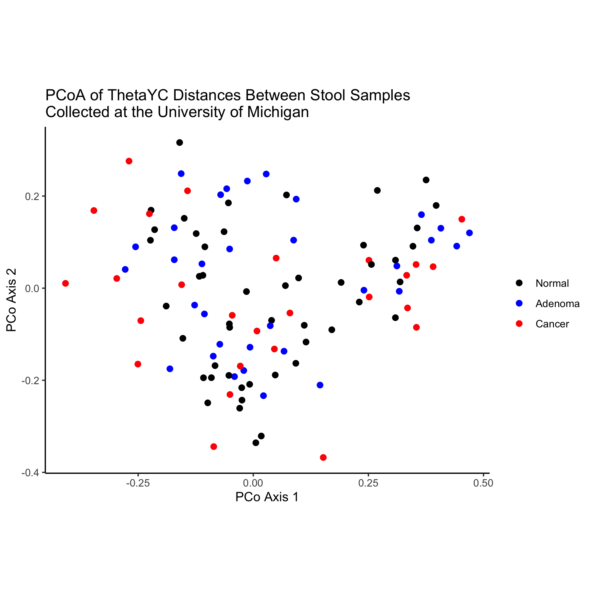

## Learning goals
* Merging data frames
* Selecting columns from data frames
* Selecting rows from data frames
* Connecting steps in data processing with pipes


## Joining `metadata` and `pcoa`
We've almost accounted for all of the lines from our original chunk of code to build an ordination plot. You may remember the `inner_join` function, which was called after cleaning up the `metadata` data frame and before using `ggplot` to plot the data


```R
metadata_pcoa <- inner_join(metadata, pcoa, by=c('sample'='group'))
```

The syntax here should be somewhat clear. The function "joins" two data frames - `pcoa` and `metadata` - based on the columns "sample" and "group", which are the columns in the `metadata` and `pcoa` data frames, respectively. If we were thinking ahead, we could have renamed the "group" column in `pcoa` to be "sample" and then the command could have just been `inner_join(metadata, pcoa)`. When you look at the contents of the `metadata_pcoa` data frame you'll see that the data frame is now 490 rows by 507 columns. Perhaps you're wondering what the ***inner*** in the `inner_join` function is about. It turns out that the `dplyr` package has several ways to join data frames. As we'll see, the `inner_join` function joins two data frames based on a column that they have in common (i.e. `by=c('sample'='group')` in our case) and if a sample or group is missing from one of the data frames, it is excluded from the joined data frame. This is what is called an "[inner join](https://en.wikipedia.org/wiki/Join_(SQL)#Inner_join)".


## Joins
In addition to an "inner join", the `dplyr` package has "[left join](https://en.wikipedia.org/wiki/Join_(SQL)#Left_outer_join)" (i.e. `left_join`) and "[right join](https://en.wikipedia.org/wiki/Join_(SQL)#Right_outer_join)" (i.e. `right_join`) functions, which will merge the data frames using the sample identifiers found in the left or right data frame being joined. There is also a "[full join](https://en.wikipedia.org/wiki/Join_(SQL)#Full_outer_join)" (i.e. `full_join`), which produces a data frame where the samples from both data frames are represented even if they're missing from one of the data frames. Let's do a couple of examples to demonstrate these joins. To keep things simple, we'll define two new data frames. We can do this by giving the `tibble` function a series of vectors that will be used to create the columns


```r
a <- tibble(sample=c("A", "B", "C"), diagnosis=c("normal", "cancer", "adenoma"))
a

b <- tibble(sample=c("A", "B", "D"), previous_history=c(T, F, T))
b
```

```
## # A tibble: 3 x 2
##   sample diagnosis
##   <chr>  <chr>    
## 1 A      normal   
## 2 B      cancer   
## 3 C      adenoma  
## # A tibble: 3 x 2
##   sample previous_history
##   <chr>  <lgl>           
## 1 A      TRUE            
## 2 B      FALSE           
## 3 D      TRUE
```

We'll do a "left join" ...


```r
left_join(a, b, by="sample")
```

```
## # A tibble: 3 x 3
##   sample diagnosis previous_history
##   <chr>  <chr>     <lgl>           
## 1 A      normal    TRUE            
## 2 B      cancer    FALSE           
## 3 C      adenoma   NA
```

Notice that because `b` doesn't have a value for "C" in column "sample", the resulting data frame has a `NA` in that cell. Because `a` doesn't have a value for "D" in column "sample" it is excluded from the new data frame. If we instead do a "right join" ...


```r
right_join(a, b, by="sample")
```

```
## # A tibble: 3 x 3
##   sample diagnosis previous_history
##   <chr>  <chr>     <lgl>           
## 1 A      normal    TRUE            
## 2 B      cancer    FALSE           
## 3 D      <NA>      TRUE
```

We see the opposite result - sample "C" is missing in the new data frame and the value in column "diagnosis" for sample "D" is `NA`. If we now do a "full join"...


```r
full_join(a, b, by="sample")
```

```
## # A tibble: 4 x 3
##   sample diagnosis previous_history
##   <chr>  <chr>     <lgl>           
## 1 A      normal    TRUE            
## 2 B      cancer    FALSE           
## 3 C      adenoma   NA              
## 4 D      <NA>      TRUE
```

Here we see that all four samples are represented, but that the "diagnosis" and "previous_history" columns have `NA` values for samples D and C, respectively. Finally, returning to our old friend, "inner join"...


```r
inner_join(a, b, by="sample")
```

```
## # A tibble: 2 x 3
##   sample diagnosis previous_history
##   <chr>  <chr>     <lgl>           
## 1 A      normal    TRUE            
## 2 B      cancer    FALSE
```

We now get a data frame that has two rows representing the two samples that were found in `a` and `b`. Depending on your goals, you will need to chose the appropriate join function. Most of the time I use an `inner_join` since I will only want the values (e.g. the axes in `pcoa`) that I have metadata for and I will only want the descriptors (e.g. the values in `metadata`) that I have community data for.

---

### Activity 1
What happens in these cases when we reverse the `a` and `b` data frames in the `inner_join` function call?

<input type="button" class="hideshow">
<div markdown="1" style="display:none;">


```r
left_join(b, a, by="sample")
right_join(b, a, by="sample")
full_join(b, a, by="sample")
inner_join(b, a, by="sample")
```

```
## # A tibble: 3 x 3
##   sample previous_history diagnosis
##   <chr>  <lgl>            <chr>    
## 1 A      TRUE             normal   
## 2 B      FALSE            cancer   
## 3 D      TRUE             <NA>     
## # A tibble: 3 x 3
##   sample previous_history diagnosis
##   <chr>  <lgl>            <chr>    
## 1 A      TRUE             normal   
## 2 B      FALSE            cancer   
## 3 C      NA               adenoma  
## # A tibble: 4 x 3
##   sample previous_history diagnosis
##   <chr>  <lgl>            <chr>    
## 1 A      TRUE             normal   
## 2 B      FALSE            cancer   
## 3 D      TRUE             <NA>     
## 4 C      NA               adenoma  
## # A tibble: 2 x 3
##   sample previous_history diagnosis
##   <chr>  <lgl>            <chr>    
## 1 A      TRUE             normal   
## 2 B      FALSE            cancer
```

We see that the order of the columns is reversed
</div>

---

### Activity 2
What happens if we leave out the `by="sample"` argument from our join commands?

<input type="button" class="hideshow">
<div markdown="1" style="display:none;">


```r
inner_join(a, b)
```

```
## # A tibble: 2 x 3
##   sample diagnosis previous_history
##   <chr>  <chr>     <lgl>           
## 1 A      normal    TRUE            
## 2 B      cancer    FALSE
```

The commands are smart enough to figure out that since there's only one column name in common between the two data frames, then it should join using the "sample" column.
</div>

---

Perhaps we want to know whether there are any rows from our data frames that will be removed when we do an inner join. For this case, we can use the `anti_join` function from the `dplyr` package:


```r
anti_join(a, b, by="sample")
```

```
## # A tibble: 1 x 2
##   sample diagnosis
##   <chr>  <chr>    
## 1 C      adenoma
```

```r
anti_join(b, a, by="sample")
```

```
## # A tibble: 1 x 2
##   sample previous_history
##   <chr>  <lgl>           
## 1 D      TRUE
```

We can see that for the first case, the row for sample "C" is found in `a`, but not `b`. In the second case, sample "D" is found in `b`, but not `a`.

We can also see what from `a` overlaps with `b` and vice versa with the `semi_join` function from the `dplyr` package


```r
semi_join(a, b, by="sample")
```

```
## # A tibble: 2 x 2
##   sample diagnosis
##   <chr>  <chr>    
## 1 A      normal   
## 2 B      cancer
```

```r
semi_join(b, a, by="sample")
```

```
## # A tibble: 2 x 2
##   sample previous_history
##   <chr>  <lgl>           
## 1 A      TRUE            
## 2 B      FALSE
```

One last thing to comment on is that our simple examples of joining `a` and `b` have been using `by="sample"` in all of the examples. If you look at the syntax of the command we used when building our ordination plot, the syntax was `by=c('sample'='group')`. This is because `sample` is a column shared by both `a` and `b`, while `sample` and `group` are columns that contain the same information (i.e. the subject's id number). Let's illustrate this with a new data frame, `c`, which has a column `group` instead of `sample`:


```r
c <- tibble(group=c("A", "B", "D"), previous_history=c(T, F, T))
c
```

```
## # A tibble: 3 x 2
##   group previous_history
##   <chr> <lgl>           
## 1 A     TRUE            
## 2 B     FALSE           
## 3 D     TRUE
```

If we do our `inner_join` as before, we'll get an error...


```r
inner_join(a, c, by="sample")
```

```
## Error: `by` can't contain join column `sample` which is missing from RHS
```

See that? It tells us that "column `sample` which is missing from RHS (right hand side)". To resolve this, we need to use the syntax we saw earlier. We can replace `by="sample"` with `by=c('sample'='group')`. This effectively tells `inner_join` to join the two data frames using the `sample` column from data frame `a` and the `group` column from data frame `b`.


```r
inner_join(a, c, by=c('sample'='group'))
```

```
## # A tibble: 2 x 3
##   sample diagnosis previous_history
##   <chr>  <chr>     <lgl>           
## 1 A      normal    TRUE            
## 2 B      cancer    FALSE
```


## Selecting columns from our data frames
Looking at the ordination data that is in our `pcoa` data frame, we see that there were a few hundred columns. When this is joined to the `metadata` data frame we get a very wide and obnoxiously large data frame. We really only need the first four columns of the `pcoa` data frame (i.e. "group", "axis1", "axis2", and "axis3"). We can do this with the `select` function from the `dplyr` package.


```r
select(pcoa, group, axis1, axis2, axis3)
```

```
## # A tibble: 490 x 4
##    group      axis1   axis2   axis3
##    <chr>      <dbl>   <dbl>   <dbl>
##  1 2003650 -0.109    0.0279 -0.200 
##  2 2005650 -0.222    0.169  -0.0667
##  3 2007660 -0.189   -0.0389 -0.147 
##  4 2009650 -0.161   -0.0237 -0.155 
##  5 2013660  0.319    0.0136 -0.0494
##  6 2015650 -0.225    0.172  -0.0871
##  7 2017660  0.00846 -0.155  -0.0670
##  8 2019651  0.171   -0.0903  0.0112
##  9 2023680 -0.299    0.122  -0.144 
## 10 2025653  0.333    0.0280  0.0304
## # … with 480 more rows
```

The resulting tibble still has 490 rows, but now it has the 4 columns we *selected*. If we want to remove specific columns we could also use a negative sign


```r
select(pcoa, -axis1)
```

```
## # A tibble: 490 x 490
##    group   axis2   axis3    axis4    axis5    axis6   axis7   axis8   axis9
##    <chr>   <dbl>   <dbl>    <dbl>    <dbl>    <dbl>   <dbl>   <dbl>   <dbl>
##  1 2003…  0.0279 -0.200  -0.199    0.0891   0.00139 -0.0142 -0.116   0.0842
##  2 2005…  0.169  -0.0667  0.00512 -0.0816  -0.0478   0.118   0.0840  0.0326
##  3 2007… -0.0389 -0.147   0.00898 -0.00153 -0.0361   0.136   0.0885 -0.0284
##  4 2009… -0.0237 -0.155  -0.0321  -0.0882   0.109    0.151  -0.119   0.0830
##  5 2013…  0.0136 -0.0494  0.00922 -0.0757  -0.240   -0.0645  0.104  -0.0361
##  6 2015…  0.172  -0.0871 -0.185    0.374   -0.0999  -0.0331  0.0943 -0.118 
##  7 2017… -0.155  -0.0670 -0.0939  -0.0938   0.0298  -0.154  -0.0244 -0.279 
##  8 2019… -0.0903  0.0112 -0.0738   0.0538   0.159   -0.209   0.198   0.172 
##  9 2023…  0.122  -0.144  -0.117    0.114    0.0295   0.231   0.0778 -0.0352
## 10 2025…  0.0280  0.0304  0.113    0.0410   0.0774   0.161  -0.0367 -0.182 
## # … with 480 more rows, and 481 more variables: axis10 <dbl>, axis11 <dbl>,
## #   axis12 <dbl>, axis13 <dbl>, axis14 <dbl>, axis15 <dbl>, axis16 <dbl>,
## #   axis17 <dbl>, axis18 <dbl>, axis19 <dbl>, axis20 <dbl>, axis21 <dbl>,
## #   axis22 <dbl>, axis23 <dbl>, axis24 <dbl>, axis25 <dbl>, axis26 <dbl>,
## #   axis27 <dbl>, axis28 <dbl>, axis29 <dbl>, axis30 <dbl>, axis31 <dbl>,
## #   axis32 <dbl>, axis33 <dbl>, axis34 <dbl>, axis35 <dbl>, axis36 <dbl>,
## #   axis37 <dbl>, axis38 <dbl>, axis39 <dbl>, axis40 <dbl>, axis41 <dbl>,
## #   axis42 <dbl>, axis43 <dbl>, axis44 <dbl>, axis45 <dbl>, axis46 <dbl>,
## #   axis47 <dbl>, axis48 <dbl>, axis49 <dbl>, axis50 <dbl>, axis51 <dbl>,
## #   axis52 <dbl>, axis53 <dbl>, axis54 <dbl>, axis55 <dbl>, axis56 <dbl>,
## #   axis57 <dbl>, axis58 <dbl>, axis59 <dbl>, axis60 <dbl>, axis61 <dbl>,
## #   axis62 <dbl>, axis63 <dbl>, axis64 <dbl>, axis65 <dbl>, axis66 <dbl>,
## #   axis67 <dbl>, axis68 <dbl>, axis69 <dbl>, axis70 <dbl>, axis71 <dbl>,
## #   axis72 <dbl>, axis73 <dbl>, axis74 <dbl>, axis75 <dbl>, axis76 <dbl>,
## #   axis77 <dbl>, axis78 <dbl>, axis79 <dbl>, axis80 <dbl>, axis81 <dbl>,
## #   axis82 <dbl>, axis83 <dbl>, axis84 <dbl>, axis85 <dbl>, axis86 <dbl>,
## #   axis87 <dbl>, axis88 <dbl>, axis89 <dbl>, axis90 <dbl>, axis91 <dbl>,
## #   axis92 <dbl>, axis93 <dbl>, axis94 <dbl>, axis95 <dbl>, axis96 <dbl>,
## #   axis97 <dbl>, axis98 <dbl>, axis99 <dbl>, axis100 <dbl>, axis101 <dbl>,
## #   axis102 <dbl>, axis103 <dbl>, axis104 <dbl>, axis105 <dbl>, axis106 <dbl>,
## #   axis107 <dbl>, axis108 <dbl>, axis109 <dbl>, …
```

The result is that the "axis1" column has been removed. If we consider our `metadata` data frame, we could also select the sample column any column that starts with "diagnosis"


```r
select(metadata, sample, starts_with("diagnosis"))
```

```
## # A tibble: 490 x 3
##    sample  diagnosis_bin    diagnosis
##    <chr>   <chr>            <chr>    
##  1 2003650 High Risk Normal normal   
##  2 2005650 High Risk Normal normal   
##  3 2007660 High Risk Normal normal   
##  4 2009650 Adenoma          adenoma  
##  5 2013660 Normal           normal   
##  6 2015650 High Risk Normal normal   
##  7 2017660 Cancer           cancer   
##  8 2019651 Normal           normal   
##  9 2023680 High Risk Normal normal   
## 10 2025653 Cancer           cancer   
## # … with 480 more rows
```

This gets us a new data frame with the columns "sample", "diagnosis_bin", and "diagnosis". We could also get the "sample" column and any column that contains "history"


```r
select(metadata, sample, contains("history"))
```

```
## # A tibble: 490 x 4
##    sample  previous_history history_of_polyps family_history_of_crc
##    <chr>   <lgl>            <lgl>             <lgl>                
##  1 2003650 FALSE            TRUE              TRUE                 
##  2 2005650 FALSE            TRUE              FALSE                
##  3 2007660 FALSE            TRUE              TRUE                 
##  4 2009650 FALSE            TRUE              FALSE                
##  5 2013660 FALSE            FALSE             FALSE                
##  6 2015650 FALSE            TRUE              FALSE                
##  7 2017660 TRUE             TRUE              FALSE                
##  8 2019651 FALSE            FALSE             FALSE                
##  9 2023680 TRUE             TRUE              FALSE                
## 10 2025653 TRUE             TRUE              FALSE                
## # … with 480 more rows
```

This generates a data frame that contains the columns "sample", "previous_history", "history_of_polyps", and "family_history_of_crc". There are other helper functions including `ends_with`, `matches`, `num_range`, and `one_of` that you can learn more about by using the `?` helper.


## Selecting rows from our data frames
We might also want to make new data frames that contain a subset of the rows. We can "filter" the data frame using the `filter` function from the `dplyr` package. Let's assume that we want to recreate our favorite ordination using only samples from the University of Michigan. We can generate a new data frame using `filter`


```r
filter(metadata, site=="U Michigan")
```

```
## # A tibble: 107 x 19
##    sample fit_result site  diagnosis_bin diagnosis previous_history
##    <chr>       <dbl> <chr> <chr>         <chr>     <lgl>           
##  1 20036…          0 U Mi… High Risk No… normal    FALSE           
##  2 20056…          0 U Mi… High Risk No… normal    FALSE           
##  3 20076…         26 U Mi… High Risk No… normal    FALSE           
##  4 20136…          0 U Mi… Normal        normal    FALSE           
##  5 20196…         19 U Mi… Normal        normal    FALSE           
##  6 20256…       1509 U Mi… Cancer        cancer    TRUE            
##  7 20296…          0 U Mi… Adenoma       adenoma   FALSE           
##  8 20416…          0 U Mi… Adenoma       adenoma   FALSE           
##  9 20456…          0 U Mi… Normal        normal    FALSE           
## 10 20576…          0 U Mi… High Risk No… normal    FALSE           
## # … with 97 more rows, and 13 more variables: history_of_polyps <lgl>,
## #   age <dbl>, sex <chr>, smoke <lgl>, diabetic <lgl>,
## #   family_history_of_crc <lgl>, height <dbl>, weight <dbl>, nsaid <lgl>,
## #   diabetes_med <lgl>, stage <chr>, `na_if(height, 0)` <dbl>, `na_if(weight,
## #   0)` <dbl>
```

The resulting data frame has 107 samples. You'll notice that I used `site=="U Michigan"`. This tells `filter` to identify those rows where the "site" column had a value equal to "U Michigan". The `==` is a logical comparison that asks whether the value on either side of the `==` are the same. The answer is either `TRUE` or `FALSE`. There are other logical operators that you should already be familiar with (but perhaps didn't know!) including `<`, `<=`, `>`, `>=`. These should be self explanatory. For example, if we want ever subject that has a `fit_result` greater than or equal to 100 we would write


```r
filter(metadata, fit_result >= 100)
```

```
## # A tibble: 126 x 19
##    sample fit_result site  diagnosis_bin diagnosis previous_history
##    <chr>       <dbl> <chr> <chr>         <chr>     <lgl>           
##  1 20256…       1509 U Mi… Cancer        cancer    TRUE            
##  2 20936…        286 Dana… Normal        normal    TRUE            
##  3 21056…        314 U Mi… Normal        normal    FALSE           
##  4 21856…        982 Toro… Adv Adenoma   adenoma   FALSE           
##  5 21876…       1200 Toro… Cancer        cancer    FALSE           
##  6 22036…       1992 U Mi… Cancer        cancer    TRUE            
##  7 22556…        140 Dana… Cancer        cancer    TRUE            
##  8 22676…        149 Dana… Cancer        cancer    TRUE            
##  9 22836…       1346 Toro… Cancer        cancer    FALSE           
## 10 22876…        939 Dana… Cancer        cancer    TRUE            
## # … with 116 more rows, and 13 more variables: history_of_polyps <lgl>,
## #   age <dbl>, sex <chr>, smoke <lgl>, diabetic <lgl>,
## #   family_history_of_crc <lgl>, height <dbl>, weight <dbl>, nsaid <lgl>,
## #   diabetes_med <lgl>, stage <chr>, `na_if(height, 0)` <dbl>, `na_if(weight,
## #   0)` <dbl>
```

Some of our columns are already logical. To get those individuals with a previous history of colorectal cancer we could do


```r
filter(metadata, previous_history)
```

```
## # A tibble: 138 x 19
##    sample fit_result site  diagnosis_bin diagnosis previous_history
##    <chr>       <dbl> <chr> <chr>         <chr>     <lgl>           
##  1 20176…          7 Dana… Cancer        cancer    TRUE            
##  2 20236…          0 Dana… High Risk No… normal    TRUE            
##  3 20256…       1509 U Mi… Cancer        cancer    TRUE            
##  4 20336…          0 Toro… High Risk No… normal    TRUE            
##  5 20516…          0 Dana… Adenoma       adenoma   TRUE            
##  6 20556…          0 Dana… Adv Adenoma   adenoma   TRUE            
##  7 20636…          0 Dana… High Risk No… normal    TRUE            
##  8 20876…          5 Dana… High Risk No… normal    TRUE            
##  9 20936…        286 Dana… Normal        normal    TRUE            
## 10 21096…          0 Dana… Normal        normal    TRUE            
## # … with 128 more rows, and 13 more variables: history_of_polyps <lgl>,
## #   age <dbl>, sex <chr>, smoke <lgl>, diabetic <lgl>,
## #   family_history_of_crc <lgl>, height <dbl>, weight <dbl>, nsaid <lgl>,
## #   diabetes_med <lgl>, stage <chr>, `na_if(height, 0)` <dbl>, `na_if(weight,
## #   0)` <dbl>
```

If we want those samples from people ***without*** a previous history we can use the `!` operator which turns `TRUE` to `FALSE` and `FALSE` to `TRUE`


```r
filter(metadata, !previous_history)
```

```
## # A tibble: 349 x 19
##    sample fit_result site  diagnosis_bin diagnosis previous_history
##    <chr>       <dbl> <chr> <chr>         <chr>     <lgl>           
##  1 20036…          0 U Mi… High Risk No… normal    FALSE           
##  2 20056…          0 U Mi… High Risk No… normal    FALSE           
##  3 20076…         26 U Mi… High Risk No… normal    FALSE           
##  4 20096…         10 Toro… Adenoma       adenoma   FALSE           
##  5 20136…          0 U Mi… Normal        normal    FALSE           
##  6 20156…          0 Dana… High Risk No… normal    FALSE           
##  7 20196…         19 U Mi… Normal        normal    FALSE           
##  8 20276…          0 Toro… Normal        normal    FALSE           
##  9 20296…          0 U Mi… Adenoma       adenoma   FALSE           
## 10 20316…          0 Toro… Adenoma       adenoma   FALSE           
## # … with 339 more rows, and 13 more variables: history_of_polyps <lgl>,
## #   age <dbl>, sex <chr>, smoke <lgl>, diabetic <lgl>,
## #   family_history_of_crc <lgl>, height <dbl>, weight <dbl>, nsaid <lgl>,
## #   diabetes_med <lgl>, stage <chr>, `na_if(height, 0)` <dbl>, `na_if(weight,
## #   0)` <dbl>
```

The `!` can also be used as `!=` to test whether two values are different from each other. We could use this to get the samples from people that do not have a normal diagnosis


```r
filter(metadata, diagnosis != 'normal')
```

```
## # A tibble: 318 x 19
##    sample fit_result site  diagnosis_bin diagnosis previous_history
##    <chr>       <dbl> <chr> <chr>         <chr>     <lgl>           
##  1 20096…         10 Toro… Adenoma       adenoma   FALSE           
##  2 20176…          7 Dana… Cancer        cancer    TRUE            
##  3 20256…       1509 U Mi… Cancer        cancer    TRUE            
##  4 20296…          0 U Mi… Adenoma       adenoma   FALSE           
##  5 20316…          0 Toro… Adenoma       adenoma   FALSE           
##  6 20356…          0 Toro… Adv Adenoma   adenoma   FALSE           
##  7 20376…         72 Toro… Cancer        cancer    FALSE           
##  8 20416…          0 U Mi… Adenoma       adenoma   FALSE           
##  9 20496…          0 Dana… Adenoma       adenoma   FALSE           
## 10 20516…          0 Dana… Adenoma       adenoma   TRUE            
## # … with 308 more rows, and 13 more variables: history_of_polyps <lgl>,
## #   age <dbl>, sex <chr>, smoke <lgl>, diabetic <lgl>,
## #   family_history_of_crc <lgl>, height <dbl>, weight <dbl>, nsaid <lgl>,
## #   diabetes_med <lgl>, stage <chr>, `na_if(height, 0)` <dbl>, `na_if(weight,
## #   0)` <dbl>
```


---

### Activity 3
A common bug for novice and experienced programmers is shown below

```
filter(metadata, diagnosis="cancer")
```

Can you see what the problem is and how to fix it?

<input type="button" class="hideshow">
<div markdown="1" style="display:none;">

```r
filter(metadata, diagnosis=="cancer")
```

```
## # A tibble: 120 x 19
##    sample fit_result site  diagnosis_bin diagnosis previous_history
##    <chr>       <dbl> <chr> <chr>         <chr>     <lgl>           
##  1 20176…          7 Dana… Cancer        cancer    TRUE            
##  2 20256…       1509 U Mi… Cancer        cancer    TRUE            
##  3 20376…         72 Toro… Cancer        cancer    FALSE           
##  4 21876…       1200 Toro… Cancer        cancer    FALSE           
##  5 22036…       1992 U Mi… Cancer        cancer    TRUE            
##  6 22556…        140 Dana… Cancer        cancer    TRUE            
##  7 22676…        149 Dana… Cancer        cancer    TRUE            
##  8 22836…       1346 Toro… Cancer        cancer    FALSE           
##  9 22856…          0 U Mi… Cancer        cancer    FALSE           
## 10 22876…        939 Dana… Cancer        cancer    TRUE            
## # … with 110 more rows, and 13 more variables: history_of_polyps <lgl>,
## #   age <dbl>, sex <chr>, smoke <lgl>, diabetic <lgl>,
## #   family_history_of_crc <lgl>, height <dbl>, weight <dbl>, nsaid <lgl>,
## #   diabetes_med <lgl>, stage <chr>, `na_if(height, 0)` <dbl>, `na_if(weight,
## #   0)` <dbl>
```
</div>

---

### Activity 4
Create a data frame that contains only females

<input type="button" class="hideshow">
<div markdown="1" style="display:none;">

```r
filter(metadata, sex=="female")
```

```
## # A tibble: 243 x 19
##    sample fit_result site  diagnosis_bin diagnosis previous_history
##    <chr>       <dbl> <chr> <chr>         <chr>     <lgl>           
##  1 20076…         26 U Mi… High Risk No… normal    FALSE           
##  2 20096…         10 Toro… Adenoma       adenoma   FALSE           
##  3 20136…          0 U Mi… Normal        normal    FALSE           
##  4 20156…          0 Dana… High Risk No… normal    FALSE           
##  5 20236…          0 Dana… High Risk No… normal    TRUE            
##  6 20276…          0 Toro… Normal        normal    FALSE           
##  7 20316…          0 Toro… Adenoma       adenoma   FALSE           
##  8 20376…         72 Toro… Cancer        cancer    FALSE           
##  9 20396…          0 Toro… Normal        normal    FALSE           
## 10 20456…          0 U Mi… Normal        normal    FALSE           
## # … with 233 more rows, and 13 more variables: history_of_polyps <lgl>,
## #   age <dbl>, sex <chr>, smoke <lgl>, diabetic <lgl>,
## #   family_history_of_crc <lgl>, height <dbl>, weight <dbl>, nsaid <lgl>,
## #   diabetes_med <lgl>, stage <chr>, `na_if(height, 0)` <dbl>, `na_if(weight,
## #   0)` <dbl>
```
</div>

---

### Activity 5
Create a data frame that contains individuals are 50 years old and younger

<input type="button" class="hideshow">
<div markdown="1" style="display:none;">

```r
filter(metadata, age <= 50)
```

```
## # A tibble: 96 x 19
##    sample fit_result site  diagnosis_bin diagnosis previous_history
##    <chr>       <dbl> <chr> <chr>         <chr>     <lgl>           
##  1 20076…         26 U Mi… High Risk No… normal    FALSE           
##  2 20136…          0 U Mi… Normal        normal    FALSE           
##  3 20616…          0 Dana… High Risk No… normal    FALSE           
##  4 20736…          0 U Mi… High Risk No… normal    FALSE           
##  5 20776…          0 U Mi… Normal        normal    FALSE           
##  6 20816…          0 U Mi… High Risk No… normal    FALSE           
##  7 20836…          0 Dana… High Risk No… normal    FALSE           
##  8 20856…          7 Dana… Normal        normal    FALSE           
##  9 20876…          5 Dana… High Risk No… normal    TRUE            
## 10 20936…        286 Dana… Normal        normal    TRUE            
## # … with 86 more rows, and 13 more variables: history_of_polyps <lgl>,
## #   age <dbl>, sex <chr>, smoke <lgl>, diabetic <lgl>,
## #   family_history_of_crc <lgl>, height <dbl>, weight <dbl>, nsaid <lgl>,
## #   diabetes_med <lgl>, stage <chr>, `na_if(height, 0)` <dbl>, `na_if(weight,
## #   0)` <dbl>
```
</div>

---

### Activity 6

Use the filter command to generate an ordination of samples from the University of Michigan.

<input type="button" class="hideshow">
<div markdown="1" style="display:none;">


```r
um_metadata <- filter(metadata, site=="U Michigan")
um_metadata_pcoa <- inner_join(um_metadata, pcoa, by=c('sample'='group'))

ggplot(um_metadata_pcoa, aes(x=axis1, y=axis2, color=diagnosis)) +
	geom_point(shape=19, size=2) +
	scale_color_manual(name=NULL,
		values=c("blue", "red", "black"),
		breaks=c("normal", "adenoma", "cancer"),
		labels=c("Normal", "Adenoma", "Cancer")) +
	coord_fixed() +
	labs(title="PCoA of ThetaYC Distances Between Stool Samples\nCollected at the University of Michigan",
		x="PCo Axis 1",
		y="PCo Axis 2") +
	theme_classic()
```


</div>

---

The `filter` and `select` functions are very powerful for subsetting our data frames. The fit result measures how much blood is in a person's stool. It's a common non-invasive diagnostic to identify colonic lesions. What if I want to get those samples from people that have a fit result over 100 and were given a normal diagnosis? We can use the `&` operator to see if two logical comparisons are true


```r
filter(metadata, fit_result >= 100 & diagnosis == "normal")
```

```
## # A tibble: 5 x 19
##   sample fit_result site  diagnosis_bin diagnosis previous_history
##   <chr>       <dbl> <chr> <chr>         <chr>     <lgl>           
## 1 20936…        286 Dana… Normal        normal    TRUE            
## 2 21056…        314 U Mi… Normal        normal    FALSE           
## 3 23216…        148 Dana… Normal        normal    FALSE           
## 4 30996…        356 Dana… High Risk No… normal    TRUE            
## 5 31376…        118 U Mi… Normal        normal    FALSE           
## # … with 13 more variables: history_of_polyps <lgl>, age <dbl>, sex <chr>,
## #   smoke <lgl>, diabetic <lgl>, family_history_of_crc <lgl>, height <dbl>,
## #   weight <dbl>, nsaid <lgl>, diabetes_med <lgl>, stage <chr>, `na_if(height,
## #   0)` <dbl>, `na_if(weight, 0)` <dbl>
```

If we want samples from people with a high fit result or a cancer diagnosis we can use a similar approach, except that instead of using `&` we would use `|`


```r
filter(metadata, fit_result >= 100 | diagnosis == "cancer")
```

```
## # A tibble: 156 x 19
##    sample fit_result site  diagnosis_bin diagnosis previous_history
##    <chr>       <dbl> <chr> <chr>         <chr>     <lgl>           
##  1 20176…          7 Dana… Cancer        cancer    TRUE            
##  2 20256…       1509 U Mi… Cancer        cancer    TRUE            
##  3 20376…         72 Toro… Cancer        cancer    FALSE           
##  4 20936…        286 Dana… Normal        normal    TRUE            
##  5 21056…        314 U Mi… Normal        normal    FALSE           
##  6 21856…        982 Toro… Adv Adenoma   adenoma   FALSE           
##  7 21876…       1200 Toro… Cancer        cancer    FALSE           
##  8 22036…       1992 U Mi… Cancer        cancer    TRUE            
##  9 22556…        140 Dana… Cancer        cancer    TRUE            
## 10 22676…        149 Dana… Cancer        cancer    TRUE            
## # … with 146 more rows, and 13 more variables: history_of_polyps <lgl>,
## #   age <dbl>, sex <chr>, smoke <lgl>, diabetic <lgl>,
## #   family_history_of_crc <lgl>, height <dbl>, weight <dbl>, nsaid <lgl>,
## #   diabetes_med <lgl>, stage <chr>, `na_if(height, 0)` <dbl>, `na_if(weight,
## #   0)` <dbl>
```

---

### Activity 7
Create a data frame that contains samples from individuals who are 50 years old and younger and have a non-normal diagnosis

<input type="button" class="hideshow">
<div markdown="1" style="display:none;">

```r
filter(metadata, age <= 50 & diagnosis != "normal")
```

```
## # A tibble: 46 x 19
##    sample fit_result site  diagnosis_bin diagnosis previous_history
##    <chr>       <dbl> <chr> <chr>         <chr>     <lgl>           
##  1 22036…       1992 U Mi… Cancer        cancer    TRUE            
##  2 23076…          0 Dana… Adv Adenoma   adenoma   TRUE            
##  3 23396…       1278 Dana… Cancer        cancer    TRUE            
##  4 23796…          0 Toro… Adv Adenoma   adenoma   FALSE           
##  5 24216…        133 MD A… Cancer        cancer    TRUE            
##  6 24636…         45 Dana… Cancer        cancer    TRUE            
##  7 24656…       1185 Dana… Cancer        cancer    TRUE            
##  8 25236…        392 MD A… Cancer        cancer    TRUE            
##  9 25456…        301 Dana… Adv Adenoma   adenoma   FALSE           
## 10 25556…          0 Toro… Adv Adenoma   adenoma   FALSE           
## # … with 36 more rows, and 13 more variables: history_of_polyps <lgl>,
## #   age <dbl>, sex <chr>, smoke <lgl>, diabetic <lgl>,
## #   family_history_of_crc <lgl>, height <dbl>, weight <dbl>, nsaid <lgl>,
## #   diabetes_med <lgl>, stage <chr>, `na_if(height, 0)` <dbl>, `na_if(weight,
## #   0)` <dbl>
```
</div>

---

### Activity 8
Create a data frame that contains samples from individuals who have a previous or family history of colorectal cancer

<input type="button" class="hideshow">
<div markdown="1" style="display:none;">

```r
filter(metadata, previous_history | family_history_of_crc)
```

```
## # A tibble: 199 x 19
##    sample fit_result site  diagnosis_bin diagnosis previous_history
##    <chr>       <dbl> <chr> <chr>         <chr>     <lgl>           
##  1 20036…          0 U Mi… High Risk No… normal    FALSE           
##  2 20076…         26 U Mi… High Risk No… normal    FALSE           
##  3 20176…          7 Dana… Cancer        cancer    TRUE            
##  4 20236…          0 Dana… High Risk No… normal    TRUE            
##  5 20256…       1509 U Mi… Cancer        cancer    TRUE            
##  6 20296…          0 U Mi… Adenoma       adenoma   FALSE           
##  7 20336…          0 Toro… High Risk No… normal    TRUE            
##  8 20416…          0 U Mi… Adenoma       adenoma   FALSE           
##  9 20436…          5 Toro… High Risk No… normal    FALSE           
## 10 20456…          0 U Mi… Normal        normal    FALSE           
## # … with 189 more rows, and 13 more variables: history_of_polyps <lgl>,
## #   age <dbl>, sex <chr>, smoke <lgl>, diabetic <lgl>,
## #   family_history_of_crc <lgl>, height <dbl>, weight <dbl>, nsaid <lgl>,
## #   diabetes_med <lgl>, stage <chr>, `na_if(height, 0)` <dbl>, `na_if(weight,
## #   0)` <dbl>
```
</div>

---

## Selecting and filtering with pipes

Let's leverage the `select` and `filter` commands we have been using to work with a new `tsv` file. The file `raw_data/baxter.groups.ave-std.summary` was generated by the [mothur `summary.single`](https://mothur.org/wiki/Summary.single) command, which rarefies the number of sequences per sample and calculates a variety of alpha diversity metrics.

---

### Activity 9
This file has a number of columns that aren't that interesting for us. You will also find that the `method` column has two values - ave and std - which indicate the average value of the alpha diversity metric after rarefying and the standard deviation (i.e. std), which is the standard deviation for the rarefaction replicates. You have several tasks...

* Write the code needed to read in the file to a new data frame called `alpha`. Make sure that the group column is read in as characters
* Filter out the rows that contain the standard deviation data
* Select the columns that contain the subject identifier, the number of observed OTUs (i.e "sobs"), the Shannon diversity index (i.e. "shannon"), the inverse Simpson diversity index (i.e. "invsimpson"), and Good's coverage (i.e. "coverage")
* Use the appropriate join function to create a data frame called `meta_alpha` that is a join between `metadata` and `alpha`

<input type="button" class="hideshow">
<div markdown="1" style="display:none;">

```r
alpha <- read_tsv(file="raw_data/baxter.groups.ave-std.summary", col_types=cols(group = col_character()))
alpha <- filter(alpha, method=='ave')
alpha <- select(alpha, group, sobs, shannon, invsimpson, coverage)
meta_alpha <- inner_join(metadata, alpha, by=c("sample"="group"))
```
</div>

---

Hopefully that was a good review of what we've done in this and the previous lessons. The approach we've taken to generate `meta_alpha` works perfectly. I'd like to show you a different way to think about the code. If you look at these four lines of code, you should see that the data kind of "flows" from the `tsv` file to the final version of `alpha` before we join it to `metadata`. There's a package installed with `dplyr` called `magrittr` that has a funny looking function called a pipe - `%>%`. The pipe, directs the flow of data from one command to the next. Instead of writing over `alpha` multiple times, we can write it once as the output of the data flow through the pipes.


```r
alpha <- read_tsv(file="raw_data/baxter.groups.ave-std.summary", col_types=cols(group = col_character())) %>%
	filter(method=='ave') %>%
	select(group, sobs, shannon, invsimpson, coverage)
alpha
```

```
## # A tibble: 490 x 5
##    group    sobs shannon invsimpson coverage
##    <chr>   <dbl>   <dbl>      <dbl>    <dbl>
##  1 2005650  291.    3.98       26.6    0.990
##  2 2003650  262.    4.02       35.6    0.991
##  3 2009650  324.    4.16       30.1    0.991
##  4 2013660  133.    3.33       17.4    0.997
##  5 2015650  233.    3.74       20.8    0.993
##  6 2017660  238.    3.98       28.6    0.994
##  7 2019651  191.    3.69       20.1    0.996
##  8 2023680  300.    4.01       28.9    0.992
##  9 2025653  179.    3.39       14.6    0.995
## 10 2027653  127.    3.54       19.2    0.998
## # … with 480 more rows
```

Viola! Cool, eh? You may not see the benefit of the pipes here, but in subsequent lessons we will pipe together numerous functions to direct the flow of data. Instead of writing over `alpha` as we did in the previous code chunks, some people would rather write each update to a new variable name. Both approaches get tedious and so the ability to pipe becomes pretty handy. In fact, we can skip the creation of the `alpha` data frame all together by piping this flow right into the `inner_join` function call. Notice that in the code below, the `inner_join` function call has a `.` where `alpha` had been before. The `.` tells `inner_join` to use the data that is flowing through the pipe.


```r
meta_alpha <- read_tsv(file="raw_data/baxter.groups.ave-std.summary", col_types=cols(group = col_character())) %>%
	filter(method=='ave') %>%
	select(group, sobs, shannon, invsimpson, coverage) %>%
	inner_join(metadata, ., by=c("sample"="group"))
meta_alpha
```

```
## # A tibble: 490 x 23
##    sample fit_result site  diagnosis_bin diagnosis previous_history
##    <chr>       <dbl> <chr> <chr>         <chr>     <lgl>           
##  1 20036…          0 U Mi… High Risk No… normal    FALSE           
##  2 20056…          0 U Mi… High Risk No… normal    FALSE           
##  3 20076…         26 U Mi… High Risk No… normal    FALSE           
##  4 20096…         10 Toro… Adenoma       adenoma   FALSE           
##  5 20136…          0 U Mi… Normal        normal    FALSE           
##  6 20156…          0 Dana… High Risk No… normal    FALSE           
##  7 20176…          7 Dana… Cancer        cancer    TRUE            
##  8 20196…         19 U Mi… Normal        normal    FALSE           
##  9 20236…          0 Dana… High Risk No… normal    TRUE            
## 10 20256…       1509 U Mi… Cancer        cancer    TRUE            
## # … with 480 more rows, and 17 more variables: history_of_polyps <lgl>,
## #   age <dbl>, sex <chr>, smoke <lgl>, diabetic <lgl>,
## #   family_history_of_crc <lgl>, height <dbl>, weight <dbl>, nsaid <lgl>,
## #   diabetes_med <lgl>, stage <chr>, `na_if(height, 0)` <dbl>, `na_if(weight,
## #   0)` <dbl>, sobs <dbl>, shannon <dbl>, invsimpson <dbl>, coverage <dbl>
```

But wait... there's more!


```r
read_tsv(file="raw_data/baxter.groups.ave-std.summary", col_types=cols(group = col_character())) %>%
	filter(method=='ave') %>%
	select(group, sobs, shannon, invsimpson, coverage) %>%
	inner_join(metadata, ., by=c("sample"="group")) %>%
	ggplot(aes(x=age, y=shannon, color=diagnosis)) +
		geom_point(shape=19, size=2) +
		coord_cartesian(xlim=c(0,90), ylim=c(0,5)) +
		scale_color_manual(name=NULL,
			values=c("blue", "red", "black"),
			breaks=c("normal", "adenoma", "cancer"),
			labels=c("Normal", "Adenoma", "Cancer")) +
		labs(title="Relationship between community diversity and subject's age",
			x="Age",
			y="Shannon Diversity Index") +
		theme_classic()
```


We've gone all the way - reading in the data from a `tsv` file to getting the rows and columns we want to joining it with our metadata to plotting. All in one command. Pretty slick.


---

### Activity 10
With our new found piping skillz, rewrite the code from the end of the last tutorial to generate the ordination. Use the `metadata` data frame that we've already been working with

<input type="button" class="hideshow">
<div markdown="1" style="display:none;">

```r
read_tsv(file="raw_data/baxter.thetayc.pcoa.axes", col_types=cols(group=col_character())) %>%
	inner_join(metadata, ., by=c('sample'='group')) %>%
	ggplot(aes(x=axis1, y=axis2, color=diagnosis)) +
		geom_point(shape=19, size=2) +
		scale_color_manual(name=NULL,
			values=c("blue", "red", "black"),
			breaks=c("normal", "adenoma", "cancer"),
			labels=c("Normal", "Adenoma", "Cancer")) +
		coord_fixed() +
		labs(title="PCoA of ThetaYC Distances Between Stool Samples",
			x="PCo Axis 1",
			y="PCo Axis 2") +
		theme_classic()
```


</div>

---

## Conclusion
A couple of closing thoughts are needed before we move on to the next lesson where we'll start doing more sophisticated work with data frames and functions from the `dplyr` package. First, you might ask why we ran select and filter on alpha rather than on the output of the `inner_join`. There's no real reason. The output would be the same. Do what makes sense for where you are in your analysis. Second, you can feel free to break up the piping as much as you want. It is there as a helper to your coding so that you don't have to create temporary data frames or write over ones you just made. Beyond these advantages, most people find that debugging code that uses the pipes is much easier than with the other approaches. Finally, instead of making the alpha diversity scatter plot one pipeline, I probably would normally break it up into two pipelines. One pipeline to create `alpha` and do the `select` and `filter` steps. The second would join `alpha` with `metadata` and produce the plot.
