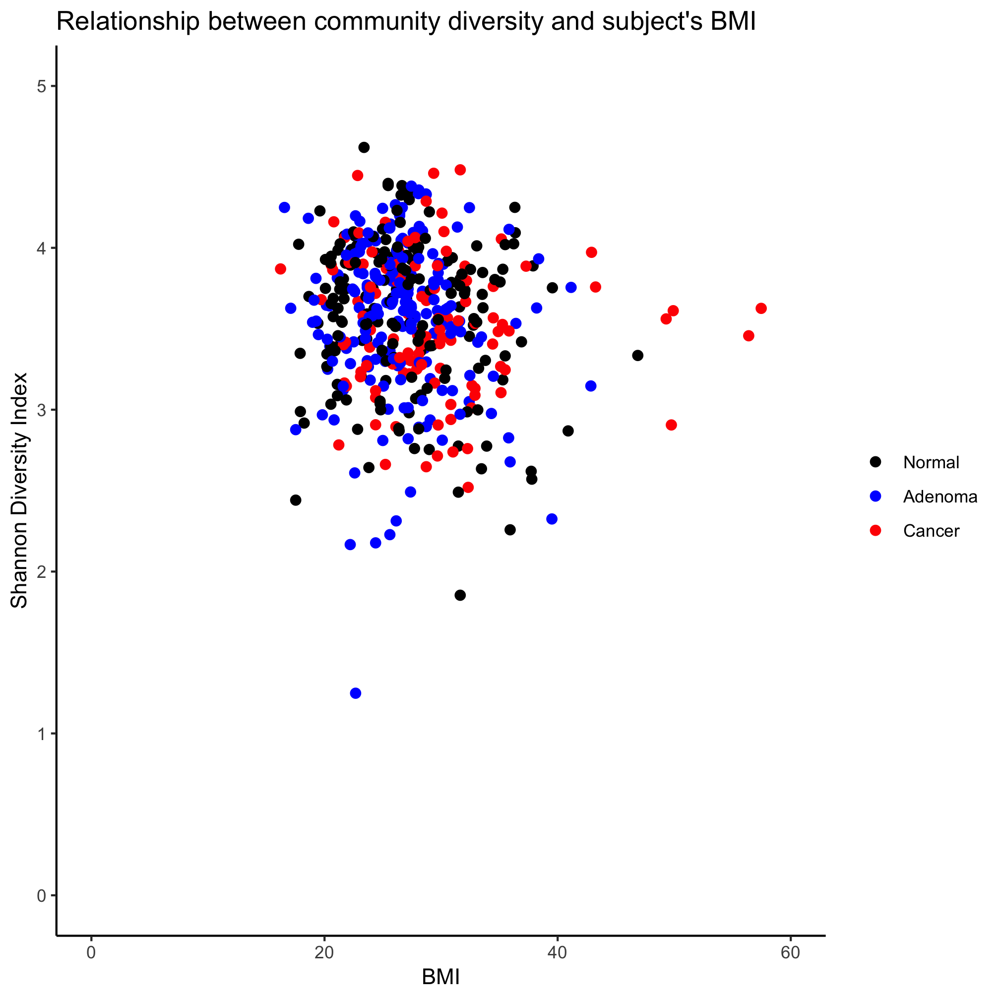

## Learning goals
* Aggregating and summarizing data by a categorical variable
* Adding columns to data frames
* Creating customized functions
* The importance of keeping code DRY


## Working with data in a data frame
In the previous lesson we saw how we can merge two data frames together and how we can `filter` for rows and/or `select` columns from a single data frame. We ended by discussing how the pipe operator (i.e. `%>%`) can be used to connect functions to direct the flow of data through a pipeline. We now want to take the next step in analyzing our data. Let's think of some questions we might have about the data in our data frame

* What is the mean diversity across the three diagnosis groups?
* What is the richness among people with and without a history of polyps?
* What is the mean age and standard deviation among males and females?

In this lesson we will see how we can add functions from the `dplyr` package to the pipeline we've been developing to answer these and more questions. Let's recall how we can create a data frame called `meta_alpha`.


```r
library(tidyverse)
library(readxl)

metadata <- read_excel(path="raw_data/baxter.metadata.xlsx",
		col_types=c(sample = "text", fit_result = "numeric", Site = "text", Dx_Bin = "text",
				dx = "text", Hx_Prev = "logical", Hx_of_Polyps = "logical", Age = "numeric",
				Gender = "text", Smoke = "logical", Diabetic = "logical", Hx_Fam_CRC = "logical",
				Height = "numeric", Weight = "numeric", NSAID = "logical", Diabetes_Med = "logical",
				stage = "text")
	)
metadata <- mutate(metadata, na_if(Height, 0))
metadata <- mutate(metadata, na_if(Weight, 0))
metadata <- mutate(metadata, Site = recode(.x=Site, "U of Michigan"="U Michigan"))
metadata <- mutate(metadata, Dx_Bin = recode(.x=Dx_Bin, "Cancer."="Cancer"))
metadata <- mutate(metadata, Gender = recode(.x=Gender, "f"="female", "m"="male"))

metadata <- rename_all(.tbl=metadata, .funs=tolower)
metadata <- rename(.data=metadata,
		previous_history=hx_prev,
		history_of_polyps=hx_of_polyps,
		family_history_of_crc=hx_fam_crc,
		diagnosis_bin=dx_bin,
		diagnosis=dx,
		sex=gender)

alpha <- read_tsv(file="raw_data/baxter.groups.ave-std.summary",
		col_types=cols(group = col_character())) %>%
	filter(method=='ave') %>%
	select(group, sobs, shannon, invsimpson, coverage)

meta_alpha <- inner_join(metadata, alpha, by=c('sample'='group'))
```

Let's take on the first question I posed above, "What is the mean diversity across the three diagnosis groups?" We'll break the problem down by steps. An outline of what we want to get R to do is to group our data frame by a categorical variable (e.g. `diagnosis`) and then within each value of `diagnosis` we want it to calculate a summary statistic on another column (e.g. `shannon`). The first step will use a new verb - `group_by` - to group our data frame by a column. The output of this function will only be slightly different to us. See if you can spot the added wrinkle to the output that is created by using `group_by`


```r
group_by(meta_alpha, diagnosis)
```

```
## # A tibble: 490 x 23
## # Groups:   diagnosis [3]
##    sample fit_result site  diagnosis_bin diagnosis previous_history
##    <chr>       <dbl> <chr> <chr>         <chr>     <lgl>           
##  1 20036…          0 U Mi… High Risk No… normal    FALSE           
##  2 20056…          0 U Mi… High Risk No… normal    FALSE           
##  3 20076…         26 U Mi… High Risk No… normal    FALSE           
##  4 20096…         10 Toro… Adenoma       adenoma   FALSE           
##  5 20136…          0 U Mi… Normal        normal    FALSE           
##  6 20156…          0 Dana… High Risk No… normal    FALSE           
##  7 20176…          7 Dana… Cancer        cancer    TRUE            
##  8 20196…         19 U Mi… Normal        normal    FALSE           
##  9 20236…          0 Dana… High Risk No… normal    TRUE            
## 10 20256…       1509 U Mi… Cancer        cancer    TRUE            
## # … with 480 more rows, and 17 more variables: history_of_polyps <lgl>,
## #   age <dbl>, sex <chr>, smoke <lgl>, diabetic <lgl>,
## #   family_history_of_crc <lgl>, height <dbl>, weight <dbl>, nsaid <lgl>,
## #   diabetes_med <lgl>, stage <chr>, `na_if(height, 0)` <dbl>, `na_if(weight,
## #   0)` <dbl>, sobs <dbl>, shannon <dbl>, invsimpson <dbl>, coverage <dbl>
```

You should notice that above the column headings it says `Groups:  diagnosis[3]`. This indicates that we now have three groups in our data. We can actually write this two different ways and get the same result. The second way and the way that I prefer is


```r
meta_alpha %>%
	group_by(diagnosis)
```

```
## # A tibble: 490 x 23
## # Groups:   diagnosis [3]
##    sample fit_result site  diagnosis_bin diagnosis previous_history
##    <chr>       <dbl> <chr> <chr>         <chr>     <lgl>           
##  1 20036…          0 U Mi… High Risk No… normal    FALSE           
##  2 20056…          0 U Mi… High Risk No… normal    FALSE           
##  3 20076…         26 U Mi… High Risk No… normal    FALSE           
##  4 20096…         10 Toro… Adenoma       adenoma   FALSE           
##  5 20136…          0 U Mi… Normal        normal    FALSE           
##  6 20156…          0 Dana… High Risk No… normal    FALSE           
##  7 20176…          7 Dana… Cancer        cancer    TRUE            
##  8 20196…         19 U Mi… Normal        normal    FALSE           
##  9 20236…          0 Dana… High Risk No… normal    TRUE            
## 10 20256…       1509 U Mi… Cancer        cancer    TRUE            
## # … with 480 more rows, and 17 more variables: history_of_polyps <lgl>,
## #   age <dbl>, sex <chr>, smoke <lgl>, diabetic <lgl>,
## #   family_history_of_crc <lgl>, height <dbl>, weight <dbl>, nsaid <lgl>,
## #   diabetes_med <lgl>, stage <chr>, `na_if(height, 0)` <dbl>, `na_if(weight,
## #   0)` <dbl>, sobs <dbl>, shannon <dbl>, invsimpson <dbl>, coverage <dbl>
```

I prefer this second approach because it breaks up the commands a bit more and makes it more clear that the source of the data is the `meta_alpha` data frame. Again, the result is the same. If I had a huge data frame and didn't want to pipe every column through the pipeline, I could easily add a select line before the `group_by` line.


```r
meta_alpha %>%
	select(diagnosis, shannon) %>%
	group_by(diagnosis)
```

```
## # A tibble: 490 x 2
## # Groups:   diagnosis [3]
##    diagnosis shannon
##    <chr>       <dbl>
##  1 normal       4.02
##  2 normal       3.98
##  3 normal       3.91
##  4 adenoma      4.16
##  5 normal       3.33
##  6 normal       3.74
##  7 cancer       3.98
##  8 normal       3.69
##  9 normal       4.01
## 10 cancer       3.39
## # … with 480 more rows
```

Adding the same `select` function to the first approach would require more typing and moving things around. It isn't as flexible.


```r
select(meta_alpha, diagnosis) %>%
	group_by(diagnosis)
```

```
## # A tibble: 490 x 1
## # Groups:   diagnosis [3]
##    diagnosis
##    <chr>    
##  1 normal   
##  2 normal   
##  3 normal   
##  4 adenoma  
##  5 normal   
##  6 normal   
##  7 cancer   
##  8 normal   
##  9 normal   
## 10 cancer   
## # … with 480 more rows
```

For the final step, we'd like to summarize the diversity values within the groups by presenting the mean value. We can do this using the `summarize` function from the `dplyr` package


```r
meta_alpha %>%
	group_by(diagnosis) %>%
	summarize(mean_shannon = mean(shannon))
```

```
## # A tibble: 3 x 2
##   diagnosis mean_shannon
##   <chr>            <dbl>
## 1 adenoma           3.58
## 2 cancer            3.52
## 3 normal            3.58
```

The output is a new data frame that has three rows, one for each diagnosis category, and two columns, which contain the diagnosis categories and the mean of the Shannon diversity values. This is a very powerful set of tools!

---

### Activity 1
Let's say that we realized our Shannon diversity indices are not normally distributed. This revelation makes us realize that instead of the mean, we should instead present the median. Change the previous code to present the median Shannon diversity for each group. Make sure you pick a better column name!

<input type="button" class="hideshow">
<div markdown="1" style="display:none;">

```r
meta_alpha %>%
	group_by(diagnosis) %>%
	summarize(median_shannon = median(shannon))
```

```
## # A tibble: 3 x 2
##   diagnosis median_shannon
##   <chr>              <dbl>
## 1 adenoma             3.63
## 2 cancer              3.49
## 3 normal              3.68
```
</div>

---

We can use `summarize` to present various summaries of the groups. Let's create a new table with the mean Shannon diversity index and standard deviation for each group.


```r
meta_alpha %>%
	group_by(diagnosis) %>%
	summarize(mean_shannon = mean(shannon), sd_shannon = sd(shannon))
```

```
## # A tibble: 3 x 3
##   diagnosis mean_shannon sd_shannon
##   <chr>            <dbl>      <dbl>
## 1 adenoma           3.58      0.473
## 2 cancer            3.52      0.413
## 3 normal            3.58      0.467
```

Slick, eh? We can continue to add summary statistics by adding columns to the arguments in the `summarize` function. Other built-in functions that you can use with the `summarize` function include `n`, `sum`, `first`, `last`, `nth`, `quantile`, `min`, `max`, `IQR`, and `var`. Note that `n` is unique in that it does not take any arguments. If you want to get a count of the number of rows in that group you would use it as `n()` rather than as `n(shannon)`.

---

### Activity 2
Add the number of individuals in each category to our summary data frame

<input type="button" class="hideshow">
<div markdown="1" style="display:none;">

```r
meta_alpha %>%
	group_by(diagnosis) %>%
	summarize(mean_shannon = mean(shannon), sd_shannon = sd(shannon), N=n())
```

```
## # A tibble: 3 x 4
##   diagnosis mean_shannon sd_shannon     N
##   <chr>            <dbl>      <dbl> <int>
## 1 adenoma           3.58      0.473   198
## 2 cancer            3.52      0.413   120
## 3 normal            3.58      0.467   172
```
</div>

---

Now let's ask a slightly more complicated question, "what is the mean diversity among males and females across the three diagnosis categories?" In other words, we would like the mean diversity, standard deviation, and number of observations for each sex and diagnosis combination. Can you see what we will need to change from the code in the previous activity? First, we'll need to get the "sex" column from `meta_alpha` and we'll also want to group by each subject's diagnosis and sex.


```r
meta_alpha %>%
	group_by(diagnosis, sex) %>%
	summarize(mean_shannon = mean(shannon), sd_shannon = sd(shannon), N=n())
```

```
## # A tibble: 6 x 5
## # Groups:   diagnosis [3]
##   diagnosis sex    mean_shannon sd_shannon     N
##   <chr>     <chr>         <dbl>      <dbl> <int>
## 1 adenoma   female         3.57      0.492    80
## 2 adenoma   male           3.58      0.462   118
## 3 cancer    female         3.56      0.429    52
## 4 cancer    male           3.50      0.401    68
## 5 normal    female         3.53      0.464   111
## 6 normal    male           3.66      0.466    61
```

Now we have a new column to indicate the sex and we now have six rows instead of three because we have the three diagnosis categories for both of the sexes.


---

### Activity 3
What happens if you use `group_by(sex, diagnosis)` instead of `group_by(diagnosis, sex)`?

<input type="button" class="hideshow">
<div markdown="1" style="display:none;">

```r
meta_alpha %>%
	group_by(sex, diagnosis) %>%
	summarize(mean_shannon = mean(shannon), sd_shannon = sd(shannon), N=n())
```

```
## # A tibble: 6 x 5
## # Groups:   sex [2]
##   sex    diagnosis mean_shannon sd_shannon     N
##   <chr>  <chr>            <dbl>      <dbl> <int>
## 1 female adenoma           3.57      0.492    80
## 2 female cancer            3.56      0.429    52
## 3 female normal            3.53      0.464   111
## 4 male   adenoma           3.58      0.462   118
## 5 male   cancer            3.50      0.401    68
## 6 male   normal            3.66      0.466    61
```
</div>

---

### Activity 4
What is the richness among people with and without a history of polyps?

<input type="button" class="hideshow">
<div markdown="1" style="display:none;">

```r
meta_alpha %>%
	group_by(history_of_polyps) %>%
	summarize(mean_sobs = mean(sobs), sd_sobs = sd(sobs), N=n())
```

```
## # A tibble: 3 x 4
##   history_of_polyps mean_sobs sd_sobs     N
##   <lgl>                 <dbl>   <dbl> <int>
## 1 FALSE                  200.    63.8   162
## 2 TRUE                   209.    63.2   327
## 3 NA                     215.    NA       1
```
</div>

---

### Activity 5
What is the mean age and standard deviation among males and females?

<input type="button" class="hideshow">
<div markdown="1" style="display:none;">

```r
meta_alpha %>%
	group_by(sex) %>%
	summarize(mean_age = mean(age), sd_sobs = sd(age), N=n())
```

```
## # A tibble: 2 x 4
##   sex    mean_age sd_sobs     N
##   <chr>     <dbl>   <dbl> <int>
## 1 female     58.7    12.5   243
## 2 male       61.9    11.6   247
```
</div>

---


## Sorting data frames
Looking at these data frames can make us go a bit cross eyed if we want to find the diagnosis/sex combination that has the highest and lowest diversity. It would be even worse if we had more categories. Let's see which site had the highest mean diversity. We'll start by adapting our earlier code, which helped us calculate the mean diversity for each diagnosis group.


```r
meta_alpha %>%
	group_by(site) %>%
	summarize(mean_shannon = mean(shannon), sd_shannon = sd(shannon), N=n())
```

```
## # A tibble: 4 x 4
##   site        mean_shannon sd_shannon     N
##   <chr>              <dbl>      <dbl> <int>
## 1 Dana Farber         3.56      0.457   120
## 2 MD Anderson         3.47      0.445    95
## 3 Toronto             3.64      0.431   168
## 4 U Michigan          3.53      0.490   107
```

This gets us a new data frame. Because it only has four rows, it's easiest to see that the individuals sampled in Toronto had the highest mean diversity while those at MD Anderson had the lowest. How do we get R to do this heavy lifting for us? We can use the `arrange` function from the `dplyr` package


```r
meta_alpha %>%
	group_by(site) %>%
	summarize(mean_shannon = mean(shannon), sd_shannon = sd(shannon), N=n()) %>%
	arrange(mean_shannon)
```

```
## # A tibble: 4 x 4
##   site        mean_shannon sd_shannon     N
##   <chr>              <dbl>      <dbl> <int>
## 1 MD Anderson         3.47      0.445    95
## 2 U Michigan          3.53      0.490   107
## 3 Dana Farber         3.56      0.457   120
## 4 Toronto             3.64      0.431   168
```

Note that we gave the `arrange` function the column that we wanted to sort on. You should also be able to see that the sorted table starts at the lowest mean diversity and goes to the highest. If we want sort to go in decreasing order, we need to use the `desc` function within `arrange`


```r
meta_alpha %>%
	group_by(site) %>%
	summarize(mean_shannon = mean(shannon), sd_shannon = sd(shannon), N=n()) %>%
	arrange(desc(mean_shannon))
```

```
## # A tibble: 4 x 4
##   site        mean_shannon sd_shannon     N
##   <chr>              <dbl>      <dbl> <int>
## 1 Toronto             3.64      0.431   168
## 2 Dana Farber         3.56      0.457   120
## 3 U Michigan          3.53      0.490   107
## 4 MD Anderson         3.47      0.445    95
```

To get the first row we would add the `head` function.


```r
meta_alpha %>%
	group_by(site) %>%
	summarize(mean_shannon = mean(shannon), sd_shannon = sd(shannon), N=n()) %>%
	arrange(desc(mean_shannon)) %>%
	head(n=1)
```

```
## # A tibble: 1 x 4
##   site    mean_shannon sd_shannon     N
##   <chr>          <dbl>      <dbl> <int>
## 1 Toronto         3.64      0.431   168
```

The nice thing about the pipes is that it enables us to add functions to our pipeline as our question evolves. We could refactor the last two steps in the pipeline with a single line using the `top_n` function from the `dplyr` package


```r
meta_alpha %>%
	group_by(site) %>%
	summarize(mean_shannon = mean(shannon), sd_shannon = sd(shannon), N=n()) %>%
	top_n(n=1, mean_shannon)
```

```
## # A tibble: 1 x 4
##   site    mean_shannon sd_shannon     N
##   <chr>          <dbl>      <dbl> <int>
## 1 Toronto         3.64      0.431   168
```

Of course we could look at the output from R to see the name of the site, but if we wanted a simpler output, we could use the `pull` function from `dplyr`


```r
meta_alpha %>%
	group_by(site) %>%
	summarize(mean_shannon = mean(shannon), sd_shannon = sd(shannon), N=n()) %>%
	top_n(n=1, mean_shannon) %>%
	pull(site)
```

```
## [1] "Toronto"
```

---

### Activity 6
Write the code that tells us the site that had the lowest mean diversity? You may need to consult the help documentation and examples for the `top_n` function

<input type="button" class="hideshow">
<div markdown="1" style="display:none;">

```r
meta_alpha %>%
	group_by(site) %>%
	summarize(mean_shannon = mean(shannon), sd_shannon = sd(shannon), N=n()) %>%
	top_n(-1, mean_shannon) %>%
	pull(site)
```

```
## [1] "MD Anderson"
```
</div>

---


## Creating new columns
Let's say we want to compare the diversity of people in the different diagnosis groups that have high and low fit results. Recall that the "fit result" column contains continuous values. Clinically, people with fit results over 100 will be referred for a colonoscopy. To get started, we'd like first create a new column that indicates whether someone has a low or high fit result. To achieve this we will make use of the `mutate` function in the `dplyr` package. You'll recall we used this function to help us clean up our metadata.


```r
meta_alpha %>%
	mutate(high_fit=fit_result>=100)
```

```
## # A tibble: 490 x 24
##    sample fit_result site  diagnosis_bin diagnosis previous_history
##    <chr>       <dbl> <chr> <chr>         <chr>     <lgl>           
##  1 20036…          0 U Mi… High Risk No… normal    FALSE           
##  2 20056…          0 U Mi… High Risk No… normal    FALSE           
##  3 20076…         26 U Mi… High Risk No… normal    FALSE           
##  4 20096…         10 Toro… Adenoma       adenoma   FALSE           
##  5 20136…          0 U Mi… Normal        normal    FALSE           
##  6 20156…          0 Dana… High Risk No… normal    FALSE           
##  7 20176…          7 Dana… Cancer        cancer    TRUE            
##  8 20196…         19 U Mi… Normal        normal    FALSE           
##  9 20236…          0 Dana… High Risk No… normal    TRUE            
## 10 20256…       1509 U Mi… Cancer        cancer    TRUE            
## # … with 480 more rows, and 18 more variables: history_of_polyps <lgl>,
## #   age <dbl>, sex <chr>, smoke <lgl>, diabetic <lgl>,
## #   family_history_of_crc <lgl>, height <dbl>, weight <dbl>, nsaid <lgl>,
## #   diabetes_med <lgl>, stage <chr>, `na_if(height, 0)` <dbl>, `na_if(weight,
## #   0)` <dbl>, sobs <dbl>, shannon <dbl>, invsimpson <dbl>, coverage <dbl>,
## #   high_fit <lgl>
```

Nice! Instead of getting back a boolean, I'd rather have it output as "high fit" or "low fit". We can get this using the `if_else` function from the `dplyr` package. This function asks a logical question (e.g. `fit_result>=100`) and if it is true then will return the second argument and if it is false, will return the third argument. We might do something like `if_else(fit_result>=100, "high fit", "low fit")`


```r
meta_alpha %>%
	mutate(fit_category=if_else(fit_result>=100, "high fit", "low fit"))
```

```
## # A tibble: 490 x 24
##    sample fit_result site  diagnosis_bin diagnosis previous_history
##    <chr>       <dbl> <chr> <chr>         <chr>     <lgl>           
##  1 20036…          0 U Mi… High Risk No… normal    FALSE           
##  2 20056…          0 U Mi… High Risk No… normal    FALSE           
##  3 20076…         26 U Mi… High Risk No… normal    FALSE           
##  4 20096…         10 Toro… Adenoma       adenoma   FALSE           
##  5 20136…          0 U Mi… Normal        normal    FALSE           
##  6 20156…          0 Dana… High Risk No… normal    FALSE           
##  7 20176…          7 Dana… Cancer        cancer    TRUE            
##  8 20196…         19 U Mi… Normal        normal    FALSE           
##  9 20236…          0 Dana… High Risk No… normal    TRUE            
## 10 20256…       1509 U Mi… Cancer        cancer    TRUE            
## # … with 480 more rows, and 18 more variables: history_of_polyps <lgl>,
## #   age <dbl>, sex <chr>, smoke <lgl>, diabetic <lgl>,
## #   family_history_of_crc <lgl>, height <dbl>, weight <dbl>, nsaid <lgl>,
## #   diabetes_med <lgl>, stage <chr>, `na_if(height, 0)` <dbl>, `na_if(weight,
## #   0)` <dbl>, sobs <dbl>, shannon <dbl>, invsimpson <dbl>, coverage <dbl>,
## #   fit_category <chr>
```

If you have more than two cases (e.g. TRUE and FALSE) then you might want to use the `case_when` function from the `dplyr` package. We might define three levels of fit categories. The `case_when` function takes on a different syntax. The arguements to `case_when` consist of a logical comparison followed by a `~`, followed by what to do if the logical comparison is true. The arguments are tested in order, so the ordering matters. It's also good to add one argument where the logical comparison is `TRUE` so that there is a default value if something goes wrong.


```r
meta_alpha %>%
	mutate(fit_category=case_when(fit_result>=100 ~ "high fit",
 				fit_result >= 50 ~ "moderate fit",
				TRUE ~ "low fit")
	) %>%
	count(fit_category)
```

```
## # A tibble: 3 x 2
##   fit_category     n
##   <chr>        <int>
## 1 high fit       126
## 2 low fit        344
## 3 moderate fit    20
```

I also added a call to the `count` function from the `dplyr` package to count the number of observations in each fit category. Now we want to return to getting the mean diversity, standard deviation, and number of observations in each category. We will tack on to the end of our pipeline (minus the `count` function call) the `group_by` and `summarize` commands like we did before. I'll go ahead and sort the resulting data frame so that we can see which categories had the lowest and highest diversity values.


```r
meta_alpha %>%
	mutate(fit_category=case_when(fit_result>=100 ~ "high fit",
 				fit_result >= 50 ~ "moderate fit",
				TRUE ~ "low fit")
	) %>%
	group_by(fit_category, diagnosis) %>%
	summarize(mean_shannon = mean(shannon), sd_shannon = sd(shannon), N=n()) %>%
	arrange(mean_shannon)
```

```
## # A tibble: 9 x 5
## # Groups:   fit_category [3]
##   fit_category diagnosis mean_shannon sd_shannon     N
##   <chr>        <chr>            <dbl>      <dbl> <int>
## 1 high fit     adenoma           3.43      0.579    31
## 2 high fit     cancer            3.49      0.418    90
## 3 moderate fit adenoma           3.50      0.447    14
## 4 moderate fit normal            3.54     NA         1
## 5 low fit      normal            3.57      0.471   166
## 6 moderate fit cancer            3.59      0.294     5
## 7 low fit      adenoma           3.61      0.447   153
## 8 high fit     normal            3.62      0.397     5
## 9 low fit      cancer            3.64      0.402    25
```

In this example you'll notice that the "fit_result" column does not show up in our final data frame because we were grouping by the "fit_category" and "diagnosis" columns to summarize the data in the "shannon" column. If we had stopped the pipeline after the mutate, then our data frame would have contained all of our previous columns as well as the "fit_category" column. Perhaps we didn't want to include the "fit_result" column in an output table since that information was captured in "fit_category". We could use `select(-fit_result)`.

---

### Activity 7
Create a summary table that gives the median age and intraquartile range of smokers in our cohort. Instead of having TRUE and FALSE as the values in the "smoke" column, convert those to "smoker" and "non-smoker"

<input type="button" class="hideshow">
<div markdown="1" style="display:none;">
There are several ways to do this, here is how I would do it with `mutate`


```r
meta_alpha %>%
	mutate(smoke_status = if_else(smoke, "smoker", "non-smoker")) %>%
	group_by(smoke_status) %>%
	summarize(median_age = median(age), IQR_age = IQR(age), N=n())
```

```
## # A tibble: 3 x 4
##   smoke_status median_age IQR_age     N
##   <chr>             <dbl>   <dbl> <int>
## 1 non-smoker         58      16     262
## 2 smoker             62      17     222
## 3 <NA>               60.5     6.5     6
```
</div>

---

### Activity 8
Create a summary table that gives the mean BMI and standard deviation for people in each of the diagnosis groups. You can calculate BMI as the person's weight in kilograms divided by their height in meters (or centimeters/100) squared.

<input type="button" class="hideshow">
<div markdown="1" style="display:none;">

```r
meta_alpha %>%
	mutate(bmi = weight / (height/100) ^2) %>%
	group_by(diagnosis) %>%
	summarize(median_bmi = mean(bmi, na.rm=T), sd_bmi = sd(bmi, na.rm=T))
```

```
## # A tibble: 3 x 3
##   diagnosis median_bmi sd_bmi
##   <chr>          <dbl>  <dbl>
## 1 adenoma         26.4   4.35
## 2 cancer          29.1   6.76
## 3 normal          27.0   5.33
```

A small trick is needed to make this work :). If you look at `?mean` and `?sd` you'll see that by default these functions keep `NA` values in their calculations. We don't want to do that because the output will be `NA`. By setting `na.rm=T` as one of the arguments when calling the `mean` and `sd` functions we will get the mean and standard deviations when `NA` values are removed.
</div>

---

## Custom functions
In the last activity you added a column that required calculating the BMI. This is a relatively straightforward calculation. I could imagine perhaps adding some "special sauce" such as checking to see whether the height is reasonable for meters or if it's more likely to be in centimeters. Alternatively, I might really want the BMI category rather than the actual BMI. I might also need to calculate the BMI of people in different cohorts or multiple times across a study. In each of these cases, I would be likely to encapsulate the code in a function.

The syntax you use to create a function looks like this.

```r
my_killer_function <- function(argument1, argument2){

	... special sauce ...

	return(value)
}
```

The `return` function tells R to return `value` from `my_killer_function`. Alternatively, R will return the output from the last function called in the function. Again, thinking about our BMI calculations we could write it like this...


```r
get_bmi <- function(weight_kg, height_cm){
	return(weight_kg / (height_cm/100) ^ 2)
}
```

Once we've got the function defined, we can then add it to our pipeline...


```r
meta_alpha %>%
	mutate(bmi = get_bmi(weight_kg = weight, height_cm = height)) %>%
	group_by(diagnosis) %>%
	summarize(median_bmi = mean(bmi, na.rm=T), sd_bmi = sd(bmi, na.rm=T))
```

```
## # A tibble: 3 x 3
##   diagnosis median_bmi sd_bmi
##   <chr>          <dbl>  <dbl>
## 1 adenoma         26.4   4.35
## 2 cancer          29.1   6.76
## 3 normal          27.0   5.33
```

The length of the new line of code is a bit longer than the original, but this is much easier to maintain. Again, say I have this function call at three or four places in my analysis. If I found that I forgot to divide the height in centimeters to meters, then I need to find and correct the bug in each case. This is a great way to cause problems. Functions allow you to practice the DRY principle: Don't Repeat Yourself. As an example, I could update my `get_bmi` function to make sure my heights and weights aren't zero and if they are I'd return an `NA` (note that `if_else` requires the true and false values to be the same type, so we need to use a special value of `NA` [see `?if_else`])


```r
get_bmi <- function(weight_kg, height_cm){
	bmi <- if_else(weight_kg == 0 | height_cm == 0, NA_real_, weight_kg / (height_cm/100) ^ 2)
	return(bmi)
}
```

I could then run the same code as before


```r
meta_alpha %>%
	mutate(bmi = get_bmi(weight_kg = weight, height_cm = height)) %>%
	group_by(diagnosis) %>%
	summarize(median_bmi = mean(bmi, na.rm=T), sd_bmi = sd(bmi, na.rm=T))
```

```
## # A tibble: 3 x 3
##   diagnosis median_bmi sd_bmi
##   <chr>          <dbl>  <dbl>
## 1 adenoma         26.4   4.35
## 2 cancer          29.1   6.76
## 3 normal          27.0   5.33
```

Alternatively, we might rather have a BMI category column. Instead of doing two mutates or having an even more complicated function, we can create a `get_bmi_category` function that calls `get_bmi` for us. This will be much easier than putting all of the code as an argument for `mutate`.


```r
get_bmi_category <- function(weight_kg, height_cm){
	bmi <- get_bmi(weight_kg, height_cm)

	bmi_cat <- case_when(bmi >= 30 ~ "obese",
			bmi >= 25 ~ "overweight",
 			bmi >= 18.5 ~ "normal",
			is.na(bmi) ~ NA_character_,
			TRUE ~ "underweight")

	return(bmi_cat)
}
```

Then I could do...


```r
meta_alpha %>%
	mutate(bmi_category = get_bmi_category(weight_kg = weight, height_cm = height)) %>%
	group_by(bmi_category) %>%
	summarize(mean_age = mean(age, na.rm=T), sd_age = sd(age, na.rm=T), N=n())
```

```
## # A tibble: 5 x 4
##   bmi_category mean_age sd_age     N
##   <chr>           <dbl>  <dbl> <int>
## 1 normal           59.6   13.4   163
## 2 obese            58.8   11.9   120
## 3 overweight       62.1   11.0   196
## 4 underweight      52.4   10.1     9
## 5 <NA>             64     21.2     2
```


---

### Activity 9
Generate a function `is_obese` that takes in a person's height and weight and returns a `TRUE` or `FALSE` value indicating whether the person is obese. Then return the mean and standard deviation for the shannon diversity and the number of people in each category.

<input type="button" class="hideshow">
<div markdown="1" style="display:none;">


```r
is_obese <- function(weight_kg, height_cm){
	bmi_category <- get_bmi_category(weight_kg, height_cm)
	return(bmi_category == "obese")
}

meta_alpha %>%
	mutate(obese = is_obese(weight_kg = weight, height_cm = height)) %>%
	group_by(obese) %>%
	summarize(mean_shannon = mean(shannon, na.rm=T), sd_shannon = sd(shannon, na.rm=T), N=n())
```

```
## # A tibble: 3 x 4
##   obese mean_shannon sd_shannon     N
##   <lgl>        <dbl>      <dbl> <int>
## 1 FALSE         3.60    0.445     368
## 2 TRUE          3.45    0.473     120
## 3 NA            3.15    0.00978     2
```
</div>

---

### Activity 10
Modify the code we used previously to generate a scatter chart with BMI on the x-axis and Shannon diversity on the y-axis. Color the points by diagnosis.


<input type="button" class="hideshow">
<div markdown="1" style="display:none;">

```r
meta_alpha %>%
	mutate(bmi = get_bmi(weight_kg = weight, height_cm = height)) %>%
	ggplot(aes(x=bmi, y=shannon, color=diagnosis)) +
		geom_point(shape=19, size=2) +
		coord_cartesian(xlim=c(0,60), ylim=c(0,5)) +
		scale_color_manual(name=NULL,
			values=c("blue", "red", "black"),
			breaks=c("normal", "adenoma", "cancer"),
			labels=c("Normal", "Adenoma", "Cancer")) +
		labs(title="Relationship between community diversity and subject's BMI",
			x="BMI",
			y="Shannon Diversity Index") +
		theme_classic()
```


</div>
