## Topics
* Problems with bar plots to represent mean/median values
* Strip charts
* Box plots
* Violin plots
* Factors


## Comparing continuous data
In the last lesson we saw how we could combine various functions from `dplyr` to create summary tables. Since tables can be a bit hard on the eyes, it might be nice to actually plot those data. In this lesson we will look at various tools we can use to represent continuous data across different categories. Let's go ahead and get our `meta_alpha` loaded for this lesson.


```r
library(tidyverse)
library(readxl)

metadata <- read_excel(path="raw_data/baxter.metadata.xlsx",
		col_types=c(sample = "text", fit_result = "numeric", Site = "text", Dx_Bin = "text",
				dx = "text", Hx_Prev = "logical", Hx_of_Polyps = "logical", Age = "numeric",
				Gender = "text", Smoke = "logical", Diabetic = "logical", Hx_Fam_CRC = "logical",
				Height = "numeric", Weight = "numeric", NSAID = "logical", Diabetes_Med = "logical",
				stage = "text")
	)
metadata <- mutate(metadata, Height = na_if(Height, 0))
metadata <- mutate(metadata, Weight = na_if(Weight, 0))
metadata <- mutate(metadata, Site = recode(.x=Site, "U of Michigan"="U Michigan"))
metadata <- mutate(metadata, Dx_Bin = recode(.x=Dx_Bin, "Cancer."="Cancer"))
metadata <- mutate(metadata, Gender = recode(.x=Gender, "f"="female", "m"="male"))

metadata <- rename_all(.tbl=metadata, .funs=tolower)
metadata <- rename(.data=metadata,
		previous_history=hx_prev,
		history_of_polyps=hx_of_polyps,
		family_history_of_crc=hx_fam_crc,
		diagnosis_bin=dx_bin,
		diagnosis=dx,
		sex=gender)

alpha <- read_tsv(file="raw_data/baxter.groups.ave-std.summary",
		col_types=cols(group = col_character())) %>%
	filter(method=='ave') %>%
	select(group, sobs, shannon, invsimpson, coverage)

meta_alpha <- inner_join(metadata, alpha, by=c('sample'='group'))
```


## Plotting options
Bar plots are an attractive and popular way to display continuous data that has been divided into categories. For example, we might want to plot the mean FIT Result for each diagnosis group or each obesity category. We may want to get a bit more complicated and plot the mean FIT result value for each combination of diagnosis group and sex. Instead of using `geom_point` or `geom_bar`, we could use `geom_col` to build bar plots. We could also put an error bar on top of each bar to represent the level of variation. Except we won't. When people read bar plots, they tend to assume that the data are close to normally distributed with the height of the bar representing the mean of the distribution and that any error bars are symmetric. If we calculate the mean and standard deviation for each diagnosis group, we'll see that the standard deviation is larger than the mean for each diagnosis group.


```r
meta_alpha %>%
	group_by(diagnosis) %>%
	summarize(mean=mean(fit_result), sd=sd(fit_result))
```

```
## # A tibble: 3 x 3
##   diagnosis   mean    sd
##   <chr>      <dbl> <dbl>
## 1 adenoma    98.8  329. 
## 2 cancer    789.   814. 
## 3 normal      8.92  44.7
```

This is kind of a big problem with bar plots that makes them a [less than desirably tool](http://journals.plos.org/plosbiology/article?id=10.1371/journal.pbio.1002128) for presenting mean data. Your data may be normally distributed, but there are better options for visualizing continuous data for different categories, which we'll explore in this lesson. While bar plots are acceptable for representing count or proportion data across the group (see Lesson 2), they are out of favor for representing a mean and should be avoided for that use.


## Strip charts
One limitation of bar plots is that they obscure the data and make it hard to determine whether the data are normally distributed and make it unclear how many observations are within each bar. An alternative to this is a strip chart where the y-axis values are plotted for each observation in the category. We can make these plots in `ggplot` using `geom_jitter`. Also, notice that we no longer want the data frame with the summary statistics, instead we can use the full `meta_alpha` data frame.


```r
ggplot(meta_alpha, aes(x=diagnosis, y=fit_result, color=diagnosis)) +
	geom_jitter(shape=19, size=2) +
	scale_color_manual(name=NULL,
		values=c("blue", "red", "black"),
		breaks=c("normal", "adenoma", "cancer"),
		labels=c("Normal", "Adenoma", "Cancer")) +
	scale_x_discrete(limits=c("normal", "adenoma", "cancer"),
		labels=c("Normal", "Adenoma", "Cancer")) +
	labs(title="Relationship between FIT result and subject's diagnosis",
		x=NULL,
		y="FIT Result") +
	theme_classic()
```

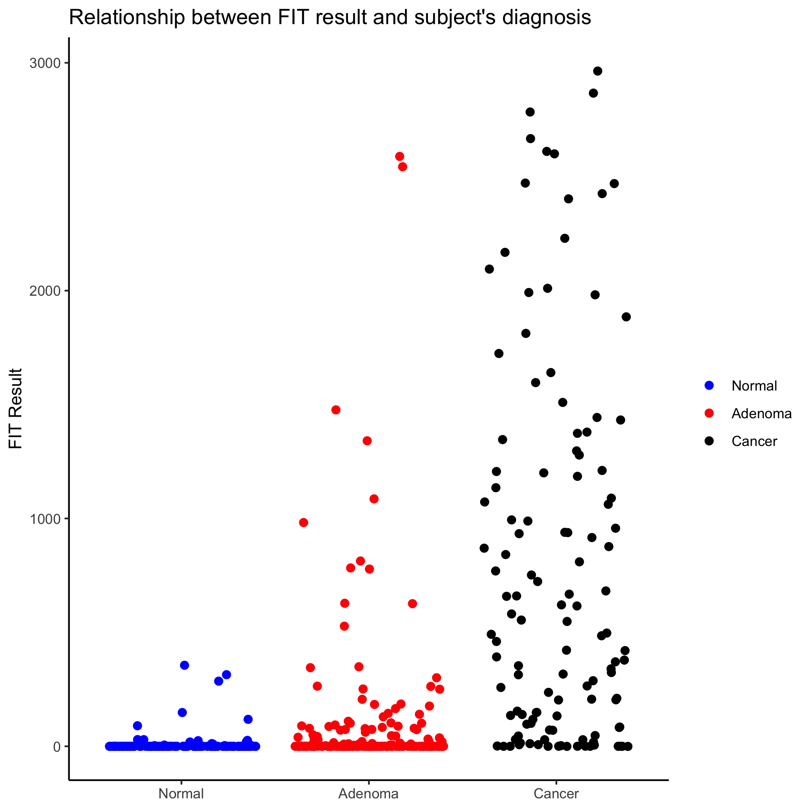

Looks better, eh? Perhaps we'd like to alter the jitter along the x-axis, we can set the amount of jitter using the `width` argument


```r
ggplot(meta_alpha, aes(x=diagnosis, y=fit_result, color=diagnosis)) +
	geom_jitter(shape=19, size=2, width=0.2) +
	scale_color_manual(name=NULL,
		values=c("blue", "red", "black"),
		breaks=c("normal", "adenoma", "cancer"),
		labels=c("Normal", "Adenoma", "Cancer")) +
	scale_x_discrete(limits=c("normal", "adenoma", "cancer"),
		labels=c("Normal", "Adenoma", "Cancer")) +
	labs(title="Relationship between FIT result and subject's diagnosis",
		x=NULL,
		y="FIT Result") +
	theme_classic()
```

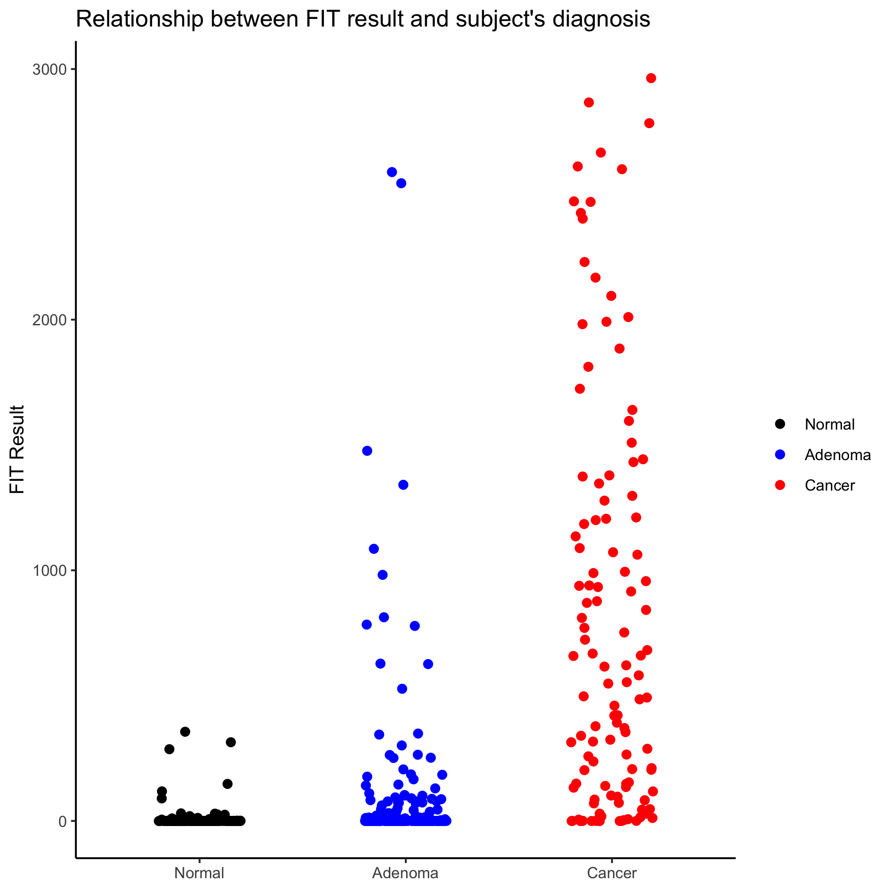

---

### Activity 1
Create a strip chart that shows the Shannon diversity for each diagnosis category. You'll notice that the y-axis does not seem to extend down to zero. Use the `coord_cartesian` function to include zero.

<input type="button" class="hideshow">
<div markdown="1" style="display:none;">

```r
ggplot(meta_alpha, aes(x=diagnosis, y=shannon, color=diagnosis)) +
	geom_jitter(shape=19, size=2, width=0.2) +
	scale_color_manual(name=NULL,
		values=c("blue", "red", "black"),
		breaks=c("normal", "adenoma", "cancer"),
		labels=c("Normal", "Adenoma", "Cancer")) +
	scale_x_discrete(limits=c("normal", "adenoma", "cancer"),
		labels=c("Normal", "Adenoma", "Cancer")) +
	labs(title="Relationship between Shannon diversity and subject's diagnosis",
		x=NULL,
		y="Shannon Diversity Index") +
	theme_classic() +
	coord_cartesian(ylim=c(0,5))
```

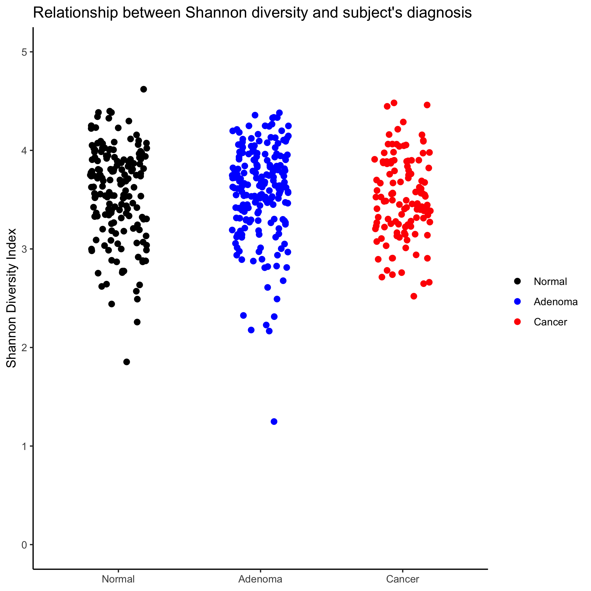
</div>

---

Great. How about comparing FIT results for combinations of sex and diagnosis? One option is to place the points along the x-axis by sex and color by diagnosis.


```r
ggplot(meta_alpha, aes(x=sex, y=fit_result, color=diagnosis)) +
	geom_jitter(shape=19, size=2, width=0.2) +
	scale_color_manual(name=NULL,
		values=c("blue", "red", "black"),
		breaks=c("normal", "adenoma", "cancer"),
		labels=c("Normal", "Adenoma", "Cancer")) +
	scale_x_discrete(limits=c("female", "male"),
		labels=c("Female", "Male")) +
	labs(title="Relationship between FIT result and subject's diagnosis and sex",
		x=NULL,
		y="FIT Result") +
	theme_classic()
```

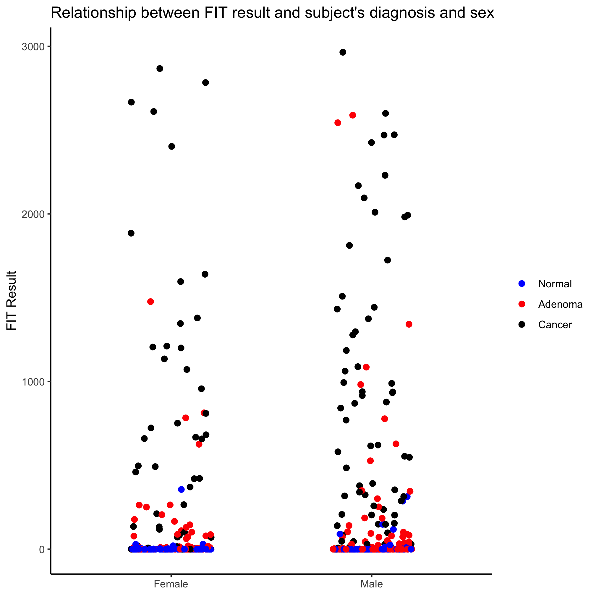

Meh. Another option is to use a the `position_jitterdodge` function with the `position` argument in `geom_jitter`. Recall that "dodge" means move the points so they don't overlap and "jitter" randomizes the x-position of the points (you can also randomize them on the y-axis, but that seems... strange).


```r
ggplot(meta_alpha, aes(x=sex, y=fit_result, color=diagnosis)) +
	geom_jitter(shape=19, size=2, position=position_jitterdodge()) +
	scale_color_manual(name=NULL,
		values=c("blue", "red", "black"),
		breaks=c("normal", "adenoma", "cancer"),
		labels=c("Normal", "Adenoma", "Cancer")) +
	scale_x_discrete(limits=c("female", "male"),
		labels=c("Female", "Male")) +
	labs(title="Relationship between FIT result and subject's diagnosis",
		x=NULL,
		y="FIT Result") +
	theme_classic()
```

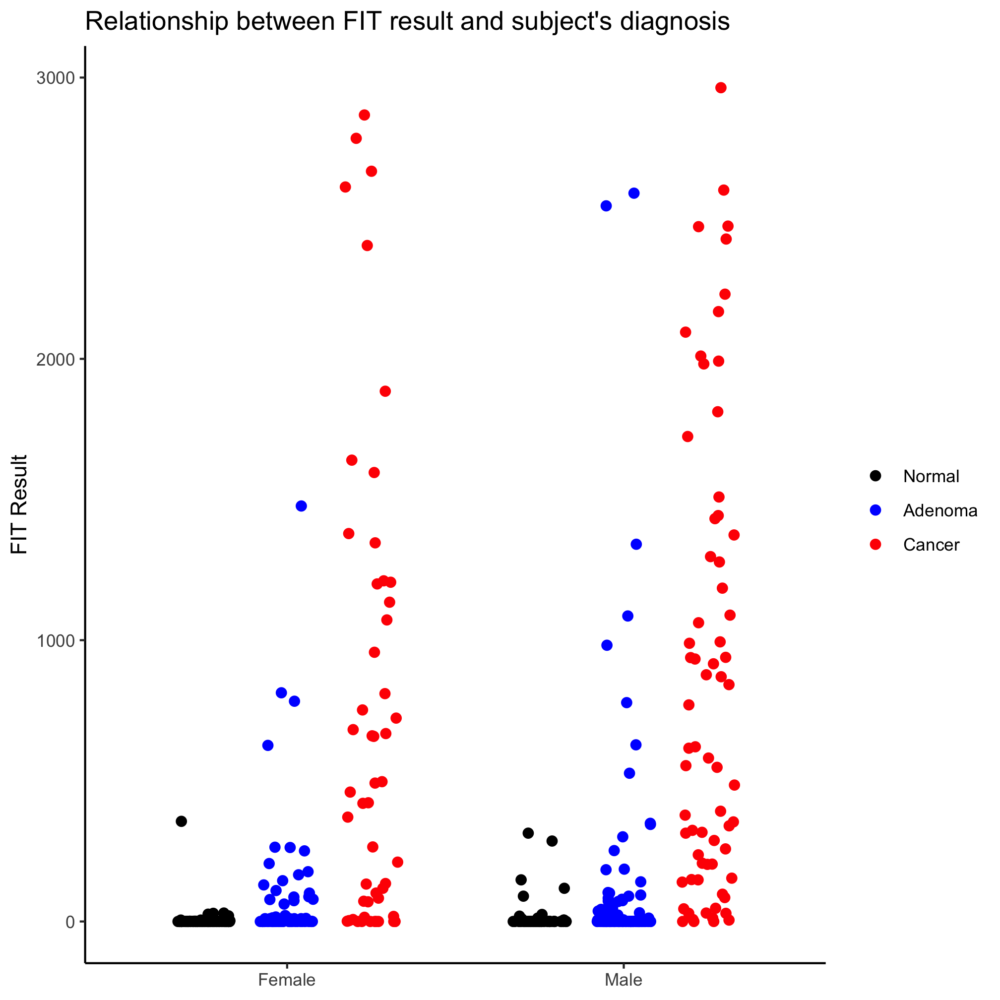

It looks like our diagnosis groups are still overlapping a bit. We can give a jitter.width and dodge.width value to `position_jitter_dodge` to eliminate that overlap.


```r
ggplot(meta_alpha, aes(x=sex, y=fit_result, color=diagnosis)) +
	geom_jitter(shape=19, size=2, position=position_jitterdodge(dodge.width=0.7, jitter.width=0.2)) +
	scale_color_manual(name=NULL,
		values=c("blue", "red", "black"),
		breaks=c("normal", "adenoma", "cancer"),
		labels=c("Normal", "Adenoma", "Cancer")) +
	scale_x_discrete(limits=c("female", "male"),
		labels=c("Female", "Male")) +
	labs(title="Relationship between FIT result and subject's diagnosis",
		x=NULL,
		y="FIT Result") +
	theme_classic()
```

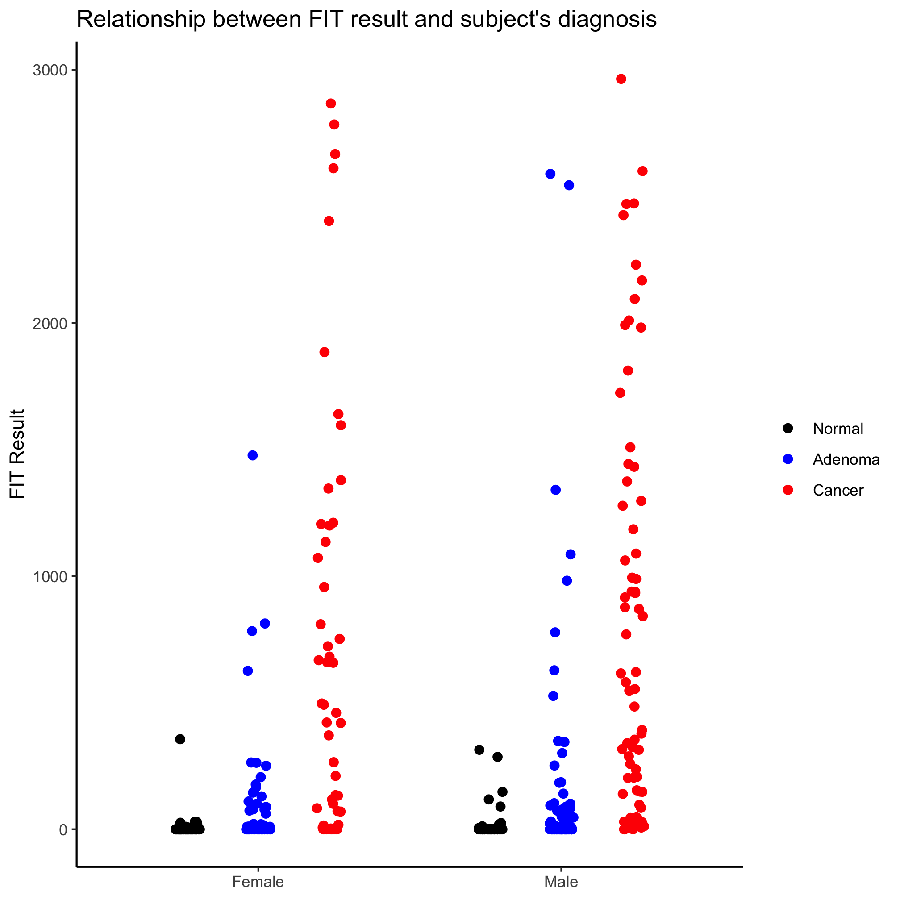

The order of the diagnosis groups is still out of whack. We'll come back to that later.


---

### Activity 2
Create a strip chart that shows the Shannon diversity for each diagnosis category and sex. Again, make sure that the y-axis includes zero.

<input type="button" class="hideshow">
<div markdown="1" style="display:none;">

```r
ggplot(meta_alpha, aes(x=sex, y=shannon, color=diagnosis)) +
	geom_jitter(shape=19, size=2, position=position_jitterdodge(dodge.width=0.7, jitter.width=0.2)) +
	scale_color_manual(name=NULL,
		values=c("blue", "red", "black"),
		breaks=c("normal", "adenoma", "cancer"),
		labels=c("Normal", "Adenoma", "Cancer")) +
	scale_x_discrete(limits=c("female", "male"),
		labels=c("Female", "Male")) +
	labs(title="Relationship between Shannon diversity and subject's diagnosis and sex",
		x=NULL,
		y="Shannon Diversity Index") +
	theme_classic() +
	coord_cartesian(ylim=c(0,5))
```


</div>

---

## Box plots
I like strip charts because I can see all of the data. These get a bit messy when there are a large number of observations. They are also problematic because although they show all of the data, we aren't great at identifying the median or the intraquartile ranges. An alternative to the strip chart that solves these problems is the box plot. That being said, a box plot may not be meaningful if there aren't many observations. We can generate a box plot using the `geom_boxplot` function in much the same way we did earlier with the `geom_jitter`


```r
ggplot(meta_alpha, aes(x=diagnosis, y=fit_result, color=diagnosis)) +
	geom_boxplot() +
	scale_color_manual(name=NULL,
		values=c("blue", "red", "black"),
		breaks=c("normal", "adenoma", "cancer"),
		labels=c("Normal", "Adenoma", "Cancer")) +
	scale_x_discrete(limits=c("normal", "adenoma", "cancer"),
		labels=c("Normal", "Adenoma", "Cancer")) +
	labs(title="Relationship between FIT result and subject's diagnosis",
		x=NULL,
		y="FIT Result") +
	theme_classic()
```

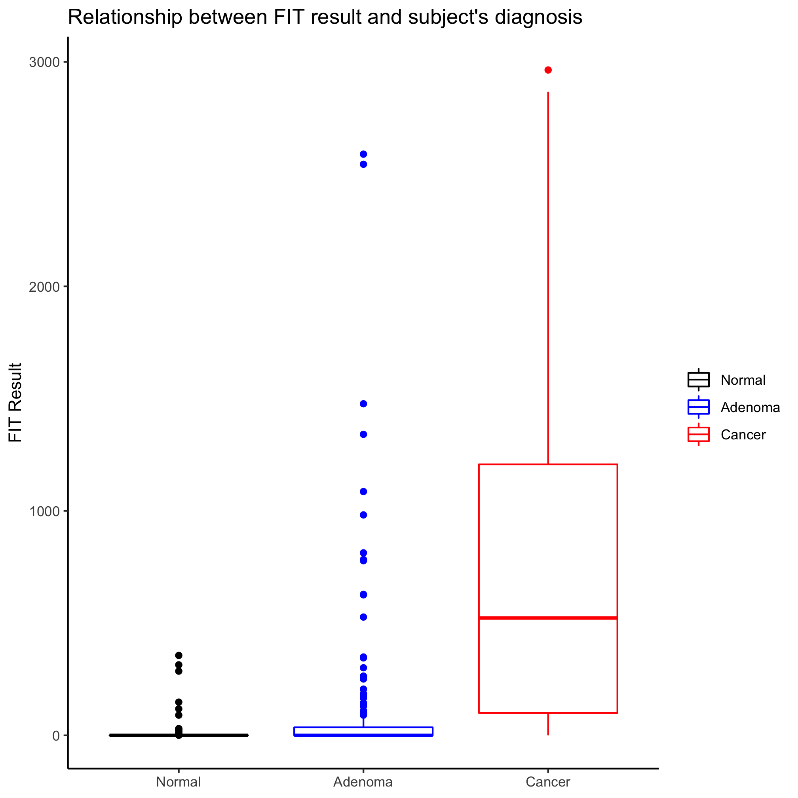

One of the things I don't like about box plots is that it isn't always clear what the various parts of the box or whiskers represent. The line through the middle of the rectangle is the median value and the lower and upper edges of the rectangle represent the 25th and 75th percentiles. The whiskers extend to the larges value greater than 1.5 times the difference between the 25th and 75th percentiles. It's a way to represent outliers. Another way to represent the distribution is wiht a notched box plot


```r
ggplot(meta_alpha, aes(x=diagnosis, y=fit_result, color=diagnosis)) +
	geom_boxplot(notch=TRUE) +
	scale_color_manual(name=NULL,
		values=c("blue", "red", "black"),
		breaks=c("normal", "adenoma", "cancer"),
		labels=c("Normal", "Adenoma", "Cancer")) +
	scale_x_discrete(limits=c("normal", "adenoma", "cancer"),
		labels=c("Normal", "Adenoma", "Cancer")) +
	labs(title="Relationship between FIT result and subject's diagnosis",
		x=NULL,
		y="FIT Result") +
	theme_classic()
```


In this case, the notches extend to 1.58 times the difference between the 25th and 75th percentiles divided by the square root of the number of observations. According to `?geom_boxplot` this gives a sense of the 95% confidence interval for comparing medians and "if the notches of two boxes do not overlap, this suggests that the medians are significantly different". Alternatively, you could generate an ugly and busy plot (but people seem to like them) where a strip chart and box plot (without the outliers) are overlapped using the `outlier.shape=NA` argument in `geom_boxplot`.


```r
ggplot(meta_alpha, aes(x=diagnosis, y=fit_result, color=diagnosis)) +
	geom_boxplot(outlier.shape=NA) +
	geom_jitter(shape=19)+
	scale_color_manual(name=NULL,
		values=c("blue", "red", "black"),
		breaks=c("normal", "adenoma", "cancer"),
		labels=c("Normal", "Adenoma", "Cancer")) +
	scale_x_discrete(limits=c("normal", "adenoma", "cancer"),
		labels=c("Normal", "Adenoma", "Cancer")) +
	labs(title="Relationship between FIT result and subject's diagnosis",
		x=NULL,
		y="FIT Result") +
	theme_classic()
```

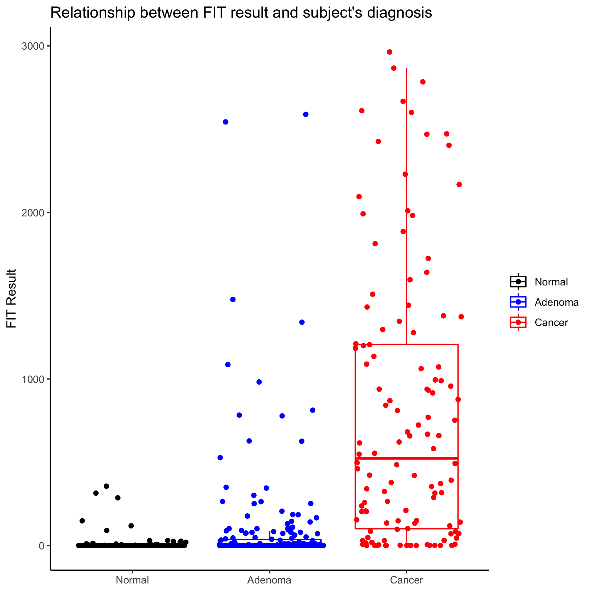


---

### Activity 3
Make a box plot that shows the Shannon diversity for each sex grouped by the subjects' diagnosis. Make the same plot, but group by diagnosis. Which is better? When would you want to group by sex? By diagnosis?

<input type="button" class="hideshow">
<div markdown="1" style="display:none;">

```r
ggplot(meta_alpha, aes(x=diagnosis, y=shannon, color=sex)) +
	geom_boxplot() +
	scale_color_manual(name=NULL,
		values=c("lightgreen", "orange"),
		breaks=c("female", "male"),
		labels=c("Female", "Male")) +
	scale_x_discrete(limits=c("normal", "adenoma", "cancer"),
		labels=c("Normal", "Adenoma", "Cancer")) +
	labs(title="Relationship between Shannon diversity and subject's sex and diagnosis",
		x=NULL,
		y="Shannon diversity index") +
	theme_classic()
```

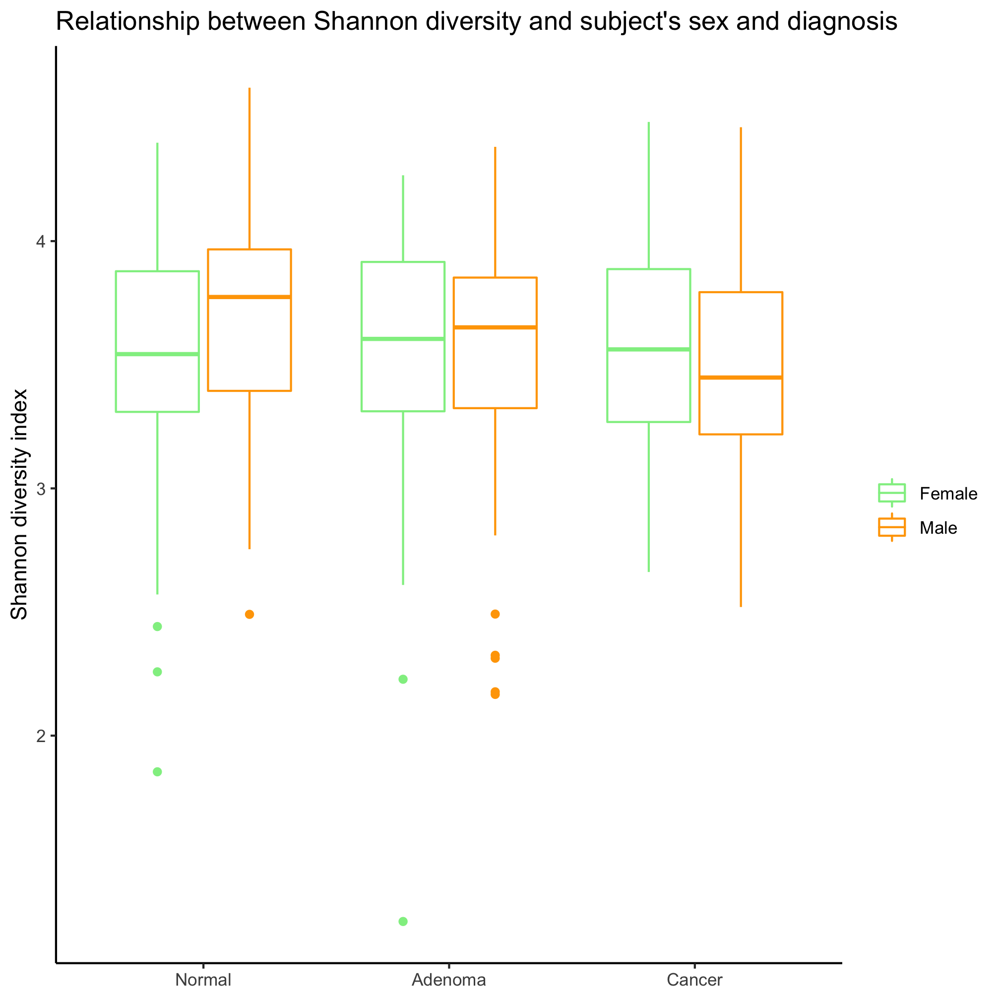


```r
ggplot(meta_alpha, aes(x=sex, y=shannon, color=diagnosis)) +
	geom_boxplot() +
	scale_color_manual(name=NULL,
		values=c("blue", "red", "black"),
		breaks=c("normal", "adenoma", "cancer"),
		labels=c("Normal", "Adenoma", "Cancer")) +
	scale_x_discrete(limits=c("female", "male"),
		labels=c("Female", "Male")) +
	labs(title="Relationship between Shannon diversity and subject's sex and diagnosis",
		x=NULL,
		y="Shannon diversity index") +
	theme_classic()
```

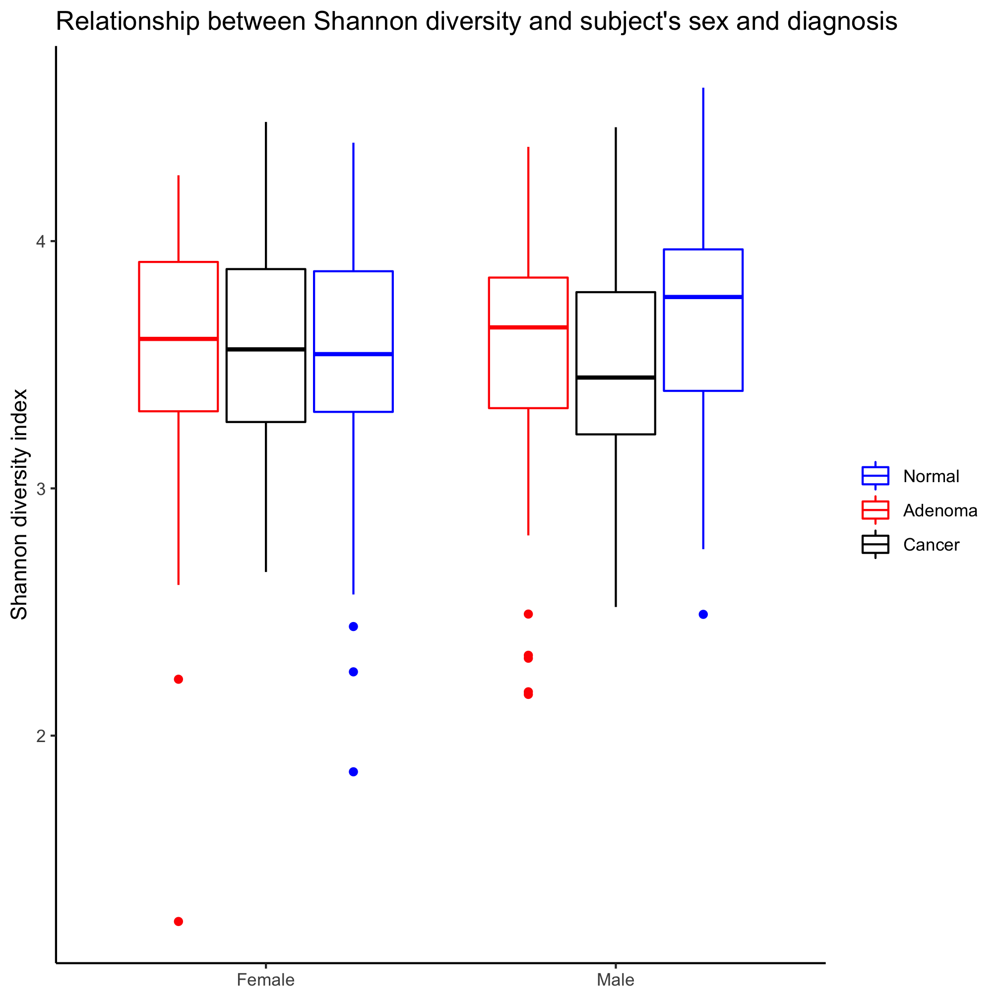
It depends on the question, which is better! If we are interested in comparing the two sexes, then we want to group by sex. If we want to compare the diagnosis groups, then we'll want to group by diagnosis groups.
</div>

---

### Activity 4
Our box plots have only had color on the rectangle, median line, whiskers, and outliers. Generate a box plot for the relationship between the patients' Shannon diversity and their diagnosis. Add a complimentary fill color that allows you to still see the cardinal values of the box plot.

<input type="button" class="hideshow">
<div markdown="1" style="display:none;">

```r
ggplot(meta_alpha, aes(x=diagnosis, y=shannon, color=diagnosis, fill=diagnosis)) +
	geom_boxplot(alpha=0.3) +
	scale_color_manual(name=NULL,
		values=c("blue", "red", "black"),
		breaks=c("normal", "adenoma", "cancer"),
		labels=c("Normal", "Adenoma", "Cancer")) +
	scale_fill_manual(name=NULL,
		values=c("blue", "red", "black"),
		breaks=c("normal", "adenoma", "cancer"),
		labels=c("Normal", "Adenoma", "Cancer")) +
	scale_x_discrete(limits=c("normal", "adenoma", "cancer"),
		labels=c("Normal", "Adenoma", "Cancer")) +
	labs(title="Relationship between Shannon diversity and subject's diagnosis",
		x=NULL,
		y="FIT Result") +
	theme_classic()
```

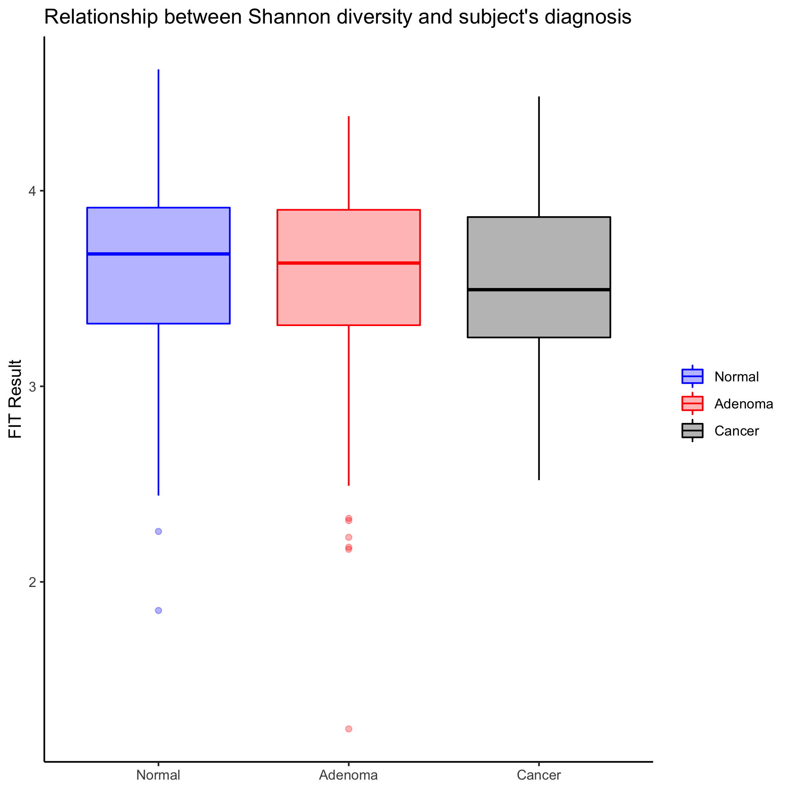
</div>

---

## Violin plots
In the last box plot example, we plotted the data points on top of the box plot. This is pretty cluttered and ugly. An alternative is the violin plot, where the position along the left axis indicates the density of values at that position on the y-axis. You can create violin plots very much in the same way as strip carts and box plots using the `geom_violin`


```r
ggplot(meta_alpha, aes(x=diagnosis, y=fit_result, fill=diagnosis)) +
	geom_violin() +
	scale_fill_manual(name=NULL,
		values=c("blue", "red", "black"),
		breaks=c("normal", "adenoma", "cancer"),
		labels=c("Normal", "Adenoma", "Cancer")) +
	scale_x_discrete(limits=c("normal", "adenoma", "cancer"),
		labels=c("Normal", "Adenoma", "Cancer")) +
	labs(title="Relationship between FIT result and subject's diagnosis",
		x=NULL,
		y="FIT Result") +
	theme_classic()
```

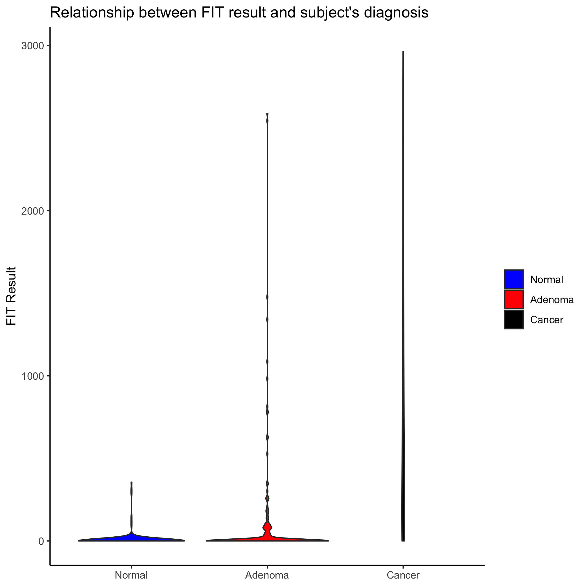

---

### Activity 5
In the previous violin plot we created the outline color to the violins was black. Can you get the outline color to match that of the fill color?

<input type="button" class="hideshow">
<div markdown="1" style="display:none;">

```r
ggplot(meta_alpha, aes(x=diagnosis, y=fit_result, fill=diagnosis, color=diagnosis)) +
	geom_violin() +
	scale_fill_manual(name=NULL,
		values=c("blue", "red", "black"),
		breaks=c("normal", "adenoma", "cancer"),
		labels=c("Normal", "Adenoma", "Cancer")) +
	scale_color_manual(name=NULL,
		values=c("blue", "red", "black"),
		breaks=c("normal", "adenoma", "cancer"),
		labels=c("Normal", "Adenoma", "Cancer")) +
	scale_x_discrete(limits=c("normal", "adenoma", "cancer"),
		labels=c("Normal", "Adenoma", "Cancer")) +
	labs(title="Relationship between FIT result and subject's diagnosis",
		x=NULL,
		y="FIT Result") +
	theme_classic()
```

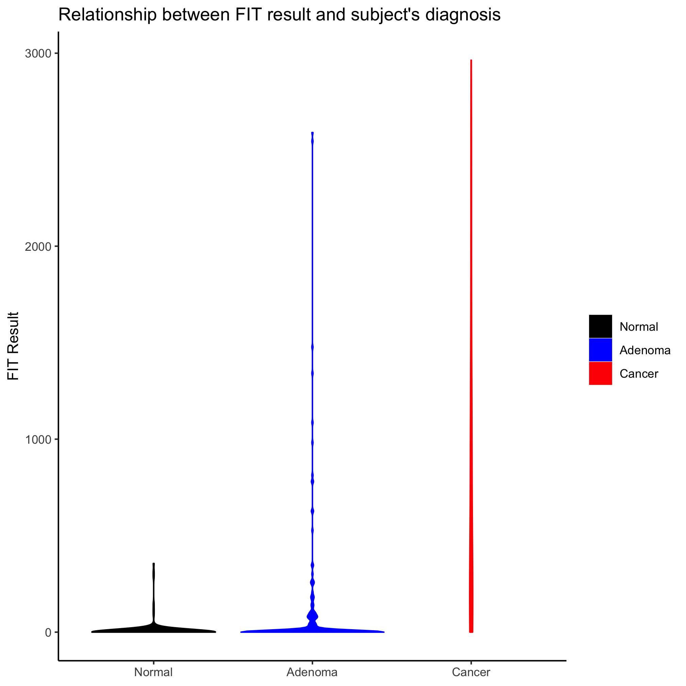
</div>

---

### Activity 6
Create a violin plot comparing diversity across diagnosis groups and sex

<input type="button" class="hideshow">
<div markdown="1" style="display:none;">

```r
ggplot(meta_alpha, aes(x=sex, y=shannon, fill=diagnosis, color=diagnosis)) +
	geom_violin() +
	scale_fill_manual(name=NULL,
		values=c("blue", "red", "black"),
		breaks=c("normal", "adenoma", "cancer"),
		labels=c("Normal", "Adenoma", "Cancer")) +
	scale_color_manual(name=NULL,
		values=c("blue", "red", "black"),
		breaks=c("normal", "adenoma", "cancer"),
		labels=c("Normal", "Adenoma", "Cancer")) +
	scale_x_discrete(limits=c("female", "male"),
		labels=c("Female", "Male")) +
	labs(title="Relationship between Shannon diversity and subject's diagnosis and sex",
		x=NULL,
		y="Shannon diversity index") +
	theme_classic()
```

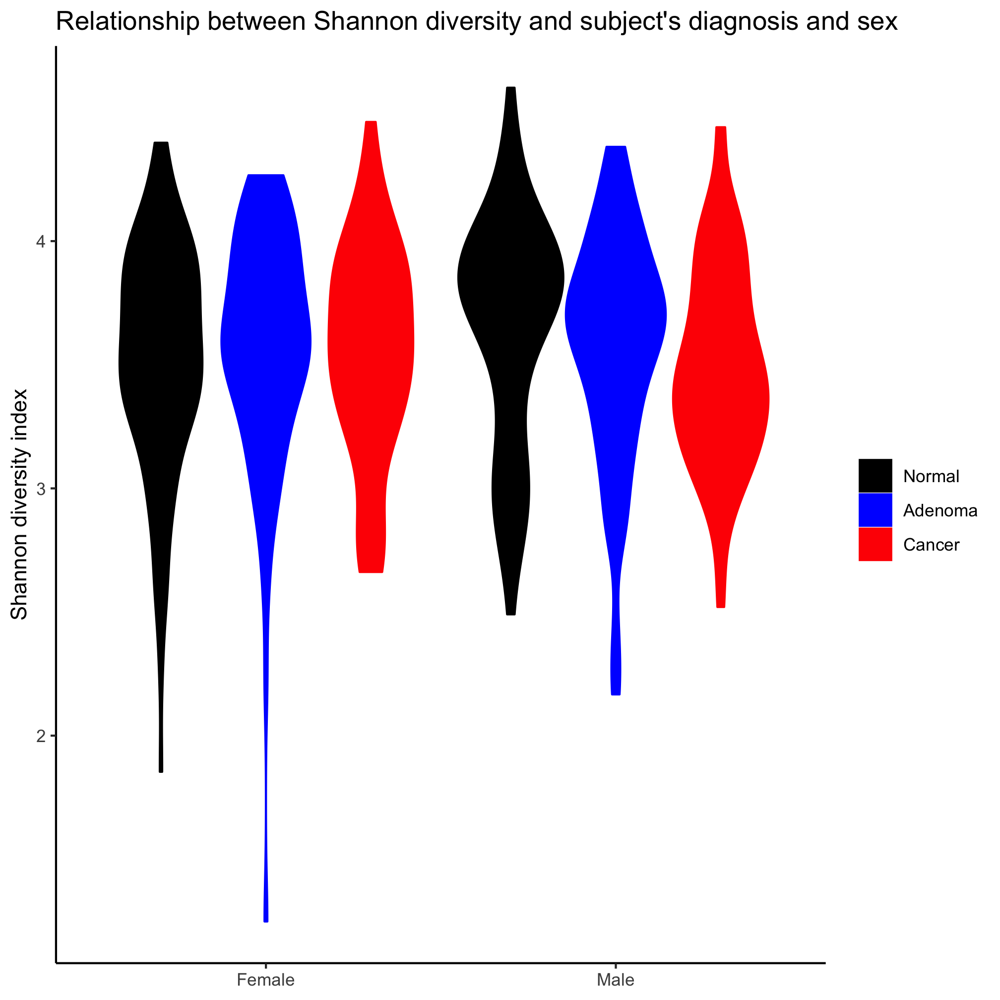
</div>

---

### Activity 7
A new variant of the types of plots discussed in this lesson is the ridgeline plot (aka ["joy plot"](http://www.houstonpress.com/music/five-joy-division-covers-that-dont-suck-6518316)). Install the `ggridges` package and see if you can figure out how to build a ridgeline plot of Shannon diversity values for the three diagnosis groups.

<input type="button" class="hideshow">
<div markdown="1" style="display:none;">

```r
#install.packages("ggridges")
library(ggridges)
```

```
## Error in library(ggridges): there is no package called 'ggridges'
```

```r
ggplot(meta_alpha, aes(x=shannon, y=diagnosis, color=diagnosis, fill=diagnosis)) +
	geom_density_ridges(alpha=0.5) +
	scale_fill_manual(name=NULL,
		values=c("blue", "red", "black"),
		breaks=c("normal", "adenoma", "cancer"),
		labels=c("Normal", "Adenoma", "Cancer")) +
	scale_color_manual(name=NULL,
		values=c("blue", "red", "black"),
		breaks=c("normal", "adenoma", "cancer"),
		labels=c("Normal", "Adenoma", "Cancer")) +
	scale_y_discrete(limits=c("normal", "adenoma", "cancer"),
		labels=c("Normal", "Adenoma", "Cancer")) +
	labs(title="Relationship between Shannon diversity and subject's diagnosis",
		y=NULL,
		x="Shannon diversity index") +
	theme_classic()
```

```
## Error in geom_density_ridges(alpha = 0.5): could not find function "geom_density_ridges"
```
</div>

---

## Ordering our groups
Whenever we've grouped our data by sex, the diagnosis groups are ordered alphabetically within each group (i.e. Adenoma, Cancer, Normal) rather than in our desired order of disease progression (i.e. Normal, Adenoma, Cancer). To fix the ordering, we need to cast these variables as factors. Factors are a troublesome feature within R. Thankfully, there's the `forcats` package within the tidyverse, which makes working with factors much easier. Factors are a type of data for representing categorical data. Characters are another type of data for representing categorical data, but the categories are ordered alphabetically. Sometimes we want to order them in another way. For example, if we have a column that has months, then when we plot with month on the x-axis, "April" will come first rather than "January". We can also rename factors so that "jan" is displayed as "January".  We've kind of already seen this when we relabeled "normal" with "Normal".

Let's return to the example of generating the bar plot of plotting the FIT result grouped by sex and then by diagnosis group.


```r
ggplot(meta_alpha, aes(x=sex, y=fit_result, color=diagnosis)) +
	geom_jitter(shape=19, size=2, position=position_jitterdodge(dodge.width=0.7, jitter.width=0.2)) +
	scale_color_manual(name=NULL,
		values=c("blue", "red", "black"),
		breaks=c("normal", "adenoma", "cancer"),
		labels=c("Normal", "Adenoma", "Cancer")) +
	scale_x_discrete(limits=c("female", "male"),
		labels=c("Female", "Male")) +
	labs(title="Relationship between FIT result and subject's diagnosis",
		x=NULL,
		y="FIT Result") +
	theme_classic()
```

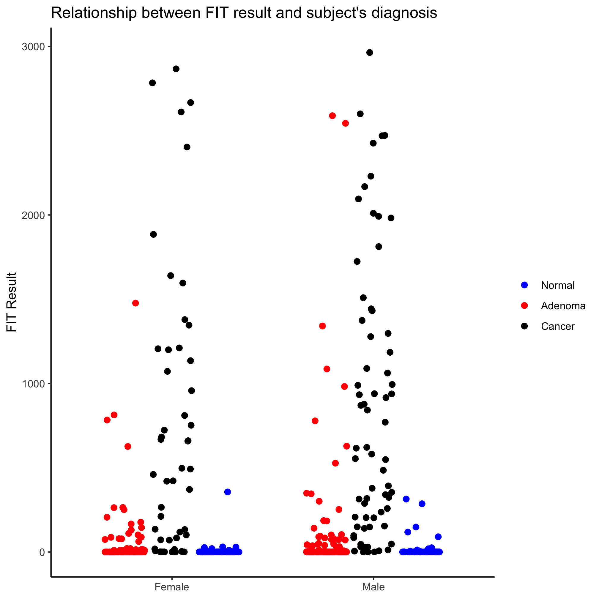

We can reorder the diagnosis variable by using the `factor` function where we give it the levels for the factor in the order we want it in. You might notice that we previously used a bit of a hack to set the `values` argument in `scale_color_manual`. This argument was taking our diagnosis values in alphabetical order. The values for `breaks` and `labels` were the order we wanted. Now we can use the "correct" order for our `values` argument


```r
meta_alpha %>%
	mutate(diagnosis = factor(diagnosis, levels=c("normal", "adenoma", "cancer"))) %>%
	ggplot(aes(x=sex, y=fit_result, color=diagnosis)) +
		geom_jitter(shape=19, size=2, position=position_jitterdodge(dodge.width=0.7, jitter.width=0.2)) +
		scale_color_manual(name=NULL,
			values=c("black", "blue", "red"),
			breaks=c("normal", "adenoma", "cancer"),
			labels=c("Normal", "Adenoma", "Cancer")) +
		scale_x_discrete(limits=c("female", "male"),
			labels=c("Female", "Male")) +
		labs(title="Relationship between FIT result and subject's diagnosis",
			x=NULL,
			y="FIT Result") +
		theme_classic()
```

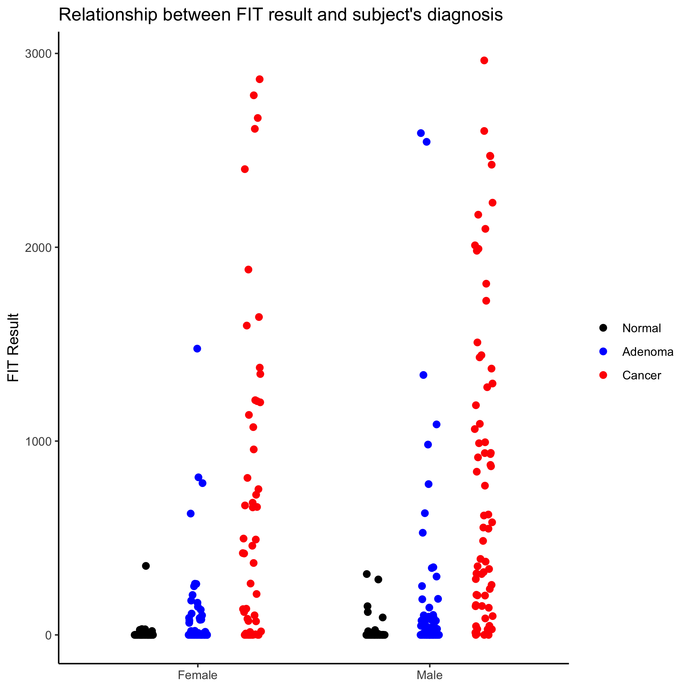

Nice, eh? There are a variety of things you can do with factors including reordering the factors by another variable, aggregating multiple values, and renaming variables. These are really outside the scope of this tutorial and I rarely use them in my work. You can learn more about them in the [R4DS book](http://r4ds.had.co.nz/factors.html).

---

### Activity 8
Generate a box plot clustering Shannon diversity data by diagnosis and then sex. Have the strips for males go before the females. Why didn't we have to worry about factors before with the sex variable?

<input type="button" class="hideshow">
<div markdown="1" style="display:none;">
This wasn't an issue before because we plotted females before males, which is alphabetical order.


```r
meta_alpha %>%
	mutate(sex = factor(sex, levels=c("male", "female"))) %>%
ggplot(aes(x=diagnosis, y=shannon, color=sex)) +
	geom_boxplot() +
	scale_color_manual(name=NULL,
		values=c("orange", "lightgreen"),
		breaks=c("male", "female"),
		labels=c("Male", "Female")) +
	scale_x_discrete(limits=c("normal", "adenoma", "cancer"),
		labels=c("Normal", "Adenoma", "Cancer")) +
	labs(title="Relationship between Shannon diversity and subject's sex and diagnosis",
		x=NULL,
		y="Shannon diversity index") +
	theme_classic()
```


</div>

---


### Activity 9
In this lesson we have discussed bar, strip, box, violin, and ridgeline plots. List strengths and weaknesses of each.

<input type="button" class="hideshow">
<div markdown="1" style="display:none;">
***bar plots***
* **Strengths**
  - May work well when describing the counts or proportion for a dataset (see Lesson 2)
  - Popular visual tool that most people know how to interpret
* **Weaknesses:**
  - Reader will instinctively assume the data are normally distributed
  - Often depicted without a zero on the y-axis leading to misinterpretation

***strip plots***
* **Strengths**
  - Shows all of the data
* **Weaknesses:**
  - Can be difficult to interpret where the median is
  - Too many points make it difficult to see the distribution of data
  - Confusion by some about meaning of jitter (there is no meaning)

***box plots***
* **Strengths**
  - Shows the shape of the distribution
* **Weaknesses:**
  - Unclear how to interpret length of whiskers
  - Need a decent amount of data for quartiles to be meaningful
  - Combination with strip plot can look messy

***violin plots***
* **Strengths**
  - Shows the shape of the distribution
* **Weaknesses:**
  - Need a decent amount of data for shape to be meaningful
  - Considered to [suggestive](https://xkcd.com/1967/) by some

***ridgeline plots/histograms***
* **Strengths**
  - Shows the shape of the distribution
* **Weaknesses:**
	- The inclusion of the 3rd dimension can make comparison of distributions difficult
  - Need a decent amount of data for quartiles to be meaningful
</div>

---

### Activity 10
Read the [PLOS Biology paper by Weissgerber et al. (2015)](https://journals.plos.org/plosbiology/article?id=10.1371/journal.pbio.1002128). Do you find their arguments and data compelling? Take a bar plot that was recently published by your research group and redraw it to comply with the recommendations of Weissgerber et al. If you are up for it, see if you can use the code from this lesson to represent it using each of the methods that we covered.
