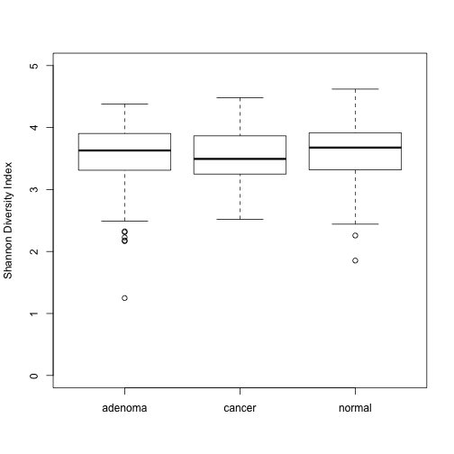
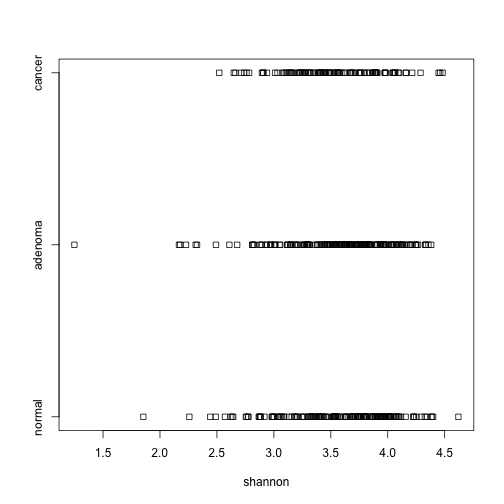
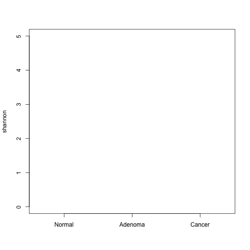
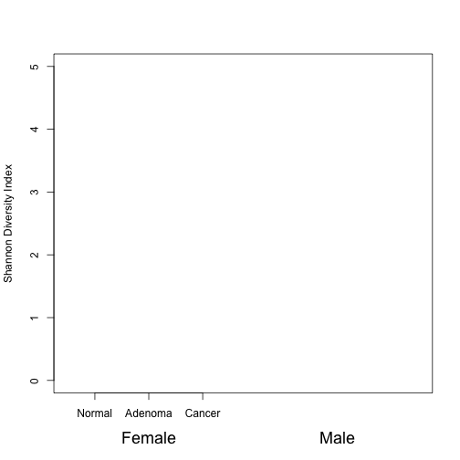
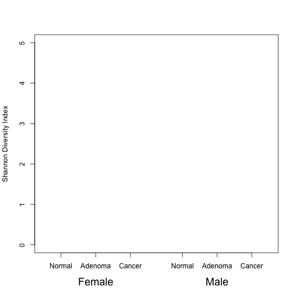
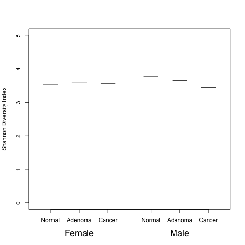
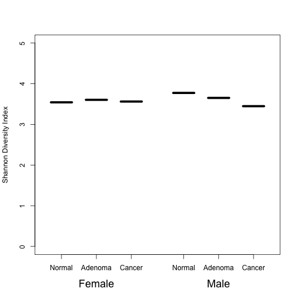
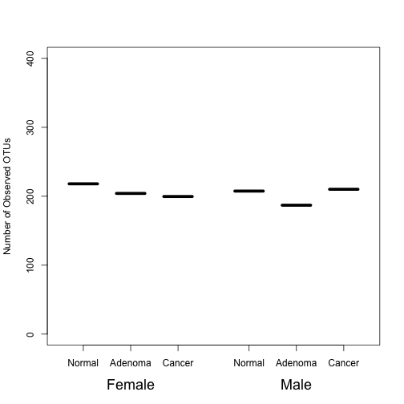

## Learning goals

* Box plots
*	Strip charts
* Segments


```r
source("code/baxter.R")
```

```
## 
## Attaching package: 'dplyr'
```

```
## The following objects are masked from 'package:stats':
## 
##     filter, lag
```

```
## The following objects are masked from 'package:base':
## 
##     intersect, setdiff, setequal, union
```

```r
meta_alpha <- get_meta_alpha()
```

In the last two sessions we've seen a couple ways to represent continuous data that are aggregated by categorical variables. We've also looked at how to represent the variation in those data using error bars to represent the standard error and histograms or density plots to represent the full distribution of values. There are a few issues with these approaches. As we've already discussed calculating and comparing means and their standard errors assumes that the data are normally distributed. With the error bar on a bar plot, depending on the color of the bar, it can be difficult to see the error bar that is below the mean if it is plotted. This type of presentation also assumes that the error bars are symmetrical about the mean, which would be the case if the data are normally distributed. A difficulty with the histograms and even the density plots is that it can become difficult to compare multiple categories. In this session and the next we'll explore two other ways to compare data that are not normally distributed. We'll start with box blots. Box plots typically represent the intraquartile range (i.e. the values at the 25th and 75% percentiles or the 50% confidence interval) by a box and the median with a line through that box. The "whiskers" are then drawn to represent a wider range of the data such as the 95% confidence interval or the minimum and maximum values of the observed values.


```r
boxplot(shannon ~ dx, data=meta_alpha, ylab="Shannon Diversity Index", ylim=c(0, 5.0))
```



As we saw earlier, many of the plotting arguments that we've seen previously can be used for other plotting functions as well. Using the `dx_color` and `dx_convert` vectors we've used previously, can you recolor the box plots (`col`) and re-label the categories along the x-axis (`names`)?


```r
dx_ordinal <- factor(meta_alpha$dx, levels=c("normal", "adenoma", "cancer"))
dx_convert <- c(normal="Normal", adenoma="Adenoma", cancer="Cancer")

boxplot(shannon ~ dx_ordinal, data=meta_alpha, ylab="Shannon Diversity Index", ylim=c(0, 5.0), col=dx_color[levels(dx_ordinal)], names=dx_convert[levels(dx_ordinal)])
```

```
## Error in boxplot.default(split(mf[[response]], mf[-response], drop = drop, : object 'dx_color' not found
```

By default the range on the whiskers is 1.5 times the intraquartile range (see `?boxplot.stats`). If we'd like to make these the minimum and maximum values, then we'd need to set the `range` argument to zero.


```r
boxplot(shannon ~ dx_ordinal, data=meta_alpha, ylab="Shannon Diversity Index", ylim=c(0, 5.0), col=dx_color[levels(dx_ordinal)], names=dx_convert[levels(dx_ordinal)], range=0)
```

```
## Error in boxplot.default(split(mf[[response]], mf[-response], drop = drop, : object 'dx_color' not found
```


Let's make a box plot for two variables - diagnosis and sex. Remembering the formula approach we can do the following...


```r
boxplot(shannon ~ dx + Gender, data=meta_alpha, ylab="Shannon Diversity Index", ylim=c(0, 5.0), col=dx_color[levels(dx_ordinal)], names=dx_convert[levels(dx_ordinal)])
```

```
## Error in boxplot.default(split(mf[[response]], mf[-response], drop = drop, : object 'dx_color' not found
```

Well that didn't work. It is complaining that the number of boxes it wants to plot (6) is not the same as the number of labels (3). We need to repeat the names vector twice. We can do this using the `rep` function. For example, give these a shot


```r
rep(x="bark", times=3)
rep(x=c("baarrrrrk", "bark"), times=3)
rep(x=c("baarrrrrk", "bark"), each=3)
```

How can we apply that to repeating the vector we are giving to the `names` argument?


```r
boxplot(shannon ~ dx_ordinal + Gender, data=meta_alpha, ylab="Shannon Diversity Index", ylim=c(0, 5.0), col=dx_color[levels(dx_ordinal)], names=rep(dx_convert[levels(dx_ordinal)], times=2) )
```

```
## Error in boxplot.default(split(mf[[response]], mf[-response], drop = drop, : object 'dx_color' not found
```

But now it isn't entirely clear which set of bars correspond to the female and male participants. We could use `levels(meta_alpha$Gender)` to get the order and see that the bars on the left are from females ("f") and those on the right are from males ("m"). We'd like to include this information on the plot. We can do this using the `mtext` function. You can think of this as "margin text".


```r
sex_map <- c(f="Female", m="Male")
boxplot(shannon ~ dx_ordinal + Gender, data=meta_alpha, ylab="Shannon Diversity Index", ylim=c(0, 5.0), col=dx_color[levels(dx_ordinal)], names=rep(dx_convert[levels(dx_ordinal)], times=2) )
```

```
## Error in boxplot.default(split(mf[[response]], mf[-response], drop = drop, : object 'dx_color' not found
```

```r
mtext(side=1, at=2, line=3, cex=1.5, text=sex_map[levels(factor(meta_alpha$Gender))[1]])
```

```
## Error in mtext(side = 1, at = 2, line = 3, cex = 1.5, text = sex_map[levels(factor(meta_alpha$Gender))[1]]): plot.new has not been called yet
```

Let's break this down a bit. If you recall our discussion of putting the legend in the right side margin, we mentioned that margins are indexed starting at the bottom axis and go clockwise. Here, we set the `side` argument to 1 to indicate the x-axis. If we wanted to put something on the right side, we'd set it to 4. Next, we have `at=2`, which tells R to put the text at 2 on the x-axis. What value of `at` would we use place "Male"? Now we have the `line` argument that tells R how many lines into the margin or away from the axis we should place the text. What do you think would happen if instead of using 3, we used -3? For the female/male category headers, we'd like them to be a bit larger. The `cex` argument tells R how much to expand the characters. Here we're making them 50% larger than normal text.

#### Activity 1
Write another `mtext` function call to add the label to indicate the Male box plots. Can you write a single `mtext` function call to produce both labels?

<input type=button class=hideshow style="margin-bottom: 20px"></input>
<div style="display: none">


```r
boxplot(shannon ~ dx_ordinal + Gender, data=meta_alpha, ylab="Shannon Diversity Index", ylim=c(0, 5.0), col=dx_color[levels(dx_ordinal)], names=rep(dx_convert[levels(dx_ordinal)], times=2) )
```

```
## Error in boxplot.default(split(mf[[response]], mf[-response], drop = drop, : object 'dx_color' not found
```

```r
mtext(side=1, at=c(2,5), line=3, cex=1.5, text=sex_map[levels(factor(meta_alpha$Gender))])
```

```
## Error in mtext(side = 1, at = c(2, 5), line = 3, cex = 1.5, text = sex_map[levels(factor(meta_alpha$Gender))]): plot.new has not been called yet
```
</div>

The female and male box plots aren't super easy to distinguish. Let's try to separate them using the `subset`, `at`, and `add` arguments. The `subset` argument allows us to give `boxplot` a logical question (e.g. `Gender == "m"`) to pullout a specific set of data. The `at` argument allows us to tell `boxplot` where to put the boxes along the x-axis. We can call `boxplot` twice (once for females and once for males) and use the `add=TRUE` argument to combine the plots. Finally, we need to lengthen the default `xlim` settings.


```r
boxplot(shannon ~ dx_ordinal, data=meta_alpha, subset=Gender=='f', ylab="Shannon Diversity Index", ylim=c(0, 5.0), col=dx_color[levels(dx_ordinal)], names=dx_convert[levels(dx_ordinal)], xlim=c(0.5,7.0))
```

```
## Error in boxplot.default(split(mf[[response]], mf[-response], drop = drop, : object 'dx_color' not found
```

```r
boxplot(shannon ~ dx_ordinal, data=meta_alpha, subset=Gender=='m', at=seq(from=4.5,6.5,1), col=dx_color[levels(dx_ordinal)], names=dx_convert[levels(dx_ordinal)], add=T)
```

```
## Error in boxplot.default(split(mf[[response]], mf[-response], drop = drop, : object 'dx_color' not found
```

```r
mtext(side=1, at=c(2,5.5), line=3, cex=1.5, text=c("Female", "Male"))
```

```
## Error in mtext(side = 1, at = c(2, 5.5), line = 3, cex = 1.5, text = c("Female", : plot.new has not been called yet
```


The separate plotting functions can also be combined into a single function using the `+` operator and `at` to keep the code DRY.


```r
boxplot(shannon ~ dx_ordinal + Gender, data=meta_alpha, at = c(1, 2, 3, 4.5, 5.5, 6.5),
        ylab="Shannon Diversity Index", ylim=c(0, 5.0), col=dx_color[levels(dx_ordinal)],
        names=rep(dx_convert[levels(dx_ordinal)], times = 2), xlim=c(0.5,7.0))
```

```
## Error in boxplot.default(split(mf[[response]], mf[-response], drop = drop, : object 'dx_color' not found
```

```r
mtext(side=1, at=c(2,5.5), line=3, cex=1.5, text=c("Female", "Male"))
```

```
## Error in mtext(side = 1, at = c(2, 5.5), line = 3, cex = 1.5, text = c("Female", : plot.new has not been called yet
```


A bar plot is fine if we have a lot of data and they are normally distributed while box plots are good for data that are not normally distributed. Both of these methods lose their desirability for small numbers of samples. Sometimes, we want to be able to see the data. We can do this with a strip chart.


```r
stripchart(shannon ~ dx_ordinal, data=meta_alpha)
```



That's pretty uninspiring, eh? We can bling it up a bit to make a more attractive figure.


```r
stripchart(shannon ~ dx_ordinal, data=meta_alpha, pch=19, ylim=c(0,5), group.names=dx_convert[levels(dx_ordinal)], col=dx_color[levels(dx_ordinal)], vertical=T, method="jitter", jitter=0.2)
```

```
## Error in plot.xy(xy.coords(x, y), type = type, ...): object 'dx_color' not found
```



Here we have three new arguments. The first, `vertical=T` tells `stripchart` to plot the points vertically. See what happens when you use `vertical=F`, but be sure to change the `ylim` and `xlim` argument values. The `method="jitter"` and `jitter=0.2` arguments go together. In the previous strip chart we made the points were on top of each other. Together these two arguments allow us to randomly jitter the points. The `jitter=0.2` argument tells R to plot the points 0.2 units to the left and right of the position along the x-axis.


#### Activity 2
As we did with the boxplots, we can also use the `+` operator in the formula, the `at` and `add` arguments to plot multiple categories together. See if you can take what you learned from the `boxplot` and `stripchart` examples to build a strip chart comparing the Shannon diversity of the three diagnoses for the female and male patients.

<input type=button class=hideshow style="margin-bottom: 20px"></input>
<div style="display: none">


```r
stripchart(shannon ~ dx_ordinal, data=meta_alpha, subset=Gender=='f', ylab="Shannon Diversity Index", ylim=c(0, 5.0), col=dx_color[levels(dx_ordinal)], group.names=dx_convert[levels(dx_ordinal)], xlim=c(0.5,7.0), vertical=T, method="jitter", jitter=0.2, pch=19)
```

```
## Error in plot.xy(xy.coords(x, y), type = type, ...): object 'dx_color' not found
```

```r
stripchart(shannon ~ dx_ordinal, data=meta_alpha, subset=Gender=='m', at=seq(from=4.5,to=6.5,by=1), col=dx_color[levels(dx_ordinal)], group.names=dx_convert[levels(dx_ordinal)], vertical=T, method="jitter", jitter=0.2, pch=19, add=T)
```

```
## Error in plot.xy(xy.coords(x, y), type = type, ...): object 'dx_color' not found
```

```r
mtext(side=1, at=c(2,5.5), line=3, cex=1.5, text=c("Female", "Male"))
```


</div>

Whoops. You'll notice the labels aren't showing up under the plots for the male subset of samples. Unfortunately, this is one of the quirks of the naming argument for stripcharts. One way around it is to combine the individual functions as we did before with the boxplots using `at` to tell R where to plot and `rep()` to repeat the label names appropriately.  Go ahead and give that a try now.

<input type=button class=hideshow style="margin-bottom: 20px"></input>
<div style="display: none">


```r
stripchart(shannon ~ dx_ordinal + Gender, data=meta_alpha, ylab="Shannon Diversity Index", pch=19, ylim=c(0,5.0),
           xlim=c(0.5,7.0), at = c(1, 2, 3, 4.5, 5.5, 6.5), group.names=rep(dx_convert[levels(dx_ordinal)], times = 2),
           col=dx_color[levels(dx_ordinal)], vertical=T, method="jitter", jitter=0.2)
```

```
## Error in plot.xy(xy.coords(x, y), type = type, ...): object 'dx_color' not found
```

```r
mtext(side=1, at=c(2,5.5), line=3, cex=1.5, text=c("Female", "Male"))
```


</div>

#### Activity 3
Because there is still a fair amount of over plotting, can you rebuild this plot and change the opacity for each point to 50%?

<input type=button class=hideshow style="margin-bottom: 20px"></input>
<div style="display: none">


```r
library('scales')

stripchart(shannon ~ dx_ordinal + Gender, data=meta_alpha, ylab="Shannon Diversity Index", pch=19, ylim=c(0,5.0),
           xlim=c(0.5,7.0), at = c(1, 2, 3, 4.5, 5.5, 6.5), group.names=rep(dx_convert[levels(dx_ordinal)], times = 2),
           col=alpha(dx_color[levels(dx_ordinal)], alpha = 0.5), vertical=T, method="jitter", jitter=0.2)
```

```
## Error in as.character(col) %in% "0": object 'dx_color' not found
```

```r
mtext(side=1, at=c(2,5.5), line=3, cex=1.5, text=c("Female", "Male"))
```


</div>

Strip charts can show us all of the data, but it is difficult to know where the center of the distribution is. We would like to plot a solid bar across each distribution to show the mean value of each distribution. In an earlier session we saw that we could calculate the median using the `aggregate` function.


```r
shannon_dx_gender_median <- aggregate(shannon ~ dx_ordinal + Gender, data=meta_alpha, FUN=median)
```

Next we'll want to draw the line segments across the distributions. Do you recall how we drew the confidence intervals using the `arrows` command? Here we'll use the `segments` function using the same arguments, except that we don't have to use the `angle` argument. You'll recall that previously we got the x-axis coordinates by saving the output of `barcode` to a variable. We don't have that option here, so we'll use the vectors that we used in the `at` argument.


```r
stripchart(shannon ~ dx_ordinal + Gender, data=meta_alpha, ylab="Shannon Diversity Index", pch=19, ylim=c(0,5.0),
           xlim=c(0.5,7.0), at = c(1, 2, 3, 4.5, 5.5, 6.5), group.names=rep(dx_convert[levels(dx_ordinal)], times = 2),
           col=alpha(dx_color[levels(dx_ordinal)], alpha = 0.5), vertical=T, method="jitter", jitter=0.2)
```

```
## Error in as.character(col) %in% "0": object 'dx_color' not found
```

```r
mtext(side=1, at=c(2,5.5), line=3, cex=1.5, text=c("Female", "Male"))

segments(x0=c(1:3, c(4.5,5.5,6.5))-0.25, y0=shannon_dx_gender_median$shannon,
         x1=c(1:3,c(4.5,5.5,6.5))+0.25, y1=shannon_dx_gender_median$shannon)
```



Cool! Those lines look good, except they're a bit thin. Let's make them a bit thicker using the `lwd` argument


```r
stripchart(shannon ~ dx_ordinal + Gender, data=meta_alpha, ylab="Shannon Diversity Index", pch=19, ylim=c(0,5.0),
           xlim=c(0.5,7.0), at = c(1, 2, 3, 4.5, 5.5, 6.5), group.names=rep(dx_convert[levels(dx_ordinal)], times = 2),
           col=alpha(dx_color[levels(dx_ordinal)], alpha = 0.5), vertical=T, method="jitter", jitter=0.2)
```

```
## Error in as.character(col) %in% "0": object 'dx_color' not found
```

```r
mtext(side=1, at=c(2,5.5), line=3, cex=1.5, text=c("Female", "Male"))

segments(x0=c(1:3, c(4.5,5.5,6.5))-0.25, y0=shannon_dx_gender_median$shannon,
         x1=c(1:3, c(4.5,5.5,6.5))+0.25, y1=shannon_dx_gender_median$shannon, lwd = 5)
```


Wonderful!


#### Activity 4
We might like the segments to extend a bit further so that they extend beyond the horizontal range of each strip chart. Can you alter the segments function call to make each segment start 0.3 units before the edge of each strip and end 0.3 units after each strip? Go ahead and put this with your code for the strip chart, axis labeling, and calculation of the mean value.

<input type=button class=hideshow style="margin-bottom: 20px"></input>
<div style="display: none">


```r
library('scales')

stripchart(shannon ~ dx_ordinal + Gender, data=meta_alpha, ylab="Shannon Diversity Index", pch=19, ylim=c(0,5.0),
           xlim=c(0.5,7.0), at = c(1, 2, 3, 4.5, 5.5, 6.5), group.names=rep(dx_convert[levels(dx_ordinal)], times = 2),
           col=alpha(dx_color[levels(dx_ordinal)], alpha = 0.5), vertical=T, method="jitter", jitter=0.2)
```

```
## Error in as.character(col) %in% "0": object 'dx_color' not found
```

```r
mtext(side=1, at=c(2,5.5), line=3, cex=1.5, text=c("Female", "Male"))

segments(x0=c(1:3, c(4.5,5.5,6.5))-0.3, y0=shannon_dx_gender_median$shannon,
         x1=c(1:3, c(4.5,5.5,6.5))+0.3, y1=shannon_dx_gender_median$shannon, lwd = 5)
```


</div>


#### Activity 5
Can you regenerate the previous plot using the number of observed OTUs (`sobs`) instead of the Shannon diversity index?

<input type=button class=hideshow style="margin-bottom: 20px"></input>
<div style="display: none">


```r
library('scales')

sobs_dx_gender_median <- aggregate(sobs ~ dx + Gender, data=meta_alpha, FUN=median)

stripchart(sobs ~ dx_ordinal + Gender, data=meta_alpha, ylab="Number of Observed OTUs", pch=19, ylim=c(0,400),
           xlim=c(0.5,7.0), at = c(1, 2, 3, 4.5, 5.5, 6.5), group.names=rep(dx_convert[levels(dx_ordinal)], times = 2),
           col=alpha(dx_color[levels(dx_ordinal)], alpha = 0.5), vertical=T, method="jitter", jitter=0.2)
```

```
## Error in as.character(col) %in% "0": object 'dx_color' not found
```

```r
mtext(side=1, at=c(2,5.5), line=3, cex=1.5, text=c("Female", "Male"))

segments(x0=c(1:3, c(4.5,5.5,6.5))-0.3, y0=sobs_dx_gender_median$sobs,
         x1=c(1:3, c(4.5,5.5,6.5))+0.3, y1=sobs_dx_gender_median$sobs, lwd=5)
```


</div>


<script>
$( "input.hideshow" ).each( function ( index, button ) {
  button.value = 'Show an answer';
  $( button ).click( function () {
    var target = this.nextSibling ? this : this.parentNode;
    target = target.nextSibling.nextSibling;
    if ( target.style.display == 'block' || target.style.display == '' ) {
      target.style.display = 'none';
      this.value = 'Show an answer';
    } else {
      target.style.display = 'block';
      this.value = 'Hide answer';
    }
  } );
} );
</script>
