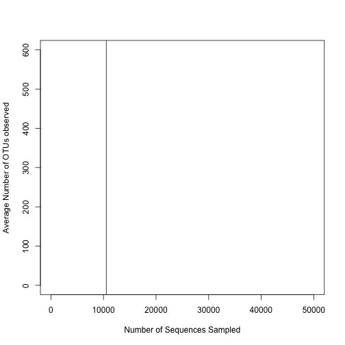

## Learning objectives

* Rarefaction curves
* Loops
* Adding lines to plots

Frequently we may have continuous data that was collected in a specific order. Usually order is dictated by time. We could use a scatterplot like we did for the ordination, but to indicate that the samples are linked, we would like to connect them with a line segment. This is what we'll call a line plot. For better or worse microbial ecology researchers are frequently interested in plotting rarefaction curves. These curves indicate how well one has sampled the most abundant sequences and can be used to make comparisons based on a common number of sequences. The file `baxter.rarefaction` contains the rarefied version of the data in the `baxter.shared` file, both of which are in the `data` folder.

Go ahead and write the code to read the rarefaction file into a variable called `rarefy`. Using the approach from the first session, take a look at this file to get a sense of what it looks like.


```r
rarefy <- read.table(file="data/baxter.rarefaction", header=T, stringsAsFactors=F)
```

If you look at the contents of `rarefy`, you'll see that it looks pretty ugly. The first column, `numsampled` has the number of sequences that have been sampled and it goes from 1 to 430213 in 100 sequence steps. The columns are displayed in sets of threes. For example, `X0.03.2003650 lci.2003650 hci.2003650`. The first column in the triplet is the average number of OTUs observed for that sample at the specified number of sequences sampled by the value in the `numsampled` column. The second and third columns in the triplet represent the lower (`lci`) and higher (`hci`) confidence interval. We don't want to mess with the `lci` and `hci` columns. There's 980 of these columns and so we can't manually remove these columns using the `-` operator like we've seen before. Instead, let's use a new function, `grep`. This allows us to search for a "REgular ExPression". There are two flavors of `grep`: `grep`, which gives us the vector index number of any values that match our regular expression and `grepl`, which gives us `TRUE` or `FALSE` depending on whether the regular expression was found. Let's do a brief aside to show some different regular expression patterns.


```r
names <- c("Samntha", "Javier", "John", "Jon", "Maria", "Courtney", "Mary")
grep(pattern="John", x=names)
```

```
## [1] 3
```

```r
grep(pattern="Maria", x=names)
```

```
## [1] 5
```

```r
grepl(pattern="John", x=names)
```

```
## [1] FALSE FALSE  TRUE FALSE FALSE FALSE FALSE
```

```r
grepl(pattern="Maria", x=names)
```

```
## [1] FALSE FALSE FALSE FALSE  TRUE FALSE FALSE
```

```r
grep(pattern="Mar", x=names)
```

```
## [1] 5 7
```

These are pretty straightforward. The first four are analogous to saying `John == names` or `Maria == names`. The fifth begins to show us the power of regular expressions finding any name that starts with "Mar". There are many, many ways to write patterns to find strings. We'll see more of these in subsequent sessions. Can you write an expression to return a vector that contains `Maria Mary`? With this bit of knowledge, you should be able to write your own regular expression to get the columns that contain the average number of OTUs for a specific number of sequences. See if you can use this to then create a new data.frame that we'll call `ave_rarefy` that contains the matching columns

```
ave_columns <- grep(pattern=???????, x=colnames(rarefy))
ave_rarefy <- rarefy[,?????]
```

Let's go ahead and use this regular expression to generate an `ave_rarefy` variable


```r
ave_columns <- grep(pattern="X0.03", x=colnames(rarefy))
ave_rarefy <- rarefy[,ave_columns]
```

If you run `ave_rarefy[1:5,1:5]` what do you notice? I notice that we no longer have the `numsampled` column and that although we have the right columns. Let's make a new vector, `numsampled`, which is the first column from `rarefy`.


```r
numsampled <- rarefy$numsampled
```

The other thing I noticed about `ave_rarefy` is that although we now have the right columns, it isn't going to be easy to take a column name and retrieve the corresponding metadata. Let's go ahead and load the metadata using the `get_meta` function from the `code/baxter.R` file


```r
source('code/baxter.R')
```

```
## 
## Attaching package: 'dplyr'
```

```
## The following objects are masked from 'package:stats':
## 
##     filter, lag
```

```
## The following objects are masked from 'package:base':
## 
##     intersect, setdiff, setequal, union
```

```r
metadata <- get_meta()
```

Recall, that the first column is `sample` and that it is a vector of `character` data. How would you confirm this?

Ok, now we need to "edit" the column names of `ave_rarefy` to get them to be in the same format as the `sample` column in `metadata`. We need to remove the `X0.03.` portion of the column names. We're going to build upon our experience with `grep` to perform this edit. You can think of `grep` as being the `find` command in a word processor and `gsub` as the `find & replace` command. The syntax will look like this

```
gsub(pattern="find", replacement="replace", x=my_vector)
```

For example...


```r
gsub(pattern="Samntha", replacement="Samantha", x=names)
```

```
## [1] "Samantha" "Javier"   "John"     "Jon"      "Maria"    "Courtney"
## [7] "Mary"
```

```r
gsub(pattern="Javier", replacement="Javi", x=names)
```

```
## [1] "Samntha"  "Javi"     "John"     "Jon"      "Maria"    "Courtney"
## [7] "Mary"
```

Do you see what happened? In the first case we corrected the spelling of Samantha's name. In the second, we shortened Javier's name to his nickname, Javi. Can you see how to take this and remove the `X0.03.` from every column name?


```r
colnames(ave_rarefy) <- gsub("X0.03.", "", colnames(ave_rarefy))
```

Check it out, how did we do?


Now we're ready to think about how we'd like to plot the data! Let's generate a line plot for the sample in the first column, `2003650`.


```r
plot(ave_rarefy[,"2003650"]~numsampled, col=dx_color[metadata[metadata$sample=="2003650", "dx"]], type="l", xlab="Number of Sequences Sampled", ylab="Average Number of OTUs observed")
```

```
## Error in FUN(X[[i]], ...): object 'dx_color' not found
```

This chunk of code creates a vector of colors that we've seen before to give each diagnosis it's own color. Then we call the `plot` function. We ran this before, but this time we use `type="l"`. This is what tells the `plot` function to generate a line plot. Again we use the `xlab` and `ylab` arguments to label the two axes. How would we add the second column? If you recall Session 5, you might remember that we were able to add points to a plot using the `points` function. We'll do the same thing here, but again we'll use `type=l` to add a line to the plot


```r
plot(ave_rarefy[,"2003650"]~numsampled, col=dx_color[metadata[metadata$sample=="2003650", "dx"]], type="l", xlab="Number of Sequences Sampled", ylab="Average Number of OTUs observed")
```

```
## Error in FUN(X[[i]], ...): object 'dx_color' not found
```

```r
points(ave_rarefy[,"2005650"]~numsampled, col=dx_color[metadata[metadata$sample=="2005650", "dx"]], type="l")
```

```
## Error in FUN(X[[i]], ...): object 'dx_color' not found
```

Can you add two or three more lines to the plot?

<input type=button class=hideshow style="margin-bottom: 20px"></input>
<div style="display: none">

```r
plot(ave_rarefy[,"2003650"]~numsampled, col=dx_color[metadata[metadata$sample=="2003650", "dx"]], type="l", xlab="Number of Sequences Sampled", ylab="Average Number of OTUs observed")
```

```
## Error in FUN(X[[i]], ...): object 'dx_color' not found
```

```r
points(ave_rarefy[,"2005650"]~numsampled, col=dx_color[metadata[metadata$sample=="2005650", "dx"]], type="l")
```

```
## Error in FUN(X[[i]], ...): object 'dx_color' not found
```

```r
points(ave_rarefy[,"2007660"]~numsampled, col=dx_color[metadata[metadata$sample=="2007660", "dx"]], type="l")
```

```
## Error in FUN(X[[i]], ...): object 'dx_color' not found
```

```r
points(ave_rarefy[,"2009650"]~numsampled, col=dx_color[metadata[metadata$sample=="2009650", "dx"]], type="l")
```

```
## Error in FUN(X[[i]], ...): object 'dx_color' not found
```

```r
points(ave_rarefy[,"2013660"]~numsampled, col=dx_color[metadata[metadata$sample=="2013660", "dx"]], type="l")
```

```
## Error in FUN(X[[i]], ...): object 'dx_color' not found
```
</div>

Jot down a few things you notice about the plot as well as several thoughts about the process of building this plot. First, we have a very broad x-axis scale ranging from 0 to over 400,000 even though our initial samples have fewer than 50,000 sequences. It would be nice to perhaps change the limit to only include the first 50,000 sequences. Second, we might notice that one of our lines has gone outside the vertical bounds of the plotting window. We need a better y-axis limit that we can set at the beginning. Let's see if we can't change these based on what we did previously with the scatter plots.


```r
plot(ave_rarefy[,"2003650"]~numsampled, col=dx_color[metadata[metadata$sample=="2003650", "dx"]], type="l", xlab="Number of Sequences Sampled", ylab="Average Number of OTUs observed", xlim=c(0,50000), ylim=c(0,max(ave_rarefy, na.rm=T)))
```

```
## Error in FUN(X[[i]], ...): object 'dx_color' not found
```

```r
points(ave_rarefy[,"2007660"]~numsampled, col=dx_color[metadata[metadata$sample=="2007660", "dx"]], type="l")
```

```
## Error in FUN(X[[i]], ...): object 'dx_color' not found
```

```r
points(ave_rarefy[,"2009650"]~numsampled, col=dx_color[metadata[metadata$sample=="2009650", "dx"]], type="l")
```

```
## Error in FUN(X[[i]], ...): object 'dx_color' not found
```

```r
points(ave_rarefy[,"2013660"]~numsampled, col=dx_color[metadata[metadata$sample=="2013660", "dx"]], type="l")
```

```
## Error in FUN(X[[i]], ...): object 'dx_color' not found
```

That looks a bit better. One thing you'll notice is that the vector I assigned to the `ylim` argument included `max(ave_rarefy, na.rm=T)`. What happens if we call `max(ave_rarefy)` from the prompt? The `na.rm=T` argument tells the `max` function to remove any value that equals `NA`. You can use the same argument in the `min`, `median`, `mean`, `sd`, and many other functions. If I ever get an `NA` back from a function, I will check the function's documentation (using `?function_name`) to see what it does with `NA` values.

Great. What else did we notice about the process here? We've created a plot with 4 lines on it. We have 486 more to go. Ugh. That's going to be painful. Not only will it take a long time, but we are also breaking the DRY rule. Each of our `points` function calls is essentially the same except for the sample name that we'll be using. To keep our code DRY, we're going to learn how to create a loop so that we can repeat a piece of code while being DRY.

First, we need to create an empty plot using the `plot` function


```r
plot(NA, type="l", xlab="Number of Sequences Sampled", ylab="Average Number of OTUs observed", xlim=c(0,50000), ylim=c(0,max(ave_rarefy, na.rm=T)))
```


This is essentially what we did in the previous code chunk, except instead of providing a formula, we give the function the value `NA`. We now have a plot without anything in the box. We said that the only thing changing in our code was the sample name. We had code that looked like this except instead of a variable named `sample_name` we explicitly named the samples (e.g. "2007660")

```
points(ave_rarefy[,sample_name]~numsampled, col=dx_color[metadata[metadata$sample==sample_name, "dx"]], type="l")
```

We might like to do `sample_name <- colnames(ave_rarefy)` and then run the preceding code, but that gives us an error. We will need to "loop" over all of the column names and give the `points` command above one sample name at a time. We will do this with what is called a "for loop". The basic syntax is

```
for(my_value in my_vector_of_values){
	#do something with my_value
}
```

The first time through the loop, `my_value` is the first value of `my_vector_of_values`. The second time through it's the second value, and so forth. The vector we put in `my_vector_of_values` can be a vector of any data type. We could put our vector of sample names in place of `my_vector_of_values` and replace `my_value` with `sample_name`.

### Activity 1
Write a for loop that runs the points function call from above on each value of `colnames(ave_rarefy)`

<input type=button class=hideshow style="margin-bottom: 20px"></input>
<div style="display: none">

```r
plot(NA, type="l", xlab="Number of Sequences Sampled", ylab="Average Number of OTUs observed", xlim=c(0,50000), ylim=c(0,max(ave_rarefy, na.rm=T)))
```


```r
for(sample_name in colnames(ave_rarefy)){
	points(ave_rarefy[,sample_name]~numsampled, col=dx_color[metadata[metadata$sample==sample_name, "dx"]], type="l")
}
```

```
## Error in FUN(X[[i]], ...): object 'dx_color' not found
```
</div>

Ugh, what a hideous mess! Let's replace our `ylim` argument in the `plot` function call with a better vector to spread the lines out a bit.


```r
plot(NA, type="l", xlab="Number of Sequences Sampled", ylab="Average Number of OTUs observed", xlim=c(0,50000), ylim=c(0,600))
```


```r
for(sample_name in colnames(ave_rarefy)){
	points(ave_rarefy[,sample_name]~numsampled, col=dx_color[metadata[metadata$sample==sample_name, "dx"]], type="l")
}
```

```
## Error in FUN(X[[i]], ...): object 'dx_color' not found
```

Goodness that's ugly. But, hey, you wanted rarefaction curves! One last thing we can do with this monstrosity is to indicate the number of sequences that we rarefied to for our alpha and beta-diversity comparisons. The data we worked with in the previous sessions were rarefied to 10,530 sequences. It would be great to draw a vertical line at 10,530 to indicate this point. We can do this with the `abline` function using the `v` argument


```r
plot(NA, type="l", xlab="Number of Sequences Sampled", ylab="Average Number of OTUs observed", xlim=c(0,50000), ylim=c(0,600))

for(sample_name in colnames(ave_rarefy)){
	points(ave_rarefy[,sample_name]~numsampled, col=dx_color[metadata[metadata$sample==sample_name, "dx"]], type="l")
}
```

```
## Error in FUN(X[[i]], ...): object 'dx_color' not found
```

```r
abline(v=10530)
```



Similarly, if you wanted a horizontal line, you could use the `h` argument.

Let's tone down our plot a bit to demonstrate a few more things about line plots


```r
plot(NA, type="l", xlab="Number of Sequences Sampled", ylab="Average Number of OTUs observed", xlim=c(0,40000), ylim=c(0,400))
```


```r
for(sample_name in colnames(ave_rarefy)[1:5]){
	points(ave_rarefy[,sample_name]~numsampled, col=dx_color[metadata[metadata$sample==sample_name, "dx"]], type="l")
}
```

```
## Error in FUN(X[[i]], ...): object 'dx_color' not found
```

### Activity 2
We can make the lines a bit thicker. In the previous session we did this to alter the thickness of the segments indicating the average diversity values. Go ahead and modify the previous code chunk to give the lines a thickness of 3 units.

<input type=button class=hideshow style="margin-bottom: 20px"></input>
<div style="display: none">

```r
plot(NA, type="l", xlab="Number of Sequences Sampled", ylab="Average Number of OTUs observed", xlim=c(0,40000), ylim=c(0,400))
```


```r
for(sample_name in colnames(ave_rarefy)[c(1, 4, 7)]){
	points(ave_rarefy[,sample_name]~numsampled, col=dx_color[metadata[metadata$sample==sample_name, "dx"]], type="l", lwd=3)
}
```

```
## Error in FUN(X[[i]], ...): object 'dx_color' not found
```
</div>


Another modification we'd like to make is to change the way the lines are presented. Here they're presented as solid lines. But we can introduce various breaks to the lines using the `lty` argument (think Line TYpe). Here's a cheat sheet to help you select one of the six different `lty` values


```r
orig_mar <- par()$mar
par(mar=c(5,0.5,0.5,0.5))
plot(NA, xlim=c(1,6), ylim=c(0,1), xlab="lty argument value", ylab="", yaxt="no")
segments(x0=1:7, y0=0, y1=1, lty=1:6)
```


```r
par(mar=orig_mar)
```

### Activity 3
Select a different line type to represent each of the diagnoses.

<input type=button class=hideshow style="margin-bottom: 20px"></input>
<div style="display: none">

```r
line_types <- c(normal=1, adenoma=2, cancer=3)

plot(NA, type="l", xlab="Number of Sequences Sampled", ylab="Average Number of OTUs observed", xlim=c(0,40000), ylim=c(0,400))
```


```r
for(sample_name in colnames(ave_rarefy)[c(1, 4, 7)]){
	points(ave_rarefy[,sample_name]~numsampled, col=dx_color[metadata[metadata$sample==sample_name, "dx"]], type="l", lty=line_types[metadata[metadata$sample==sample_name, "dx"]],lwd=3)
}
```

```
## Error in FUN(X[[i]], ...): object 'dx_color' not found
```
</div>

The last thing we'd like to include is a legend so people know what each line color and type represents. Again the syntax is very similar to what we saw previously. The exception is that we provide the appropriate `lty` values so it draws the lines in the legend


```r
line_types <- c(normal=1, adenoma=2, cancer=3)

plot(NA, type="l", xlab="Number of Sequences Sampled", ylab="Average Number of OTUs observed", xlim=c(0,40000), ylim=c(0,400))

for(sample_name in colnames(ave_rarefy)[c(1, 4, 7)]){
	points(ave_rarefy[,sample_name]~numsampled, col=dx_color[metadata[metadata$sample==sample_name, "dx"]], type="l", lty=line_types[metadata[metadata$sample==sample_name, "dx"]],lwd=3)
}
```

```
## Error in FUN(X[[i]], ...): object 'dx_color' not found
```

```r
legend(x=25000, y=200, legend=c("Normal", "Adenoma", "Cancer"), col=dx_color, lty=line_types, lwd=3)
```

```
## Error in legend(x = 25000, y = 200, legend = c("Normal", "Adenoma", "Cancer"), : object 'dx_color' not found
```


<script>
$( "input.hideshow" ).each( function ( index, button ) {
  button.value = 'Show an answer';
  $( button ).click( function () {
    var target = this.nextSibling ? this : this.parentNode;
    target = target.nextSibling.nextSibling;
    if ( target.style.display == 'block' || target.style.display == '' ) {
      target.style.display = 'none';
      this.value = 'Show an answer';
    } else {
      target.style.display = 'block';
      this.value = 'Hide answer';
    }
  } );
} );
</script>
