## Topics
* Scripting analysis
* Making data "tidy"
* Generating line plots
* Rarefaction curves
* Adding lines to annotate plots
* Working with text


## Getting organized
To this point, we've had a chunk of code that we've been copying and pasting into the terminal to generate the `metadata` data frame. Perhaps you've been saving your code to a text file as we've been going a long, which has made it easier to copy and paste. But this process is pretty risky since we might forget to highlight all of the code we want or we may have multiple versions lying around. Before we move on to building line plots, we're going to see how we can encapsulate the code for the `metadata` data frame in a script and how we can use that script in our analyses. To help organize our project, we'll create a directory in our project directory called `code`.


```r
dir.create("code", showWarnings=FALSE)
```

Open a text file either using `RStudio`, `atom`, or another text editor and copy and paste this code to the file:


```r

library(tidyverse)
library(readxl)
 
metadata <- read_excel(path="raw_data/baxter.metadata.xlsx",
		col_types=c(sample = "text", fit_result = "numeric", Site = "text",
				Dx_Bin = "text", dx = "text", Hx_Prev = "logical",
				Hx_of_Polyps = "logical", Age = "numeric", Gender = "text",
				Smoke = "logical", Diabetic = "logical", Hx_Fam_CRC = "logical",
				Height = "numeric", Weight = "numeric", NSAID = "logical",
				Diabetes_Med = "logical", stage = "text")
	)
metadata <- mutate(metadata, Height = na_if(Height, 0))
metadata <- mutate(metadata, Weight = na_if(Weight, 0))
metadata <- mutate(metadata, Site = recode(.x=Site, "U of Michigan"="U Michigan"))
metadata <- mutate(metadata, Dx_Bin = recode(.x=Dx_Bin, "Cancer."="Cancer"))
metadata <- mutate(metadata, Gender = recode(.x=Gender, "f"="female", "m"="male"))

metadata <- rename_all(.tbl=metadata, .funs=tolower)
metadata <- rename(.data=metadata,
		previous_history=hx_prev,
		history_of_polyps=hx_of_polyps,
		family_history_of_crc=hx_fam_crc,
		diagnosis_bin=dx_bin,
		diagnosis=dx,
		sex=gender)

metadata <- mutate(metadata, diagnosis = factor(diagnosis, levels=c("normal", "adenoma", "cancer")))

```

Within your new `code` directory, save the file as `baxter.R`. Re-start `R` and type `metadata` at the prompt. You should get an error saying **`Error: object 'metadata' not found`**. If you don't this would be a good time to remind you that you should not save your session on quitting and you should not load your previous session on starting. R will prompt you about the former and automatically to the latter unless you have R properly configured. You can set this in the RStudio preferences. Trust me, these things causes major headaches and reduce the reproducibility of your analyses.

How do we get metadata back into R? We can load code from external files in a few different ways. One that we've already seen is with the `library` function, which loads code from external packages. We can also use the `source` command. Before running `source`, let's see what variables are already loaded into R with the `ls` function.


```r
ls()
source('code/baxter.R')
ls()
metadata
```

Nice, eh? Before we ran `source`, the result of `ls` was `character(0)`, which means there is nothing. After running `source`, `ls` tells us that the `metadata` variable is loaded. Our source file only contains variable - `metadata` - it's pretty simple. Do you remember that we previously created a couple of functions related to the BMI? Let's bring those into our `baxter.R` file as functions below our metadata code.


```r

get_bmi <- function(weight_kg, height_cm){
	return(weight_kg / (height_cm/100) ^ 2)
}

get_bmi_category <- function(weight_kg, height_cm){
	bmi <- get_bmi(weight_kg, height_cm)

	bmi_cat <- case_when(bmi >= 30 ~ "obese",
			bmi >= 25 ~ "overweight",
 			bmi >= 18.5 ~ "normal",
			is.na(bmi) ~ NA_character_,
			TRUE ~ "underweight")

	return(bmi_cat)
}

is_obese <- function(weight_kg, height_cm){
	bmi_category <- get_bmi_category(weight_kg, height_cm)
	return(bmi_category == "obese")
}
```

Save `baxter.R` and re-run the `source` and `ls` functions.


```r
source("code/baxter.R")
ls()
```

We now see `get_bmi`, `get_bmi_category`, `is_obese`, and `metadata`. Remember that functions are variables. To make sure it all works, let's test our functions


```r
get_bmi(height_cm=2, weight_kg=130)
```

```
## [1] 325000
```

```r
get_bmi_category(height_cm=2, weight_kg=130)
```

```
## [1] "obese"
```

```r
is_obese(height_cm=2, weight_kg=130)
```

```
## [1] TRUE
```

The cool thing about this is that wherever we want to calculate a BMI value in our project, `get_bmi` is available to us after we source `baxter.R`. In the grand scheme of things, the code to generate the `metadata` data frame was pretty simple - there's only one variable: `metadata`. If our code had been more complex and we had used multiple variables to generate `metadata`, then all those variables would be available to us. That would probably be less than ideal. What happens if you enter `bmi_cat` at the prompt? You get an error message, right? That's because it's within the body of the `get_bmi_category` function and is hidden to any code outside that function. Let's convert our metadata code into a function we'll call `get_metadata`. You will need to edit `baxter.R` like this...

```r
library(tidyverse)
library(readxl)

get_metadata <- function(){

	metadata <- read_excel(path="raw_data/baxter.metadata.xlsx",

...

			sex=gender)

	return(metadata)
}
```


Go ahead and restart R. Now try this


```r
source('code/baxter.R')
ls()
```

Instead of seeing `metadata` we now see `get_metadata`. But how do we get a `metadata` data frame?


```r
metadata <- get_metadata()
metadata
```

```
## # A tibble: 490 x 17
##    sample fit_result site  diagnosis_bin diagnosis previous_history
##    <chr>       <dbl> <chr> <chr>         <fct>     <lgl>           
##  1 20036…          0 U Mi… High Risk No… normal    FALSE           
##  2 20056…          0 U Mi… High Risk No… normal    FALSE           
##  3 20076…         26 U Mi… High Risk No… normal    FALSE           
##  4 20096…         10 Toro… Adenoma       adenoma   FALSE           
##  5 20136…          0 U Mi… Normal        normal    FALSE           
##  6 20156…          0 Dana… High Risk No… normal    FALSE           
##  7 20176…          7 Dana… Cancer        cancer    TRUE            
##  8 20196…         19 U Mi… Normal        normal    FALSE           
##  9 20236…          0 Dana… High Risk No… normal    TRUE            
## 10 20256…       1509 U Mi… Cancer        cancer    TRUE            
## # … with 480 more rows, and 11 more variables: history_of_polyps <lgl>,
## #   age <dbl>, sex <chr>, smoke <lgl>, diabetic <lgl>,
## #   family_history_of_crc <lgl>, height <dbl>, weight <dbl>, nsaid <lgl>,
## #   diabetes_med <lgl>, stage <chr>
```

We now have a DRY way of providing the code to generate a consistent `metadata` data frame across our project.  You might be thinking that this isn't so special since you can dump all of your code for your project into `baxter.R`. Sure, you could. Most people who have been working to make their code reusable and reproducible find value to breaking their code up across multiple files. For example, we might want to make an ordination figure like we started with, a strip chart of FIT result by diagnosis group, and a strip chart of diversity by diagnosis group. My preference is to have a separate R script file to build each of these figures. That way if I want to come back and change my diversity value from Shannon to inverse Simpson indices in the third figure, I would only need to re-run the code for that figure. Similarly, having a primary "utility" R script that has a lot of common features in it, I can now source `baxter.R` in each of the figures where I need metadata. Also, if I were really on the ball, I could define my color scheme in `baxter.R` as a variable and then use that variable throughout my figures. Ultimately, as a project gets larger, it helps to break up your code in to different R scripts as a way of organizing your code.

Before we move on to generating line graphs, I want to leave you with a stylistic note. In your R script files, it helps to put all your `library` and `source` function calls at the top of the script. This way it is obvious to anyone that picks up your script what packages they need to install and what other R scripts your script depends on.


---

### Activity 1
Modify `get_metadata` to add a `bmi`, `bmi_category`, and `is_obese` column to the `metadata` data frame. Confirm that your edits worked by running `source('code/baxter.R')` and then looking at the values in `metadata`


<input type="button" class="hideshow">
<div markdown="1" style="display:none;">
```r
...
			diagnosis=dx,
			sex=gender)

	metadata <- mutate(metadata, diagnosis = factor(diagnosis, levels=c("normal", "adenoma", "cancer")))

	metadata <- metadata %>%
		mutate(bmi = get_bmi(weight_kg=weight, height_cm=height),
			bmi_category = get_bmi_category(weight_kg=weight, height_cm=height),
			obese = is_obese(weight_kg=weight, height_cm=height)
		)

	return(metadata)
}
```
</div>

---

### Activity 2
Create a new file in the `code` directory called `plot_ordination.R` that contains the code to build the first figure that we talked about in this series of lessons. Create a `figures` directory and output a pdf version of your plot to `figures`.

<input type="button" class="hideshow">
<div markdown="1" style="display:none;">
This code would go into `code/plot_ordination.R`. Note that the the `library(tidyverse)` line isn't necessary since it's already being loaded in `baxter.R`


```r

source("code/baxter.R")

pcoa <- read_tsv(file="raw_data/baxter.braycurtis.pcoa.axes",
		col_types=cols(group=col_character())
	)

metadata <- get_metadata()
metadata_pcoa <- inner_join(metadata, pcoa, by=c("sample"="group"))

ggplot(metadata_pcoa, aes(x=axis1, y=axis2, color=diagnosis)) +
	geom_point(shape=19, size=2) +
	scale_color_manual(name=NULL,
		values=c("black", "blue", "red"),
		breaks=c("normal", "adenoma", "cancer"),
		labels=c("Normal", "Adenoma", "Cancer")) +
	coord_fixed() +
	labs(title="PCoA of Bray-Curtis Distances Between Stool Samples",
		x="PCo Axis 1",
		y="PCo Axis 2") +
	theme_classic()

ggsave("figures/ordination.pdf")

```

Once `code/plot_ordination.R` is saved, in your terminal you can run `source('code/plot_ordination.R')` to generate the following

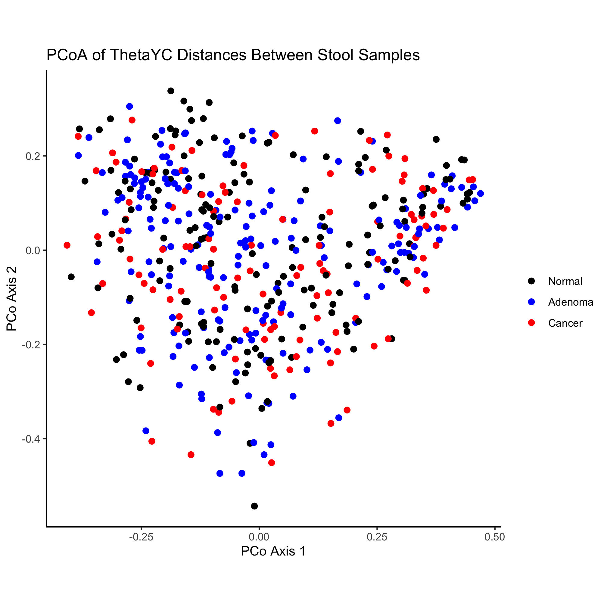
</div>

---

## Plotting associated data with line plots

Frequently we may have continuous data that was collected in a specific order. Usually order is dictated by time. We could use a scatterplot like we did for the ordination, but to indicate that the samples are linked, we would like to connect them with a line segment. This is what we'll call a line plot. If you have two samples from the same individual or site that perhaps represent a pre and post time point and you connect the points with a line, this is a special type of line plot called a slope plot. The key is that for some data we can connect observations with a line and that line indicates that the points are connected.

For better or worse, microbial ecologists are frequently obsessed with plotting rarefaction curves. These curves indicate how well one has sampled the most abundant sequences and can be used to make comparisons based on a common number of sequences. Rarefaction is really a tool for asking the question, "How many types of things would I have observed if I had only sampled N things?" We can then compare the number of types across samples where we collected different numbers of things. The file `baxter.rarefaction` contains the rarefied version of the data in the `baxter.shared` file, both of which are in the `raw_data` folder.

Go ahead and write the code to read the rarefaction file into a variable called `rarefy`. Using the approach from the first session, take a look at this file to get a sense of what it looks like.


```r
rarefy <- read_tsv(file="raw_data/baxter.rarefaction")
rarefy
```

```
## # A tibble: 4,790 x 1,471
##    numsampled `0.03-2003650` `lci-2003650` `hci-2003650` `0.03-2005650`
##         <dbl>          <dbl>         <dbl>         <dbl>          <dbl>
##  1          1            1               1             1            1  
##  2        100           43.9            39            52           43.2
##  3        200           59.7            54            69           61.2
##  4        300           70.3            64            78           73.6
##  5        400           78.6            70            85           83.0
##  6        500           85.4            75            94           91.0
##  7        600           92.2            84           100           98.4
##  8        700           97.6            89           106          105. 
##  9        800          102.             94           111          111. 
## 10        900          107.             99           118          117. 
## # … with 4,780 more rows, and 1,466 more variables: `lci-2005650` <dbl>,
## #   `hci-2005650` <dbl>, `0.03-2007660` <dbl>, `lci-2007660` <dbl>,
## #   `hci-2007660` <dbl>, `0.03-2009650` <dbl>, `lci-2009650` <dbl>,
## #   `hci-2009650` <dbl>, `0.03-2013660` <dbl>, `lci-2013660` <dbl>,
## #   `hci-2013660` <dbl>, `0.03-2015650` <dbl>, `lci-2015650` <dbl>,
## #   `hci-2015650` <dbl>, `0.03-2017660` <dbl>, `lci-2017660` <dbl>,
## #   `hci-2017660` <dbl>, `0.03-2019651` <dbl>, `lci-2019651` <dbl>,
## #   `hci-2019651` <dbl>, `0.03-2023680` <dbl>, `lci-2023680` <dbl>,
## #   `hci-2023680` <dbl>, `0.03-2025653` <dbl>, `lci-2025653` <dbl>,
## #   `hci-2025653` <dbl>, `0.03-2027653` <dbl>, `lci-2027653` <dbl>,
## #   `hci-2027653` <dbl>, `0.03-2029650` <dbl>, `lci-2029650` <dbl>,
## #   `hci-2029650` <dbl>, `0.03-2031650` <dbl>, `lci-2031650` <dbl>,
## #   `hci-2031650` <dbl>, `0.03-2033650` <dbl>, `lci-2033650` <dbl>,
## #   `hci-2033650` <dbl>, `0.03-2035650` <dbl>, `lci-2035650` <dbl>,
## #   `hci-2035650` <dbl>, `0.03-2037653` <dbl>, `lci-2037653` <dbl>,
## #   `hci-2037653` <dbl>, `0.03-2039650` <dbl>, `lci-2039650` <dbl>,
## #   `hci-2039650` <dbl>, `0.03-2041650` <dbl>, `lci-2041650` <dbl>,
## #   `hci-2041650` <dbl>, `0.03-2043650` <dbl>, `lci-2043650` <dbl>,
## #   `hci-2043650` <dbl>, `0.03-2045653` <dbl>, `lci-2045653` <dbl>,
## #   `hci-2045653` <dbl>, `0.03-2049653` <dbl>, `lci-2049653` <dbl>,
## #   `hci-2049653` <dbl>, `0.03-2051660` <dbl>, `lci-2051660` <dbl>,
## #   `hci-2051660` <dbl>, `0.03-2055690` <dbl>, `lci-2055690` <dbl>,
## #   `hci-2055690` <dbl>, `0.03-2057650` <dbl>, `lci-2057650` <dbl>,
## #   `hci-2057650` <dbl>, `0.03-2059653` <dbl>, `lci-2059653` <dbl>,
## #   `hci-2059653` <dbl>, `0.03-2061650` <dbl>, `lci-2061650` <dbl>,
## #   `hci-2061650` <dbl>, `0.03-2063650` <dbl>, `lci-2063650` <dbl>,
## #   `hci-2063650` <dbl>, `0.03-2065651` <dbl>, `lci-2065651` <dbl>,
## #   `hci-2065651` <dbl>, `0.03-2067650` <dbl>, `lci-2067650` <dbl>,
## #   `hci-2067650` <dbl>, `0.03-2071650` <dbl>, `lci-2071650` <dbl>,
## #   `hci-2071650` <dbl>, `0.03-2073650` <dbl>, `lci-2073650` <dbl>,
## #   `hci-2073650` <dbl>, `0.03-2075650` <dbl>, `lci-2075650` <dbl>,
## #   `hci-2075650` <dbl>, `0.03-2077653` <dbl>, `lci-2077653` <dbl>,
## #   `hci-2077653` <dbl>, `0.03-2081660` <dbl>, `lci-2081660` <dbl>,
## #   `hci-2081660` <dbl>, `0.03-2083650` <dbl>, `lci-2083650` <dbl>, …
```

If you look at the contents of `rarefy`, you'll see that it looks pretty ugly. The first column, `numsampled` has the number of sequences that have been sampled and it goes from 1 to 430213 in 100 sequence steps. The columns are displayed in sets of threes. For example, `0.03-2003650 lci-2003650 hci-2003650`. The first column in the triplet is the average number of OTUs observed for that sample (e.g. `2003650`) at the specified number of sequences sampled by the value in the `numsampled` column. The second and third columns in the triplet represent the lower (`lci`) and higher (`hci`) confidence interval. We don't want to mess with the `lci` and `hci` columns. There's 980 of these columns that are cluttering the data frame and will be in the way in a few moments. We can't manually remove these columns using the `-` operator like we've seen before with the `select` function from the `dplyr` package. Can you remember another function from the `dplyr` package that we can use with `select`? Some options we might consider would be `contains` and `starts_with`. We can do


```r
rarefy <- read_tsv(file="raw_data/baxter.rarefaction") %>%
	select(-contains("lci-")) %>%
	select(-contains("hci-"))
```

or


```r
rarefy <- read_tsv(file="raw_data/baxter.rarefaction") %>%
	select(-contains("lci-"), -contains("hci-"))
```

Both of these work, it's a matter of how explicit you want to be with the steps in your analysis. Note that we used `-contains(...)`, which removes those columns that contain the offending columns. If you look at `rarefy`, you'll see that we now have all of the columns that start with `0.03`, which is what we want.


---

### Activity 3
Rewrite the previous code chunk to get the columns we want without using negative signs.


<input type="button" class="hideshow">
<div markdown="1" style="display:none;">
Note that if we do what seems obvious, then we will lose our "numsampled" column, which we need to know how many sequences have been sampled from each sample

```r
read_tsv(file="raw_data/baxter.rarefaction") %>%
	select(starts_with("0.03"))
```

We need to remember that "numsampled" column in our `select` function call


```r
read_tsv(file="raw_data/baxter.rarefaction") %>%
	select("numsampled", starts_with("0.03"))
```

```
## # A tibble: 4,790 x 491
##    numsampled `0.03-2003650` `0.03-2005650` `0.03-2007660` `0.03-2009650`
##         <dbl>          <dbl>          <dbl>          <dbl>          <dbl>
##  1          1            1              1              1              1  
##  2        100           43.9           43.2           40.8           47.3
##  3        200           59.7           61.2           59.2           68.7
##  4        300           70.3           73.6           71.8           82.9
##  5        400           78.6           83.0           82.2           94.2
##  6        500           85.4           91.0           90.4          104. 
##  7        600           92.2           98.4           97.6          113. 
##  8        700           97.6          105.           104.           120. 
##  9        800          102.           111.           110.           127. 
## 10        900          107.           117.           116.           134. 
## # … with 4,780 more rows, and 486 more variables: `0.03-2013660` <dbl>,
## #   `0.03-2015650` <dbl>, `0.03-2017660` <dbl>, `0.03-2019651` <dbl>,
## #   `0.03-2023680` <dbl>, `0.03-2025653` <dbl>, `0.03-2027653` <dbl>,
## #   `0.03-2029650` <dbl>, `0.03-2031650` <dbl>, `0.03-2033650` <dbl>,
## #   `0.03-2035650` <dbl>, `0.03-2037653` <dbl>, `0.03-2039650` <dbl>,
## #   `0.03-2041650` <dbl>, `0.03-2043650` <dbl>, `0.03-2045653` <dbl>,
## #   `0.03-2049653` <dbl>, `0.03-2051660` <dbl>, `0.03-2055690` <dbl>,
## #   `0.03-2057650` <dbl>, `0.03-2059653` <dbl>, `0.03-2061650` <dbl>,
## #   `0.03-2063650` <dbl>, `0.03-2065651` <dbl>, `0.03-2067650` <dbl>,
## #   `0.03-2071650` <dbl>, `0.03-2073650` <dbl>, `0.03-2075650` <dbl>,
## #   `0.03-2077653` <dbl>, `0.03-2081660` <dbl>, `0.03-2083650` <dbl>,
## #   `0.03-2085653` <dbl>, `0.03-2087650` <dbl>, `0.03-2093650` <dbl>,
## #   `0.03-2097653` <dbl>, `0.03-2103650` <dbl>, `0.03-2105652` <dbl>,
## #   `0.03-2107650` <dbl>, `0.03-2109653` <dbl>, `0.03-2113670` <dbl>,
## #   `0.03-2115650` <dbl>, `0.03-2117651` <dbl>, `0.03-2119650` <dbl>,
## #   `0.03-2123652` <dbl>, `0.03-2125650` <dbl>, `0.03-2127650` <dbl>,
## #   `0.03-2129660` <dbl>, `0.03-2131650` <dbl>, `0.03-2133650` <dbl>,
## #   `0.03-2137650` <dbl>, `0.03-2139650` <dbl>, `0.03-2143653` <dbl>,
## #   `0.03-2145660` <dbl>, `0.03-2147680` <dbl>, `0.03-2149650` <dbl>,
## #   `0.03-2151650` <dbl>, `0.03-2153660` <dbl>, `0.03-2155650` <dbl>,
## #   `0.03-2157660` <dbl>, `0.03-2159650` <dbl>, `0.03-2161653` <dbl>,
## #   `0.03-2163653` <dbl>, `0.03-2165652` <dbl>, `0.03-2167670` <dbl>,
## #   `0.03-2169653` <dbl>, `0.03-2171690` <dbl>, `0.03-2173650` <dbl>,
## #   `0.03-2177653` <dbl>, `0.03-2179650` <dbl>, `0.03-2181650` <dbl>,
## #   `0.03-2183650` <dbl>, `0.03-2185670` <dbl>, `0.03-2187680` <dbl>,
## #   `0.03-2189650` <dbl>, `0.03-2193650` <dbl>, `0.03-2195651` <dbl>,
## #   `0.03-2197670` <dbl>, `0.03-2199650` <dbl>, `0.03-2201650` <dbl>,
## #   `0.03-2203653` <dbl>, `0.03-2205670` <dbl>, `0.03-2207653` <dbl>,
## #   `0.03-2215650` <dbl>, `0.03-2219650` <dbl>, `0.03-2221650` <dbl>,
## #   `0.03-2223650` <dbl>, `0.03-2225650` <dbl>, `0.03-2227660` <dbl>,
## #   `0.03-2229653` <dbl>, `0.03-2231653` <dbl>, `0.03-2239650` <dbl>,
## #   `0.03-2241650` <dbl>, `0.03-2243651` <dbl>, `0.03-2253660` <dbl>,
## #   `0.03-2255653` <dbl>, `0.03-2257660` <dbl>, `0.03-2261650` <dbl>,
## #   `0.03-2265651` <dbl>, `0.03-2267653` <dbl>, `0.03-2271650` <dbl>, …
```
</div>

---

## Tidying data
We've made it all this way using various tools from the "tidyverse" without ever describing what the tidyverse is! "Tidy data" refers to the structure of a data frame where similar measurements are in the same column. For example, consider if we had the temperatures of various cities over time. We might be inclined to make a column for the date and then separate columns for each city. Then each row would contain the temperature for that date and city. This produces a wide-formatted data frame. This ends up being hard to work with. If you think about how we've been using `dplyr` and `ggplot` functions we want to apply their functions to columns. If we wanted to plot the temperature (or number of OTUs) by city, we would like to have a city column and a temperature column. Not a bunch of temperature columns for different cities. If you think about our `metadata` data frame it is tidy. Each column is distinct and measures a different thing about each person. Depending on the context, our `alpha` data frame could be considered to be non-tidy. We have numerous parameters (e.g. `shannon`, `invsimpson`, `sobs`, `coverage`) for each subject. If we wanted to compare those parameters to each other for each person, then we'd want them to be in the same column. Usually we wouldn't want to compare `shannon` to `invsimpson` data so it isn't a big deal. But we would want to compare Chicago to Nashville temperatures, so they should be in the same column. Similarly, we want to compare the rarefaction data for samples `2003650` and `2005650`. Within the tidyverse there is a `tidyr` package that has functions we will now use to make our `rarefy` data frame tidy.

Let's start with a simpler example than `rarefy`


```r
temps <- tibble(day=c(1,2,3), chicago=c(75, 77, 74), detroit=c(69, 71, 70), nashville=c(79,80,78))
```

We can make `temps` a tidy data frame by using the `pivot_longer` function from `tidyr`. To use this function, we need to tell `pivot_longer` which columns (`cols`) we want to gather together and the name for the new column containing the city name (i.e. `names_to`) and the name for the new column containing the temperatures (i.e. `values_to`)


```r
pivot_longer(temps, cols=c(chicago, detroit, nashville), names_to='city', values_to='temperatures')
```

```
## # A tibble: 9 x 3
##     day city      temperatures
##   <dbl> <chr>            <dbl>
## 1     1 chicago             75
## 2     1 detroit             69
## 3     1 nashville           79
## 4     2 chicago             77
## 5     2 detroit             71
## 6     2 nashville           80
## 7     3 chicago             74
## 8     3 detroit             70
## 9     3 nashville           78
```

Note that if we had a bunch of cities, it would be a pain to write them all out. We could use the helper functions that we used with `select`. Alternatively, if there's only one other column (e.g. "day" or "numsampled"), you could use the `-` to tell `pivot_longer` to ignore that columns


```r
pivot_longer(temps, cols=c(-day), names_to='city', values_to='temperatures')
```

```
## # A tibble: 9 x 3
##     day city      temperatures
##   <dbl> <chr>            <dbl>
## 1     1 chicago             75
## 2     1 detroit             69
## 3     1 nashville           79
## 4     2 chicago             77
## 5     2 detroit             71
## 6     2 nashville           80
## 7     3 chicago             74
## 8     3 detroit             70
## 9     3 nashville           78
```

Let's apply this to our rarefaction data


```r
rarefy <- read_tsv(file="raw_data/baxter.rarefaction") %>%
	select(-contains("lci-"), -contains("hci-")) %>%
	pivot_longer(cols=c(-numsampled), names_to='sample', values_to='sobs')
```

Our `rarefy` data frame now has 2347100 rows and three columns. It has gone from being really wide to being skinny and really long. As we'll see in the next section, it is now much easier to do a join between `rarefy` and `metadata` than it would have been with the samples across the columns.


---

### Activity 4
Use the `pivot_longer` function with our `alpha` data frame to gather together the `sobs`, `shannon`, `invsimpson`, and `coverage` columns. The key column should be called "metric" and the value column should be called "value".

<input type="button" class="hideshow">
<div markdown="1" style="display:none;">

```r
alpha <- read_tsv(file="raw_data/baxter.groups.ave-std.summary",
		col_types=cols(group = col_character())) %>%
	filter(method=='ave') %>%
	select(group, sobs, shannon, invsimpson, coverage) %>%
	pivot_longer(cols=c(-group), names_to="metric", values_to="value")
```
</div>

---

## Cleaning up our sample names
What we want to be able to do is connect our sample identifiers in the column names of `rarefy` with the sample identifiers in `metadata`. The names in the "sample" column aren't quite where they need to be. We need to remove the `0.03-` from each identifier. R has several options for manipulating strings. Basically, we want to use one of those functions that will do a find all/replace all operation for us. There are two options: `gsub` and `str_replace_all`. The former is part of the base R package while the latter is part of `tidyr`. They do the same thing, but `str_replace_all` is a bit preferable since it's more readable. Let's try it out...


```r
str_replace_all(string="0.03-2003650", pattern="0.03-", replacement="")
```

```
## [1] "2003650"
```

That's exactly what we want, but distributed across the entire column. In later lessons we'll see how we can use more sophisticated `pattern` and `replacement` values to do more powerful searches. Let's go ahead and apply `str_replace_all` to our `rarefy` data frame so we can get to our line plots.


```r
rarefy <- read_tsv(file="raw_data/baxter.rarefaction") %>%
	select(-contains("lci-"), -contains("hci-")) %>%
	pivot_longer(cols=c(-numsampled), names_to='sample', values_to='sobs') %>%
	mutate(sample=str_replace_all(sample, pattern="0.03-", replacement=""))
```

One thing that you may remember from looking at rarefy when it was a wide data frame was that there were a lot of `NA` values in the data frame. This is because one sample may have had 10000 reads, but another sample only had 9000 reads. For the second sample, the number of OTUs between 9000 and 1000 reads would be an `NA` since the data were missing. We can remove these `NA` values by using the `drop_na` function from the `tidyr` package


```r
rarefy <- read_tsv(file="raw_data/baxter.rarefaction") %>%
	select(-contains("lci-"), -contains("hci-")) %>%
	pivot_longer(cols=c(-numsampled), names_to='sample', values_to='sobs') %>%
	mutate(sample=str_replace_all(sample, pattern="0.03-", replacement="")) %>%
	drop_na()
```

Now the rarefy data frame "only" has 140,797 rows. We are now ready for our `inner_join` to connect the `rarefy` and `metadata` data frames


```r
source('code/baxter.R')
metadata <- get_metadata()
metadata_rarefy <- inner_join(metadata, rarefy)
```

If we were interested in plotting the rarefaction curves and coloring them by diagnosis of the person the sample came from, we could use `select` to get the "sample" and "dianosis" columns from `metadata` before joining. This would make the data frame much smaller. It isn't that big, so we'll stick with what we've got.

---

### Activity 5
Create a new data frame called `roman_metadata` where the numbers in the "stage" column of metadata is represented as a roman numeral. This will require multiple lines of code.

<input type="button" class="hideshow">
<div markdown="1" style="display:none;">
There are probably easier ways of doing this (e.g. `case_when`), but this also works


```r
roman_metadata <- metadata %>%
			mutate(stage=str_replace_all(stage, pattern="1", replacement="I")) %>%
			mutate(stage=str_replace_all(stage, pattern="2", replacement="II")) %>%
			mutate(stage=str_replace_all(stage, pattern="3", replacement="III")) %>%
			mutate(stage=str_replace_all(stage, pattern="4", replacement="IV"))
roman_metadata %>% count(stage)
```

```
## # A tibble: 5 x 2
##   stage     n
##   <chr> <int>
## 1 0       370
## 2 I        39
## 3 II       35
## 4 III      36
## 5 IV       10
```
</div>

---


## Plotting rarefaction curves
At this point you've probably seen enough of the ggplot syntax to anticipate what we're going to do. Insted of `geom_point` or `geom_jitter`, we're going to use `geom_line`


```r
ggplot(metadata_rarefy, aes(x=numsampled, y=sobs)) +
	geom_line()
```

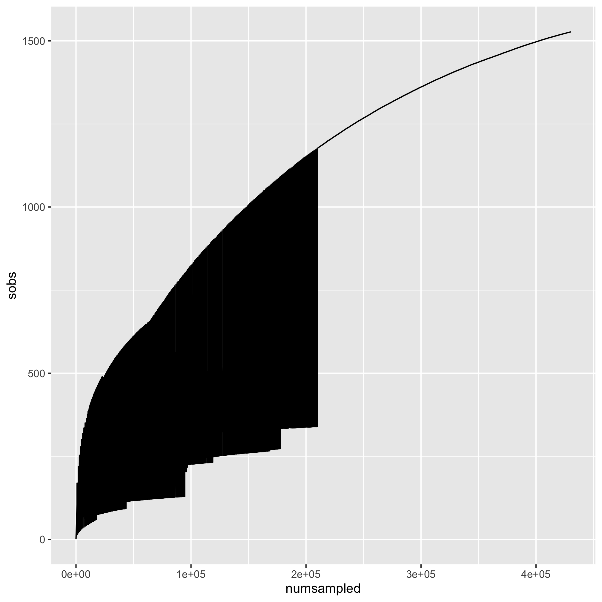

Whoa. That my friends is what we call [#accidentalaRt](https://twitter.com/search?q=rstats%20accidentalart&src=typd). It appears that the points were all connected by a single line. We want separate lines for each sample. Looking at the aesthetics that we can use with `geom_line`, we see that there is a `group` option. We want to use that to group our samples by `sample`.


```r
ggplot(metadata_rarefy, aes(x=numsampled, y=sobs, group=sample)) +
	geom_line()
```

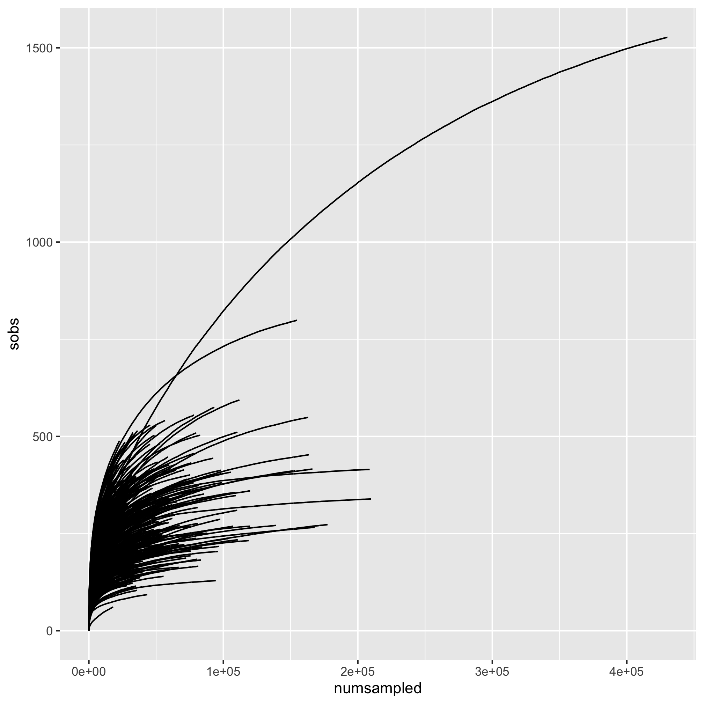

That's more like it! Let's map the `diagnosis` to the `color` aesthetic so our lines are colored by the subjects' diagnosis group.


```r
ggplot(metadata_rarefy, aes(x=numsampled, y=sobs, group=sample, color=diagnosis)) +
	geom_line()
```

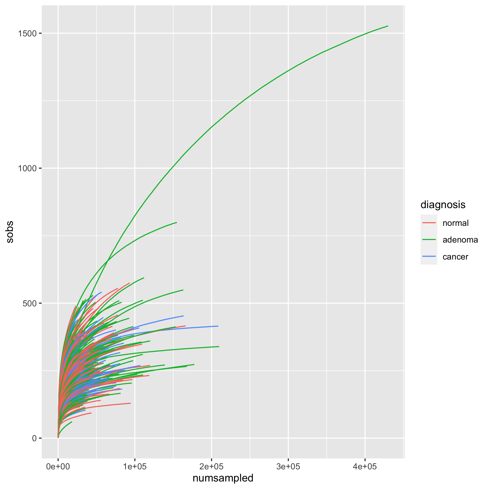

To keep our coloring scheme consistent, let's add our `scale_color_manual` function. While we're at it, let's add our titling and theme.


```r
ggplot(metadata_rarefy, aes(x=numsampled, y=sobs, group=sample, color=diagnosis)) +
	geom_line() +
	scale_color_manual(name=NULL,
		values=c("black", "blue", "red"),
		breaks=c("normal", "adenoma", "cancer"),
		labels=c("Normal", "Adenoma", "Cancer")) +
	labs(title="Rarefaction curves are pretty pointless at this scale",
		x="Number of Sequences Sampled per Subject",
		y="Number of OTUs per Subject") +
	theme_classic()
```

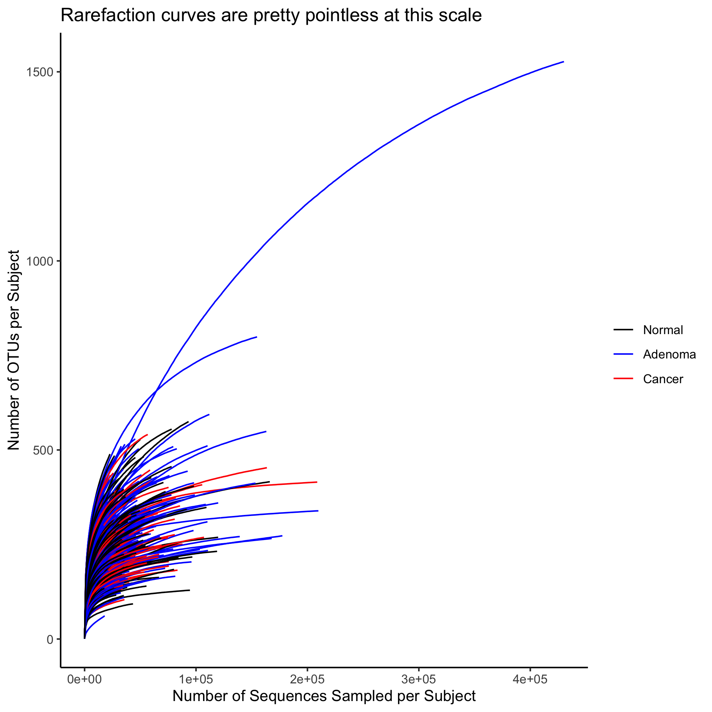

One thing we might notice is that most of the action is occurring inside of 20,000 sequences sampled. We'd like to zoom in on the x and y-axes. Recall that we can do this with the `coord_cartesian` function.


```r
ggplot(metadata_rarefy, aes(x=numsampled, y=sobs, group=sample, color=diagnosis)) +
	geom_line() +
	scale_color_manual(name=NULL,
		values=c("black", "blue", "red"),
		breaks=c("normal", "adenoma", "cancer"),
		labels=c("Normal", "Adenoma", "Cancer")) +
	coord_cartesian(xlim=c(0,20000), ylim=c(0,500)) +
	labs(title="Rarefaction curves are pretty pointless at this scale",
		x="Number of Sequences Sampled per Subject",
		y="Number of OTUs per Subject") +
	theme_classic()
```

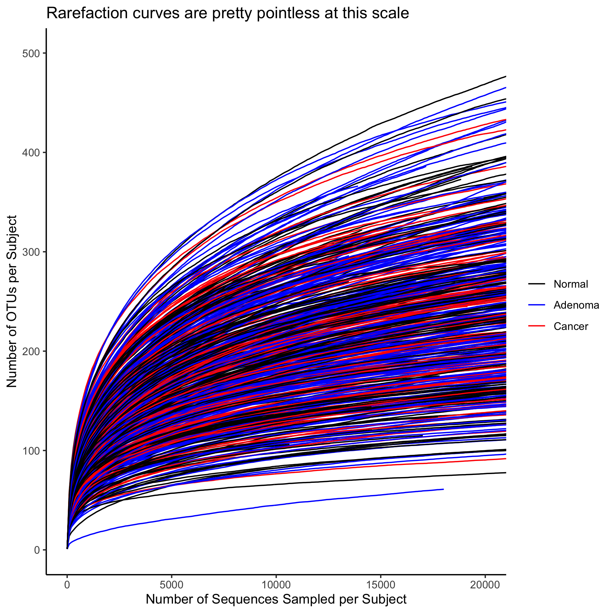

This plot is a bit much. There are way too many lines. To illustrate some other features of `geom_line`, let's reduce the number of samples. We can do this with the `sample_n` or `sample_frac` functions from the `dplyr` package.


```r
set.seed(1) #this makes sure that we all get the same result!
metadata_rarefy_sample <- metadata %>%
	sample_n(10) %>%
	inner_join(., rarefy)

ggplot(metadata_rarefy_sample, aes(x=numsampled, y=sobs, group=sample, color=diagnosis)) +
		geom_line() +
		scale_color_manual(name=NULL,
			values=c("black", "blue", "red"),
			breaks=c("normal", "adenoma", "cancer"),
			labels=c("Normal", "Adenoma", "Cancer")) +
		coord_cartesian(xlim=c(0,20000), ylim=c(0,500)) +
		labs(title="Rarefaction curves are pretty pointless at this scale",
			x="Number of Sequences Sampled per Subject",
			y="Number of OTUs per Subject") +
		theme_classic()
```

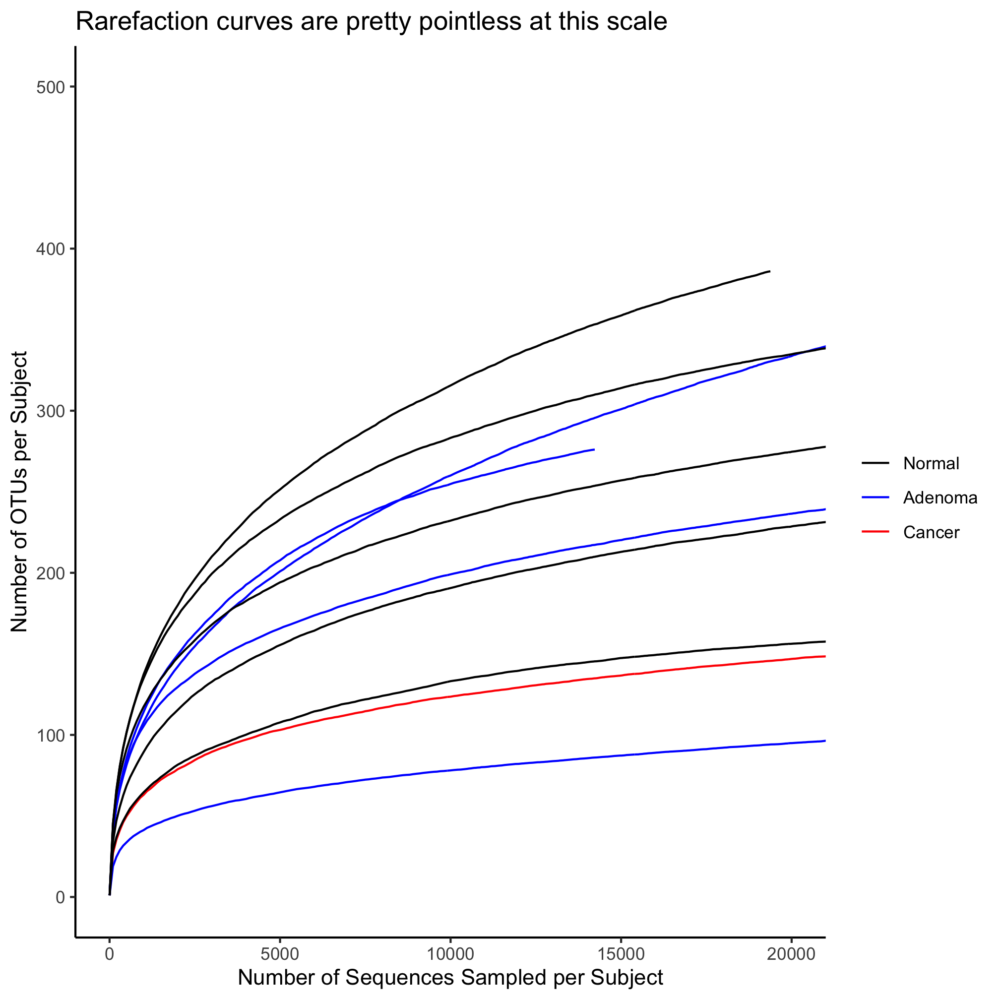


Here we have solid lines. What if we want to have some hashing to the lines or want to change their width? Let's start with the hashing, which is controlled by the `linetype` aesthetic


```r
ggplot(metadata_rarefy_sample, aes(x=numsampled, y=sobs, group=sample, color=diagnosis)) +
		geom_line(linetype=5) +
		scale_color_manual(name=NULL,
			values=c("black", "blue", "red"),
			breaks=c("normal", "adenoma", "cancer"),
			labels=c("Normal", "Adenoma", "Cancer")) +
		coord_cartesian(xlim=c(0,20000), ylim=c(0,500)) +
		labs(title="Rarefaction curves are pretty pointless at this scale",
			x="Number of Sequences Sampled per Subject",
			y="Number of OTUs per Subject") +
		theme_classic()
```

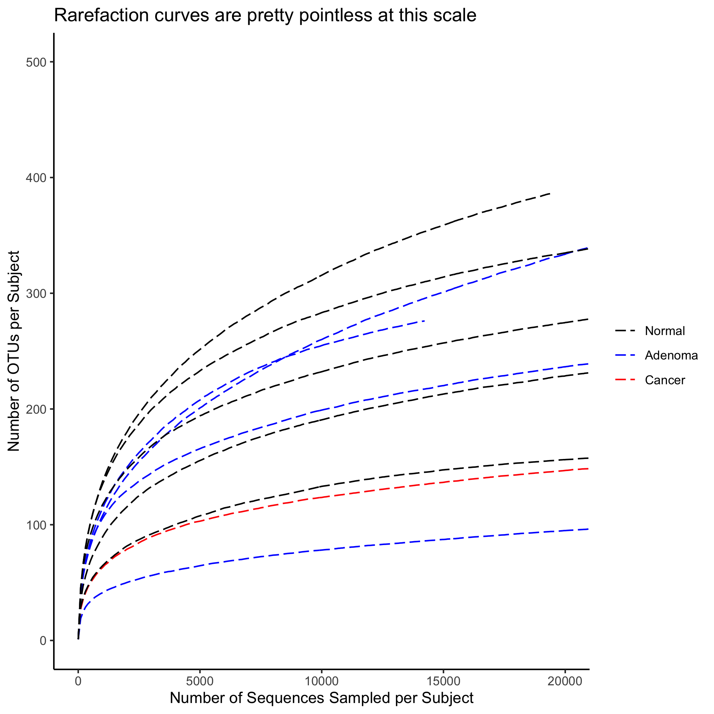

There are six different `linetype`s that you can set with a number from 1 to 6.


---

### Activity 6
Map the diagnosis value for each subject on to the line type. Make sure that you only have one legend.


<input type="button" class="hideshow">
<div markdown="1" style="display:none;">

```r
ggplot(metadata_rarefy_sample, aes(x=numsampled, y=sobs, group=sample, color=diagnosis, linetype=diagnosis)) +
		geom_line() +
		scale_color_manual(name=NULL,
			values=c("black", "blue", "red"),
			breaks=c("normal", "adenoma", "cancer"),
			labels=c("Normal", "Adenoma", "Cancer")) +
		scale_linetype_manual(name=NULL,
			values=c(1, 5, 6),
			breaks=c("normal", "adenoma", "cancer"),
			labels=c("Normal", "Adenoma", "Cancer")) +
		coord_cartesian(xlim=c(0,20000), ylim=c(0,500)) +
		labs(title="Rarefaction curves are pretty pointless at this scale",
			x="Number of Sequences Sampled per Subject",
			y="Number of OTUs per Subject") +
		theme_classic()
```

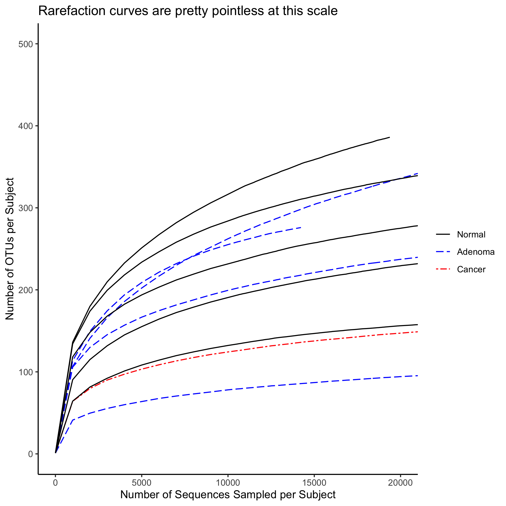
</div>

---

### Activity 7
Map the diagnosis value for each subject onto color and their sex to the line type.

<input type="button" class="hideshow">
<div markdown="1" style="display:none;">

```r
ggplot(metadata_rarefy_sample, aes(x=numsampled, y=sobs, group=sample, color=diagnosis, linetype=sex)) +
		geom_line() +
		scale_color_manual(name=NULL,
			values=c("black", "blue", "red"),
			breaks=c("normal", "adenoma", "cancer"),
			labels=c("Normal", "Adenoma", "Cancer")) +
		scale_linetype_manual(name=NULL,
			values=c(2, 6),
			breaks=c("female", "male"),
			labels=c("Female", "Male")) +
		coord_cartesian(xlim=c(0,20000), ylim=c(0,500)) +
		labs(title="Rarefaction curves are pretty pointless at this scale",
			x="Number of Sequences Sampled per Subject",
			y="Number of OTUs per Subject") +
		theme_classic()
```

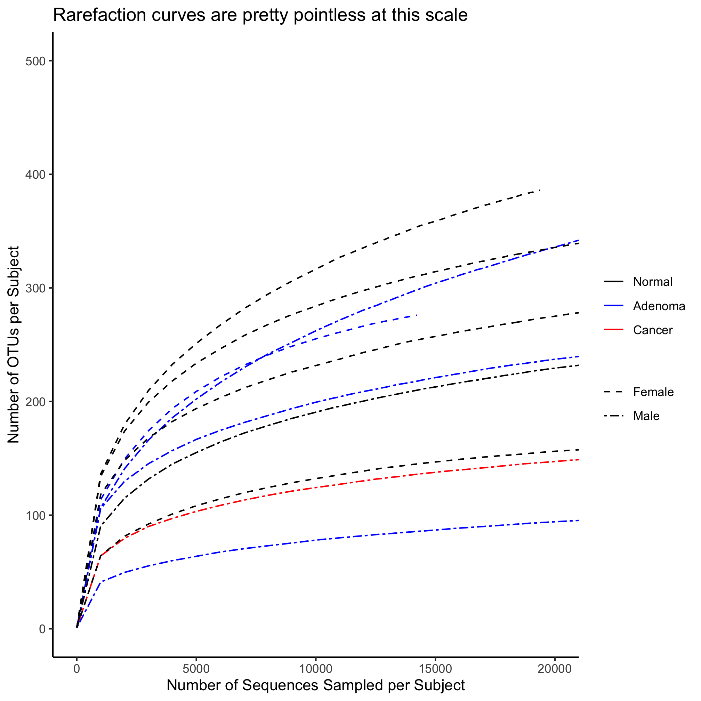
</div>

---

### Activity 8
Map the diagnosis value for each subject onto color and their sex to shape of the plotting symbol.

<input type="button" class="hideshow">
<div markdown="1" style="display:none;">

```r
ggplot(metadata_rarefy_sample, aes(x=numsampled, y=sobs, group=sample, color=diagnosis, shape=sex)) +
		geom_line() +
		geom_point() +
		scale_color_manual(name=NULL,
			values=c("black", "blue", "red"),
			breaks=c("normal", "adenoma", "cancer"),
			labels=c("Normal", "Adenoma", "Cancer")) +
		scale_shape_manual(name=NULL,
			values=c(19, 1),
			breaks=c("female", "male"),
			labels=c("Female", "Male")) +
		coord_cartesian(xlim=c(0,20000), ylim=c(0,500)) +
		labs(title="Rarefaction curves are pretty pointless at this scale",
			x="Number of Sequences Sampled per Subject",
			y="Number of OTUs per Subject") +
		theme_classic()
```


You'll notice some clumping in the points along the lines. This occurs because if a sample got to 9331 sequences, then mothur outputted the data for all of the samples at 9331 sequences. We could change the output to make sure that the data outputted every 1000 or 5000 or whatever sequences by making a second data frame to use with the `geom_line` function.


```r
metadata_rarefy_sample_dots <- metadata_rarefy_sample %>% filter(numsampled %% 1000 == 0)

ggplot(metadata_rarefy_sample, aes(x=numsampled, y=sobs, group=sample, color=diagnosis)) +
		geom_line() +
		geom_point(data=metadata_rarefy_sample_dots, aes(x=numsampled, y=sobs, group=sample, color=diagnosis, shape=sex)) +
		scale_color_manual(name=NULL,
			values=c("black", "blue", "red"),
			breaks=c("normal", "adenoma", "cancer"),
			labels=c("Normal", "Adenoma", "Cancer")) +
		scale_shape_manual(name=NULL,
			values=c(19, 1),
			breaks=c("female", "male"),
			labels=c("Female", "Male")) +
		coord_cartesian(xlim=c(0,20000), ylim=c(0,500)) +
		labs(title="Rarefaction curves are pretty pointless at this scale",
			x="Number of Sequences Sampled per Subject",
			y="Number of OTUs per Subject") +
		theme_classic()
```

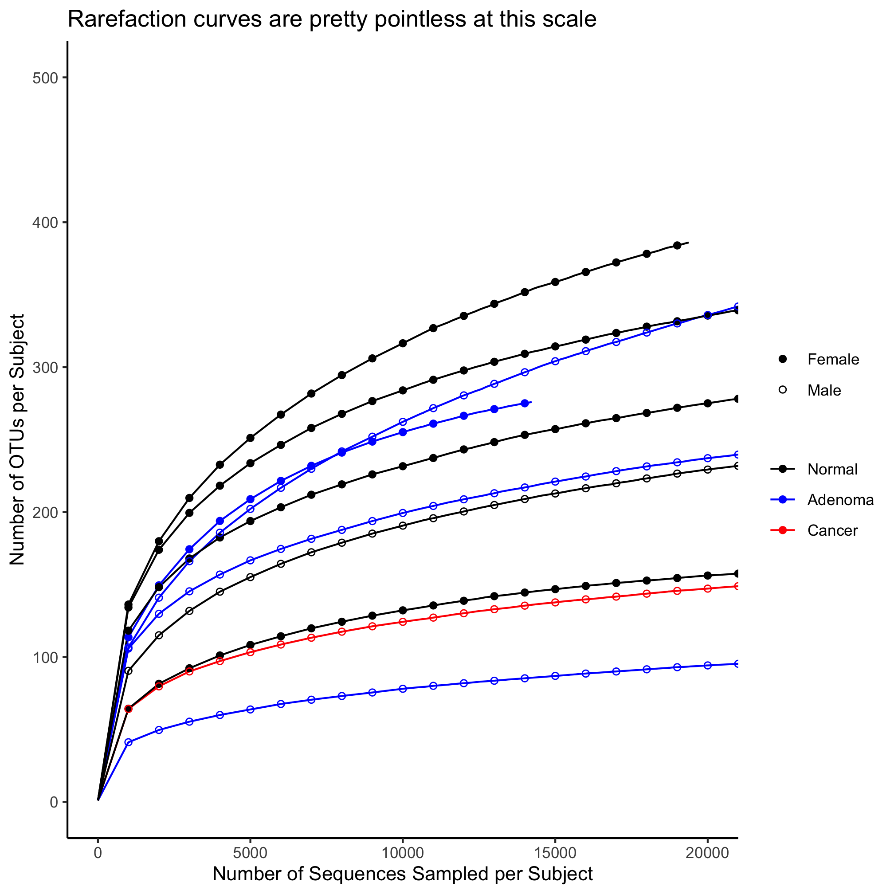

The `%%` function is the modulus operator, which returns the remainder of dividing one number by another. If you do `233 %% 100` the value would be `33`. If you did `2000 %% 1000`, the remainder would be `0`.
</div>

---

## Using lines to annotate a plot

In the original study, we rarefied all of our data to 10,530 sequences per sample. We would like to have a vertical line that crosses the x-axis at 10,530 to indicate the number of OTUs that were observed at that threshold. Let's return to our simple line plot. We will add a vertical line using the `geom_vline` function.


```r
ggplot(metadata_rarefy_sample, aes(x=numsampled, y=sobs, group=sample, color=diagnosis)) +
		geom_line() +
		geom_vline(xintercept=10530) +
		scale_color_manual(name=NULL,
			values=c("black", "blue", "red"),
			breaks=c("normal", "adenoma", "cancer"),
			labels=c("Normal", "Adenoma", "Cancer")) +
		coord_cartesian(xlim=c(0,20000), ylim=c(0,500)) +
		labs(title="Rarefaction curves are pretty pointless at this scale",
			x="Number of Sequences Sampled per Subject",
			y="Number of OTUs per Subject") +
		theme_classic()
```

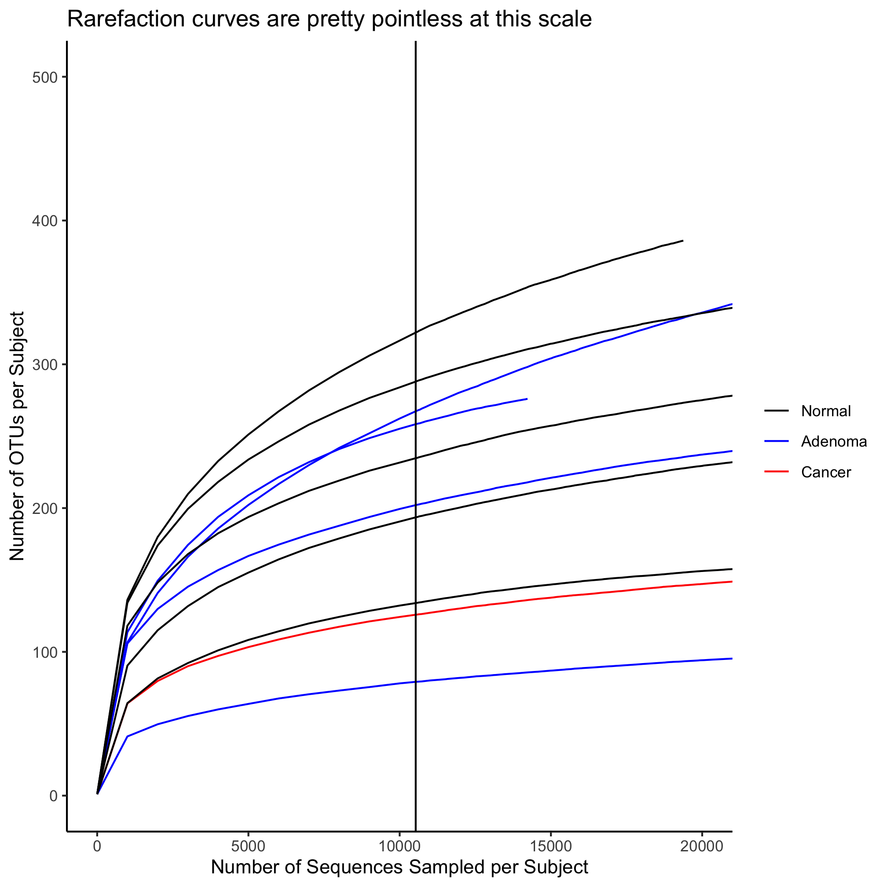

As with `geom_line`, we can change the line type, color, and width. Let's make the line a bit thicker and have it be gray. To put the vertical line behind the curves, we will call `geom_vline` before `geom_line`


```r
ggplot(metadata_rarefy_sample, aes(x=numsampled, y=sobs, group=sample, color=diagnosis)) +
		geom_vline(xintercept=10530, color="gray", size=2) +
		geom_line() +
		scale_color_manual(name=NULL,
			values=c("black", "blue", "red"),
			breaks=c("normal", "adenoma", "cancer"),
			labels=c("Normal", "Adenoma", "Cancer")) +
		coord_cartesian(xlim=c(0,20000), ylim=c(0,500)) +
		labs(title="Rarefaction curves are pretty pointless at this scale",
			x="Number of Sequences Sampled per Subject",
			y="Number of OTUs per Subject") +
		theme_classic()
```


You might have seen this coming, but if you want a horizontal line, you would use `geom_hline` with the `yintercept` attribute.


```r
ggplot(metadata_rarefy_sample, aes(x=numsampled, y=sobs, group=sample, color=diagnosis)) +
		geom_hline(yintercept=200, color="gray", size=2) +
		geom_line() +
		scale_color_manual(name=NULL,
			values=c("black", "blue", "red"),
			breaks=c("normal", "adenoma", "cancer"),
			labels=c("Normal", "Adenoma", "Cancer")) +
		coord_cartesian(xlim=c(0,20000), ylim=c(0,500)) +
		labs(title="Rarefaction curves are pretty pointless at this scale",
			x="Number of Sequences Sampled per Subject",
			y="Number of OTUs per Subject") +
		theme_classic()
```

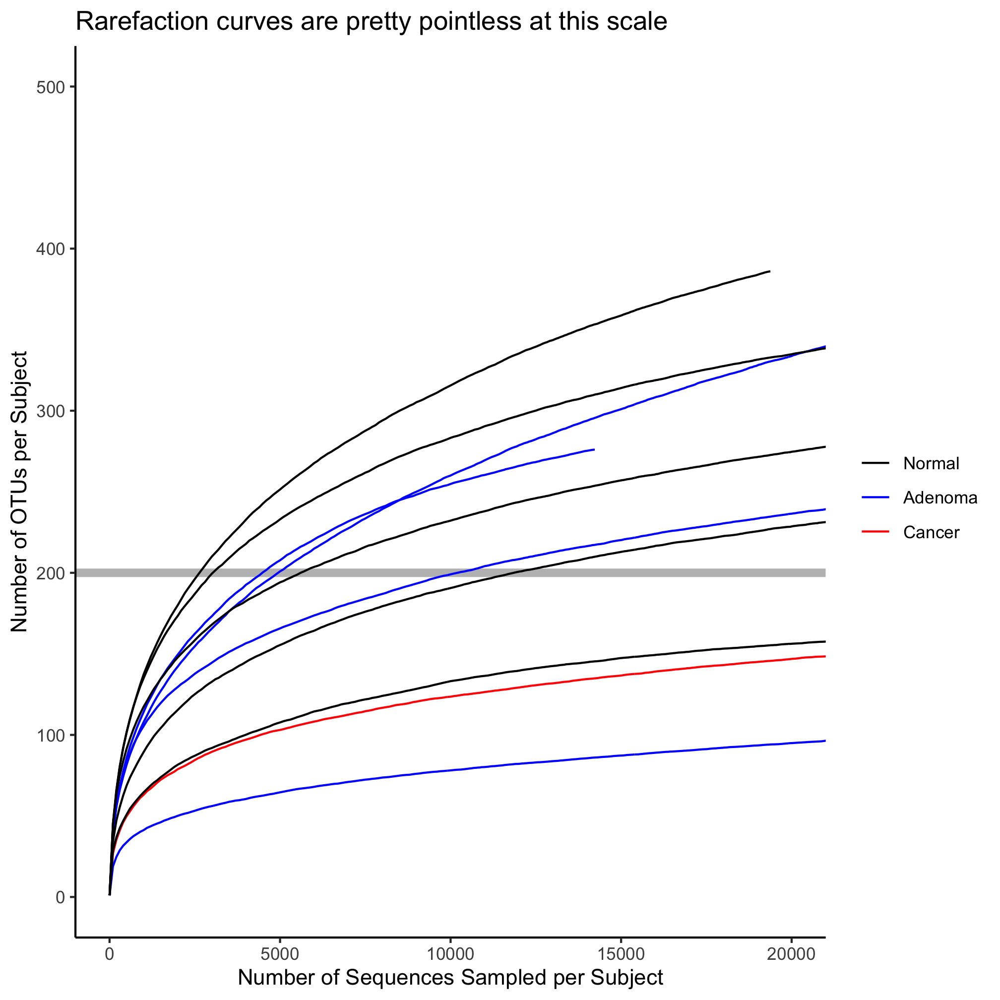

A third type of line that doesn't exactly fit with rarefaction data is `geom_abline` or a straight line with a defined y-intercept and slope


```r
ggplot(metadata_rarefy_sample, aes(x=numsampled, y=sobs, group=sample, color=diagnosis)) +
		geom_abline(intercept=150, slope=0.005, color="gray", size=2) +
		geom_line() +
		scale_color_manual(name=NULL,
			values=c("black", "blue", "red"),
			breaks=c("normal", "adenoma", "cancer"),
			labels=c("Normal", "Adenoma", "Cancer")) +
		coord_cartesian(xlim=c(0,20000), ylim=c(0,500)) +
		labs(title="Rarefaction curves are pretty pointless at this scale",
			x="Number of Sequences Sampled per Subject",
			y="Number of OTUs per Subject") +
		theme_classic()
```

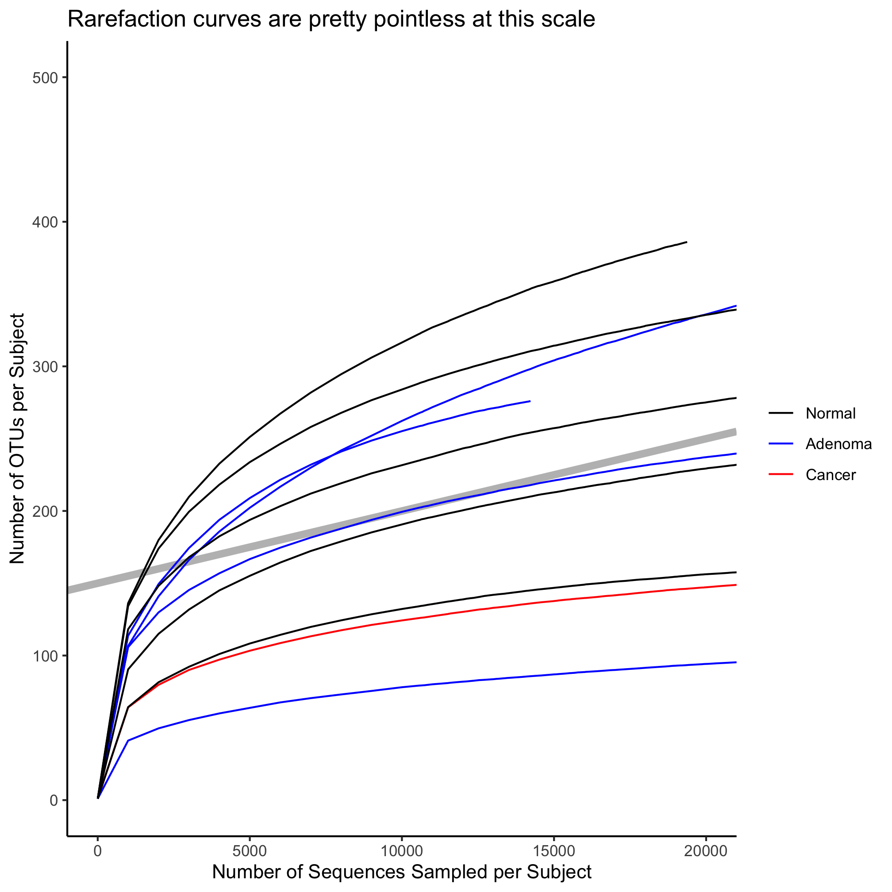

---

### Activity 9
Create a scatter plot with the subjects' FIT result on the x-axis and the Shannon diversity index on the y-axis. Color the points by diagnosis group and draw a vertical line to cross the x-axis at 100.

<input type="button" class="hideshow">
<div markdown="1" style="display:none;">

```r
source("code/baxter.R")
metadata <- get_metadata()

alpha <- read_tsv(file="raw_data/baxter.groups.ave-std.summary",
		col_types=cols(group = col_character())) %>%
	filter(method=='ave') %>%
	select(group, sobs, shannon, invsimpson, coverage)

meta_alpha <- inner_join(metadata, alpha, by=c('sample'='group'))

ggplot(meta_alpha, aes(x=fit_result, y=shannon, color=diagnosis)) +
	geom_vline(xintercept=100, color="gray") +
	geom_point(size=2) +
	scale_color_manual(name=NULL,
		values=c("black", "blue", "red"),
		breaks=c("normal", "adenoma", "cancer"),
		labels=c("Normal", "Adenoma", "Cancer")) +
	labs(title="No apparent relationship between Shannon diversity index and FIT result",
		subtitle="Vertical line indicates the clinical screening threshold of 100",
		x="FIT Result",
		y="Shannon Diversity Index") +
	theme_classic()
```

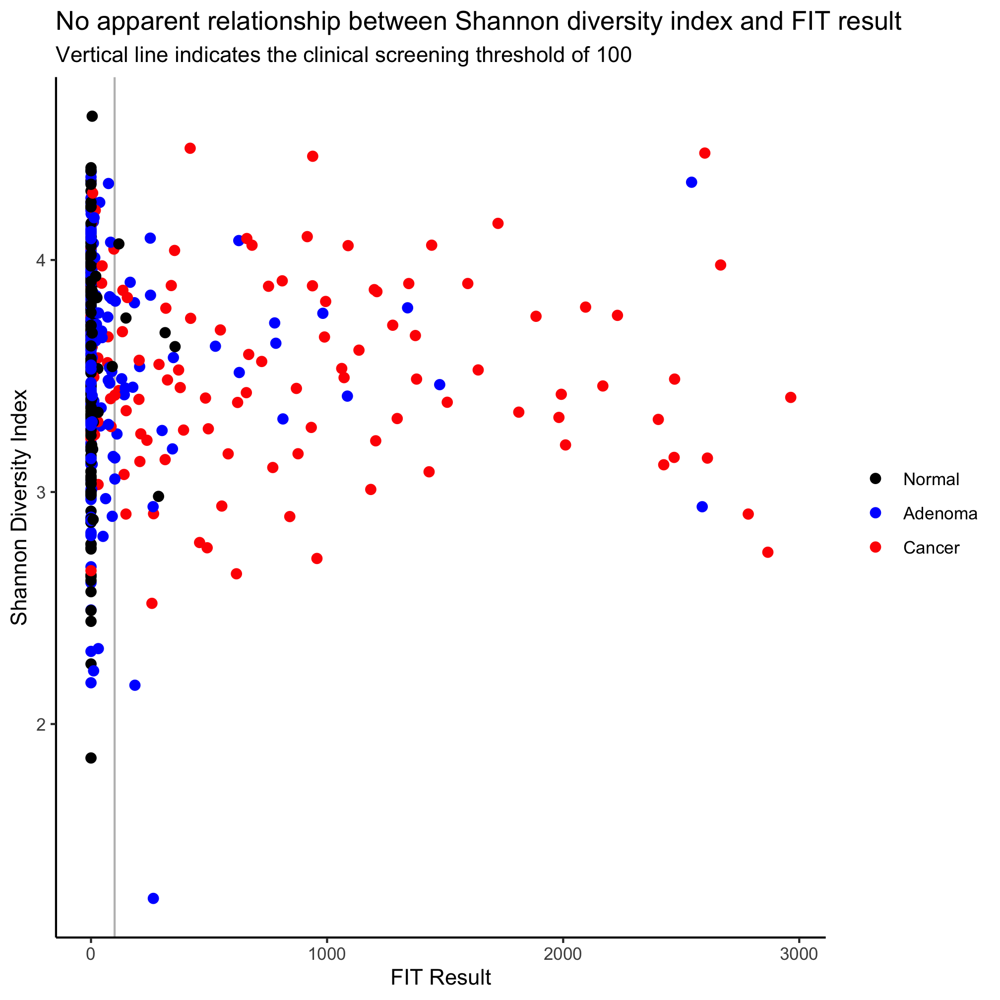
</div>

---

### Activity 10
Create a file in `code/` that is called `plot_rarefaction_curves.R` that contains the code needed to generate the 490 rarefaction curves colored by diagnosis. Draw a vertical gray line behind the curves to indicate where the 10,530 sequence threshold was. Restart R and run `source("code/plot_rarefaction_curves.R")` to make sure it runs as intended.

<input type="button" class="hideshow">
<div markdown="1" style="display:none;">


```r

source("code/baxter.R")
metadata <- get_metadata()

rarefy <- read_tsv(file="raw_data/baxter.rarefaction") %>%
	select(-contains("lci-"), -contains("hci-")) %>%
	pivot_longer(cols=c(-numsampled), names_to="sample", values_to="sobs") %>%
	mutate(sample=str_replace_all(sample, pattern="0.03-", replacement="")) %>%
	drop_na()

metadata_rarefy <- inner_join(metadata, rarefy)

ggplot(metadata_rarefy, aes(x=numsampled, y=sobs, group=sample, color=diagnosis)) +
	geom_vline(xintercept=10530, color="gray", size=2) +
	geom_line() +
	scale_color_manual(name=NULL,
		values=c("black", "blue", "red"),
		breaks=c("normal", "adenoma", "cancer"),
		labels=c("Normal", "Adenoma", "Cancer")) +
	coord_cartesian(xlim=c(0,20000), ylim=c(0,500)) +
	labs(title="Rarefaction curves are pretty pointless at this scale",
		subtitle="Vertical line indicates the number of sequences that samples were rarefied to",
		x="Number of Sequences Sampled per Subject",
		y="Number of OTUs per Subject") +
	theme_classic()
ggsave("figures/rarefaction.pdf")

```

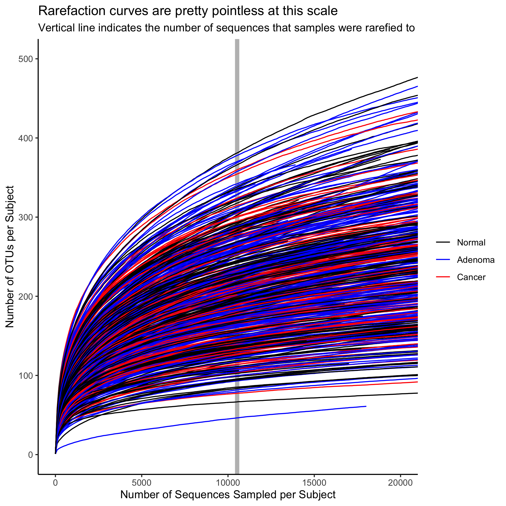

<div>


