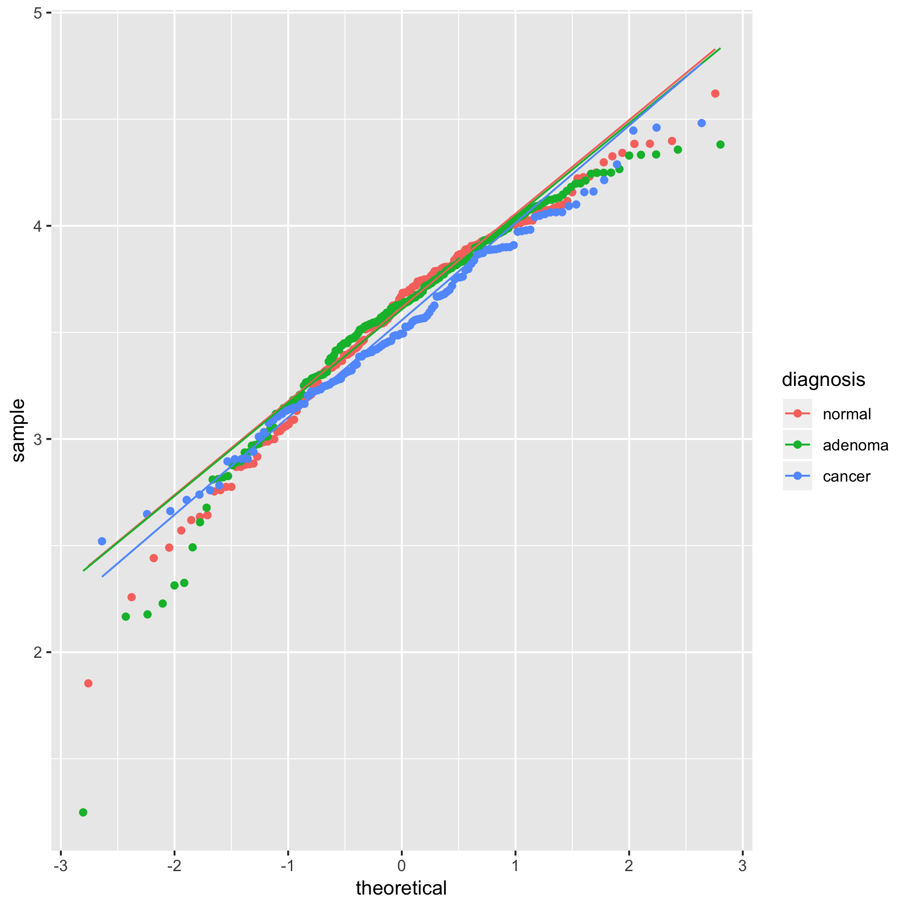
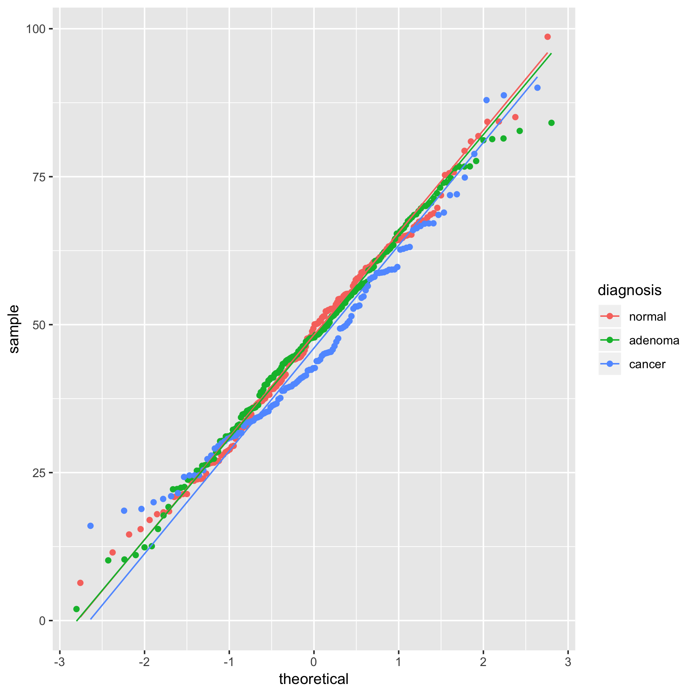
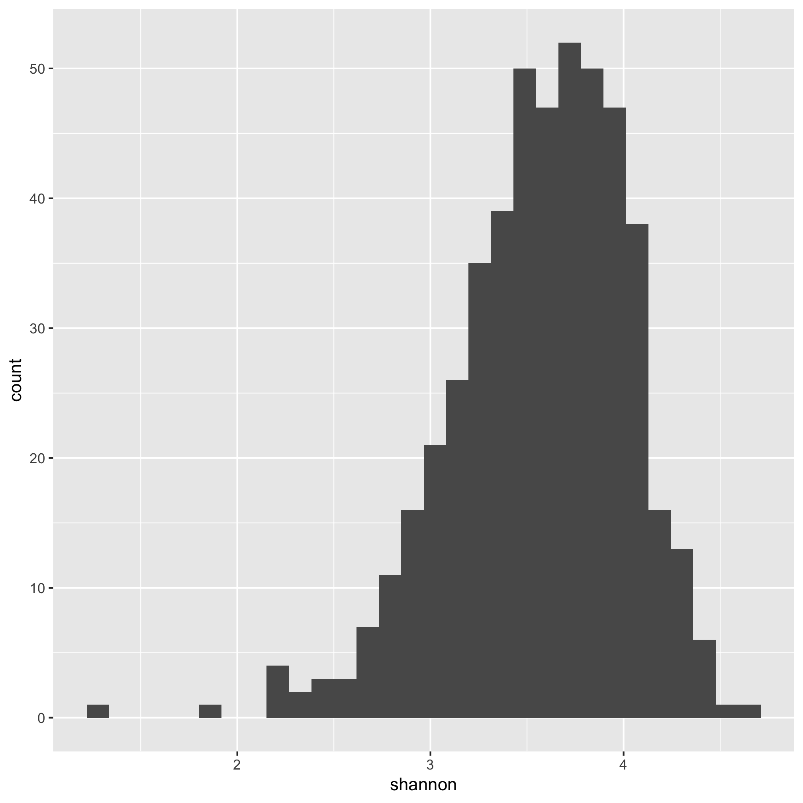
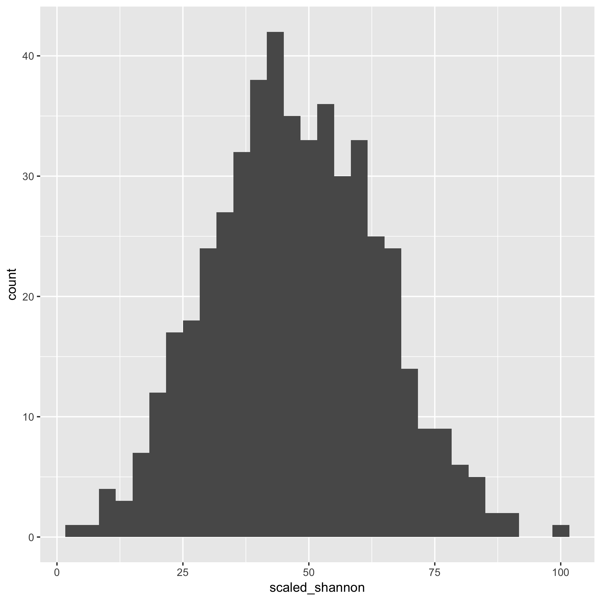
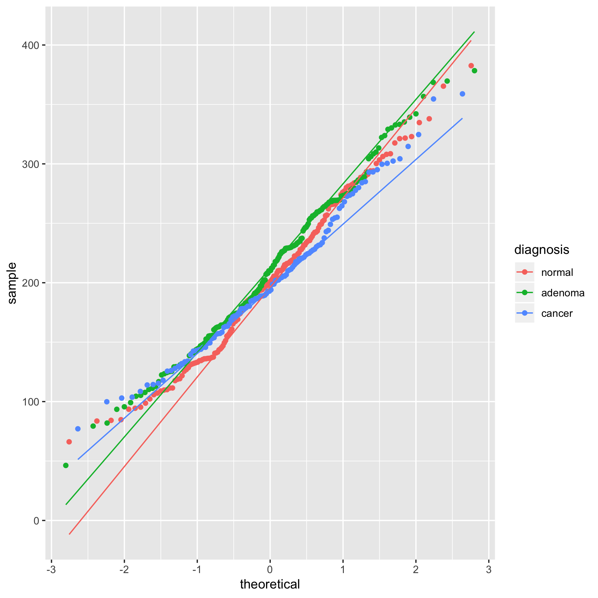
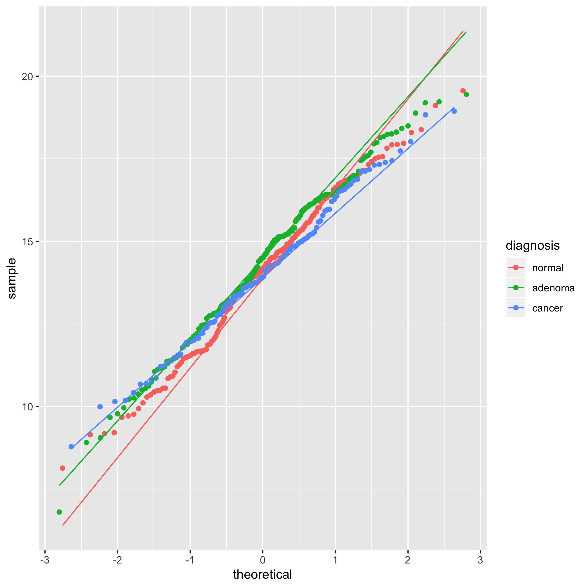
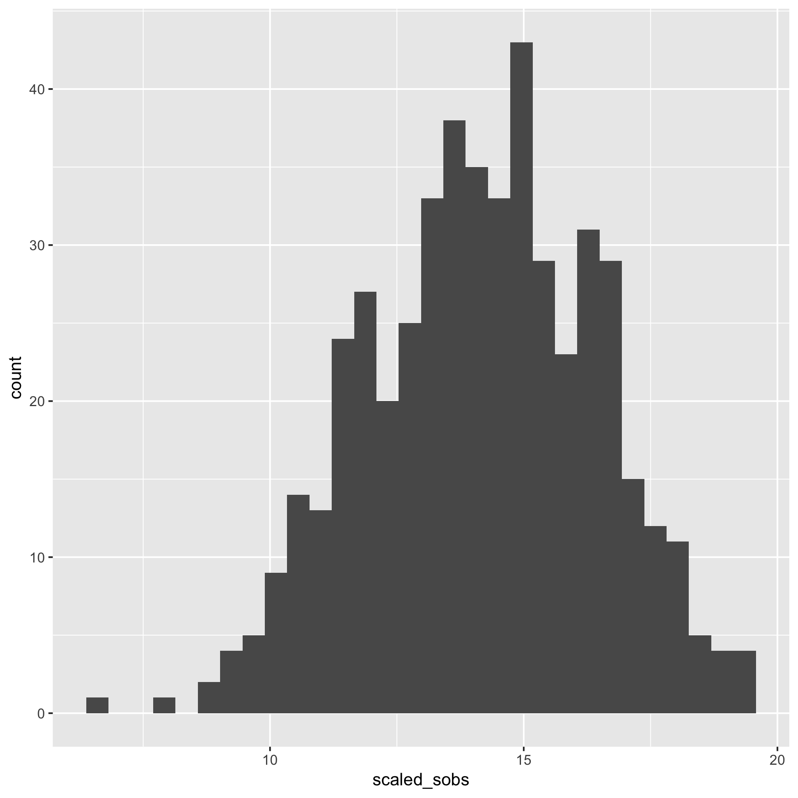
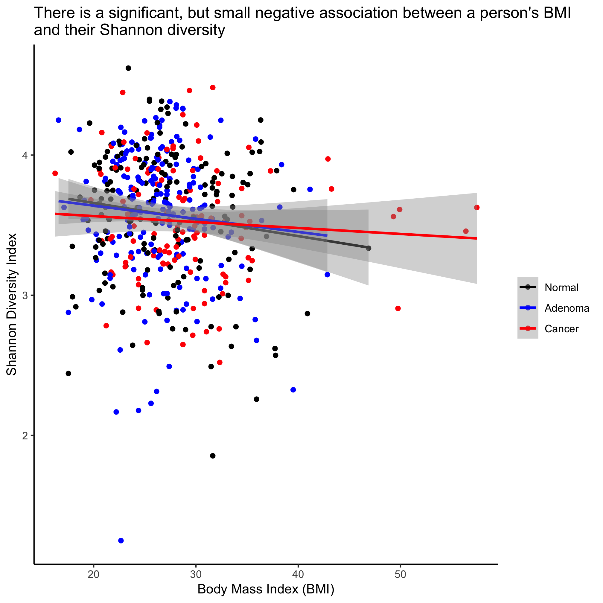
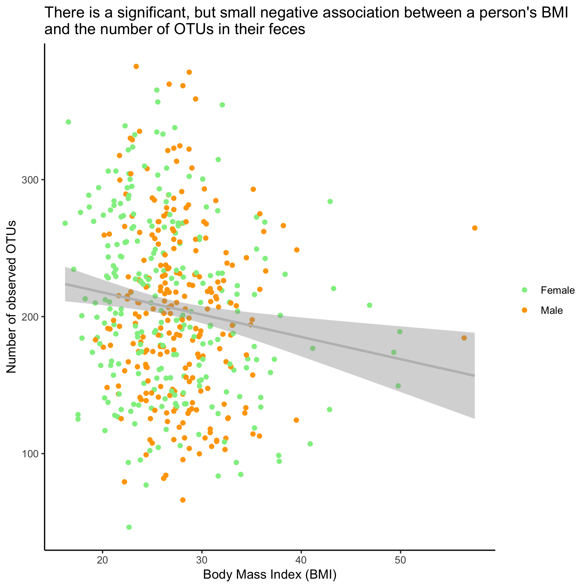
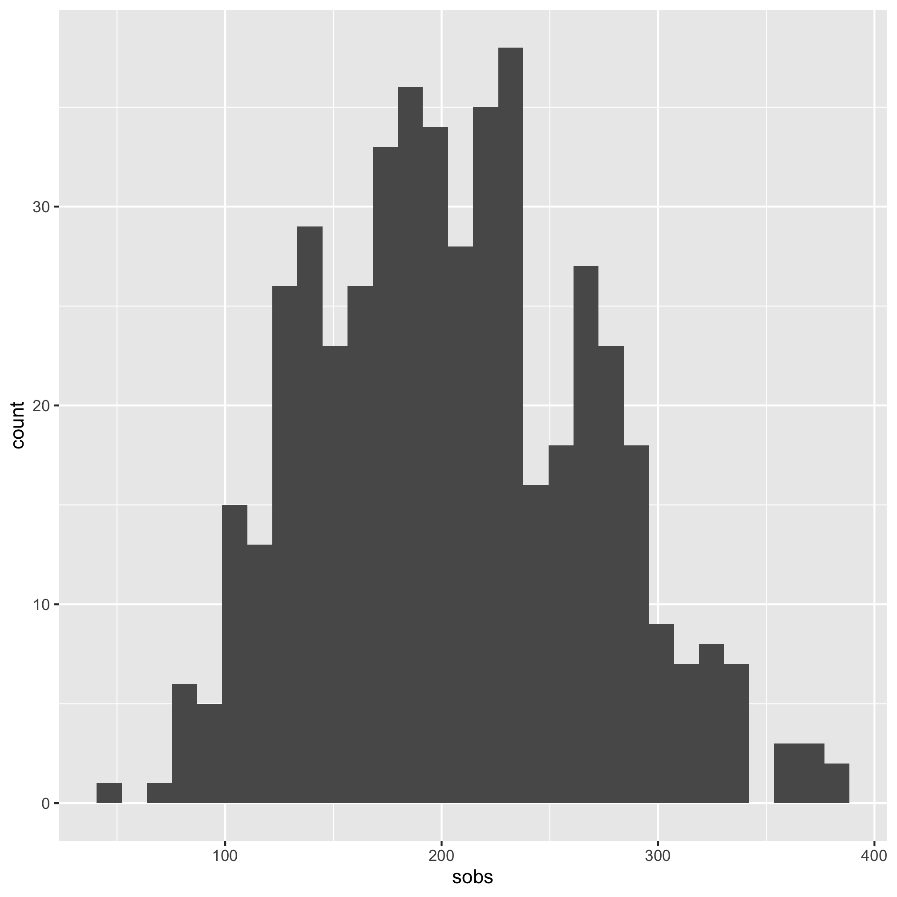

## Learning goals
* Transforming data to make them normally distributed
* T-test and Analysis of Variance
* Wilcoxon and Kruskal-Wallis tests
* Correlations and regression
* Overlaying regression on scatter plots
* Chi-squared tests and visualization


## Comparing continuous by categorical variables
So far we have been analyzing our data visually with the plots we have made. It would be nice to know whether there are statistically significant differences between various categories of the same variable or whether two continuous variables are correlated with each other. For example, we might want to know whether the Shannon diversity of men and women or between the three diagnosis categories is significantly different. Alternatively, we might want to know whether having a cancer diagnosis varies with the subjects' sex. Or we might want to know whether there is a correlation between Shannon diversity and a subject's BMI or FIT result.

One of the more important assumptions in most statistical analyses is whether the data are normally distributed. We can look at this question graphically with a few tools. The first we'll use is the qq plot which plots the normally distributed quartiles on the x axis and our observed values on the y-axis. If the data are normally distributed, then the points fall on a line. We can generate this plot using `geom_qq` and `stat_qq_line`


```r
source("code/baxter.R")

alpha <- read_tsv(file="raw_data/baxter.groups.ave-std.summary",
		col_types=cols(group = col_character())) %>%
	filter(method=='ave') %>%
	select(group, sobs, shannon, invsimpson, coverage)
metadata <- get_metadata()
meta_alpha <- inner_join(metadata, alpha, by=c('sample'='group'))

ggplot(meta_alpha, aes(sample=shannon, group=diagnosis, color=diagnosis)) + geom_qq() + stat_qq_line()
```



We see from this qq plot that our data are not normally distributed. We can attempt to normalize the distributions by scaling `shannon` by raising it to a power. If the curve would hold water, then you should use a power between 0 and 1 and if it wouldn't hold water you would use a power above 1. Ours would not hold water so we'll try 2 or 3.


```r
meta_alpha <- mutate(meta_alpha, scaled_shannon=shannon^3)

ggplot(meta_alpha, aes(sample=scaled_shannon, group=diagnosis, color=diagnosis)) +
	geom_qq() + stat_qq_line()
```



It's hard to tell the difference between 2 and 3, but I think 3 looks a bit better. Let's compare the raw Shannon values to the scaled values using a histogram


```r
ggplot(meta_alpha, aes(x=shannon)) + geom_histogram()
```



We see that the distribution is skewed to the left.


```r
ggplot(meta_alpha, aes(x=scaled_shannon)) + geom_histogram()
```



That does look better. There are several other functions that you might find useful for plotting histograms including `geom_freqpoly`, `geom_dotplot`, and `geom_density`. As with `geom_qq`, you can specify the `group` and `color` or `fill` aesthetics to see the distribution for each category you are interested in. We can also run a `shapiro.test`. The null hypothesis is that the data are normally distributed so a small p-value would mean that the data are not normally distributed.


```r
shapiro.test(meta_alpha$shannon)
```

```
## 
## 	Shapiro-Wilk normality test
## 
## data:  meta_alpha$shannon
## W = 0.96978, p-value = 1.637e-08
```

That's a small p-value, which indicates that the data are not normally distributed. Let's try the scaled data


```r
shapiro.test(meta_alpha$scaled_shannon)
```

```
## 
## 	Shapiro-Wilk normality test
## 
## data:  meta_alpha$scaled_shannon
## W = 0.99803, p-value = 0.8478
```

Wonderful - it's impossible to prove a null hypothesis, but we have a p-value that indicates support for the null hypothesis that our data are normally distributed. Great - we can move on with the scaled data for our parametric tests.


Now that we are confident our data are properly distribute for an analysis of variance (ANOVA), we can run the test with the `aov` and `summary` functions.


```r
diagnosis_shannon_aov <- aov(scaled_shannon~diagnosis, data=meta_alpha)
summary(diagnosis_shannon_aov)
```

```
##              Df Sum Sq Mean Sq F value Pr(>F)
## diagnosis     2    573   286.4   1.065  0.345
## Residuals   487 130932   268.9
```

The `scaled_shannon~diagnosis` syntax is a bit different than anything we've seen before. It is a model specification that asks R to test for a relationship where `diagnosis` explains `scaled_shannon`. It is commonly used with statistical modeling in R. We see that our P-value is 0.345, which is not less than 0.05. If the experiment-wise P-value had been less than 0.05, then we could use Tukey's Honest Significant Difference (HSD) test **[Note that this is a bad idea if your experiment-wise P-value is greater than 0.05]**.


```r
TukeyHSD(diagnosis_shannon_aov)
```

```
##   Tukey multiple comparisons of means
##     95% family-wise confidence level
## 
## Fit: aov(formula = scaled_shannon ~ diagnosis, data = meta_alpha)
## 
## $diagnosis
##                       diff       lwr      upr     p adj
## adenoma-normal  0.04536102 -3.972517 4.063239 0.9996117
## cancer-normal  -2.48940175 -7.074295 2.095492 0.4091780
## cancer-adenoma -2.53476277 -6.994230 1.924705 0.3757486
```

Again, all of our adjusted P-values are greater than 0.05.


If instead of using the scaled Shannon values we had used the raw values, then we would want to use a Kruskal-Wallis test using the `kruskal.test` function. To run this test, we need to recast `diagnosis` as a factor.


```r
kruskal.test(shannon~factor(diagnosis), data=meta_alpha)
```

```
## 
## 	Kruskal-Wallis rank sum test
## 
## data:  shannon by factor(diagnosis)
## Kruskal-Wallis chi-squared = 3.5804, df = 2, p-value = 0.1669
```

Again, our P-value is not significant. If the experiment-wise P-value had been less than 0.05, then we could use pairwise Wilcoxon rank sum tests with correction for multiple comparisons. **[Note that this is a bad idea if your experiment-wise P-value is greater than 0.05]**. Here we need to revert to using the `[[]]` notation that we learned earlier to select specific columns from our data frame.


```r
pairwise.wilcox.test(g=meta_alpha[["diagnosis"]], x=meta_alpha[["shannon"]], p.adjust.method="BH")
```

```
## 
## 	Pairwise comparisons using Wilcoxon rank sum test 
## 
## data:  meta_alpha[["shannon"]] and meta_alpha[["diagnosis"]] 
## 
##         normal adenoma
## adenoma 0.95   -      
## cancer  0.19   0.19   
## 
## P value adjustment method: BH
```

We are telling `pairwise.wilcox.test` to group our values from `meta_alpha[["shannon"]]` by `meta_alpha[["diagnosis"]]` and to perform all possible pairwise Wilcoxon tests. Because this is fraught with an increased probability of Type I errors, we need to correct for multiple comparisons. As written, this is done using the Benjamini & Hochberg (`BH`) method. You can find other methods of correcting p-values by looking at `?p.adjust.methods`.

ANOVA and Kruskal-Wallis tests are for cases where there are more than two levels of a single variable. You can also use ANOVA to test for more than two levels for more than one variable in R. This is beyond what we are shooting for in these lessons, but know that it can be done. Let's back up a bit and see how we test when there are only two levels of a variable such as sex. If our data are normally distributed we can use `t.test`


```r
t.test(scaled_shannon~sex, data=meta_alpha)
```

```
## 
## 	Welch Two Sample t-test
## 
## data:  scaled_shannon by sex
## t = -0.59593, df = 487.94, p-value = 0.5515
## alternative hypothesis: true difference in means is not equal to 0
## 95 percent confidence interval:
##  -3.795983  2.029205
## sample estimates:
## mean in group female   mean in group male 
##             46.94440             47.82779
```

We see that the P-value is 0.55 and is not significant. Alternatively, we could have used the Wilcoxon test


```r
wilcox.test(shannon~sex, data=meta_alpha)
```

```
## 
## 	Wilcoxon rank sum test with continuity correction
## 
## data:  shannon by sex
## W = 29285, p-value = 0.6436
## alternative hypothesis: true location shift is not equal to 0
```

Both of these tests allow you perform a paired test if you have pre and post data from the same experimental units. Again, this is not a statistics tutorial...


---

### Activity 1
Is the number of OTUs normally distributed? Repeat the analyses we performed above to see whether there is a significant difference in the number of OTUs by diagnosis group.

<input type="button" class="hideshow">
<div markdown="1" style="display:none;">

```r
ggplot(meta_alpha, aes(sample=sobs, group=diagnosis, color=diagnosis)) + geom_qq() + stat_qq_line()
```



The curve holds water so we might try transforming with the square root


```r
meta_alpha <- mutate(meta_alpha, scaled_sobs=sobs^0.5)

ggplot(meta_alpha, aes(sample=scaled_sobs, group=diagnosis, color=diagnosis)) +
	geom_qq() + stat_qq_line()
```



That doesn't look horrible...


```r
ggplot(meta_alpha, aes(x=sobs)) + geom_histogram()
ggplot(meta_alpha, aes(x=scaled_sobs)) + geom_histogram()
```



Good enough...


```r
diagnosis_sobs_aov <- aov(scaled_sobs~diagnosis, data=meta_alpha)
summary(diagnosis_sobs_aov)
```

```
##              Df Sum Sq Mean Sq F value Pr(>F)
## diagnosis     2   12.6   6.293   1.244  0.289
## Residuals   487 2463.3   5.058
```

Not significant.
</div>

---

### Activity 2
Is there a significant difference in the FIT result by diagnosis group?

<input type="button" class="hideshow">
<div markdown="1" style="display:none;">

```r
kruskal.test(fit_result~factor(diagnosis), data=meta_alpha)
```

```
## 
## 	Kruskal-Wallis rank sum test
## 
## data:  fit_result by factor(diagnosis)
## Kruskal-Wallis chi-squared = 218.91, df = 2, p-value < 2.2e-16
```

Yes, the P-value is quite small. Let's perform the pairwise Wilcoxon tests


```r
pairwise.wilcox.test(g=meta_alpha[["diagnosis"]], x=meta_alpha[["fit_result"]], p.adjust.method="BH")
```

```
## 
## 	Pairwise comparisons using Wilcoxon rank sum test 
## 
## data:  meta_alpha[["fit_result"]] and meta_alpha[["diagnosis"]] 
## 
##         normal  adenoma
## adenoma 1.2e-08 -      
## cancer  < 2e-16 < 2e-16
## 
## P value adjustment method: BH
```

The three diagnosis groups have significantly different FIT results even after comparing for multiple comparisons.
</div>

---


## Comparing continuous by continuous variables
Sometimes we would like to know whether two variables are correlated with each other. For example, is someone's BMI correlated with their Shannon diversity? Is FIT result correlated with age? Is the FIT result correlated with their Shannon diversity? To test for these types of correlations we can use the `cor.test` function


```r
meta_alpha <- meta_alpha %>%
	mutate(bmi = get_bmi(weight_kg=weight, height_cm=height))

cor.test(meta_alpha[["shannon"]], meta_alpha[["bmi"]])
```

```
## 
## 	Pearson's product-moment correlation
## 
## data:  meta_alpha[["shannon"]] and meta_alpha[["bmi"]]
## t = -2.3142, df = 486, p-value = 0.02107
## alternative hypothesis: true correlation is not equal to 0
## 95 percent confidence interval:
##  -0.19138925 -0.01578278
## sample estimates:
##        cor 
## -0.1043997
```

```r
cor.test(meta_alpha[["fit_result"]], meta_alpha[["age"]])
```

```
## 
## 	Pearson's product-moment correlation
## 
## data:  meta_alpha[["fit_result"]] and meta_alpha[["age"]]
## t = 1.0154, df = 488, p-value = 0.3104
## alternative hypothesis: true correlation is not equal to 0
## 95 percent confidence interval:
##  -0.04284033  0.13395240
## sample estimates:
##        cor 
## 0.04591557
```

```r
cor.test(meta_alpha[["fit_result"]], meta_alpha[["shannon"]])
```

```
## 
## 	Pearson's product-moment correlation
## 
## data:  meta_alpha[["fit_result"]] and meta_alpha[["shannon"]]
## t = -1.1199, df = 488, p-value = 0.2633
## alternative hypothesis: true correlation is not equal to 0
## 95 percent confidence interval:
##  -0.13858973  0.03812301
## sample estimates:
##         cor 
## -0.05062962
```

We see that Shannon diversity has a significant negative correlation with BMI, albeit a small correlation (R=-0.1043997). But there is no significant correlation between FIT result and age or Shannon diversity. To explore this correlation a bit further, we can fit a regression line through the data using the `lm` (i.e. linear model) function


```r
lm_shannon_bmi <- lm(meta_alpha[["shannon"]]~meta_alpha[["bmi"]])
summary(lm_shannon_bmi)
```

```
## 
## Call:
## lm(formula = meta_alpha[["shannon"]] ~ meta_alpha[["bmi"]])
## 
## Residuals:
##      Min       1Q   Median       3Q      Max 
## -2.35664 -0.26872  0.04092  0.32429  1.02171 
## 
## Coefficients:
##                      Estimate Std. Error t value Pr(>|t|)    
## (Intercept)          3.802808   0.104823  36.278   <2e-16 ***
## meta_alpha[["bmi"]] -0.008724   0.003770  -2.314   0.0211 *  
## ---
## Signif. codes:  0 '***' 0.001 '**' 0.01 '*' 0.05 '.' 0.1 ' ' 1
## 
## Residual standard error: 0.4546 on 486 degrees of freedom
##   (2 observations deleted due to missingness)
## Multiple R-squared:  0.0109,	Adjusted R-squared:  0.008864 
## F-statistic: 5.355 on 1 and 486 DF,  p-value: 0.02107
```

The slope of the line where BMI is the x-axis and Shannon diversity is the y-axis is slightly negative. Again, it's significant, but ... meh. We can also test whether the regression changes by diagnosis group


```r
lm_shannon_bmi <- lm(shannon~bmi + diagnosis, data=meta_alpha)
summary(lm_shannon_bmi)
```

```
## 
## Call:
## lm(formula = shannon ~ bmi + diagnosis, data = meta_alpha)
## 
## Residuals:
##      Min       1Q   Median       3Q      Max 
## -2.36144 -0.26818  0.04287  0.32556  1.01510 
## 
## Coefficients:
##                   Estimate Std. Error t value Pr(>|t|)    
## (Intercept)       3.798312   0.109538  34.676   <2e-16 ***
## bmi              -0.008249   0.003853  -2.141   0.0328 *  
## diagnosisadenoma -0.001477   0.047563  -0.031   0.9752    
## diagnosiscancer  -0.032234   0.054929  -0.587   0.5576    
## ---
## Signif. codes:  0 '***' 0.001 '**' 0.01 '*' 0.05 '.' 0.1 ' ' 1
## 
## Residual standard error: 0.4553 on 484 degrees of freedom
##   (2 observations deleted due to missingness)
## Multiple R-squared:  0.01175,	Adjusted R-squared:  0.00562 
## F-statistic: 1.917 on 3 and 484 DF,  p-value: 0.1258
```

We see that the impact of BMI is significant, but that there's no meaninful difference between the three diagnosis groups.

By default, `cor.test` performs a Pearson correlation, which assumes a linear relationship between the two variables. Having seen the FIT result distribution a few times now, we might suspect that it has a non-linear association with other variables. We can test the association with a Spearman correlation.


```r
cor.test(meta_alpha[["shannon"]], meta_alpha[["bmi"]], method="spearman")
```

```
## 
## 	Spearman's rank correlation rho
## 
## data:  meta_alpha[["shannon"]] and meta_alpha[["bmi"]]
## S = 21505000, p-value = 0.01477
## alternative hypothesis: true rho is not equal to 0
## sample estimates:
##        rho 
## -0.1103069
```

```r
cor.test(meta_alpha[["fit_result"]], meta_alpha[["age"]], method="spearman")
```

```
## 
## 	Spearman's rank correlation rho
## 
## data:  meta_alpha[["fit_result"]] and meta_alpha[["age"]]
## S = 17398000, p-value = 0.01254
## alternative hypothesis: true rho is not equal to 0
## sample estimates:
##     rho 
## 0.11271
```

```r
cor.test(meta_alpha[["fit_result"]], meta_alpha[["shannon"]], method="spearman")
```

```
## 
## 	Spearman's rank correlation rho
## 
## data:  meta_alpha[["fit_result"]] and meta_alpha[["shannon"]]
## S = 21405000, p-value = 0.04265
## alternative hypothesis: true rho is not equal to 0
## sample estimates:
##         rho 
## -0.09161851
```

Now we get significant P-values for these comparisons, but we see that the rho values are quite small. We also get a warning message that an exact p-value cannot be calculated when there are ties such as those that occur because multiple subjects have a value of zero for their FIT result.

We can plot these associations on our scatter plots with the `geom_smooth` function and giving it the linear model `method` (i.e. `lm`)


```r
ggplot(meta_alpha, aes(x=bmi, y=shannon, color=diagnosis)) +
	geom_point() +
	geom_smooth(method="lm") +
	scale_color_manual(name=NULL,
		values=c("black", "blue", "red"),
		breaks=c("normal", "adenoma", "cancer"),
		labels=c("Normal", "Adenoma", "Cancer")) +
	labs(title="There is a significant, but small negative association between a person's BMI\nand their Shannon diversity",
		x="Body Mass Index (BMI)",
		y="Shannon Diversity Index") +
	theme_classic()
```



This plots the regression lines with the cloud around the line indicating the 95% confidence interval. We noted above that our regression analysis indicated that there wasn't a statistical difference between the diagnosis groups. If we want a single line through the data, then we can overwrite the `color` aesthetic in `geom_smooth`


```r
ggplot(meta_alpha, aes(x=bmi, y=shannon, color=diagnosis)) +
	geom_point() +
	geom_smooth(method="lm", color="gray") +
	scale_color_manual(name=NULL,
		values=c("black", "blue", "red"),
		breaks=c("normal", "adenoma", "cancer"),
		labels=c("Normal", "Adenoma", "Cancer")) +
	labs(title="There is a significant, but small negative association between a person's BMI\nand their Shannon diversity",
		x="Body Mass Index (BMI)",
		y="Shannon Diversity Index") +
	theme_classic()
```


---

### Activity 3
In the scatter plot where we drew three regression lines the legend changed to have a gray background behind the points and a line was drawn with the points. This is effectively a merge between the legend of the `geom_point` and `geom_smooth` layers. How do we remove the `geom_smooth` legend so that our legend only contains the simple plotting character?

<input type="button" class="hideshow">
<div markdown="1" style="display:none;">

```r
ggplot(meta_alpha, aes(x=bmi, y=shannon, color=diagnosis)) +
	geom_point() +
	geom_smooth(method="lm", show.legend=FALSE) +
	scale_color_manual(name=NULL,
		values=c("black", "blue", "red"),
		breaks=c("normal", "adenoma", "cancer"),
		labels=c("Normal", "Adenoma", "Cancer")) +
	labs(title="There is a significant, but small negative association between a person's BMI\nand their Shannon diversity",
		x="Body Mass Index (BMI)",
		y="Shannon Diversity Index") +
	theme_classic()
```


</div>


---

### Activity 4
Is there a significant association between the number of OTUs in a person's fecal samples and their BMI and sex? Run the test and show a plot of the relevant fit of the data.


<input type="button" class="hideshow">
<div markdown="1" style="display:none;">

```r
lm_sobs_bmi_sex <- lm(sobs~bmi+sex, data=meta_alpha)
summary(lm_sobs_bmi_sex)
```

```
## 
## Call:
## lm(formula = sobs ~ bmi + sex, data = meta_alpha)
## 
## Residuals:
##      Min       1Q   Median       3Q      Max 
## -168.307  -49.136   -3.455   45.344  176.230 
## 
## Coefficients:
##             Estimate Std. Error t value Pr(>|t|)    
## (Intercept) 250.8916    14.5981  17.187   <2e-16 ***
## bmi          -1.6010     0.5247  -3.051   0.0024 ** 
## sexmale      -2.7168     5.7278  -0.474   0.6355    
## ---
## Signif. codes:  0 '***' 0.001 '**' 0.01 '*' 0.05 '.' 0.1 ' ' 1
## 
## Residual standard error: 62.97 on 485 degrees of freedom
##   (2 observations deleted due to missingness)
## Multiple R-squared:  0.02001,	Adjusted R-squared:  0.01597 
## F-statistic: 4.953 on 2 and 485 DF,  p-value: 0.007425
```

The effect of BMI is statistically significant, but not with the subject's sex.


```r
ggplot(meta_alpha, aes(x=bmi, y=sobs, color=sex)) +
	geom_point() +
	geom_smooth(method="lm", color="gray") +
	scale_color_manual(name=NULL,
		values=c("lightgreen", "orange"),
		breaks=c("female", "male"),
		labels=c("Female", "Male")) +
	labs(title="There is a significant, but small negative association between a person's BMI\nand the number of OTUs in their feces",
		x="Body Mass Index (BMI)",
		y="Number of observed OTUs") +
	theme_classic()
```


</div>

---

## Comparing discrete variables
We might also be interested in knowing whether two discrete variables have the same distribution. For example, within our cohort, are men and women equally likely to have adenomas and carcinomas? Is there variation in obesity status and diagnosis? Let's start with the first question and leave the second for an activity for you to work on. We can test this association using a Chi-Squared test of association using the `chisq.test` function


```r
chisq.test(x=meta_alpha[["sex"]], y=meta_alpha[["diagnosis"]])
```

```
## 
## 	Pearson's Chi-squared test
## 
## data:  meta_alpha[["sex"]] and meta_alpha[["diagnosis"]]
## X-squared = 23.93, df = 2, p-value = 6.363e-06
```

We see that the P-value for this difference is quite small and so we can conclude that within our cohort there is a significant difference in the proportion of men and women who have a diagnosis of an adenoma or carcinoma. We can visualize this with the `geom_count` function.


```r
ggplot(meta_alpha, aes(x=sex, y=diagnosis)) +
	geom_count() +
	scale_x_discrete(name=NULL,
		breaks=c("female", "male"),
		labels=c("Female", "Male")) +
	scale_y_discrete(name=NULL,
		breaks=c("normal", "adenoma", "cancer"),
		labels=c("Normal", "Adenoma", "Cancer")) +
	scale_size_continuous(name=NULL) +
	labs(title="There is significant variation in the likelihood that men or women will\ndevelop lesions",
		x="Body Mass Index (BMI)",
		y="Number of observed OTUs") +
	theme_classic()
```



Not that size of circles is generally pretty hard for people to differentiate, so this isn't necessarily the best visualization tool. To see how to scale the circles by proportions you should see the examples in the `?geom_count` documentation.


---

### Activity 5
Is there variation in obesity status and diagnosis?

<input type="button" class="hideshow">
<div markdown="1" style="display:none;">

```r
chisq.test(x=meta_alpha[["obese"]], y=meta_alpha[["diagnosis"]])
```

```
## Error in chisq.test(x = meta_alpha[["obese"]], y = meta_alpha[["diagnosis"]]): 'x' and 'y' must have the same length
```

The P-value is quite small


```r
ggplot(meta_alpha, aes(x=obese, y=diagnosis)) +
	geom_count() +
	scale_x_discrete(name=NULL,
		breaks=c("TRUE", "FALSE"),
		labels=c("Obese", "Not Obese")) +
	scale_y_discrete(name=NULL,
		breaks=c("normal", "adenoma", "cancer"),
		labels=c("Normal", "Adenoma", "Cancer")) +
	scale_size_continuous(name=NULL) +
	labs(title="There is significant variation in the likelihood that obese individuals\nwill develop lesions",
		x="Body Mass Index (BMI)",
		y="Number of observed OTUs") +
	theme_classic()
```

```
## Error in FUN(X[[i]], ...): object 'obese' not found
```


</div>
