## Topics
* More complex aggregation approach
* Transforming data to make them normally distributed
* Extracting columns from a data frame
* Parsing output from complex variables
* Simple statistical tests
* Formula notation
* Overlaying models on scatter plots


## Comparing continuous by categorical variables
So far we have been analyzing our data visually with the plots we have made. It would be nice to know whether there are statistically significant differences between various categories of the same variable or whether two continuous variables are correlated with each other. For example, we might want to know whether the Shannon diversity of men and women or between the three diagnosis categories is significantly different. Alternatively, we might want to know whether having a cancer diagnosis varies with the subjects' sex. Or we might want to know whether there is a correlation between Shannon diversity and a subject's BMI or FIT result.

Before we get to plotting, let's summarize the data a bit differently than we have been. Back in Lesson 4, we saw that we could use the `group_by`/`summarize` workflow to generate individual columns of a new data frame. That approach has a major problem: we can only use functions that generate a single value (e.g. `mean`). To do this type of operation, we need to take a slightly different approach. We will use tools from a package called `purrr`, which is part of the tidyverse. Way back in Lesson 2 we saw that we could run `summary` to generate summary statistics for each column of a data frame by doing something like `summary(meta_alpha)`. With continuous data that command would output the minimum and maximum values, the values at the 25th and 75% percentiles and the median and mean. To illustrate one of the problems I describe above, let's try the `group_by`/`summarize` workflow with `summary`.


```r
source("code/baxter.R")

alpha <- read_tsv(file="raw_data/baxter.groups.ave-std.summary",
		col_types=cols(group = col_character())) %>%
	filter(method=='ave') %>%
	select(group, sobs, shannon, invsimpson, coverage)
metadata <- get_metadata()
meta_alpha <- inner_join(metadata, alpha, by=c('sample'='group'))

meta_alpha %>%
	group_by(diagnosis) %>%
	summarize(summary(fit_result))
```

```
## Error: Problem with `summarise()` input `..1`.
## ✖ Can't convert <table> to <table>.
## ℹ Input `..1` is `summary(fit_result)`.
## ℹ The error occurred in group 3: diagnosis = "cancer".
```

As I indicated, this created an error message. In the new approach, we will take four steps to get the desired output. First, we will generate three data frames - one for each diagnosis group. Second, within each diagnosis group we will run the summary command generating a data frame for each diagnosis group. Finally, we will merge the data frames together to make a single data frame. The cool thing, is that we will generate these data frames within the original data frame. We will have a data frame where instead of a column containing character or numerical values, it will have columns that contain data frames. The first step requires the `nest` command. We will *nest* the data within the original data frame.


```r
library(purrr)
library(broom)

meta_alpha %>%
	nest(data = -diagnosis)
```

```
## # A tibble: 3 x 2
##   diagnosis data               
##   <fct>     <list>             
## 1 normal    <tibble [172 × 20]>
## 2 adenoma   <tibble [198 × 20]>
## 3 cancer    <tibble [120 × 20]>
```

Trippy, eh? We told `nest` to take the data not in the diagnosis column and make a data frame with it for each diagnosis group. Next, we will want to apply the `summary` function to the `shannon` column in each data frame in the data column. We can achieve this with the `map` and `tidy` functions.


```r
meta_alpha %>%
	nest(data = -diagnosis) %>%
	mutate(summary_data=map(data, ~summary(.x$shannon) %>% tidy))
```

```
## # A tibble: 3 x 3
##   diagnosis data                summary_data    
##   <fct>     <list>              <list>          
## 1 normal    <tibble [172 × 20]> <tibble [1 × 6]>
## 2 adenoma   <tibble [198 × 20]> <tibble [1 × 6]>
## 3 cancer    <tibble [120 × 20]> <tibble [1 × 6]>
```

This chunk has a few things going on in it. You'll notice we are using the `mutate` function to create a new column called summary. The values in summary_data are being set using the `map` function. The `map` function runs the `summary` function on each row of our data frame (i.e. there are three rows - one for each diagnosis category). We are giving the `summary` function to `map` using the formula notation, hence the `~` (we'll discuss this later in this lesson). If you look at `map` you'll see that the primary arguments to the function are `.x` and `.f`. The first is for the data and the second is for the function to be applied to the data. Although it isn't explicitly stated, the value of `.x` is `data` and the value of `.f` is `~summary(.x$shannon)) %>% tidy`. So you should be able to see that `.x$shannon` is pulling the shannon column from the nested data frame stored in the data column. The `summary` function is doing it's thing with that column. The output of that command is a structure called a Summary Data Frame, which doesn't play nicely with our tibble. To clean it up, we need to run the output through the `tidy` function. The output shows that we now have a three column data frame. The diagnosis column, our data column, and the new summary_data column, which contains the summary output as a column of tibbles. Next, we want to extract or `unnest` the values in the summary_data column.


```r
meta_alpha %>%
	nest(data = -diagnosis) %>%
	mutate(summary_data=map(data, ~summary(.x$shannon) %>% tidy)) %>%
	unnest(cols=summary_data)
```

```
## # A tibble: 3 x 8
##   diagnosis data                minimum    q1 median  mean    q3 maximum
##   <fct>     <list>                <dbl> <dbl>  <dbl> <dbl> <dbl>   <dbl>
## 1 normal    <tibble [172 × 20]>    1.85  3.32   3.68  3.58  3.91    4.62
## 2 adenoma   <tibble [198 × 20]>    1.25  3.31   3.63  3.58  3.90    4.38
## 3 cancer    <tibble [120 × 20]>    2.52  3.25   3.49  3.52  3.87    4.48
```

Nice, eh? Let's go ahead and get rid of the data column using the `select` function


```r
meta_alpha %>%
	nest(data = -diagnosis) %>%
	mutate(summary_data=map(data, ~summary(.x$shannon) %>% tidy)) %>%
	unnest(cols=summary_data) %>%
	select(-data)
```

```
## # A tibble: 3 x 7
##   diagnosis minimum    q1 median  mean    q3 maximum
##   <fct>       <dbl> <dbl>  <dbl> <dbl> <dbl>   <dbl>
## 1 normal       1.85  3.32   3.68  3.58  3.91    4.62
## 2 adenoma      1.25  3.31   3.63  3.58  3.90    4.38
## 3 cancer       2.52  3.25   3.49  3.52  3.87    4.48
```

### Activity 1
Modify the code we used above to generate the same type of output, but for the fit_result column. Can you add a column to the data frame that indicates the number of subjects in each diagnosis group as a column?

<input type="button" class="hideshow">
<div markdown="1" style="display:none;">

```r
meta_alpha %>%
	nest(data = -diagnosis) %>%
	mutate(summary_data=map(data, ~summary(.x$fit_result) %>% tidy),
				N = map(data, ~nrow(.x))) %>%
	unnest(cols=c(summary_data, N)) %>%
	select(-data)
```

```
## # A tibble: 3 x 8
##   diagnosis minimum    q1 median   mean     q3 maximum     N
##   <fct>       <dbl> <dbl>  <dbl>  <dbl>  <dbl>   <dbl> <int>
## 1 normal          0     0     0    8.92    0       356   172
## 2 adenoma         0     0     0   98.8    35.8    2589   198
## 3 cancer          0   100   522. 789.   1207.     2964   120
```

You could have written two mutate statements or run them together as a single statement. If you did `~nrow(.x) %>% tidy` that is fine, but the `tidy` function call to generate N is unnecessary.
</div>

---

## Testing significance
Looking at those summary tables, it might be hard to decipher whether the diagnosis groups are significantly different from each other. We'd like to test these differences with a statistical test. One of the more important assumptions in most statistical analyses is whether the data are normally distributed. We can look at this question graphically with a few tools. The first we'll use is the qq plot which plots the normally distributed quartiles on the x axis and our observed values on the y-axis. If the data are normally distributed, then the points fall on a line. We can generate this plot using `geom_qq` and `stat_qq_line`


```r
ggplot(meta_alpha, aes(sample=shannon, group=diagnosis, color=diagnosis)) + geom_qq() + stat_qq_line()
```

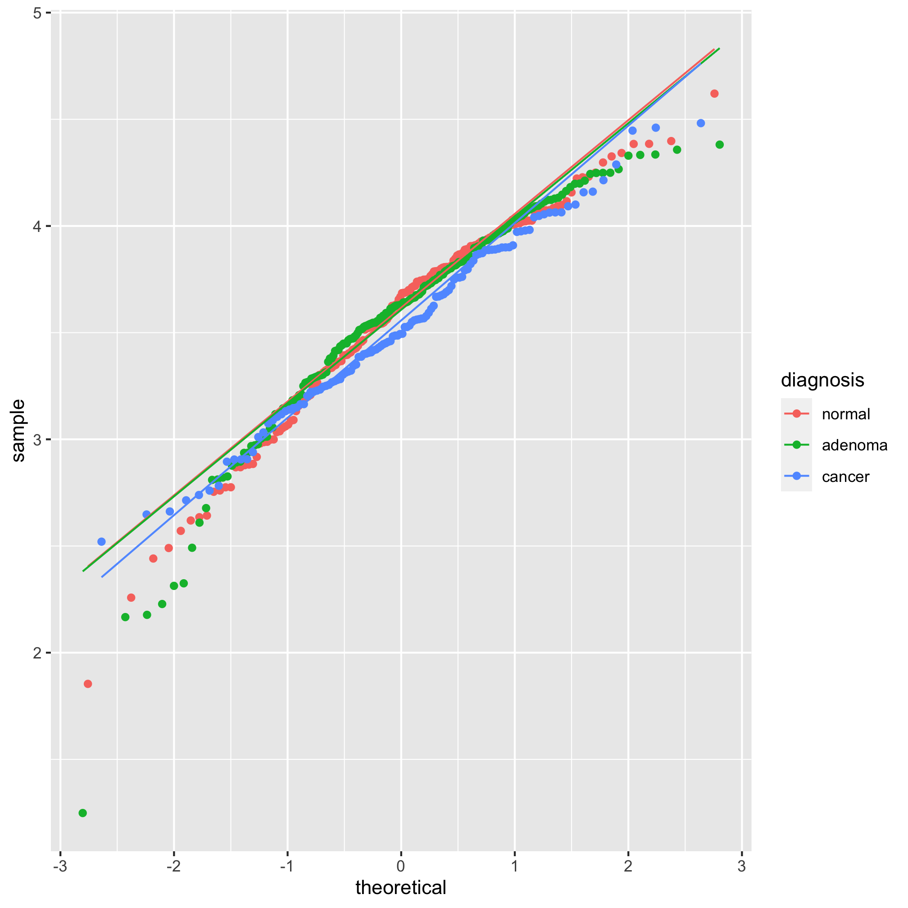

We see from this qq plot that our data are not normally distributed. We can attempt to normalize the distributions by scaling `shannon` by raising it to a power. If the curve would hold water, then you should use a power between 0 and 1 and if it wouldn't hold water you would use a power above 1. Ours would not hold water so we'll try 2 or 3.


```r
meta_alpha <- mutate(meta_alpha, scaled_shannon=shannon^3)

ggplot(meta_alpha, aes(sample=scaled_shannon, group=diagnosis, color=diagnosis)) +
	geom_qq() + stat_qq_line()
```

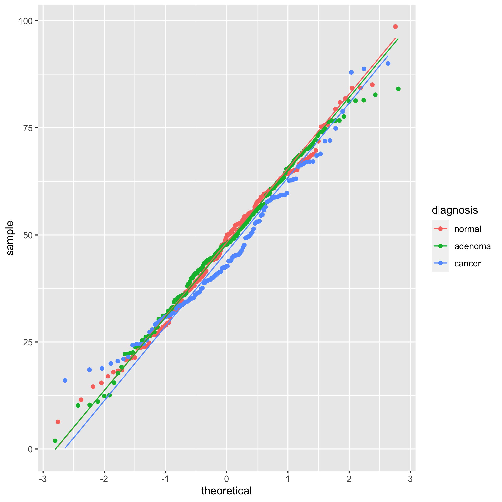

It's hard to tell the difference between 2 and 3, but I think 3 looks a bit better. Let's compare the raw Shannon values to the scaled values using a histogram


```r
ggplot(meta_alpha, aes(x=shannon)) + geom_histogram()
```

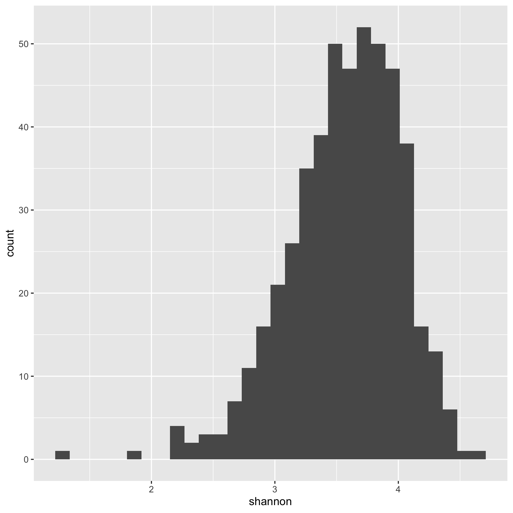

We see that the distribution is skewed to the left.


```r
ggplot(meta_alpha, aes(x=scaled_shannon)) + geom_histogram()
```

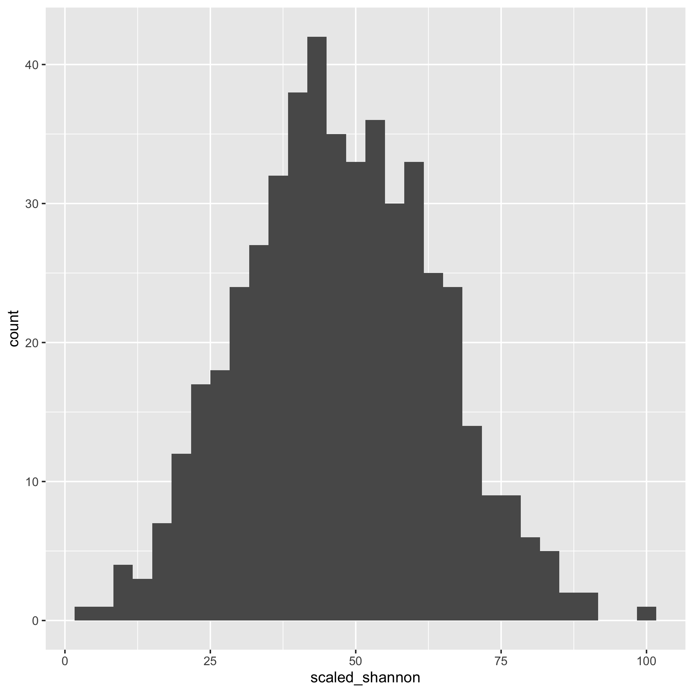

That does look better. There are several other functions that you might find useful for plotting histograms including `geom_freqpoly`, `geom_dotplot`, and `geom_density`. As with `geom_qq`, you can specify the `group` and `color` or `fill` aesthetics to see the distribution for each category you are interested in. We can also run a `shapiro.test`. The null hypothesis is that the data are normally distributed so a small p-value would mean that the data are not normally distributed.


```r
meta_alpha %>% pull(shannon) %>% shapiro.test()
```

```
## 
## 	Shapiro-Wilk normality test
## 
## data:  .
## W = 0.96978, p-value = 1.637e-08
```

That's a small p-value, which indicates that the data are not normally distributed. Let's try the scaled data


```r
meta_alpha %>% pull(scaled_shannon) %>% shapiro.test()
```

```
## 
## 	Shapiro-Wilk normality test
## 
## data:  .
## W = 0.99803, p-value = 0.8478
```

Wonderful - it's impossible to prove a null hypothesis, but we have a p-value that indicates support for the null hypothesis that our data are normally distributed. Great - we can move on with the scaled data for our parametric tests. We can run the test with the `aov` and `summary` functions.


```r
diagnosis_shannon_aov <- aov(scaled_shannon~diagnosis, data=meta_alpha)
summary(diagnosis_shannon_aov)
```

```
##              Df Sum Sq Mean Sq F value Pr(>F)
## diagnosis     2    573   286.4   1.065  0.345
## Residuals   487 130932   268.9
```

The `scaled_shannon~diagnosis` syntax is a bit different than anything we've seen before. It is a model specification that asks R to test for a relationship where `diagnosis` explains `scaled_shannon`. It is commonly used with statistical modeling in R. We see that our P-value is 0.345, which is not less than 0.05. If the experiment-wise P-value had been less than 0.05, then we could use Tukey's Honest Significant Difference (HSD) test **[Note that this is a bad idea if your experiment-wise P-value is greater than 0.05]**.


```r
TukeyHSD(diagnosis_shannon_aov)
```

```
##   Tukey multiple comparisons of means
##     95% family-wise confidence level
## 
## Fit: aov(formula = scaled_shannon ~ diagnosis, data = meta_alpha)
## 
## $diagnosis
##                       diff       lwr      upr     p adj
## adenoma-normal  0.04536102 -3.972517 4.063239 0.9996117
## cancer-normal  -2.48940175 -7.074295 2.095492 0.4091780
## cancer-adenoma -2.53476277 -6.994230 1.924705 0.3757486
```

Again, all of our adjusted P-values are greater than 0.05.


If instead of using the scaled Shannon values we had used the raw values, then we would want to use a Kruskal-Wallis test using the `kruskal.test` function.


```r
kruskal.test(shannon~diagnosis, data=meta_alpha)
```

```
## 
## 	Kruskal-Wallis rank sum test
## 
## data:  shannon by diagnosis
## Kruskal-Wallis chi-squared = 3.5804, df = 2, p-value = 0.1669
```

Again, our P-value is not significant. If the experiment-wise P-value had been less than 0.05, then we could use pairwise Wilcoxon rank sum tests with correction for multiple comparisons. **[Note that this is a bad idea if your experiment-wise P-value is greater than 0.05]**. Perhaps we'd like to capture the actual P-value from that line of code and save it as a variable. How would we do this? Let's re-run the command, but save the variable as output


```r
result <- kruskal.test(shannon~diagnosis, data=meta_alpha)
result
```

```
## 
## 	Kruskal-Wallis rank sum test
## 
## data:  shannon by diagnosis
## Kruskal-Wallis chi-squared = 3.5804, df = 2, p-value = 0.1669
```

Entering `result` at the prompt gets us the same output as before. The `kruskal.test` command, and many other commands, summarize the results of the test in an attractive manner to be human readable. We can see the output as the computer does using the `glimpse` or `str` commands.


```r
glimpse(result)
```

```
## List of 5
##  $ statistic: Named num 3.58
##   ..- attr(*, "names")= chr "Kruskal-Wallis chi-squared"
##  $ parameter: Named int 2
##   ..- attr(*, "names")= chr "df"
##  $ p.value  : num 0.167
##  $ method   : chr "Kruskal-Wallis rank sum test"
##  $ data.name: chr "shannon by diagnosis"
##  - attr(*, "class")= chr "htest"
```

In that output you'll see a few things that may be a bit familiar to you. First, it tells us that the output is a "List of 5". It then follows with multiple lines, five of which start with a `$`. Next to the `$` are the names of different variables, a `:`, and the type of data that variable represents along with its value. Let's back up a smidge. What's a list? In R, a list is a collection of vectors that can contain different types of data. You can access the values of the list by a few different methods. You can use a `list_name$variable_name` or you can use `list_name[["variable_name"]]`.


```r
result$p.value
```

```
## [1] 0.166927
```


```r
result[["p.value"]]
```

```
## [1] 0.166927
```

A data frame is a special type of list. If you do `glimpse(meta_alpha)`, you will see the output is a bit different from what we got above with `result`, but is still similar. Each line that starts with a `$` represents a different variable and is a vector of the indicated type. For example, the `sample` column is a vector of characters. We can access this column by one of four different ways.


```r
meta_alpha$sample
meta_alpha[["sample"]]
meta_alpha[, "sample"]
pull(meta_alpha, sample)
```

Each of these function calls returns the same vector. In general, I will use the `$` notation because it's fewer keystrokes; however, if the code is part of a pipeline, I'll likely use the `pull` function. Note that you can chain together this notation for parsing complicated lists. Take for example, the `diagnosis_shannon_aov` variable that we created above


```r
glimpse(diagnosis_shannon_aov)
```

```
## List of 13
##  $ coefficients : Named num [1:3] 47.981 0.0454 -2.4894
##   ..- attr(*, "names")= chr [1:3] "(Intercept)" "diagnosisadenoma" "diagnosiscancer"
##  $ residuals    : Named num [1:490] 17.2 15.2 11.6 24.2 -11.1 ...
##   ..- attr(*, "names")= chr [1:490] "1" "2" "3" "4" ...
##  $ effects      : Named num [1:490] -1049 11.6 -20.9 24.2 -12.8 ...
##   ..- attr(*, "names")= chr [1:490] "(Intercept)" "diagnosisadenoma" "diagnosiscancer" "" ...
##  $ rank         : int 3
##  $ fitted.values: Named num [1:490] 48 48 48 48 48 ...
##   ..- attr(*, "names")= chr [1:490] "1" "2" "3" "4" ...
##  $ assign       : int [1:3] 0 1 1
##  $ qr           :List of 5
##   ..$ qr   : num [1:490, 1:3] -22.1359 0.0452 0.0452 0.0452 0.0452 ...
##   .. ..- attr(*, "dimnames")=List of 2
##   .. ..- attr(*, "assign")= int [1:3] 0 1 1
##   .. ..- attr(*, "contrasts")=List of 1
##   ..$ qraux: num [1:3] 1.05 1.04 1.05
##   ..$ pivot: int [1:3] 1 2 3
##   ..$ tol  : num 1e-07
##   ..$ rank : int 3
##   ..- attr(*, "class")= chr "qr"
##  $ df.residual  : int 487
##  $ contrasts    :List of 1
##   ..$ diagnosis: chr "contr.treatment"
##  $ xlevels      :List of 1
##   ..$ diagnosis: chr [1:3] "normal" "adenoma" "cancer"
##  $ call         : language aov(formula = scaled_shannon ~ diagnosis, data = meta_alpha)
##  $ terms        :Classes 'terms', 'formula'  language scaled_shannon ~ diagnosis
##   .. ..- attr(*, "variables")= language list(scaled_shannon, diagnosis)
##   .. ..- attr(*, "factors")= int [1:2, 1] 0 1
##   .. .. ..- attr(*, "dimnames")=List of 2
##   .. ..- attr(*, "term.labels")= chr "diagnosis"
##   .. ..- attr(*, "order")= int 1
##   .. ..- attr(*, "intercept")= int 1
##   .. ..- attr(*, "response")= int 1
##   .. ..- attr(*, ".Environment")=<environment: 0x7fdadf1311d0> 
##   .. ..- attr(*, "predvars")= language list(scaled_shannon, diagnosis)
##   .. ..- attr(*, "dataClasses")= Named chr [1:2] "numeric" "factor"
##   .. .. ..- attr(*, "names")= chr [1:2] "scaled_shannon" "diagnosis"
##  $ model        :'data.frame':	490 obs. of  2 variables:
##   ..$ scaled_shannon: num [1:490] 65.2 63.2 59.6 72.2 36.9 ...
##   ..$ diagnosis     : Factor w/ 3 levels "normal","adenoma",..: 1 1 1 2 1 1 3 1 1 3 ...
##   ..- attr(*, "terms")=Classes 'terms', 'formula'  language scaled_shannon ~ diagnosis
##   .. .. ..- attr(*, "variables")= language list(scaled_shannon, diagnosis)
##   .. .. ..- attr(*, "factors")= int [1:2, 1] 0 1
##   .. .. .. ..- attr(*, "dimnames")=List of 2
##   .. .. ..- attr(*, "term.labels")= chr "diagnosis"
##   .. .. ..- attr(*, "order")= int 1
##   .. .. ..- attr(*, "intercept")= int 1
##   .. .. ..- attr(*, "response")= int 1
##   .. .. ..- attr(*, ".Environment")=<environment: 0x7fdadf1311d0> 
##   .. .. ..- attr(*, "predvars")= language list(scaled_shannon, diagnosis)
##   .. .. ..- attr(*, "dataClasses")= Named chr [1:2] "numeric" "factor"
##   .. .. .. ..- attr(*, "names")= chr [1:2] "scaled_shannon" "diagnosis"
##  - attr(*, "class")= chr [1:2] "aov" "lm"
```

The following commands return the three diagnosis groups


```r
diagnosis_shannon_aov$xlevels$diagnosis
diagnosis_shannon_aov[["xlevels"]][["diagnosis"]]
diagnosis_shannon_aov[["xlevels"]]$diagnosis
```

```
## [1] "normal"  "adenoma" "cancer" 
## [1] "normal"  "adenoma" "cancer" 
## [1] "normal"  "adenoma" "cancer"
```

---

### Activity 2
Write the code to extract the type of test that we performed using the `result` variable using both methods that were discussed.

<input type="button" class="hideshow">
<div markdown="1" style="display:none;">

```r
result[["test"]]
result$test
```

```
## NULL
## NULL
```
</div>
---

Not all R functions will play nicely with data frames or with the dplyr pipelines that we have been using through these materials. Some functions will require that we provide the data as vectors. To do this, we will need to revert to using the `$` or `[[]]` notation that we learned earlier to select specific columns from our data frame. Assuming the P-value of `result` was less than 0.05, we might want to know which of the three groups were different from each other. We can test this with the `pairwise.wilcox.test` function


```r
pairwise.wilcox.test(g=meta_alpha$diagnosis, x=meta_alpha$shannon, p.adjust.method="BH")
```

```
## 
## 	Pairwise comparisons using Wilcoxon rank sum test with continuity correction 
## 
## data:  meta_alpha$shannon and meta_alpha$diagnosis 
## 
##         normal adenoma
## adenoma 0.95   -      
## cancer  0.19   0.19   
## 
## P value adjustment method: BH
```

We are telling `pairwise.wilcox.test` to group our values from `meta_alpha$shannon` by `meta_alpha$diagnosis` and to perform all possible pairwise Wilcoxon tests. Because this is fraught with an increased probability of Type I errors, we need to correct for multiple comparisons. As written, this is done using the Benjamini & Hochberg (`BH`) method. You can find other methods of correcting p-values by looking at `?p.adjust.methods`.

ANOVA and Kruskal-Wallis tests are for cases where there are more than two levels of a single variable. You can also use ANOVA to test for more than two levels for more than one variable in R. This is beyond what we are shooting for in these lessons, but know that it can be done. Let's back up a bit and see how we test when there are only two levels of a variable such as sex. If our data are normally distributed we can use `t.test`


```r
t.test(scaled_shannon~sex, data=meta_alpha)
```

```
## 
## 	Welch Two Sample t-test
## 
## data:  scaled_shannon by sex
## t = -0.59593, df = 487.94, p-value = 0.5515
## alternative hypothesis: true difference in means is not equal to 0
## 95 percent confidence interval:
##  -3.795983  2.029205
## sample estimates:
## mean in group female   mean in group male 
##             46.94440             47.82779
```

We see that the P-value is 0.55 and is not significant. Alternatively, we could have used the Wilcoxon test


```r
wilcox.test(shannon~sex, data=meta_alpha)
```

```
## 
## 	Wilcoxon rank sum test with continuity correction
## 
## data:  shannon by sex
## W = 29285, p-value = 0.6436
## alternative hypothesis: true location shift is not equal to 0
```

Both of these tests allow you perform a paired test if you have pre and post data from the same experimental units. Again, this is not a statistics tutorial...


---

### Activity 3
Is the number of OTUs normally distributed? Repeat the analyses we performed above to see whether there is a significant difference in the number of OTUs by diagnosis group.

<input type="button" class="hideshow">
<div markdown="1" style="display:none;">

```r
ggplot(meta_alpha, aes(sample=sobs, group=diagnosis, color=diagnosis)) + geom_qq() + stat_qq_line()
```

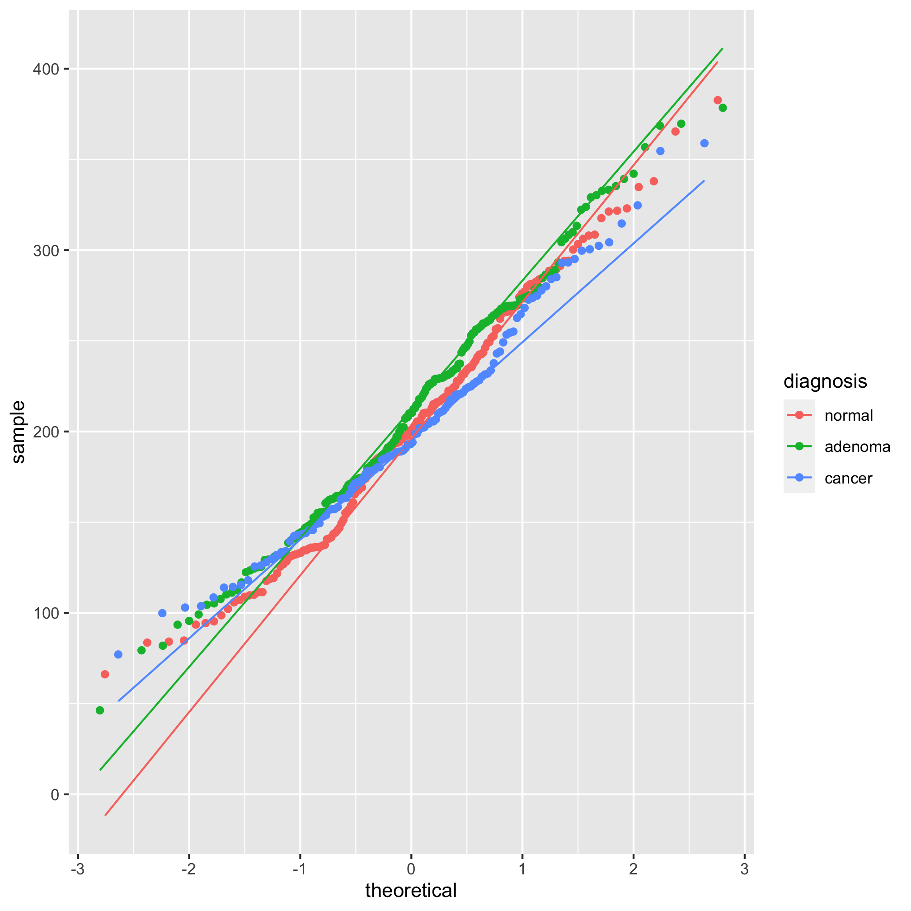

The curve holds water so we might try transforming with the square root


```r
meta_alpha <- mutate(meta_alpha, scaled_sobs=sobs^0.5)

ggplot(meta_alpha, aes(sample=scaled_sobs, group=diagnosis, color=diagnosis)) +
	geom_qq() + stat_qq_line()
```

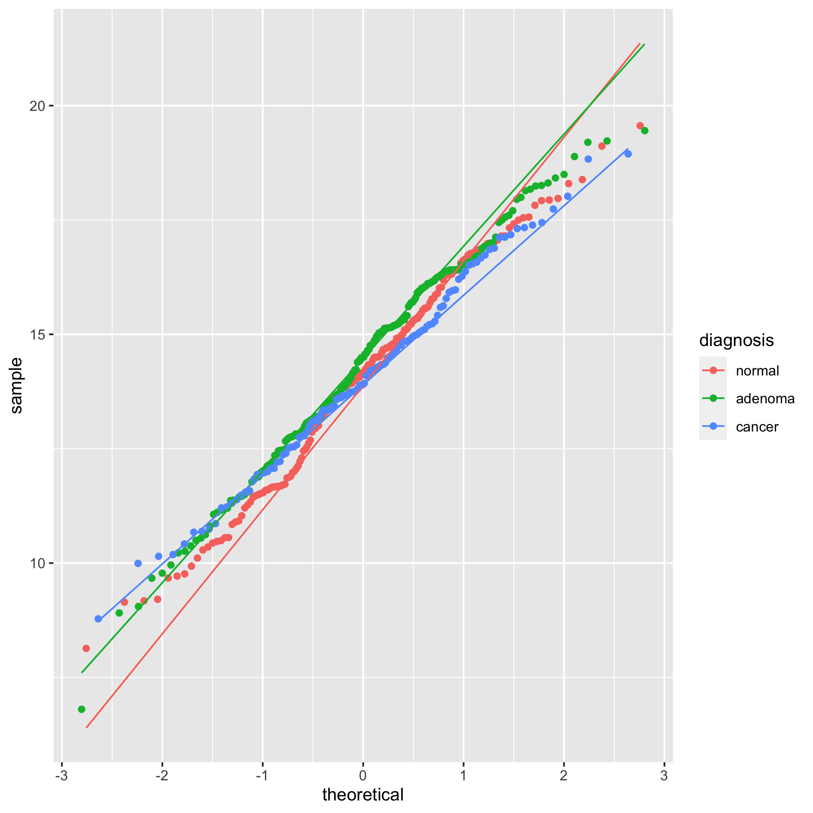

That doesn't look horrible...


```r
ggplot(meta_alpha, aes(x=sobs)) + geom_histogram()
ggplot(meta_alpha, aes(x=scaled_sobs)) + geom_histogram()
```

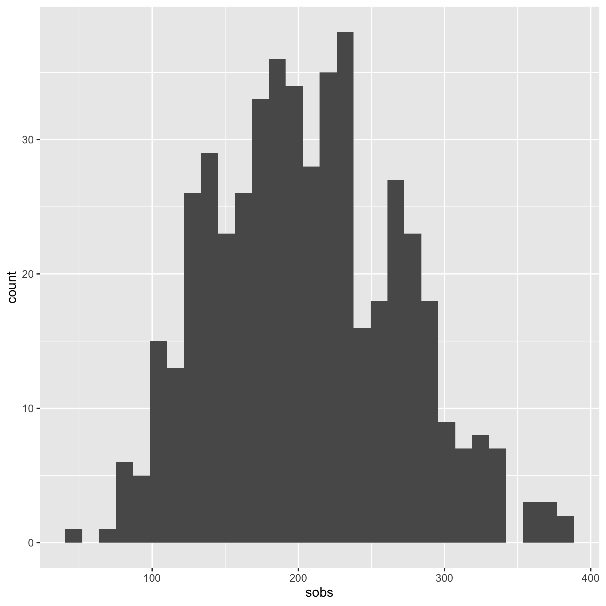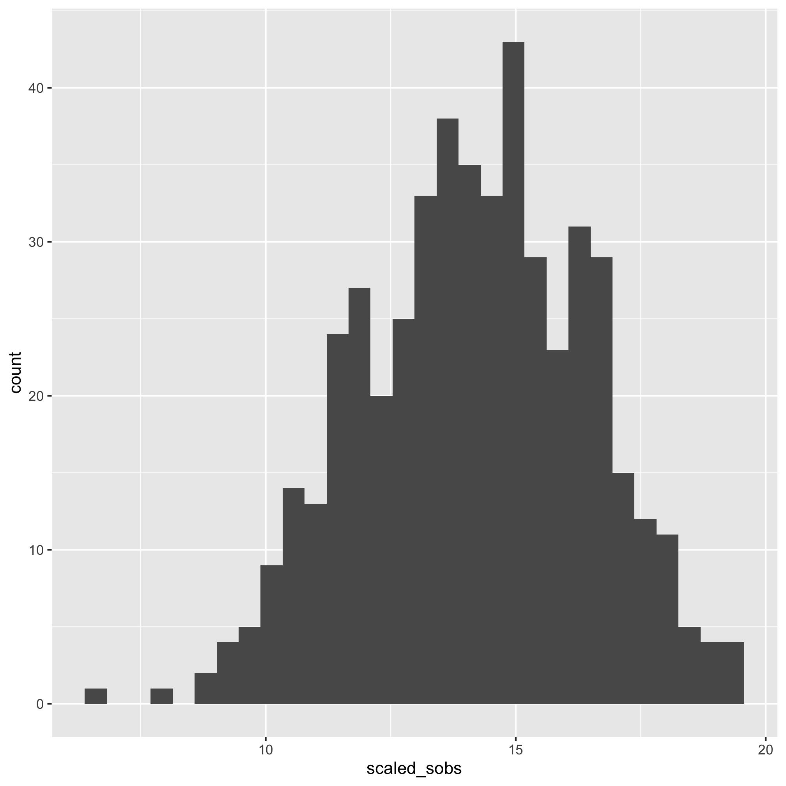

Good enough...


```r
diagnosis_sobs_aov <- aov(scaled_sobs~diagnosis, data=meta_alpha)
summary(diagnosis_sobs_aov)
```

```
##              Df Sum Sq Mean Sq F value Pr(>F)
## diagnosis     2   12.6   6.293   1.244  0.289
## Residuals   487 2463.3   5.058
```

Not significant.
</div>

---

### Activity 4
Is there a significant difference in the FIT result by diagnosis group?

<input type="button" class="hideshow">
<div markdown="1" style="display:none;">

```r
kruskal.test(fit_result~diagnosis, data=meta_alpha)
```

```
## 
## 	Kruskal-Wallis rank sum test
## 
## data:  fit_result by diagnosis
## Kruskal-Wallis chi-squared = 218.91, df = 2, p-value < 2.2e-16
```

Yes, the P-value is quite small. Let's perform the pairwise Wilcoxon tests


```r
pairwise.wilcox.test(g=meta_alpha$diagnosis, x=meta_alpha$fit_result, p.adjust.method="BH")
```

```
## 
## 	Pairwise comparisons using Wilcoxon rank sum test with continuity correction 
## 
## data:  meta_alpha$fit_result and meta_alpha$diagnosis 
## 
##         normal  adenoma
## adenoma 1.2e-08 -      
## cancer  < 2e-16 < 2e-16
## 
## P value adjustment method: BH
```

The three diagnosis groups have significantly different FIT results even after comparing for multiple comparisons.
</div>

---

## Testing multiple hypotheses at once
I'd like to know whether the Shannon diversity varies by diagnosis, sex, or smoking status. Let's think through how to do this. We could run `kruskal.test` multiple times. This isn't particularly DRY. We could also use `pivot_longer` to make a column that we could call characteristic that contains the values "diagnosis", "sex", and "smoke" and a column that contains the value for those characteristics. Then we could use our `nest`/`mutate`/`map`/`unnest` workflow to generate a table with p-values. Let's give that a shot.


```r
meta_alpha %>%
	select(sample, shannon, diagnosis, sex, smoke) %>%
	pivot_longer(cols=c(diagnosis, sex, smoke), names_to="characteristic", values_to="value")
```

```
## Error: Can't combine `diagnosis` <character> and `smoke` <logical>.
```

Oops we get an error. It doesn't like that we're trying to combine columns that are different types of data. Let's recast those columns to all be character vectors with the `as.character` function and try again


```r
meta_alpha %>%
	mutate(diagnosis = as.character(diagnosis),
		sex = as.character(sex), #unnecessary since it's already a character vector
		smoke = as.character(smoke)) %>%
	select(sample, shannon, diagnosis, sex, smoke) %>%
	pivot_longer(cols=c(diagnosis, sex, smoke), names_to="characteristic", values_to="value")
```

```
## # A tibble: 1,470 x 4
##    sample  shannon characteristic value  
##    <chr>     <dbl> <chr>          <chr>  
##  1 2003650    4.02 diagnosis      normal 
##  2 2003650    4.02 sex            male   
##  3 2003650    4.02 smoke          <NA>   
##  4 2005650    3.98 diagnosis      normal 
##  5 2005650    3.98 sex            male   
##  6 2005650    3.98 smoke          FALSE  
##  7 2007660    3.91 diagnosis      normal 
##  8 2007660    3.91 sex            female 
##  9 2007660    3.91 smoke          FALSE  
## 10 2009650    4.16 diagnosis      adenoma
## # … with 1,460 more rows
```

Nice. I notice that we do have a few `NA` values in the data frame so let's go ahead and drop those rows.


```r
meta_alpha %>%
	mutate(diagnosis = as.character(diagnosis),
		sex = as.character(sex), #unnecessary since it's already a character vector
		smoke = as.character(smoke)) %>%
	select(sample, shannon, diagnosis, sex, smoke) %>%
	pivot_longer(cols=c(diagnosis, sex, smoke), names_to="characteristic", values_to="value") %>%
	drop_na()
```

```
## # A tibble: 1,464 x 4
##    sample  shannon characteristic value  
##    <chr>     <dbl> <chr>          <chr>  
##  1 2003650    4.02 diagnosis      normal 
##  2 2003650    4.02 sex            male   
##  3 2005650    3.98 diagnosis      normal 
##  4 2005650    3.98 sex            male   
##  5 2005650    3.98 smoke          FALSE  
##  6 2007660    3.91 diagnosis      normal 
##  7 2007660    3.91 sex            female 
##  8 2007660    3.91 smoke          FALSE  
##  9 2009650    4.16 diagnosis      adenoma
## 10 2009650    4.16 sex            female 
## # … with 1,454 more rows
```

Now we can go ahead and do our `nest`/`mutate`/`map`/`unnest` workflow


```r
meta_alpha %>%
	mutate(diagnosis = as.character(diagnosis),
		sex = as.character(sex), #unnecessary since it's already a character vector
		smoke = as.character(smoke)) %>%
	select(sample, shannon, diagnosis, sex, smoke) %>%
	pivot_longer(cols=c(diagnosis, sex, smoke), names_to="characteristic", values_to="value") %>%
	drop_na() %>%
	nest(data = -characteristic) %>%
	mutate(tests = map(data, ~tidy(kruskal.test(shannon ~ value, data=.x)))) %>%
	unnest(cols=tests) %>%
	select(-data)
```

```
## # A tibble: 3 x 5
##   characteristic statistic p.value parameter method                      
##   <chr>              <dbl>   <dbl>     <int> <chr>                       
## 1 diagnosis          3.58    0.167         2 Kruskal-Wallis rank sum test
## 2 sex                0.214   0.643         1 Kruskal-Wallis rank sum test
## 3 smoke              0.260   0.610         1 Kruskal-Wallis rank sum test
```

Viola! None of these tests appear to be significant, so we can probably move on from these univariate analyses. For completion, let's add a column with adjusted P-values. We can get these values with the `p.adjust` function.


```r
meta_alpha %>%
	mutate(diagnosis = as.character(diagnosis),
		sex = as.character(sex), #unnecessary since it's already a character vector
		smoke = as.character(smoke)) %>%
	select(sample, shannon, diagnosis, sex, smoke) %>%
	pivot_longer(cols=c(diagnosis, sex, smoke), names_to="characteristic", values_to="value") %>%
	drop_na() %>%
	nest(data = -characteristic) %>%
	mutate(tests = map(data, ~tidy(kruskal.test(shannon ~ value, data=.x)))) %>%
	unnest(cols=tests) %>%
	select(-data) %>%
	mutate(p.value.adj = p.adjust(p.value, method="BH"))
```

```
## # A tibble: 3 x 6
##   characteristic statistic p.value parameter method                  p.value.adj
##   <chr>              <dbl>   <dbl>     <int> <chr>                         <dbl>
## 1 diagnosis          3.58    0.167         2 Kruskal-Wallis rank su…       0.501
## 2 sex                0.214   0.643         1 Kruskal-Wallis rank su…       0.643
## 3 smoke              0.260   0.610         1 Kruskal-Wallis rank su…       0.643
```

### Activity 5
Generate a table with adjusted P-values indicating whether the variation in fit_result data is significant across diagnosis groups for each site separately.

<input type="button" class="hideshow">
<div markdown="1" style="display:none;">

```r
meta_alpha %>%
	select(sample, fit_result, diagnosis, site) %>%
	nest(data = -site) %>%
	mutate(tests = map(data, ~tidy(kruskal.test(fit_result ~ diagnosis, data=.x)))) %>%
	unnest(cols=tests) %>%
	select(-data) %>%
	mutate(p.value.adj = p.adjust(p.value, method="BH"))
```

```
## # A tibble: 4 x 6
##   site        statistic  p.value parameter method                    p.value.adj
##   <chr>           <dbl>    <dbl>     <int> <chr>                           <dbl>
## 1 U Michigan       46.2 9.07e-11         2 Kruskal-Wallis rank sum …    1.21e-10
## 2 Toronto          39.3 2.93e- 9         2 Kruskal-Wallis rank sum …    2.93e- 9
## 3 Dana Farber      60.8 6.13e-14         2 Kruskal-Wallis rank sum …    1.23e-13
## 4 MD Anderson      65.3 6.68e-15         2 Kruskal-Wallis rank sum …    2.67e-14
```
</div>

---


## Comparing continuous by continuous variables
Sometimes we would like to know whether two variables are correlated with each other. For example, is someone's BMI correlated with their Shannon diversity? Is FIT result correlated with age? Is the FIT result correlated with their Shannon diversity? To test for these types of correlations we can use the `cor.test` function


```r
meta_alpha <- meta_alpha %>%
	mutate(bmi = get_bmi(weight_kg=weight, height_cm=height))

cor.test(meta_alpha$shannon, meta_alpha$bmi)
```

```
## 
## 	Pearson's product-moment correlation
## 
## data:  meta_alpha$shannon and meta_alpha$bmi
## t = -2.3142, df = 486, p-value = 0.02107
## alternative hypothesis: true correlation is not equal to 0
## 95 percent confidence interval:
##  -0.19138925 -0.01578278
## sample estimates:
##        cor 
## -0.1043997
```

```r
cor.test(meta_alpha$fit_result, meta_alpha$age)
```

```
## 
## 	Pearson's product-moment correlation
## 
## data:  meta_alpha$fit_result and meta_alpha$age
## t = 1.0154, df = 488, p-value = 0.3104
## alternative hypothesis: true correlation is not equal to 0
## 95 percent confidence interval:
##  -0.04284033  0.13395240
## sample estimates:
##        cor 
## 0.04591557
```

```r
cor.test(meta_alpha$fit_result, meta_alpha$shannon)
```

```
## 
## 	Pearson's product-moment correlation
## 
## data:  meta_alpha$fit_result and meta_alpha$shannon
## t = -1.1199, df = 488, p-value = 0.2633
## alternative hypothesis: true correlation is not equal to 0
## 95 percent confidence interval:
##  -0.13858973  0.03812301
## sample estimates:
##         cor 
## -0.05062962
```

We see that Shannon diversity has a significant negative correlation with BMI, albeit a small correlation (R=-0.1043997). But there is no significant correlation between FIT result and age or Shannon diversity. To explore this correlation a bit further, we can fit a regression line through the data using the `lm` (i.e. linear model) function


```r
lm_shannon_bmi <- lm(shannon~bmi, data=meta_alpha)
summary(lm_shannon_bmi)
```

```
## 
## Call:
## lm(formula = shannon ~ bmi, data = meta_alpha)
## 
## Residuals:
##      Min       1Q   Median       3Q      Max 
## -2.35664 -0.26872  0.04092  0.32429  1.02171 
## 
## Coefficients:
##              Estimate Std. Error t value Pr(>|t|)    
## (Intercept)  3.802808   0.104823  36.278   <2e-16 ***
## bmi         -0.008724   0.003770  -2.314   0.0211 *  
## ---
## Signif. codes:  0 '***' 0.001 '**' 0.01 '*' 0.05 '.' 0.1 ' ' 1
## 
## Residual standard error: 0.4546 on 486 degrees of freedom
##   (2 observations deleted due to missingness)
## Multiple R-squared:  0.0109,	Adjusted R-squared:  0.008864 
## F-statistic: 5.355 on 1 and 486 DF,  p-value: 0.02107
```

The slope of the line where BMI is the x-axis and Shannon diversity is the y-axis is slightly negative. Again, it's significant, but ... meh. We can also test whether the regression changes by diagnosis group


```r
lm_shannon_bmi <- lm(shannon~bmi + diagnosis, data=meta_alpha)
summary(lm_shannon_bmi)
```

```
## 
## Call:
## lm(formula = shannon ~ bmi + diagnosis, data = meta_alpha)
## 
## Residuals:
##      Min       1Q   Median       3Q      Max 
## -2.36144 -0.26818  0.04287  0.32556  1.01510 
## 
## Coefficients:
##                   Estimate Std. Error t value Pr(>|t|)    
## (Intercept)       3.798312   0.109538  34.676   <2e-16 ***
## bmi              -0.008249   0.003853  -2.141   0.0328 *  
## diagnosisadenoma -0.001477   0.047563  -0.031   0.9752    
## diagnosiscancer  -0.032234   0.054929  -0.587   0.5576    
## ---
## Signif. codes:  0 '***' 0.001 '**' 0.01 '*' 0.05 '.' 0.1 ' ' 1
## 
## Residual standard error: 0.4553 on 484 degrees of freedom
##   (2 observations deleted due to missingness)
## Multiple R-squared:  0.01175,	Adjusted R-squared:  0.00562 
## F-statistic: 1.917 on 3 and 484 DF,  p-value: 0.1258
```

We see that the impact of BMI is significant, but that there's no meaningful difference between the three diagnosis groups.

By default, `cor.test` performs a Pearson correlation, which assumes a linear relationship between the two variables. Having seen the FIT result distribution a few times now, we might suspect that it has a non-linear association with other variables. We can test the association with a Spearman correlation.


```r
cor.test(meta_alpha$shannon, meta_alpha$bmi, method="spearman")
```

```
## 
## 	Spearman's rank correlation rho
## 
## data:  meta_alpha$shannon and meta_alpha$bmi
## S = 21505495, p-value = 0.01477
## alternative hypothesis: true rho is not equal to 0
## sample estimates:
##        rho 
## -0.1103069
```

```r
cor.test(meta_alpha$fit_result, meta_alpha$age, method="spearman")
```

```
## 
## 	Spearman's rank correlation rho
## 
## data:  meta_alpha$fit_result and meta_alpha$age
## S = 17398058, p-value = 0.01254
## alternative hypothesis: true rho is not equal to 0
## sample estimates:
##     rho 
## 0.11271
```

```r
cor.test(meta_alpha$fit_result, meta_alpha$shannon, method="spearman")
```

```
## 
## 	Spearman's rank correlation rho
## 
## data:  meta_alpha$fit_result and meta_alpha$shannon
## S = 21404548, p-value = 0.04265
## alternative hypothesis: true rho is not equal to 0
## sample estimates:
##         rho 
## -0.09161851
```

Now we get significant P-values for these comparisons, but we see that the rho values are quite small. We also get a warning message that an exact p-value cannot be calculated when there are ties such as those that occur because multiple subjects have a value of zero for their FIT result.

We can plot these associations on our scatter plots with the `geom_smooth` function and giving it the linear model `method` (i.e. `lm`)


```r
ggplot(meta_alpha, aes(x=bmi, y=shannon, color=diagnosis)) +
	geom_point() +
	geom_smooth(method="lm") +
	scale_color_manual(name=NULL,
		values=c("black", "blue", "red"),
		breaks=c("normal", "adenoma", "cancer"),
		labels=c("Normal", "Adenoma", "Cancer")) +
	labs(title="There is a significant, but small negative association between a person's BMI\nand their Shannon diversity",
		x="Body Mass Index (BMI)",
		y="Shannon Diversity Index") +
	theme_classic()
```

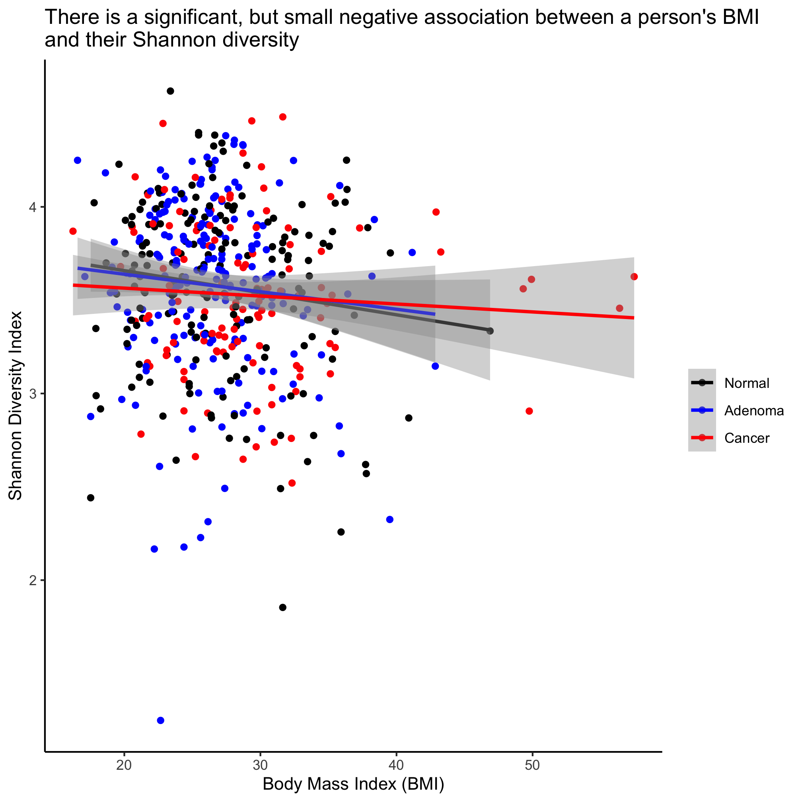

This plots the regression lines with the cloud around the line indicating the 95% confidence interval. We noted above that our regression analysis indicated that there wasn't a statistical difference between the diagnosis groups. If we want a single line through the data, then we can overwrite the `color` aesthetic in `geom_smooth`


```r
ggplot(meta_alpha, aes(x=bmi, y=shannon, color=diagnosis)) +
	geom_point() +
	geom_smooth(method="lm", color="gray") +
	scale_color_manual(name=NULL,
		values=c("black", "blue", "red"),
		breaks=c("normal", "adenoma", "cancer"),
		labels=c("Normal", "Adenoma", "Cancer")) +
	labs(title="There is a significant, but small negative association between a person's BMI\nand their Shannon diversity",
		x="Body Mass Index (BMI)",
		y="Shannon Diversity Index") +
	theme_classic()
```

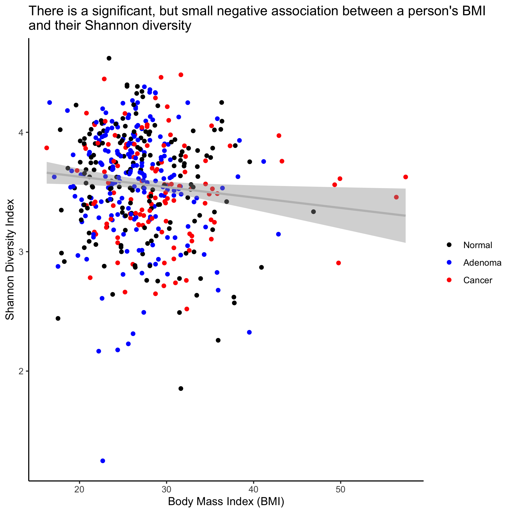

---

### Activity 6
In the scatter plot where we drew three regression lines the legend changed to have a gray background behind the points and a line was drawn with the points. This is effectively a merge between the legend of the `geom_point` and `geom_smooth` layers. How do we remove the `geom_smooth` legend so that our legend only contains the simple plotting character?

<input type="button" class="hideshow">
<div markdown="1" style="display:none;">

```r
ggplot(meta_alpha, aes(x=bmi, y=shannon, color=diagnosis)) +
	geom_point() +
	geom_smooth(method="lm", show.legend=FALSE) +
	scale_color_manual(name=NULL,
		values=c("black", "blue", "red"),
		breaks=c("normal", "adenoma", "cancer"),
		labels=c("Normal", "Adenoma", "Cancer")) +
	labs(title="There is a significant, but small negative association between a person's BMI\nand their Shannon diversity",
		x="Body Mass Index (BMI)",
		y="Shannon Diversity Index") +
	theme_classic()
```


</div>


---

### Activity 7
Is there a significant association between the number of OTUs in a person's fecal samples and their BMI and sex? Run the test and show a plot of the relevant fit of the data.


<input type="button" class="hideshow">
<div markdown="1" style="display:none;">

```r
lm_sobs_bmi_sex <- lm(sobs~bmi+sex, data=meta_alpha)
summary(lm_sobs_bmi_sex)
```

```
## 
## Call:
## lm(formula = sobs ~ bmi + sex, data = meta_alpha)
## 
## Residuals:
##      Min       1Q   Median       3Q      Max 
## -168.307  -49.136   -3.455   45.344  176.230 
## 
## Coefficients:
##             Estimate Std. Error t value Pr(>|t|)    
## (Intercept) 250.8916    14.5981  17.187   <2e-16 ***
## bmi          -1.6010     0.5247  -3.051   0.0024 ** 
## sexmale      -2.7168     5.7278  -0.474   0.6355    
## ---
## Signif. codes:  0 '***' 0.001 '**' 0.01 '*' 0.05 '.' 0.1 ' ' 1
## 
## Residual standard error: 62.97 on 485 degrees of freedom
##   (2 observations deleted due to missingness)
## Multiple R-squared:  0.02001,	Adjusted R-squared:  0.01597 
## F-statistic: 4.953 on 2 and 485 DF,  p-value: 0.007425
```

The effect of BMI is statistically significant, but not with the subject's sex.


```r
ggplot(meta_alpha, aes(x=bmi, y=sobs, color=sex)) +
	geom_point() +
	geom_smooth(method="lm", color="gray") +
	scale_color_manual(name=NULL,
		values=c("lightgreen", "orange"),
		breaks=c("female", "male"),
		labels=c("Female", "Male")) +
	labs(title="There is a significant, but small negative association between a person's BMI\nand the number of OTUs in their feces",
		x="Body Mass Index (BMI)",
		y="Number of observed OTUs") +
	theme_classic()
```

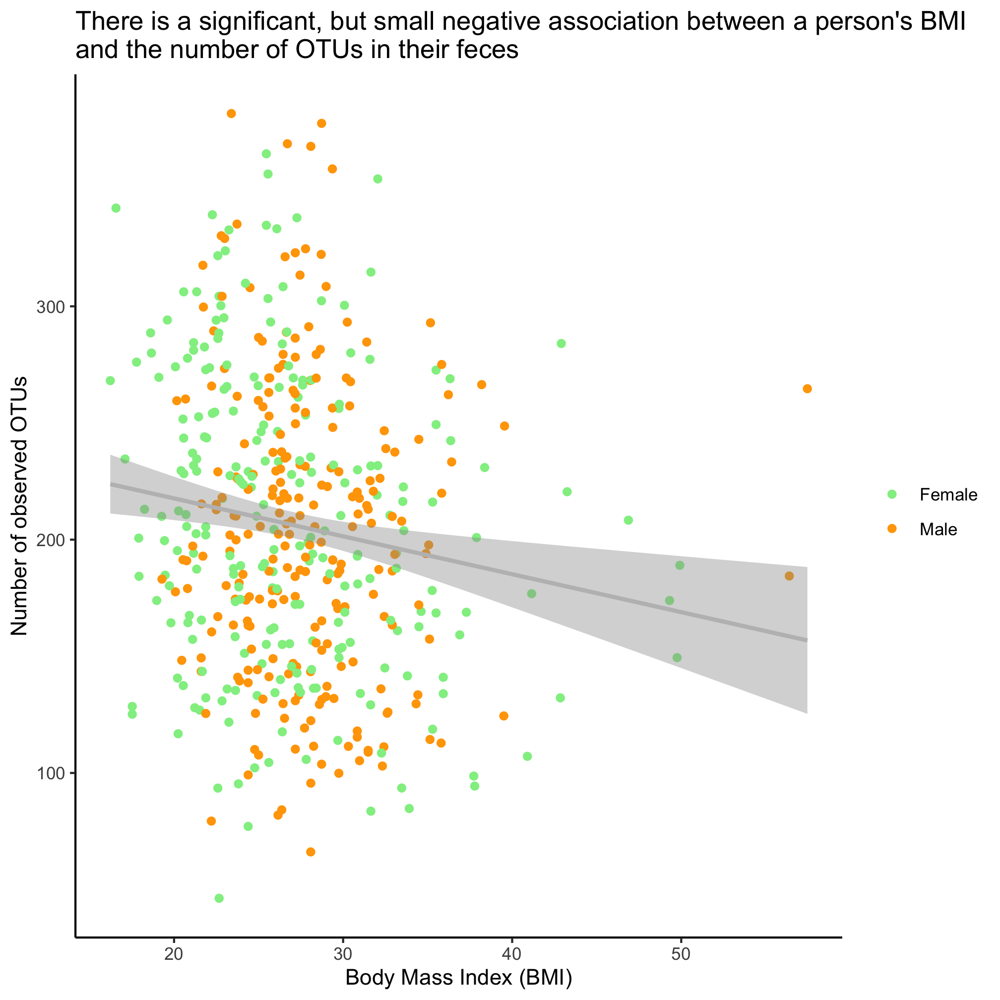
</div>

---

### Activity 8
Returning to the scatter plot showing the negative relationship between Shannon diversity and BMI, add an annotation to the field of the plot that indicates the Spearman rho value and p-value. To do this you will need to parse the output of `cor.test` and use the `geom_text` function. You can also use `paste` and `round` to format the numbers to look nice. Use the `?` function and google if you run into a problem.

<input type="button" class="hideshow">
<div markdown="1" style="display:none;">

```r
test <- cor.test(meta_alpha$shannon, meta_alpha$bmi, method="spearman")
p <- paste("P-value:", round(test$p.value, digits=2))
rho <- paste("rho:", round(test$estimate, digits=2))
annotation <- paste(p, rho, sep="\n")

ggplot(meta_alpha, aes(x=bmi, y=shannon, color=diagnosis)) +
	geom_point() +
	geom_smooth(method="lm", color="gray") +
	geom_text(aes(x=50, y=2, label=annotation), color="black", hjust = "left") +
	scale_color_manual(name=NULL,
		values=c("black", "blue", "red"),
		breaks=c("normal", "adenoma", "cancer"),
		labels=c("Normal", "Adenoma", "Cancer")) +
	labs(title="There is a significant, but small negative association between a person's BMI\nand their Shannon diversity",
		x="Body Mass Index (BMI)",
		y="Shannon Diversity Index") +
	theme_classic()
```

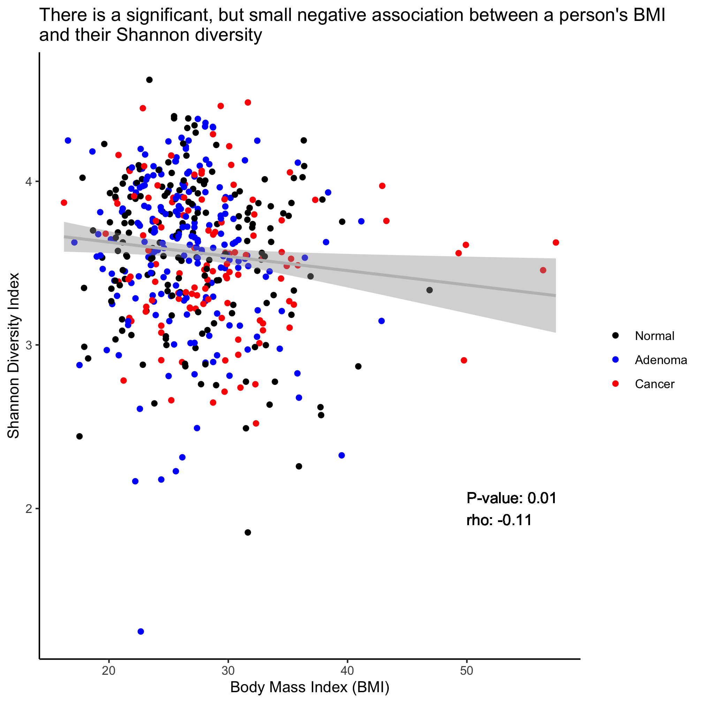
</div>

---

## Comparing discrete variables
We might also be interested in knowing whether two discrete variables have the same distribution. For example, within our cohort, are men and women equally likely to have adenomas and carcinomas? Is there variation in obesity status and diagnosis? Let's start with the first question and leave the second for an activity for you to work on. We can test this association using a Chi-Squared test of association using the `chisq.test` function


```r
chisq.test(x=meta_alpha[["sex"]], y=meta_alpha[["diagnosis"]])
```

```
## 
## 	Pearson's Chi-squared test
## 
## data:  meta_alpha[["sex"]] and meta_alpha[["diagnosis"]]
## X-squared = 23.93, df = 2, p-value = 6.363e-06
```

We see that the P-value for this difference is quite small and so we can conclude that within our cohort there is a significant difference in the proportion of men and women who have a diagnosis of an adenoma or carcinoma. We can visualize this with the `geom_count` function.


```r
ggplot(meta_alpha, aes(x=sex, y=diagnosis)) +
	geom_count() +
	scale_x_discrete(name=NULL,
		breaks=c("female", "male"),
		labels=c("Female", "Male")) +
	scale_y_discrete(name=NULL,
		breaks=c("normal", "adenoma", "cancer"),
		labels=c("Normal", "Adenoma", "Cancer")) +
	scale_size_continuous(name=NULL) +
	labs(title="There is significant variation in the likelihood that men or women will\ndevelop lesions",
		x="Body Mass Index (BMI)",
		y="Number of observed OTUs") +
	theme_classic()
```

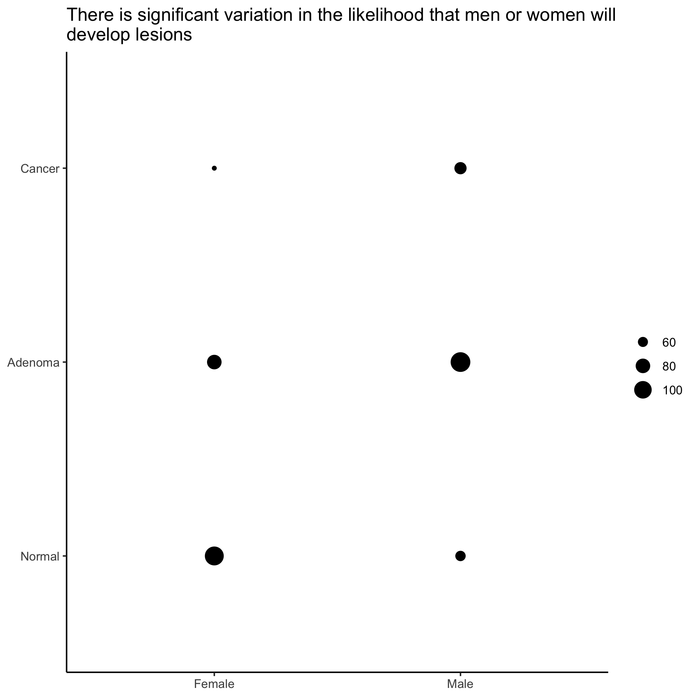

Not that size of circles is generally pretty hard for people to differentiate, so this isn't necessarily the best visualization tool. To see how to scale the circles by proportions you should see the examples in the `?geom_count` documentation.


---

### Activity 9
Is there significant variation in site and diagnosis?

<input type="button" class="hideshow">
<div markdown="1" style="display:none;">

```r
chisq.test(x=meta_alpha[["site"]], y=meta_alpha[["diagnosis"]])
```

```
## 
## 	Pearson's Chi-squared test
## 
## data:  meta_alpha[["site"]] and meta_alpha[["diagnosis"]]
## X-squared = 152.46, df = 6, p-value < 2.2e-16
```

The P-value is quite small


```r
ggplot(meta_alpha, aes(x=site, y=diagnosis)) +
	geom_count() +
	scale_y_discrete(name=NULL,
		breaks=c("normal", "adenoma", "cancer"),
		labels=c("Normal", "Adenoma", "Cancer")) +
	scale_size_continuous(name=NULL) +
	labs(title="There is significant variation in the diagnosis group and\nthe site where the subjects were recruited",
		x=NULL) +
	theme_classic()
```

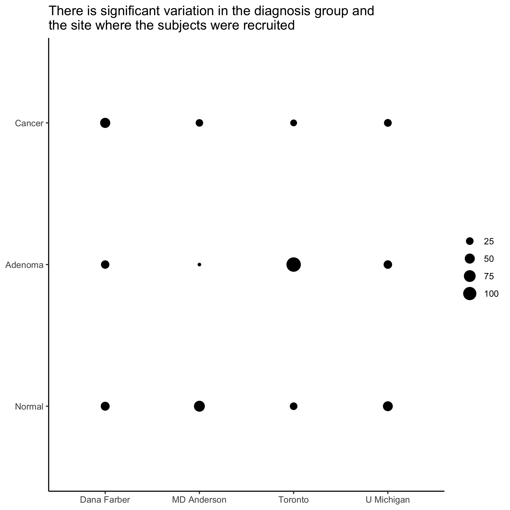
</div>
