## Topics
* Complex string manipulations
* Regular expressions
* Representing taxonomic data
* Customizing axes
* Developing multistep workflow to answer a problem


## Motivation
To this point our analysis has looked at alpha and beta diversity values for our samples. We'd like to start drilling into the data to get a better sense of the types of organisms that might differ between the three diagnosis groups. What we'd like to do is to generate plots to describe the biodiversity of the three diagnosis groups. In the next session we'll work with OTU data describing biodiversity at the phylum and OTU level. We'll need to manipulate the data in three steps. First, in the `raw_data` folder there is a file called `baxter.cons.taxonomy` that contains the taxonomic information for each OTU that was observed when defining OTUs at a 3% distance cutoff. To build our plots we need to find the different phyla in that file. Second, we need to aggregate the data in the `baxter.subsample.shared` file by those phyla. Third, we will probably need to aggregate the data for each subject across individuals within a diagnosis group. Ready? Let's go!


## Processing taxonomy data
We'll start by reading in the data contained within `baxter.cons.taxonomy` to a data frame we'll call `taxonomy`. The column headings are all capitalized, so we'll want to make them lower cased to avoid confusion down the road...


```r
library(tidyverse)
taxonomy <- read_tsv(file="raw_data/baxter.cons.taxonomy") %>%
		rename_all(tolower)
```

If you take a peak at this data frame you'll notice a few things. The first column is the OTU label and it has the format of "Otu######" where "#" is a number. You'll also notice that the third column, `taxonomy`, contains the taxonomic information that we're interested in. The values of this column have a format like `Bacteria(100);Firmicutes(100);Clostridia(100);Clostridiales(100);Lachnospiraceae(100);Blautia(100);`. This is a `mothur` convention that indicates the taxonomic name at each level with each level separated by a semicolon (i.e. ';'). Each taxonomic name also has a name (e.g. "Firmicutes") followed by a pair of parentheses with a number inside of them (e.g. "(100)"). We would like to write a function to parse these strings to return a data frame where the values are the OTU names and the names for each taxonomic level so that we can aggregate our OTU data by taxonomic level. From the previous session you may recall that we used the `str_replace_all` function to find a pattern in a vector of characters and replace with a new string. We saw how we could remove `0.03-` with a function call like this:


```r
str_replace_all(string="0.03-2003650", pattern="0.03-", replacement="")
```

```
## [1] "2003650"
```

This was a relatively simple pattern. Looking at the values in the "taxonomy" column of the `taxonomy` data frame there are a number of different values that are quite similar with a similar format. We'd like to find a pattern that matches the parentheses and numbers in between and replaces them with an empty string. This helps us get into some more advanced patterns. Fortunately, R has several "metacharacters" that you can think of as being generic representations of numbers, alphanumeric characters, and white spaces. You can learn more about these and many others by looking at the material in `?regex` or on the handy [RStudio cheat sheet](https://www.rstudio.com/wp-content/uploads/2016/09/RegExCheatsheet.pdf). Let's look at some examples before we apply these tools to our problem. Can you tell what each of these three metacharacters does?


```r
string <- "My phone number is (555)555-1234"
str_replace_all(pattern='\\s', replacement="_", string)
```

```
## [1] "My_phone_number_is_(555)555-1234"
```

```r
str_replace(pattern='\\s', replacement="_", string) #str_replace does what str_replace_all does once
```

```
## [1] "My_phone number is (555)555-1234"
```

```r
str_replace_all(pattern='\\d', replacement="#", string)
```

```
## [1] "My phone number is (###)###-####"
```

```r
str_replace_all(pattern='\\w', replacement="*", string)
```

```
## [1] "** ***** ****** ** (***)***-****"
```

```r
str_replace_all(pattern='.', replacement="x", string)
```

```
## [1] "xxxxxxxxxxxxxxxxxxxxxxxxxxxxxxxx"
```

```r
str_replace_all(pattern='[-]', replacement=" ", string)
```

```
## [1] "My phone number is (555)555 1234"
```

```r
str_replace_all(pattern='[()-]', replacement=" ", string)
```

```
## [1] "My phone number is  555 555 1234"
```

```r
str_replace_all(pattern='[^()-]', replacement=" ", string)
```

```
## [1] "                   (   )   -    "
```

```r
str_replace_all(pattern='\\d', replacement="#", string)
```

```
## [1] "My phone number is (###)###-####"
```

```r
str_replace_all(pattern='m', replacement="*", string, ignore.case=T)
```

```
## Error in str_replace_all(pattern = "m", replacement = "*", string, ignore.case = T): unused argument (ignore.case = T)
```

Got it? We can string these together to produce a pattern to represent a phone number:


```r
str_replace_all(pattern='[(]\\d\\d\\d[)]\\d\\d\\d-\\d\\d\\d\\d', replacement="<redacted>", string)
```

```
## [1] "My phone number is <redacted>"
```

Do you see what's happening there? If we want to match parentheses, we used `[(]` and `[)]`. Alternatively, we could have used `\\(` and `\\)`. The `\\` is necessary because the naked parentheses will be useful in a moment. For now let's stick with the bracket notation. We match the parentheses and the three numbers (i.e. `\\d\\d\\d`) within them. Then we match another three numbers, a hyphen and then four more numbers. If our phone number has a different pattern - say we don't use parentheses around the area code, `str_replace_all` won't work like we want. Instead of repeating `\\d` over and over, we can use a quantifier to match the numbers.


```r
str_replace_all(pattern='[(]\\d{3}[)]\\d{3}-\\d{4}', replacement="<redacted>", string)
```

```
## [1] "My phone number is <redacted>"
```

This is the same pattern as we had before, but much simpler. It's worth noting that we could have used `\\d{5,}` to match five or more consecutive numbers, `\\d{,5}` to match five or fewer consecutive numbers or `\\d{1,5}` to match one to five consecutive numbers. Let's consider a new set of strings. Incidentally, we've seen this before, but `c(something, something_else)` creates what is called a "vector". Think of it as being like a column from our data frames:


```r
string <- c("My phone number is (555)555-1234", "Suzy's phone number is 555-555-9876")
str_replace_all(pattern='[(]\\d{3}[)]\\d{3}-\\d{4}', replacement="<redacted>", string)
```

```
## [1] "My phone number is <redacted>"       "Suzy's phone number is 555-555-9876"
```

You should see that Suzy's phone number was not redacted. We would like to manipulate our regular expression to accommodate both phone numbers. We can do this using another type of quantifier - the `?`, which represents 0 or 1 instances of the character:


```r
string <- c("My phone number is (555)555-1234", "Suzy's phone number is 555-555-9876")
str_replace_all(pattern='[(]?\\d{3}[)-]?\\d{3}-\\d{4}', replacement="<redacted>", string)
```

```
## [1] "My phone number is <redacted>"     "Suzy's phone number is <redacted>"
```

See that? By putting a `?` after the `[()]` we ask `str_replace_all` to match a patten that may or may not start with an opening parentheses. Similarly, after three numbers, we ask `str_replace_all` to match a string that may or may not contain a `)` or a `-`. Another quantifier we might want to use is `*`. This matches zero or more instances of the preceding character.


```r
string <- c("My phone number is (555)555-1234", "Suzy's phone number is 555-555-9876")
str_replace_all(pattern='.* ', replacement="", string)
```

```
## [1] "(555)555-1234" "555-555-9876"
```

The last tool that we can use is to replace an entire string with a substring. To do this we will use naked parentheses to wrap the substring that we want to preserve. In the replacement string we will use "\\1" to insert the substring. Let's suppose we want to extract the area code from each phone number. Can you see what these lines of code are doing?


```r
string <- c("My phone number is (555)555-1234", "Suzy's phone number is 555-555-9876")
str_replace_all(pattern='[(]?(\\d{3})[)-]?\\d{3}-\\d{4}', replacement="\\1", string)
```

```
## [1] "My phone number is 555"     "Suzy's phone number is 555"
```

```r
str_replace_all(pattern='.*[(]?(\\d{3})[)-]?\\d{3}-\\d{4}', replacement="\\1", string)
```

```
## [1] "555" "555"
```

```r
str_replace_all(pattern='.*[(]?(\\d{3})[)-]?\\d{3}-\\d{4}', replacement="Area code: \\1", string)
```

```
## [1] "Area code: 555" "Area code: 555"
```

```r
str_replace_all(pattern='.*[(]?(\\d{3})[)-]?(\\d{3})-(\\d{4})', replacement="Area code: \\1, Central office code: \\2, Private extension: \\3", string)
```

```
## [1] "Area code: 555, Central office code: 555, Private extension: 1234"
## [2] "Area code: 555, Central office code: 555, Private extension: 9876"
```

---

### Activity 1

Here is a data frame of strings


```r
string_df <- tibble(
	s = c(
	"Bacteria(100);Firmicutes(100);Clostridia(100);Clostridiales(100);Lachnospiraceae(100);Blautia(95);",
	"Bacteria(100);Firmicutes(100);Bacilli(100);Lactobacillales(100);Streptococcaceae(85);unclassified(100);",
	"Bacteria(100);unclassified(100);unclassified(100);unclassified(100);unclassified(100);unclassified(100);"
	))
```

Write the `str_replace_all` pattern and replacement that takes in `string_df` and returns

```
# A tibble: 3 x 1
  s               
  <chr>           
1 Blautia         
2 Streptococcaceae
3 Bacteria        
```

<input type="button" class="hideshow">
<div markdown="1" style="display:none;">
There are many many ways to do this...


```r
string_df %>%
	mutate(s=str_replace_all(s, "[\\(\\d\\)]", "")) %>%
	mutate(s=str_replace_all(s, "unclassified;", "")) %>%
	mutate(s=str_replace_all(s, "(.*);", "\\1")) %>%
	mutate(s=str_replace_all(s, ".*;(.*)", "\\1"))
```

```
## # A tibble: 3 x 1
##   s               
##   <chr>           
## 1 Blautia         
## 2 Streptococcaceae
## 3 Bacteria
```
</div>

---

As we were reminded in the last Activity, the taxonomy strings in `taxonomy` have this general format:

```
Bacteria(100);Firmicutes(100);Clostridia(100);Clostridiales(100);Lachnospiraceae(100);Blautia(100);
```

Our goal is to strip out the confidence scores and create a separate column in our data frame for each taxonomic level, which is separated by a `;`.  Let's start by removing the parentheses and the numbers between them. From the output of `taxonomy` it appears that all of the confidence scores are `100`. This could be pretty easy.


```r
taxonomy %>%
	mutate(taxonomy=str_replace_all(string=taxonomy, pattern="\\(100\\)", replacement=""))
```

```
## # A tibble: 9,467 x 3
##    otu         size taxonomy                                                    
##    <chr>      <dbl> <chr>                                                       
##  1 Otu000001 1.30e6 Bacteria;Firmicutes;Clostridia;Clostridiales;Lachnospiracea…
##  2 Otu000002 9.98e5 Bacteria;Bacteroidetes;Bacteroidia;Bacteroidales;Bacteroida…
##  3 Otu000003 8.27e5 Bacteria;Bacteroidetes;Bacteroidia;Bacteroidales;Bacteroida…
##  4 Otu000004 7.61e5 Bacteria;Verrucomicrobia;Verrucomicrobiae;Verrucomicrobiale…
##  5 Otu000005 7.40e5 Bacteria;Firmicutes;Clostridia;Clostridiales;Lachnospiracea…
##  6 Otu000006 6.94e5 Bacteria;Firmicutes;Clostridia;Clostridiales;Ruminococcacea…
##  7 Otu000007 6.82e5 Bacteria;Bacteroidetes;Bacteroidia;Bacteroidales;Bacteroida…
##  8 Otu000008 5.57e5 Bacteria;Firmicutes;Clostridia;Clostridiales;Lachnospiracea…
##  9 Otu000009 5.51e5 Bacteria;Firmicutes;Clostridia;Clostridiales;Lachnospiracea…
## 10 Otu000010 4.94e5 Bacteria;Firmicutes;Clostridia;Clostridiales;unclassified;u…
## # … with 9,457 more rows
```

The output is too big too look out both in terms of the number of rows and the width of our taxonomy column. Let's use another string matching tool to see whether any rows still have parentheses in them. This time we can use either the `grepl` or `str_detect` functions. These functions will return a `TRUE` or `FALSE` if our pattern matches the string. This makes them great for use with the `filter` function in a `dplyr` workflow. We'll also use the `select` function so we can see more of the "taxonomy" column.


```r
taxonomy %>%
	mutate(taxonomy=str_replace_all(string=taxonomy, pattern="\\(100\\)", replacement="")) %>%
	filter(str_detect(taxonomy, pattern="\\(")) %>%
	select(taxonomy)
```

```
## # A tibble: 338 x 1
##    taxonomy                                                                     
##    <chr>                                                                        
##  1 Bacteria;Firmicutes;Clostridia;Clostridiales;Lachnospiraceae;Roseburia(97);  
##  2 Bacteria;Firmicutes;Clostridia;Clostridiales;Lachnospiraceae;Blautia(97);    
##  3 Bacteria;Firmicutes;Clostridia;Clostridiales;Ruminococcaceae;Ruminococcus(69…
##  4 Bacteria;Firmicutes;Clostridia;Clostridiales;Lachnospiraceae;Ruminococcus2(5…
##  5 Bacteria;Firmicutes;Clostridia;Clostridiales;Ruminococcaceae;unclassified(99…
##  6 Bacteria;Firmicutes;Clostridia;Clostridiales;Peptostreptococcaceae;Clostridi…
##  7 Bacteria;Firmicutes;Clostridia;Clostridiales;Ruminococcaceae;unclassified(91…
##  8 Bacteria;Firmicutes;Clostridia;Clostridiales;Lachnospiraceae;Blautia(88);    
##  9 Bacteria;Firmicutes;Erysipelotrichia;Erysipelotrichales;Erysipelotrichaceae;…
## 10 Bacteria;Firmicutes;Clostridia;Clostridiales;Lachnospiraceae;Ruminococcus2(9…
## # … with 328 more rows
```

It looks like we didn't remove all of the confidence scores - ruh roh! How can we change the pattern in our `mutate` function? We could use the `\\d` metacharacter with the `*` quantifier to remove any number between parentheses.


```r
taxonomy %>%
	mutate(taxonomy=str_replace_all(string=taxonomy, pattern="\\(\\d*\\)", replacement="")) %>%
	filter(str_detect(taxonomy, pattern="\\(")) %>%
	select(taxonomy)
```

```
## # A tibble: 0 x 1
## # … with 1 variable: taxonomy <chr>
```

Nice - there's nothing there, which means that our filter command returned nothing. Now we'd like to split the "taxonomy" column into separate columns for each taxonomic level. We can do this easily with the `separate` function. For this function to work, we need to give it a delimiter to separate the strings by (i.e. `sep=";"`) and values to place on the new columns (i.e. `into=c("kingdom", "phylum", ..., "genus")`). If it's going to separate data by the `;`, then we will end up with a seventh column that doesn't contain any information in it because the final character in our taxonomy strings is a `;`. We need an additional `mutate` line to remove that final semicolon before running `separate`. But how do we remove the last `;` and not all of them? Looking at the [cheat sheet](https://www.rstudio.com/wp-content/uploads/2016/09/RegExCheatsheet.pdf), can you figure out how we can tell `str_replace_all` to match the last semicolon in the strings?


```r
taxonomy %>%
	mutate(taxonomy=str_replace_all(string=taxonomy, pattern="\\(\\d*\\)", replacement="")) %>%
	mutate(taxonomy=str_replace_all(string=taxonomy, pattern=";$", replacement="")) %>%
	separate(taxonomy, into=c("kingdom", "phylum", "class", "order", "family", "genus"), sep=";")
```

```
## # A tibble: 9,467 x 8
##    otu        size kingdom  phylum    class     order      family      genus    
##    <chr>     <dbl> <chr>    <chr>     <chr>     <chr>      <chr>       <chr>    
##  1 Otu000… 1301902 Bacteria Firmicut… Clostrid… Clostridi… Lachnospir… Blautia  
##  2 Otu000…  998089 Bacteria Bacteroi… Bacteroi… Bacteroid… Bacteroida… Bacteroi…
##  3 Otu000…  826705 Bacteria Bacteroi… Bacteroi… Bacteroid… Bacteroida… Bacteroi…
##  4 Otu000…  761110 Bacteria Verrucom… Verrucom… Verrucomi… Verrucomic… Akkerman…
##  5 Otu000…  740489 Bacteria Firmicut… Clostrid… Clostridi… Lachnospir… Roseburia
##  6 Otu000…  694460 Bacteria Firmicut… Clostrid… Clostridi… Ruminococc… Faecalib…
##  7 Otu000…  682137 Bacteria Bacteroi… Bacteroi… Bacteroid… Bacteroida… Bacteroi…
##  8 Otu000…  556768 Bacteria Firmicut… Clostrid… Clostridi… Lachnospir… Anaerost…
##  9 Otu000…  551496 Bacteria Firmicut… Clostrid… Clostridi… Lachnospir… Blautia  
## 10 Otu000…  493735 Bacteria Firmicut… Clostrid… Clostridi… unclassifi… unclassi…
## # … with 9,457 more rows
```

That's exactly what we want, so let's go ahead and save this over our taxonomy data frame


```r
taxonomy <- read_tsv(file="raw_data/baxter.cons.taxonomy") %>%
		rename_all(tolower) %>%
		mutate(taxonomy=str_replace_all(string=taxonomy, pattern="\\(\\d*\\)", replacement="")) %>%
		mutate(taxonomy=str_replace_all(string=taxonomy, pattern=";$", replacement="")) %>%
		separate(taxonomy, into=c("kingdom", "phylum", "class", "order", "family", "genus"), sep=";")
```

---

### Activity 2
Looking at the values in `taxonomy` we see a number of columns have "unclassified" as the value. Instead of parsing the taxonomy string to return all taxonomic names, can you find a way to generate a column that contains the deepest taxonomy that isn't "unclassified"? For example, if this was the taxonomy:

```
Bacteria(100);Firmicutes(100);Clostridia(100);Clostridiales(100);Ruminococcaceae(100);unclassified(100);
```

The output should return "Ruminococcaceae"

<input type="button" class="hideshow">
<div markdown="1" style="display:none;">

```r
read_tsv(file="raw_data/baxter.cons.taxonomy") %>%
		rename_all(tolower) %>%
		mutate(taxonomy=str_replace_all(string=taxonomy, pattern="\\(\\d*\\)", replacement="")) %>%
		mutate(taxonomy=str_replace_all(string=taxonomy, pattern="unclassified;", replacement="")) %>%
		mutate(taxonomy=str_replace_all(string=taxonomy, pattern=";$", replacement="")) %>%
		mutate(taxonomy=str_replace_all(string=taxonomy, pattern=".*;", replacement=""))
```

```
## # A tibble: 9,467 x 3
##    otu          size taxonomy        
##    <chr>       <dbl> <chr>           
##  1 Otu000001 1301902 Blautia         
##  2 Otu000002  998089 Bacteroides     
##  3 Otu000003  826705 Bacteroides     
##  4 Otu000004  761110 Akkermansia     
##  5 Otu000005  740489 Roseburia       
##  6 Otu000006  694460 Faecalibacterium
##  7 Otu000007  682137 Bacteroides     
##  8 Otu000008  556768 Anaerostipes    
##  9 Otu000009  551496 Blautia         
## 10 Otu000010  493735 Clostridiales   
## # … with 9,457 more rows
```
</div>

---

What I'd really like is a strip chart or box plot showing the relative abundance of each phylum in each subject segregated by diagnosis. We'll need to get our OTU data, make it tidy, join it with `taxonomy`, and then run it through the rest of our `dplyr` and `ggplot` steps. The OTU data is in `raw_data/baxter.subsample.shared`.


```r
otu_data <- read_tsv("raw_data/baxter.subsample.shared")
```

Looking at `shared` we see that the data frame is not tidy in the same way that our rarefaction curve data frame was not initially tidy. We'd like to have a data frame that has the "Group" or "sample" identifier as a column, a column with the OTU identifier, and a column with the number of sequences that were found for that OTU and group. See if you can do these steps without looking ahead.


```r
otu_data <- read_tsv("raw_data/baxter.subsample.shared", col_types=cols(Group=col_character())) %>%
	select(-label, -numOtus) %>%
	rename(sample=Group) %>%
	pivot_longer(cols=-sample, names_to="otu", values_to="count")
```

As we stated in our `pivot_longer` function syntax, these data are counts, not relative abundances. Let's create a "rel_abund" column. First we need to know the number of sequences in each sample


```r
otu_data %>% group_by(sample) %>% summarize(n=sum(count)) %>% summary()
```

```
##     sample                n        
##  Length:490         Min.   :10530  
##  Class :character   1st Qu.:10530  
##  Mode  :character   Median :10530  
##                     Mean   :10530  
##                     3rd Qu.:10530  
##                     Max.   :10530
```

We see that all of our samples have 10530 sequences in them. Now we can modify our previous code to get the relative abundance values


```r
otu_data <- read_tsv("raw_data/baxter.subsample.shared", col_types=cols(Group=col_character())) %>%
	select(-label, -numOtus) %>%
	rename(sample=Group) %>%
	pivot_longer(cols=-sample, names_to="otu", values_to="count") %>%
	mutate(rel_abund=count/10530)
```

Now we can join our `otu_data`, `metadata`, and `taxonomy` data frames together. These files can get big quick, so let's not generate a gigantic data frame all at once. We'll first join our `otu_data` and `taxonomy` data frames. With that we'll aggregate the relative abundance values for each subject and those OTUs that belong to each phylum. Because we were smart in naming our columns we can join our `otu_data` data frame will be merged with the `taxonomy` data frame using the "otu" column


```r
source('code/baxter.R')
agg_phylum_data <- inner_join(otu_data, taxonomy) %>%
		group_by(sample, phylum) %>%
		summarize(agg_rel_abund=sum(rel_abund))
```

Next we'll merge `agg_phylum_data` our metadata data frame using the "sample" columns in both data frames. Let's do this in one step:


```r
source('code/baxter.R')
agg_phylum_data <- inner_join(otu_data, taxonomy) %>%
		group_by(sample, phylum) %>%
		summarize(agg_rel_abund=sum(rel_abund)) %>%
		inner_join(., get_metadata()) %>%
		ungroup() #without this, the sample and phylum columns remain grouped
```

I'm curious what the median relative abundances are for each phylum. I suspect that there are some phyla that are super rare that I probably don't want to include on a boxplot.


```r
agg_phylum_data %>%
		group_by(phylum) %>%
		summarize(median=median(agg_rel_abund)) %>%
		arrange((desc(median)))
```

```
## # A tibble: 17 x 2
##    phylum                       median
##    <chr>                         <dbl>
##  1 Firmicutes                  0.628  
##  2 Bacteroidetes               0.251  
##  3 Actinobacteria              0.0236 
##  4 Proteobacteria              0.0102 
##  5 Verrucomicrobia             0.00902
##  6 unclassified                0.00551
##  7 Acidobacteria               0      
##  8 Candidatus_Saccharibacteria 0      
##  9 Deferribacteres             0      
## 10 Deinococcus-Thermus         0      
## 11 Elusimicrobia               0      
## 12 Fusobacteria                0      
## 13 Lentisphaerae               0      
## 14 Planctomycetes              0      
## 15 Spirochaetes                0      
## 16 Synergistetes               0      
## 17 Tenericutes                 0
```

Sure enough, the five most abundant phyla are the usual suspects: *Firmicutes*, *Bacteroidetes*, *Actinobacteria*, *Proteobacteria*, and *Verrucomicrobia*. We can get the listing of these phyla with the `top_n` function from the `dplyr` package


```r
top_phyla <- agg_phylum_data %>%
		group_by(phylum) %>%
		summarize(median=median(agg_rel_abund)) %>%
		arrange((desc(median))) %>% # keep this so that the phyla are sorted properly
		top_n(5, median) %>%
		pull(phylum) # use pull to convert the names from a data frame to a vector of names
```

We want to filter `agg_phylum_data` to only contain the phyla with the five most abundant phyla. That's fairly straightforward - we're pretty good at running `filter` at this point. One subtle difference is that we can use the `%in%` operator which asks the question are the elements in one vector in another vector. The answer is logical, so it works nicely with `filter`. Here's a generic boxplot


```r
agg_phylum_data %>%
	filter(phylum %in% top_phyla) %>%
	ggplot(aes(x=phylum, y=agg_rel_abund, color=diagnosis)) +
		geom_boxplot()
```

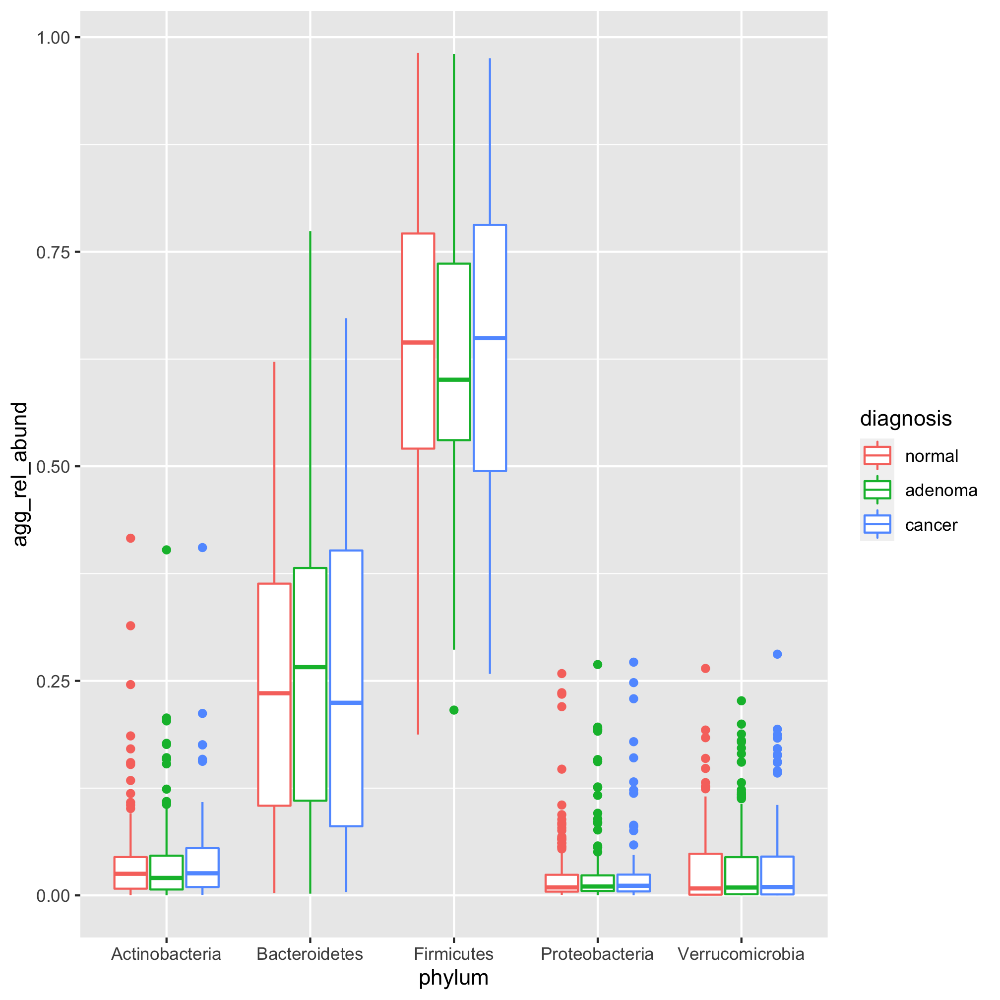

We'd like to sort the sets of bars by the median relative abundance for each phylum. We want them to be in the order that the phylum names are in `top_phyla`. Do you recall how we can set the order of a vector of characters? Remember what we did to get our diagnosis categories to line up as "Normal", "Adenoma", and "Cancer"? Right! We used factors


```r
agg_phylum_data %>%
	filter(phylum %in% top_phyla) %>%
	mutate(phylum=factor(phylum, levels=top_phyla)) %>%
	ggplot(aes(x=phylum, y=agg_rel_abund, color=diagnosis)) +
		geom_boxplot()
```

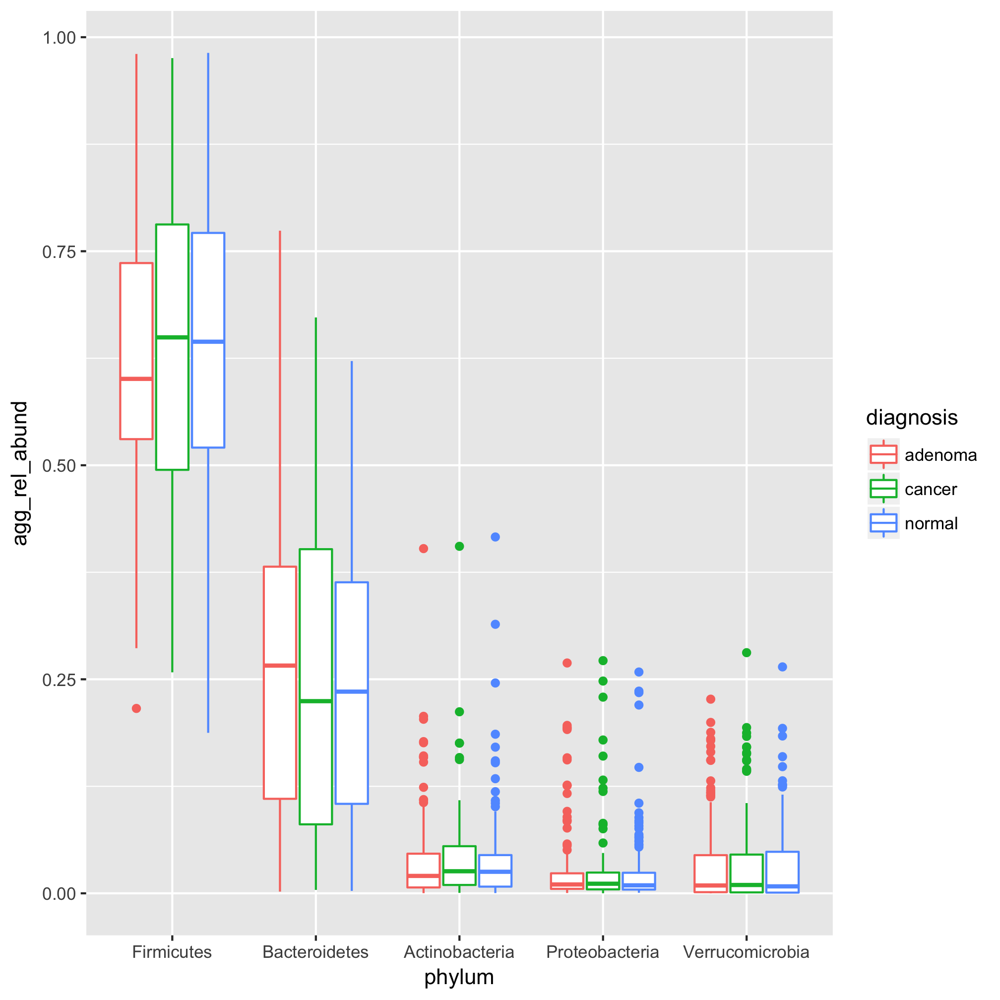

Happy dance. Go on. Dance! Let's gussy this up a bit with our standard styling


```r
agg_phylum_data %>%
	filter(phylum %in% top_phyla) %>%
	mutate(phylum=factor(phylum, levels=top_phyla)) %>%
	ggplot(aes(x=phylum, y=agg_rel_abund, color=diagnosis)) +
		geom_boxplot() +
		scale_color_manual(name=NULL,
			values=c("black", "blue", "red"),
			breaks=c("normal", "adenoma", "cancer"),
			labels=c("Normal", "Adenoma", "Cancer")) +
		labs(title="There are no obvious phylum-level differences between the\ndiagnosis groups",
			x=NULL,
			y="Relative abundance") +
		theme_classic()
```


---

### Activity 3
Can you convert our box plot to a strishapeart? Put the diagnosis groups in order of increasing severity.

<input type="button" class="hideshow">
<div markdown="1" style="display:none;">

```r
agg_phylum_data %>%
	filter(phylum %in% top_phyla) %>%
	mutate(phylum=factor(phylum, levels=top_phyla)) %>%
	ggplot(aes(x=phylum, y=agg_rel_abund, color=diagnosis)) +
		geom_jitter(pos=position_jitterdodge(jitter.width=0.2, dodge.width=0.8)) +
		scale_color_manual(name=NULL,
			values=c("black", "blue", "red"),
			breaks=c("normal", "adenoma", "cancer"),
			labels=c("Normal", "Adenoma", "Cancer")) +
		labs(title="There are no obvious phylum-level differences between the\ndiagnosis groups",
			x=NULL,
			y="Relative abundance") +
		theme_classic()
```

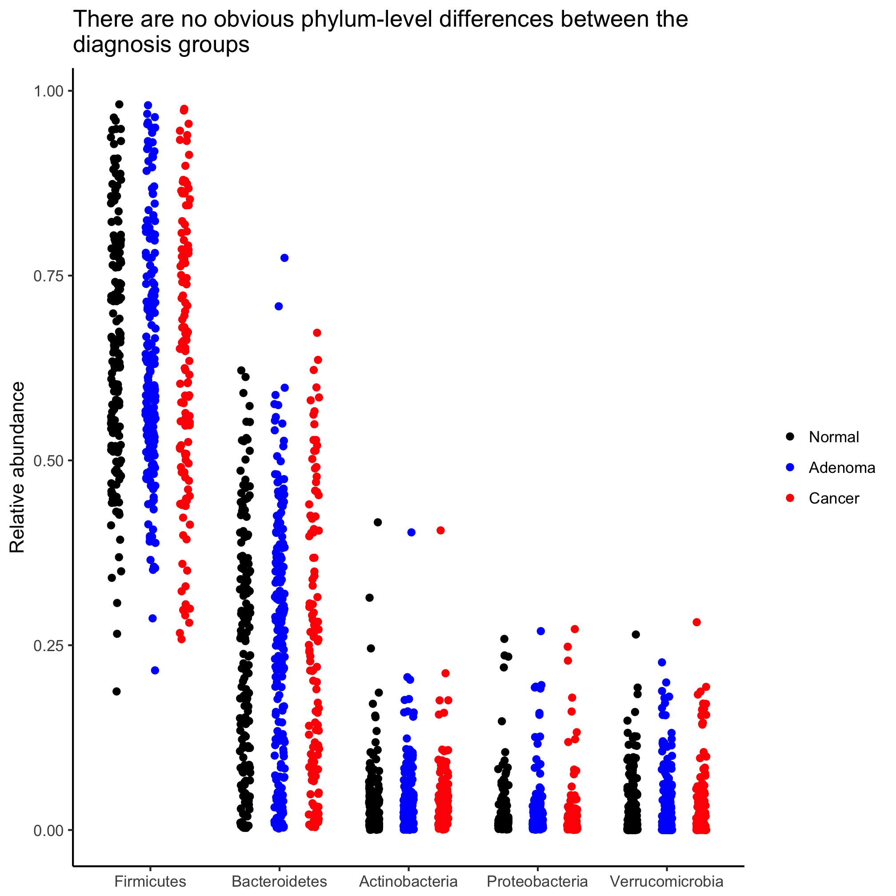
</div>

---

### Activity 4
Our y-axis is formatted to go from 0 to 1. Can you change it to go from 0 to 100?

<input type="button" class="hideshow">
<div markdown="1" style="display:none;">
There are a few ways to do this. This might be the most direct:

```r
agg_phylum_data %>%
	filter(phylum %in% top_phyla) %>%
	mutate(phylum=factor(phylum, levels=top_phyla)) %>%
	mutate(agg_rel_abund=100 * agg_rel_abund) %>%
	ggplot(aes(x=phylum, y=agg_rel_abund, color=diagnosis)) +
		geom_jitter(pos=position_jitterdodge(jitter.width=0.2, dodge.width=0.8)) +
		scale_color_manual(name=NULL,
			values=c("black", "blue", "red"),
			breaks=c("normal", "adenoma", "cancer"),
			labels=c("Normal", "Adenoma", "Cancer")) +
		labs(title="There are no obvious phylum-level differences between the\ndiagnosis groups",
			x=NULL,
			y="Relative abundance") +
		theme_classic()
```

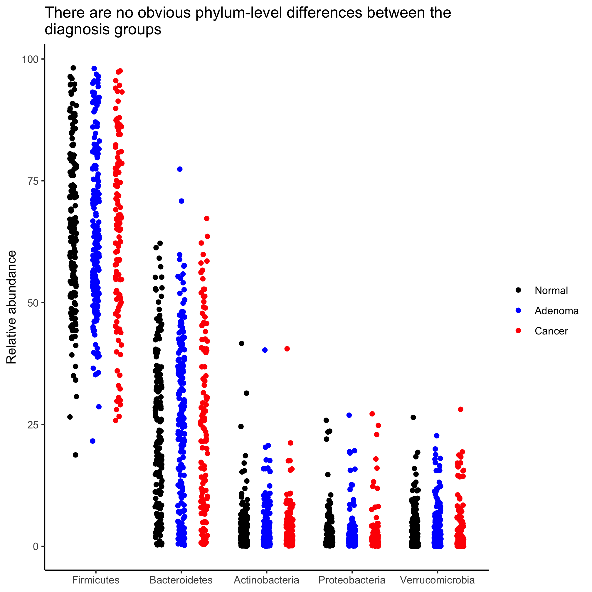

An alternative approach uses `scale_y_continuous`


```r
agg_phylum_data %>%
	filter(phylum %in% top_phyla) %>%
	mutate(phylum=factor(phylum, levels=top_phyla)) %>%
	ggplot(aes(x=phylum, y=agg_rel_abund, color=diagnosis)) +
		geom_boxplot() +
		scale_color_manual(name=NULL,
			values=c("black", "blue", "red"),
			breaks=c("normal", "adenoma", "cancer"),
			labels=c("Normal", "Adenoma", "Cancer")) +
		scale_y_continuous(breaks=c(0, 0.25, 0.5, 0.75, 1.0), labels=c(0, 25, 50, 75, 100)) +
		labs(title="There are no obvious phylum-level differences between the\ndiagnosis groups",
			x=NULL,
			y="Relative abundance (%)") +
		theme_classic()
```

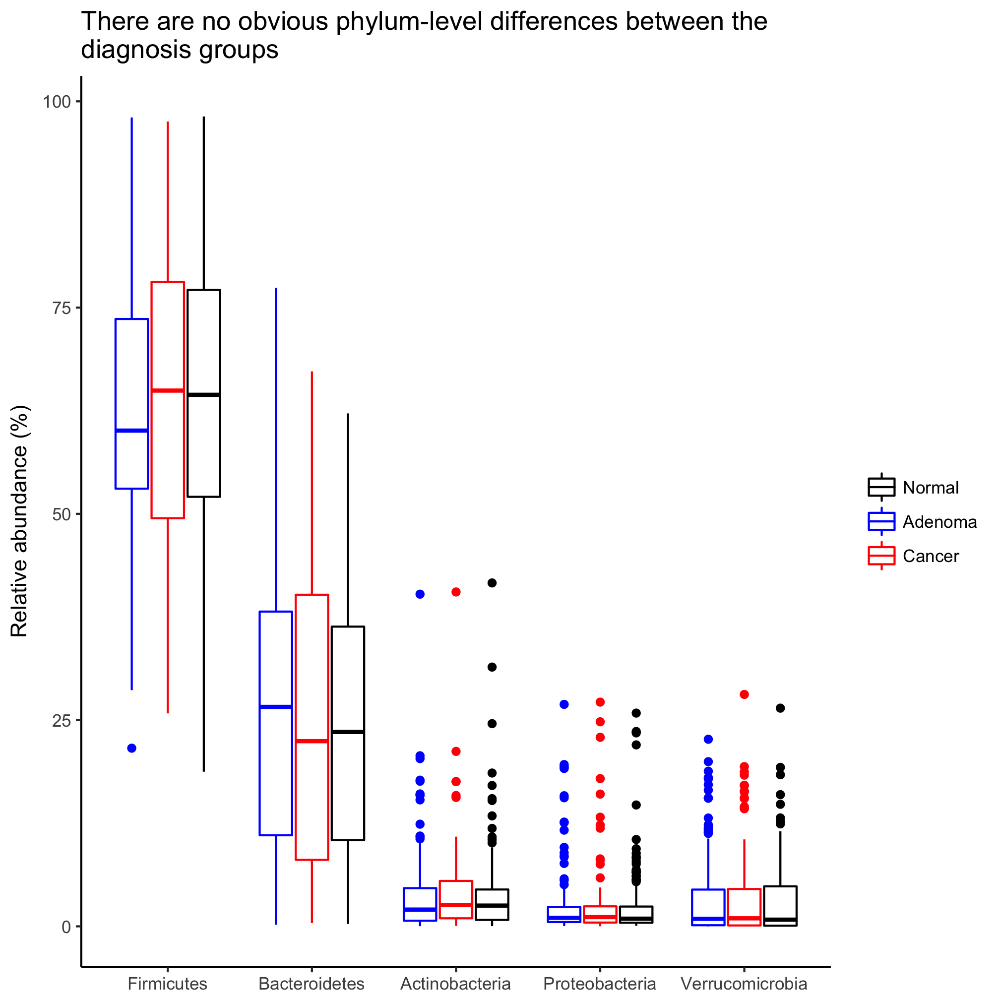

This approach is a bit more flexible since you can specify the reference values you want on the y-axis.
</div>

---

You might notice that with the exception of the *Firmicutes*, the relative abundances of the other phyla are concentrated towards the bottom of the y-axis. Sometimes it is helpful to plot relative abundance data on a log-scaled y-axis. We can use `scale_y_log10` to get a log-scaled y-axis.


```r
agg_phylum_data %>%
	filter(phylum %in% top_phyla) %>%
	mutate(phylum=factor(phylum, levels=top_phyla)) %>%
	ggplot(aes(x=phylum, y=agg_rel_abund, color=diagnosis)) +
		geom_boxplot() +
		scale_color_manual(name=NULL,
			values=c("black", "blue", "red"),
			breaks=c("normal", "adenoma", "cancer"),
			labels=c("Normal", "Adenoma", "Cancer")) +
		labs(title="There are no obvious phylum-level differences between the\ndiagnosis groups",
			x=NULL,
			y="Relative abundance") +
		scale_y_log10() +
		theme_classic()
```

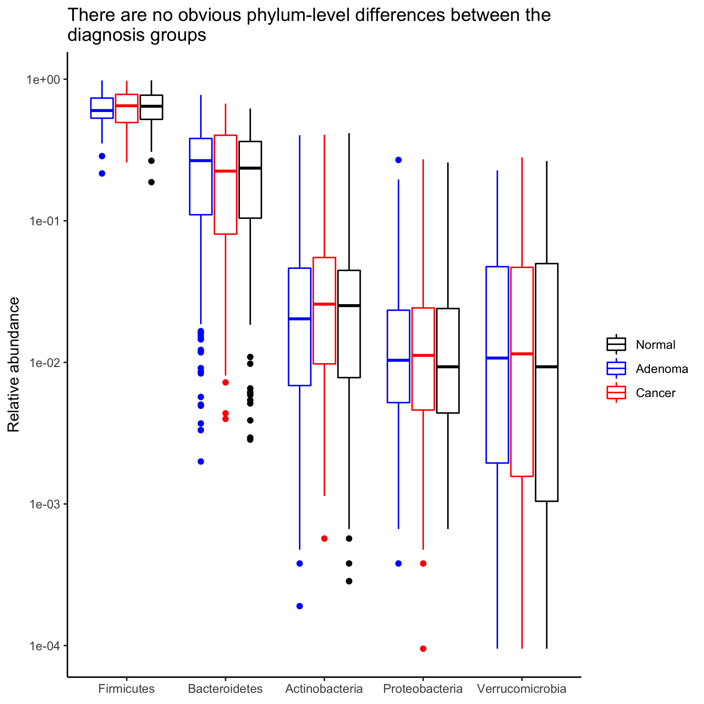

This spits out two Warning messages:

```r
Warning messages:
1: Transformation introduced infinite values in continuous y-axis
2: Removed 23 rows containing non-finite values (stat_boxplot).
```

These warnings come from the fact that `log10(0)` is infinity. To correct this, we can add a small number. Say less than 1/10530.


```r
agg_phylum_data %>%
	filter(phylum %in% top_phyla) %>%
	mutate(phylum=factor(phylum, levels=top_phyla)) %>%
	mutate(agg_rel_abund = agg_rel_abund + 1/21000) %>%
	ggplot(aes(x=phylum, y=agg_rel_abund, color=diagnosis)) +
		geom_boxplot() +
		scale_color_manual(name=NULL,
			values=c("black", "blue", "red"),
			breaks=c("normal", "adenoma", "cancer"),
			labels=c("Normal", "Adenoma", "Cancer")) +
		labs(title="There are no obvious phylum-level differences between the\ndiagnosis groups",
			x=NULL,
			y="Relative abundance") +
		scale_y_log10() +
		theme_classic()
```

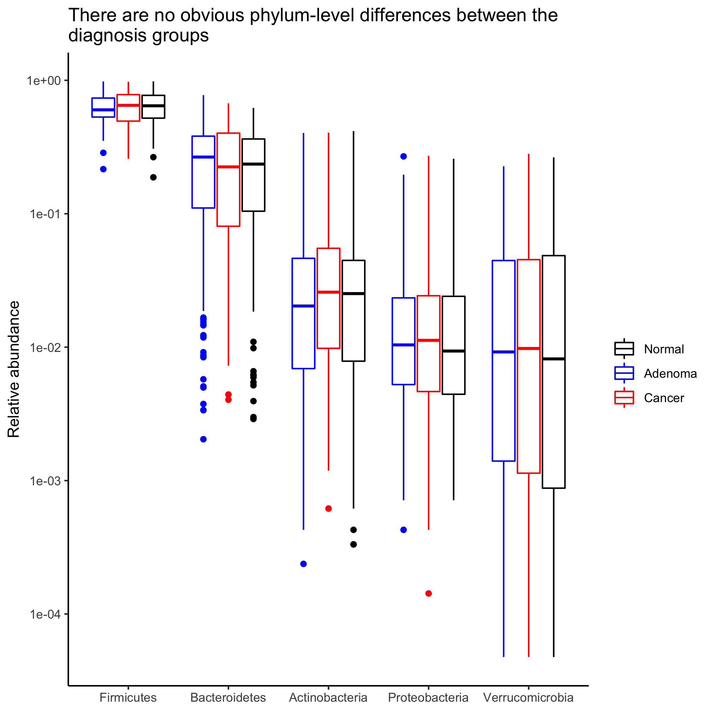

That took care of the warning messages. If you did the previous Activity, you might be thinking about how we can better label that y-axis. Since we added a small number to everything, we should also add a line to indicate the limit of detection at 1/10530.


```r
agg_phylum_data %>%
	filter(phylum %in% top_phyla) %>%
	mutate(phylum=factor(phylum, levels=top_phyla)) %>%
	mutate(agg_rel_abund = agg_rel_abund + 1/21000) %>%
	ggplot(aes(x=phylum, y=agg_rel_abund, color=diagnosis)) +
		geom_hline(yintercept=1/10530, color="gray") +
		geom_boxplot() +
		scale_color_manual(name=NULL,
			values=c("black", "blue", "red"),
			breaks=c("normal", "adenoma", "cancer"),
			labels=c("Normal", "Adenoma", "Cancer")) +
		labs(title="There are no obvious phylum-level differences between the\ndiagnosis groups",
			x=NULL,
			y="Relative abundance (%)") +
		scale_y_log10(breaks=c(1e-4, 1e-3, 1e-2, 1e-1, 1), labels=c(1e-2, 1e-1, 1, 10, 100)) +
		theme_classic()
```


---

### Activity 5
In this session we focused on phylum-level data. Let's generate a box plot for the five most abundant taxa that are defined as deep as we can classify them. See Activity 2 for the code to generate the taxonomy data. Be careful not to write over your other data frames

<input type="button" class="hideshow">
<div markdown="1" style="display:none;">

```r
source('code/baxter.R')

deep_taxonomy <- read_tsv(file="raw_data/baxter.cons.taxonomy") %>%
		rename_all(tolower) %>%
		mutate(taxonomy=str_replace_all(string=taxonomy, pattern="\\(\\d*\\)", replacement="")) %>%
		mutate(taxonomy=str_replace_all(string=taxonomy, pattern="unclassified;", replacement="")) %>%
		mutate(taxonomy=str_replace_all(string=taxonomy, pattern=";$", replacement="")) %>%
		mutate(taxonomy=str_replace_all(string=taxonomy, pattern=".*;", replacement=""))

agg_deep_data <- inner_join(otu_data, deep_taxonomy) %>%
		group_by(sample, taxonomy) %>%
		summarize(agg_rel_abund=sum(rel_abund)) %>%
		inner_join(., get_metadata()) %>%
		ungroup() #without this, the sample and phylum columns remain grouped

top_deep_taxa <- agg_deep_data %>%
		group_by(taxonomy) %>%
		summarize(median=median(agg_rel_abund)) %>%
		arrange((desc(median))) %>% # keep this so that the phyla are sorted properly
		top_n(5, median) %>%
		pull(taxonomy) # use pull to convert the names from a data frame to a vector of names

agg_deep_data %>%
	filter(taxonomy %in% top_deep_taxa) %>%
	mutate(taxonomy=factor(taxonomy, levels=top_deep_taxa)) %>%
	mutate(agg_rel_abund=agg_rel_abund+1/21000) %>%
	ggplot(aes(x=taxonomy, y=agg_rel_abund, color=diagnosis)) +
		geom_boxplot() +
		geom_hline(yintercept=1/10530, color="gray") +
		scale_color_manual(name=NULL,
			values=c("black", "blue", "red"),
			breaks=c("normal", "adenoma", "cancer"),
			labels=c("Normal", "Adenoma", "Cancer")) +
		labs(title="There are no obvious phylum-level differences between the\ndiagnosis groups",
			x=NULL,
			y="Relative abundance (%)") +
		scale_y_log10(breaks=c(1e-4, 1e-3, 1e-2, 1e-1, 1), labels=c(1e-2, 1e-1, 1, 10, 100)) +
		theme_classic()
```

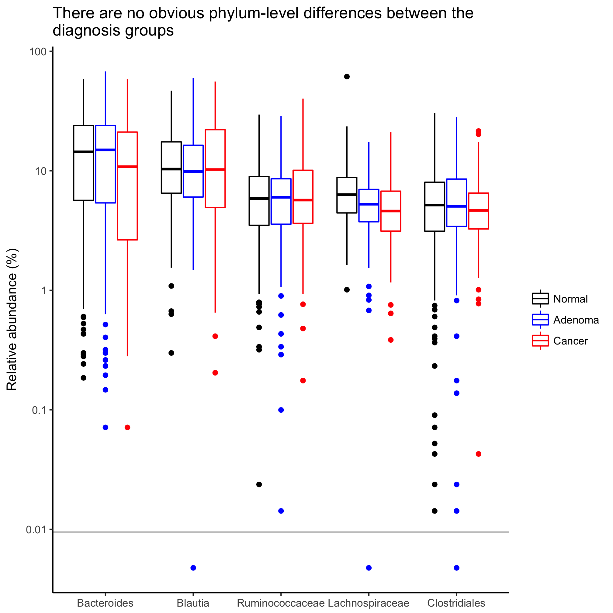
</div>

---

## Hypothesis testing
We've been able to generate strip charts and box plots for the most abundant phyla, but it would be nice to know whether any of these phyla have a significantly different representation across the diagnosis groups. We saw in a previous lesson how we can use the Kruskal-Wallis test to test for significance when we have data that are not normally distributed. But how do we do that across groups within a data frame? As we've seen before, we'll group our data by the "phylum" column. Then for each group we'll use the `nest`/`mutate`/`map`/`unnest` workflow to run `kruskal.test` as we did in the last lesson.


```r
library(broom)
library(purrr)

phylum_tests <- agg_phylum_data %>%
					nest(sample_data = c(-phylum)) %>%
					mutate(test=map(sample_data, ~tidy(kruskal.test(agg_rel_abund~diagnosis, data=.)))) %>%
					unnest(test)
```

Of course, because we're doing 17 hypothesis tests, we want to correct our P-values for multiple comparisons, sort the data frame in ascending order by corrected P-value, and then get the names of the phyla with significant differences


```r
phylum_tests <- agg_phylum_data %>%
					nest(sample_data = c(-phylum)) %>%
					mutate(test=map(sample_data, ~tidy(kruskal.test(agg_rel_abund~diagnosis, data=.)))) %>%
					unnest(test) %>%
					mutate(p.value.adj=p.adjust(p.value, method="BH")) %>%
					arrange(p.value.adj)

sig_phyla <- phylum_tests %>%
					filter(p.value.adj <= 0.05) %>%
					pull(phylum)
```

As we did before, let's make a box plot of the significant phyla


```r
agg_phylum_data %>%
	filter(phylum %in% sig_phyla) %>%
	mutate(phylum=factor(phylum, levels=sig_phyla)) %>%
	mutate(agg_rel_abund=agg_rel_abund+1/21000) %>%
	ggplot(aes(x=phylum, y=agg_rel_abund, color=diagnosis)) +
		geom_hline(yintercept=1/10530, color="gray") +
		geom_boxplot() +
		scale_color_manual(name=NULL,
			values=c("black", "blue", "red"),
			breaks=c("normal", "adenoma", "cancer"),
			labels=c("Normal", "Adenoma", "Cancer")) +
		labs(title="Two phyla are significantly associated with disease progression",
			x=NULL,
			y="Relative abundance (%)") +
		scale_y_log10(breaks=c(1e-4, 1e-3, 1e-2, 1e-1, 1), labels=c(1e-2, 1e-1, 1, 10, 100)) +
		theme_classic()
```

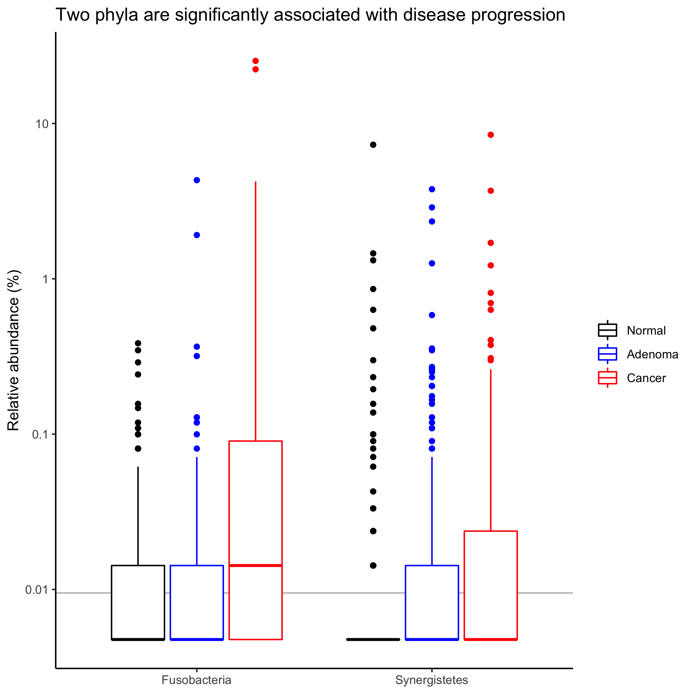

These plots are far preferable to the standard pie and stacked bar charts because they focus on those taxa that are significantly different from each other, allow you to perceive the variation in the data, and give a side-by-side comparison of the taxa.

---

### Activity 6
In the last plot we generated, the order of the three box plots is out of whack. Can you order them to reflect disease progression?

<input type="button" class="hideshow">
<div markdown="1" style="display:none;">

```r
agg_phylum_data %>%
	filter(phylum %in% sig_phyla) %>%
	mutate(phylum=factor(phylum, levels=sig_phyla)) %>%
	mutate(agg_rel_abund=agg_rel_abund+1/21000) %>%
	ggplot(aes(x=phylum, y=agg_rel_abund, color=diagnosis)) +
		geom_hline(yintercept=1/10530, color="gray") +
		geom_boxplot() +
		scale_color_manual(name=NULL,
			values=c("black", "blue", "red"),
			breaks=c("normal", "adenoma", "cancer"),
			labels=c("Normal", "Adenoma", "Cancer")) +
		labs(title="Two phyla are significantly associated with disease progression",
			x=NULL,
			y="Relative abundance (%)") +
		scale_y_log10(breaks=c(1e-4, 1e-3, 1e-2, 1e-1, 1), labels=c(1e-2, 1e-1, 1, 10, 100)) +
		theme_classic()
```

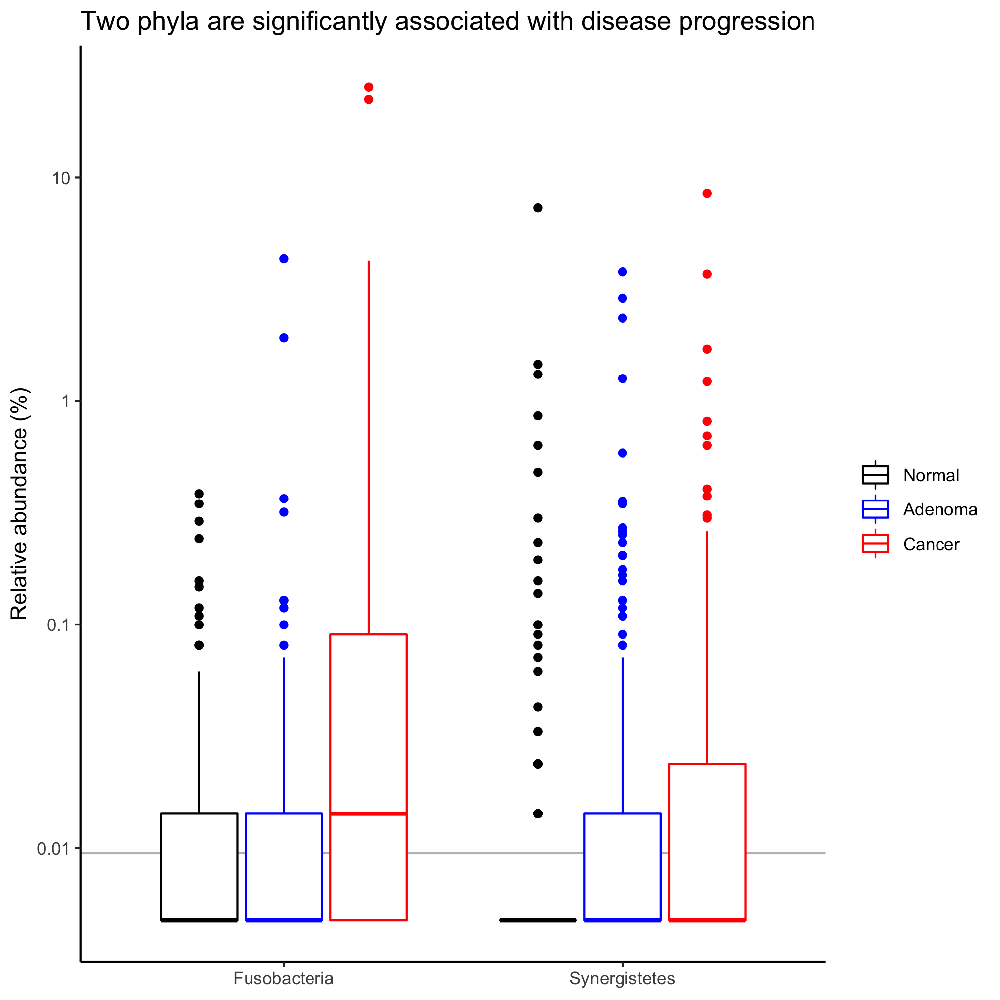
</div>

---

### Activity 7
Following up on an earlier Activity, identify those taxa that are significantly different between the diagnosis states, when defining them to their deepest classification.

<input type="button" class="hideshow">
<div markdown="1" style="display:none;">

```r
deep_taxonomy <- read_tsv(file="raw_data/baxter.cons.taxonomy") %>%
		rename_all(tolower) %>%
		mutate(taxonomy=str_replace_all(string=taxonomy, pattern="\\(\\d*\\)", replacement="")) %>%
		mutate(taxonomy=str_replace_all(string=taxonomy, pattern="unclassified;", replacement="")) %>%
		mutate(taxonomy=str_replace_all(string=taxonomy, pattern=";$", replacement="")) %>%
		mutate(taxonomy=str_replace_all(string=taxonomy, pattern=".*;", replacement=""))

agg_deep_data <- inner_join(otu_data, deep_taxonomy) %>%
		group_by(sample, taxonomy) %>%
		summarize(agg_rel_abund=sum(rel_abund)) %>%
		inner_join(., get_metadata()) %>%
		ungroup() #without this, the sample and phylum columns remain grouped

deep_tests <- agg_deep_data %>%
		nest(sample_data = c(-taxonomy)) %>%
		mutate(test=map(sample_data, ~tidy(kruskal.test(agg_rel_abund~diagnosis, data=.)))) %>%
		unnest(test) %>%
		mutate(p.value.adj=p.adjust(p.value, method="BH")) %>%
		arrange(p.value.adj)

sig_deep <- deep_tests %>%
		filter(p.value.adj <= 0.05) %>%
		pull(taxonomy)

agg_deep_data %>%
	filter(taxonomy %in% sig_deep) %>%
	mutate(taxonomy=factor(taxonomy, levels=sig_deep)) %>%
	mutate(agg_rel_abund=agg_rel_abund + 1/10531) %>%
	ggplot(aes(x=taxonomy, y=agg_rel_abund, color=diagnosis)) +
		geom_boxplot() +
		scale_color_manual(name=NULL,
			values=c("black", "blue", "red"),
			breaks=c("normal", "adenoma", "cancer"),
			labels=c("Normal", "Adenoma", "Cancer")) +
		labs(title="Populations associated with oral disease are associated with\na cancer diagnosis while others associated with fermentation\nare associated with a normal diagnosis",
			x=NULL,
			y="Relative abundance (%)") +
		scale_y_log10(breaks=c(1e-4, 1e-3, 1e-2, 1e-1, 1), labels=c(1e-2, 1e-1, 1, 10, 100)) +
		theme_classic()
```

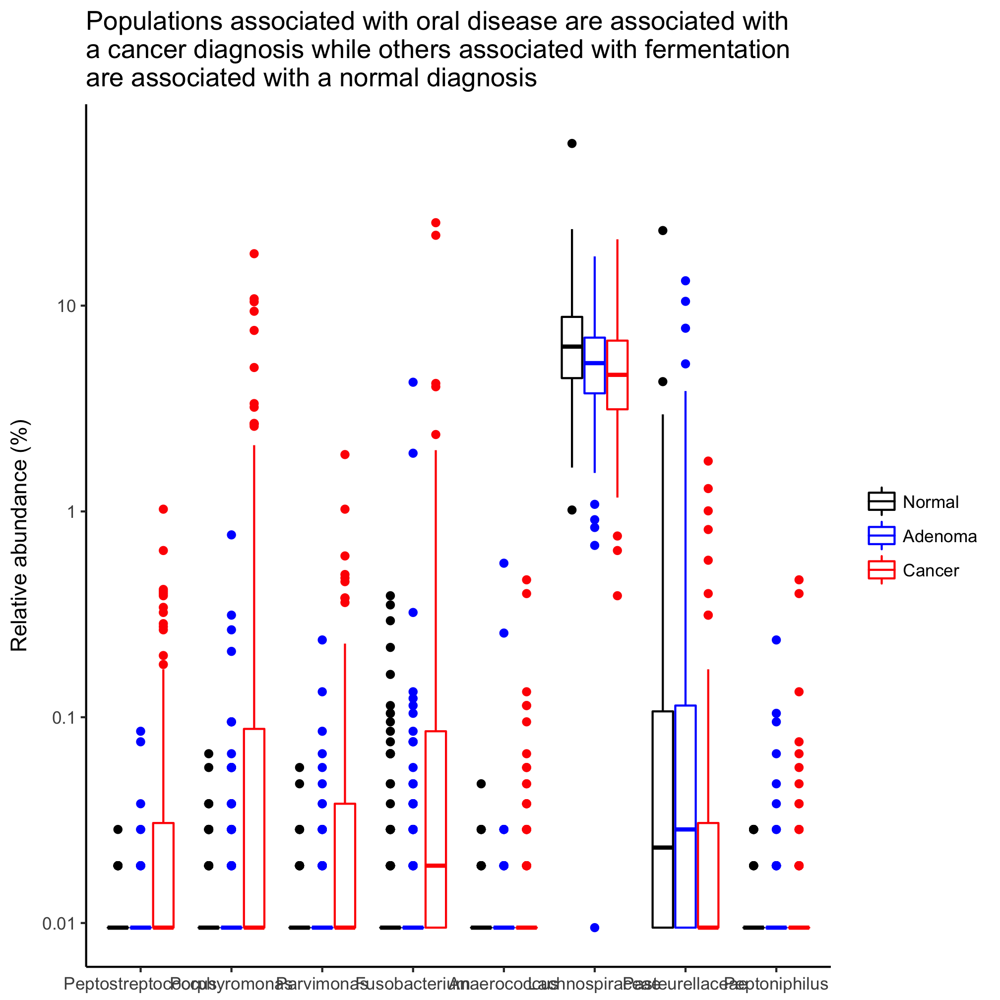

That's kind of hard to see. We can add `coord_flip` to turn the axes


```r
agg_deep_data %>%
	filter(taxonomy %in% sig_deep) %>%
	mutate(taxonomy=factor(taxonomy, levels=sig_deep)) %>%
	mutate(agg_rel_abund=agg_rel_abund + 1/10531) %>%
	ggplot(aes(x=taxonomy, y=agg_rel_abund, color=diagnosis)) +
		geom_boxplot() +
		scale_color_manual(name=NULL,
			values=c("black", "blue", "red"),
			breaks=c("normal", "adenoma", "cancer"),
			labels=c("Normal", "Adenoma", "Cancer")) +
		labs(title="Populations associated with oral disease are associated with\na cancer diagnosis while others associated with fermentation\nare associated with a normal diagnosis",
			x=NULL,
			y="Relative abundance (%)") +
		scale_y_log10(breaks=c(1e-4, 1e-3, 1e-2, 1e-1, 1), labels=c(1e-2, 1e-1, 1, 10, 100)) +
		coord_flip() +
		theme_classic() +
		theme()
```

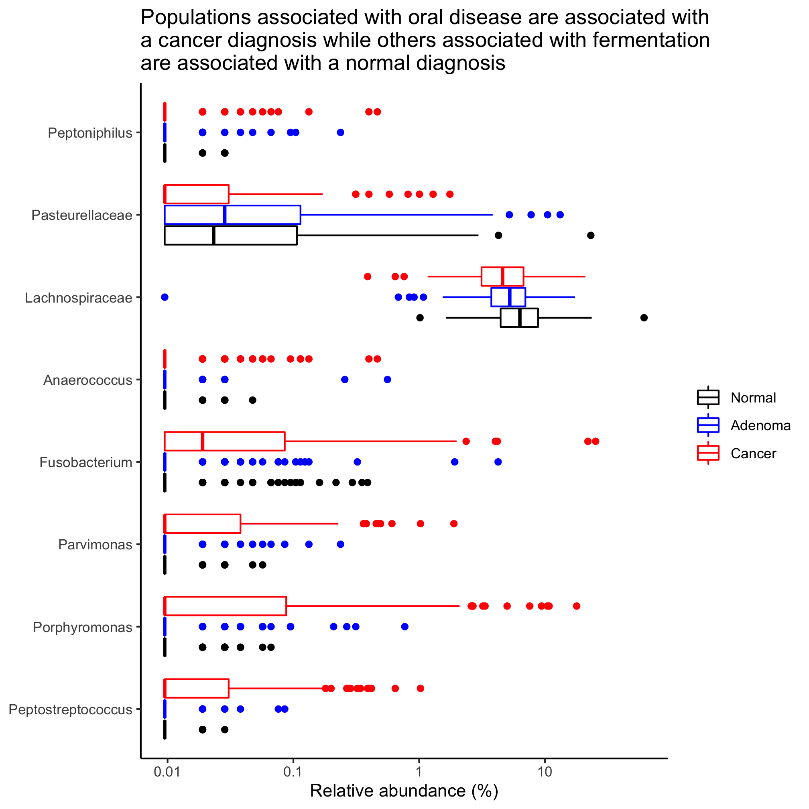
</div>

---

### Activity 8
Instead of grouping individuals by three diagnosis groups, group them as having normal colons or a lesion (i.e. adenoma or cancer diagnosis). Identify those taxa that are significantly different between the diagnosis states, when defining them to their deepest classification. Sort the populations by overall mean relative abundance.

<input type="button" class="hideshow">
<div markdown="1" style="display:none;">

```r
deep_taxonomy <- read_tsv(file="raw_data/baxter.cons.taxonomy") %>%
		rename_all(tolower) %>%
		mutate(taxonomy=str_replace_all(string=taxonomy, pattern="\\(\\d*\\)", replacement="")) %>%
		mutate(taxonomy=str_replace_all(string=taxonomy, pattern="unclassified;", replacement="")) %>%
		mutate(taxonomy=str_replace_all(string=taxonomy, pattern=";$", replacement="")) %>%
		mutate(taxonomy=str_replace_all(string=taxonomy, pattern=".*;", replacement=""))

agg_deep_data <- inner_join(otu_data, deep_taxonomy) %>%
		group_by(sample, taxonomy) %>%
		summarize(agg_rel_abund=sum(rel_abund)) %>%
		inner_join(., get_metadata()) %>%
		mutate(lesion = diagnosis != 'normal') %>%
		ungroup() #without this, the sample and phylum columns remain grouped

deep_tests <- agg_deep_data %>%
		nest(sample_data = c(-taxonomy)) %>%
		mutate(test=map(sample_data, ~tidy(kruskal.test(agg_rel_abund~diagnosis, data=.)))) %>%
		unnest(test) %>%
		mutate(p.value.adj=p.adjust(p.value, method="BH")) %>%
		arrange(p.value.adj)

sig_deep <- deep_tests %>%
		filter(p.value.adj <= 0.05) %>%
		pull(taxonomy)

sig_abund_deep <- agg_deep_data %>%
		filter(taxonomy %in% sig_deep) %>%
		group_by(taxonomy) %>%
		summarize(mean=mean(agg_rel_abund)) %>%
		arrange(desc(mean)) %>% pull(taxonomy)

agg_deep_data %>%
	filter(taxonomy %in% sig_deep) %>%
	mutate(taxonomy=factor(taxonomy, levels=sig_abund_deep)) %>%
	mutate(agg_rel_abund=agg_rel_abund + 1/10531) %>%
	ggplot(aes(x=taxonomy, y=agg_rel_abund, color=lesion)) +
		geom_boxplot() +
		scale_color_manual(name=NULL,
			values=c("black", "darkgreen"),
			breaks=c(FALSE, TRUE),
			labels=c("Normal", "Lesion")) +
		labs(title="Genera that are significantly different in relative abundance\nbetween healthy individuals and those with lesions",
			x=NULL,
			y="Relative abundance (%)") +
		scale_y_log10(breaks=c(1e-4, 1e-3, 1e-2, 1e-1, 1), labels=c(1e-2, 1e-1, 1, 10, 100)) +
		coord_flip() +
		theme_classic() +
		theme()
```


</div>


---

### Activity 9
This lesson deviates from what is typically the norm in the microbiome literature. It is common to see researchers use pie charts and stacked bar charts to depict relative abundance data. For some background, run `?pie` and read the "Note" section. Based on using strip charts and box plots to represent relative abundance data what do you see as the strengths and weaknesses of the approach used on this lesson versus using pie or stacked bar charts?

<input type="button" class="hideshow">
<div markdown="1" style="display:none;">
***Strengths***
* Can see distribution and variation in data
* Easier to focus attention on what the researcher wants to show the reader rather than on showing 100s of wedges
* Easier to compare relative abundance of taxa when they are on the same y-axis

***Weaknesses***
* It's a "different" approach, there's a lot of inertia to use stacked bar plots
* Sometimes there are more taxa to show than we have space for (need to make hard choices!)
</div>

	rm assets/images/07_statistical_analyses/unnamed-chunk-48-1.png	assets/images/07_statistical_analyses/unnamed-chunk-50-1.png	assets/images/07_statistical_analyses/unnamed-chunk-52-1.png
